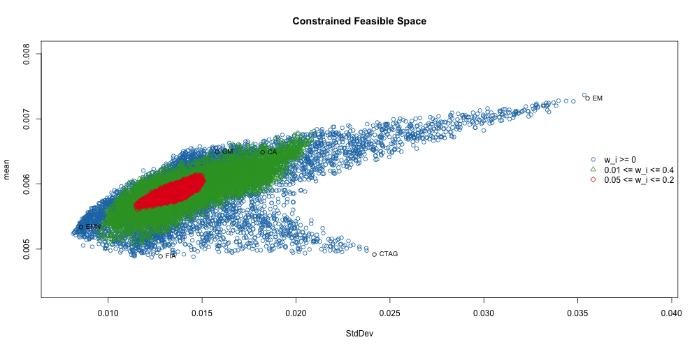

## Why Random Portfolios?
* Portfolio Optimization
  * Non-convex and complex objective functions
  * Visualize feasible space
  * Easily parallelizable
* Performance Measurement and Mandates
* Extend differential evolution algorithm
* Trading Strategy Paremeter Optimization

<!--
Intro slide
give a brief overview of each bullet point
focus on usefulness and application of random portfolios
-->

---

## What is a random portfolio?
The basic idea is to sample from the population of portfolios that satisfy the given constraints. The idea is simple, but is a very flexible and powerful approach for portfolio optimization and other applications.

> "Random portfolios have the power to revolutionize fund management. You might think that means they must be esoteric and complex. You would be wrong — the idea is very simple." - Patrick Burns

<!--
explain what a random portfolio is
-->

---

## Algorithms to Generate Random Portfolios
  * Simplex
  * Grid Search
  * Sample

<!--
these are the algorithms that are included in PortfolioAnalytics that I am familar with and will talk about. There may be others. Ask Brian.
-->

---

## Simplex Algorithm
* Monte Carlo Portfolio Optimization in a Parallel Environment (MC-POPE) method by William T. Shaw.

$$
w_i = \frac{\log U_i}{\sum_{j=1}^N U_j}
$$

where $U_i$ are uncorrelated random variables on $U(0,1)$

<!--
Shaw recommends this as the best method to evenly sample a simplex or a subject of it.

implicit constraints of long only and weights sum to 1
-->

---

## Simplex Algorithm Extensions
* Lower Bound
$$
w_i = L_i + (1 - \sum_{j=1}^N L_j) \frac{\log U_i}{\sum_{k=1}^N U_k}
$$

* FEV-Biasing
$$
w_i = \frac{\log U_i^q}{\sum_{j=1}^N U_j^q}
$$
let $q = 2^p$

<!--
q -> Inf leads to a portfolio concentrated in a single asset
increasing q will lead to more concentrated portfolios
-->

---

## FEV-Biasing Visualization


<!--
can see that q = 0 is concentrated around equal weight portfolio

increasing q will lead to more concentrated portfolios
-->

---

## Simplex Algorithm Overview
Advantages
  * Fast and efficient method to generate random portfolios
  * Control portfolio concentration

Disadvantages
  * Limited support for constraints
    * Weights sum to 1
    * Lower bound on weights
  
<!--
fast and efficient because it is fast to generate uniform random number
upper bound on weights?
group?
dollar neutral?
position limits?
handle more complex constraints by elimination
-->

---

## Grid Search Method
Create all possible combinations given a set of feasible weights
* The portfolio will satisfy box constraints by construction

How do we handle other constraints?
* transformation
* elimination

<!--
transformation may violate box constraints
elimination may not leave many random portfolios
problem with large problems (n!)
-->

---

## Sample Method Algorithm
Based on idea by Patrick Burns
```{r, tidy=FALSE, eval=FALSE}
foo <- function(weights, min_sum, max_sum, min, max, S, ...){
  while (sum(weights) <= min_sum | sum(weights) >= max_sum) {
    # i is a randomly selected index of weights vector
    while (sum(weights) <= min_sum) {
      tmpS <- S[(S >= weights[i]) & (S <= max[i])]
      weights[i] <- tmpS[sample.int(1, length(tmpS))]
    }
    while (sum(weights) >= max_sum) {
      tmpS <- S[(S >= weights[i]) & (S <= max[i])]
      weights[i] <- tmpS[sample.int(1, length(tmpS))]
    }
  }
return(weights)
}
```
* Note: code snippet is intentionally incomplete for the purpose of slides

<!--
Mountain lake analogy

This is the most flexible method, but also the slowest, and can generate portfolios to satisfy sum of weights, box, group, position limit constraints.

it is often the case that the optimal portfolio is on the edge of the feasible space. this algorithm allows us to generate portfolios that evenly cover the interior and edges of feasible space.

* $S$ is the of feasible weights
* $weights$ is the vector of portfolio weights
* $min_sum$ is the lower bound on sum of weights
* $max_sum$ is the upper bound on sum of weights
* $min$ is the vector of lower bound box constraints
* $max$ is the vector of upper bound box constraints

increase loop
- randomly permute and increase a random portfolio element

decrease loop
- randomly permute and decrease a random portfolio element

any sum of weights
box constraints

Other constraints?
* group
* number of assets
-->

---

## Adding Constraints
Extend algorithm to support more constraint types. By construction, the random portfolio satisfies the following constraints:
* sum of weights
* box
* group
* position limit (# of non-zero, # of long/short, etc.)
* leverage

<!--
My first attempt at v2 was to add conditions to the outer while loop and cross my fingers

I was forced to think hard about the algorithm

after a lot of testing and frustration, I came to the algorithm that is currently implemented in PortfolioAnalytics
-->

---

## Adding Group Constraint
```{r, eval=FALSE, tidy=FALSE}
rp <- function(x){
  while(violate_constraints(x)){
    x <- check_maxsum(x)
    x <- check_minsum(x)
    if(violate_group_constraints(x))
      x <- rp(x)
  }
  return(x)
}
```
* Note: code snippet is intentionally incomplete for the purpose of the slides

<!--
pseudo code to demonstrate modular approach of the algorithm and how we can look at the group constraint violation problem as the same problem as a portfolio that violates sum of weights. This results in a simple recursive call
while constraints violated

check for minimum sum of weights
randomly permute and increase a random portfolio element

check for maximum sum of weights
randomly permute and decrease a random portfolio element

check for group
group constraint violation is taking that subset of the portfolio and then you have the exact same problem as a portfolio that violates sum of weights constraint so we can just make a recursive call
-->

---

## Interactive Visualization of RP Methods
```{r, results = 'asis', comment = NA, message = F, echo = F}
load("figures/rp_viz.rda")
rp_viz$show('inline')
```

<!--
The feasible space is computed using the EDHEC data for a long only portfolio with a search size of 2000.

Note how grid search does not cover the boundary very well

sample and simplex are very similar (mostly because of the choice of constraints. More restrictive constraints would mean fewer dots for simplex method
-->

---

## Visualizing Constrained Feasible Space


<!--
The feasible space is computed using the EDHEC data for a long only portfolio with a search size of 2000.

Note how grid search does not cover the boundary very well

sample and simplex are very similar (mostly because of the choice of constraints. More restrictive constraints would mean fewer dots for simplex method
-->

---

## Performance Measurement
### Annual Information Ratio Comparison
Three artificial benchmarks
* equal weight
* random portfolio 1
* random portfolio 2

Weekly returns 35 stocks from 1997-01-07 to 2010-12-28.

<!--
most performance analysis is relative to a benchmark

0.01 <= w_i <= 0.2
Large and mid cap 0.1 and 0.5
small cap 0 and 0.1

* The measurement of skill with random portfolios avoids some of the noise that is introduced when performance is measured relative to a benchmark.

* need to know constraints
-->

---

## Information Ratio


<!--
* In some quarters there is a strong tendency for the benchmark to outperform  the random portfolios, in others a strong tendency for the benchmark to underperform.

* A benchmark will be hard to beat during periods when the most heavily weighted assets in the benchmark happen to do well. Likewise, when the assets with large weights in the benchmark do relatively poorly, then the benchmark will be easy to beat.

* Clearly the more unequal the weights in a benchmark, the more extreme the swings will be in the probability of outperforming. In this regard, the random benchmarks that are used here are not at all extreme compared to many indices that are used in practice as benchmarks.
-->

---

## Zero Skill Managers
* 10,000 random portfolios
* 1,000 zero skill managers
* annual rebalancing
* weights sum to 1
* no asset can have a weight less than 0 or greater than 0.4

<!--
edhec data
CA, EMN, FIA, CTAG, EM, GM
1997-01-31 to 2014-01-31

Mandates that are based on random portfolios allow fund managers to play to their strengths because they need not be tied to a benchmark. This also allows more flexibility for the investor to shape the behavior of the fund managers to best advantage.

Other uses of random portfolios include the assessment of the opportunity set available to a fund manager with a given strategy.
-->

---

## Zero Skill Managers


<!--
looks similar to Monte Carlo
no distributional assumptions, only based on constraints
assessment of the opportunity set available to a fund manager with a given strategy.
can use whatever measure of utility, performance, risk
-->

---

## Annualized Sharpe Ratio of Zero Skill Managers
Quantiles
```{r, eval=FALSE}
       0%       25%       50%       75%      100% 
0.9486588 1.2462714 1.4058532 1.5354576 1.9824632 
```


---

## Optimization

### EDHEC Data Setup
Here we will look at portfolio optimization in the context of portfolio of hedge funds.

* EDHEC-Risk Alternative Indexes monthly returns from 1/31/1997 to 1/31/2014

Relative Value | Directional
-------------- | -----------
Convertible Arbitrage (CA) | CTA Global (CTAG)
Equity Market Neutral (EMN) | Emerging Markets (EM)
Fixed Income Arbitrage (FIA) | Global Macro (GM)

<!--
* Chosen to represent investing in hedge funds with different styles
* Not necessarily investable
-->

---

## Monthly Returns


<!--
Easy to see the relative volatility
Periods of coincident drawdowns
-->

---

## Minimum Expected Shortfall
Consider an allocation to hedge funds using the EDHEC-Risk Alternative Index as a proxy.

* Minimize Modified Expected Shortfall
* Minimize Modified Expected Shortfall with Risk Budget Limit
* Minimize Modified Expected Shortfall with Equal Risk Contribution

<!--
Add risk budget objective to minimize concentration of percentage component contribution to risk. Concentration is defined as the Herfindahl Hirschman Index (HHI).

$$ \sum_{i=1}^n x_i^2 $$

ES is coherent and is a convex function of the weights

We are actually using modified ES to take into account the higher moments because the return distribution displays skewness and kurtosis. Modified ES uses the Cornish-Fisher estimate of ES.
-->

---

## Plot in Risk-Return Space


---

## Chart Risk Budgets


<!--
talk about neighbor portfolios
could use this as a threshold for rebalancing
-->

---

## Maximize CRRA
Consider an allocation to hedge funds using the EDHEC-Risk Alternative Index as a proxy. Our objective to maximize the fourth order expansion of the Constant Relative Risk Aversion (CRRA) expected utility function as in the Boudt paper and Martellini paper. 

$$
\begin{aligned}
& \underset{w}{\text{maximize}}
& & EU(w) \\
& \text{subject to}
& & \sum_{i=1}^N w_i\\
& & & w_i \geq 0
\end{aligned}
$$

$$
EU_{\lambda}(w) = - \frac{\lambda}{2} m_{(2)}(w) + 
\frac{\lambda (\lambda + 1)}{6} m_{(3)}(w) -
\frac{\lambda (\lambda + 1) (\lambda + 2)}{24} m_{(4)}(w)
$$

<!---
* This example will demonstrate a custom moment function and a custom objective function.
* This is an interesting objective function
* An increase in the 2nd and 4th moment will decrease the objective function
* An increase in the lambda value places a bigger penalty on the higher moments
-->

---

## Maximum CRRA in Risk-Return Space


<!--
It is very interesting to look at the feasible space in terms of different measures for risk. It appears that the optimal CRRA portfolio is close to the minimum StdDev portfolio, but nowhere near the minimum ES portfolio.
-->

---

## DEoptim Extensions
* Mapping function in DEoptim
* 
* Seed population


<!--
Extensions to other optimizers

DEoptim is a global optimization in the class of genetic algorithms

DEoptim only supports box constraints

constraints implemented in random portfolios now implemented in DEoptim

random portfolio logic is used in a 

mapping function an optional function that will be run after each population is created, but before the population is passed to the objective function. This allows the user to impose integer/cardinality constriants.
-->

---

## Conclusion
* Introduced algorithms and applications for random portfolios
* Demonstrated the flexibility by example
* More work to do on algorithms and applications

#### Acknowledgements
Many thanks to...

* UW CF&RM Program faculty
* GSoC Mentors: Brian Peterson, Peter Carl, Doug Martin, and Guy Yollin

<!---
- One of the best things about GSoC is the opportunity to work and interact with the mentors.
- Thank the GSoC mentors for offering help and guidance during the GSoC project and after as I continued to work on the PortfolioAnalytics package.
- R/Finance Committee for the conference and the opportunity to talk about PortfolioAnalytics.
- Google for funding the Google Summer of Code for PortfolioAnalytics and many other proposals for R
-->

---

## Questions?

---

