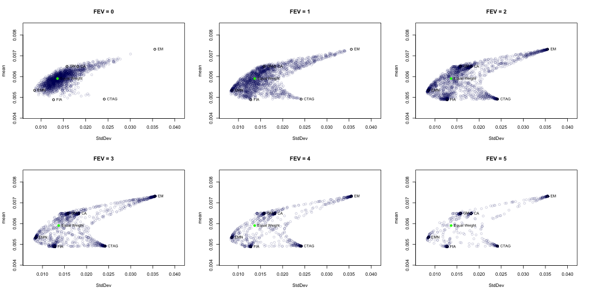
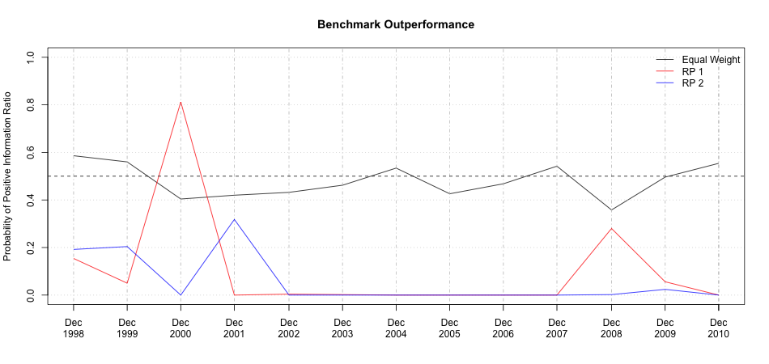
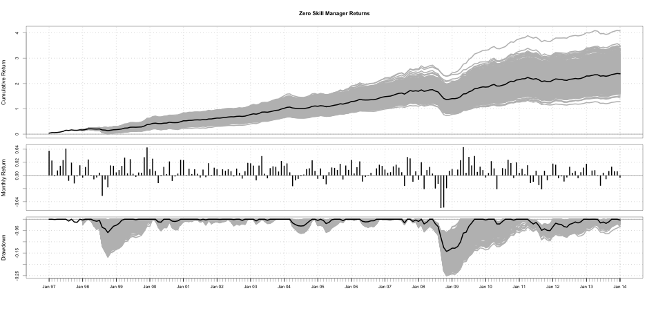
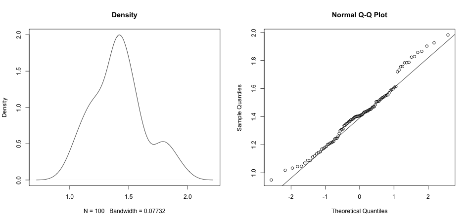
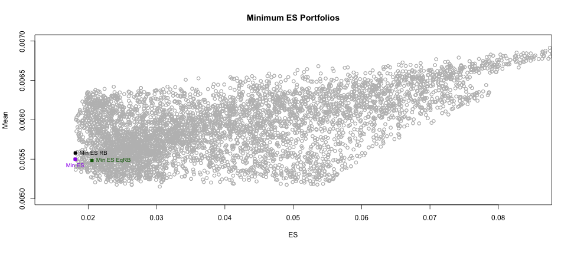
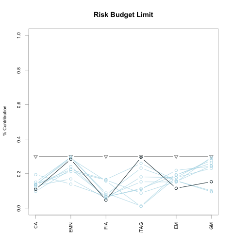
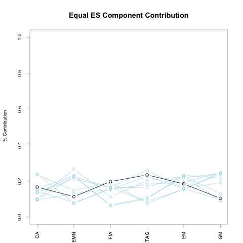
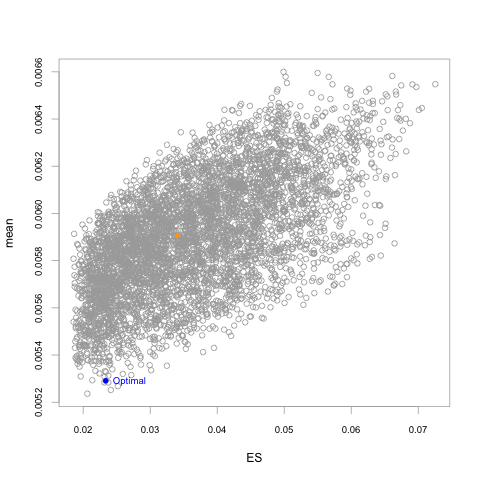
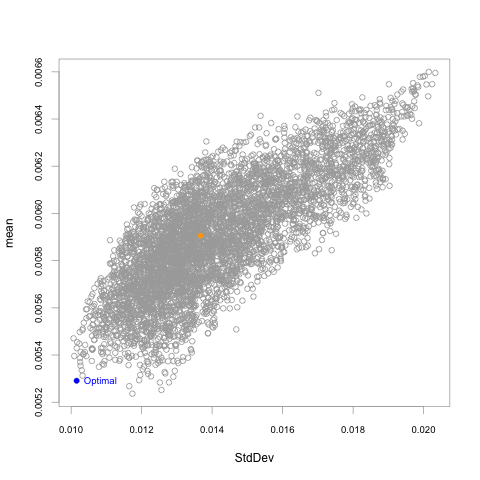
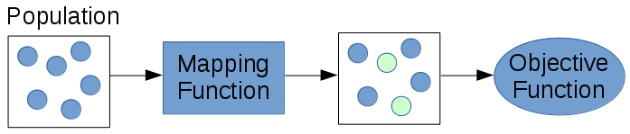

## What is a random portfolio?
The basic idea is to sample from the population of portfolios that satisfy the given constraints. The idea is simple, but is a very flexible and powerful approach for portfolio optimization and other applications.

> "Random portfolios have the power to revolutionize fund management. You might think that means they must be esoteric and complex. You would be wrong — the idea is very simple." - Patrick Burns

---

## Why Random Portfolios?
* Portfolio Optimization
  * Non-convex and complex objective functions
  * Visualize feasible space
  * Easily parallelizable
* Performance Measurement
* Extend differential evolution algorithm
* Trading Strategy Paremeter Optimization

---

## Algorithms to Generate Random Portfolios
  * Simplex
  * Grid Search
  * Sample

<!--
these are the algorithms that are included in PortfolioAnalytics that I am familar with and will talk about. There may be others. Ask Brian.
-->

---

## Simplex Algorithm
* Monte Carlo Portfolio Optimization in a Parallel Environment (MC-POPE) method by William T. Shaw.
* Shaw recommends this as the best method to evenly sample a simplex or a subject of it.

$$
w_i = \frac{\log U_i}{\sum_{j=1}^N U_j}
$$

where $U_i$ are uncorrelated random variables on $U(0,1)$

<!--
implicit constraints of long only and weights sum to 1
-->

---

## Simplex Algorithm Extensions
* Lower Bound
$$
w_i = L_i + (1 - \sum_{j=1}^N L_j) \frac{\log U_i}{\sum_{k=1}^N U_k}
$$

* FEV-Biasing
$$
w_i = \frac{\log U_i^q}{\sum_{j=1}^N U_j^q}
$$
let $q = 2^p$

---

## FEV-Biasing Visualization


---

## Simplex Algorithm Overview
Advantages
  * Fast and efficient method to generate random portfolios
  * Control portfolio concentration

Disadvantages
  * Limited support for constraints
    * Weights sum to 1
    * Lower bound on weights
  
<!---
* upper bound on weights?
* group?
* dollar neutral?
* position limits?
-->

---

## Grid Search Method
Create all possible combinations given a set of feasible weights
* The portfolio will satisfy box constraints by construction

How do we handle other constraints?
* transformation
* elimination

<!--
transformation may violate box constraints
elimination may not leave many random portfolios
problem with large problems (n!)
-->

---

## Sample Method Algorithm
Based on idea by Patrick Burns

```r
foo <- function(weights, min_sum, max_sum, min, max, ...){
  while (sum(weights) <= min_sum | sum(weights) >= max_sum) {
    while (sum(weights) <= min_sum) {
      # i is a randomly selected index of weights vector
      tmpS <- S[(S >= cur_val) & (S <= max[i])]
      weights[i] <- tmpS[sample.int(1, length(tmpS))]
    }
    while (sum(weights) >= max_sum) {
      # i is a randomly selected index of weights vector
      tmpS <- S[(S >= cur_val) & (S <= max[i])]
      weights[i] <- tmpS[sample.int(1, length(tmpS))]
    }
  }
return(weights)
}
```
* Note: code snippet is intentionally incomplete for the purpose of slides

<!--
Mountain lake analogy

This is the most flexible method, but also the slowest, and can generate portfolios to satisfy sum of weights, box, group, position limit constraints.

it is often the case that the optimal portfolio is on the edge of the feasible space. this algorithm allows us to generate portfolios that evenly cover the interior and edges of feasible space.

* $S$ is the of feasible weights
* $weights$ is the vector of portfolio weights
* $min_sum$ is the lower bound on sum of weights
* $max_sum$ is the upper bound on sum of weights
* $min$ is the vector of lower bound box constraints
* $max$ is the vector of upper bound box constraints
randomly permute and increase a random portfolio element
randomly permute and decrease a random portfolio element
any sum of weights
box constraints

Other constraints?
* group
* number of assets
-->

---

## Adding Constraints
Think hard about the algorithm to support more constraint types by construction of the portfolio.
* sum of weights
* box
* group
* position limit (# of non-zero, # of long/short, etc.)
* leverage

<!--
My first attempt at v2 was to add conditions to the outer while loop and cross my fingers

after a lot of testing and frustration, I came to the algorithm that is currently implemented in PortfolioAnalytics
-->

---

## Adding Group Constraint

```r
rp <- function(x){
  while(violate_constraints(x)){
    x <- check_maxsum(x)
    x <- check_minsum(x)
    if(violate_group_constraints(x))
      x <- rp(x)
  }
  return(x)
}
```
* Note: code snippet is intentionally incomplete for the purpose of the slides

<!--
pseudo code to demonstrate modular approach of the algorithm and how we can look at the group constraint violation problem as the same problem as a portfolio that violates sum of weights. This results in a simple recursive call
while constraints violated

check for minimum sum of weights
randomly permute and increase a random portfolio element

check for maximum sum of weights
randomly permute and decrease a random portfolio element

check for group
group constraint violation is taking that subset of the portfolio and then you have the exact same problem as a portfolio that violates sum of weights constraint so we can just make a recursive call
-->

---

## Interactive Visualization of RP Methods

<div id = 'chartfae6922170d' class = 'rChart nvd3'></div>
<script type='text/javascript'>
 $(document).ready(function(){
      drawchartfae6922170d()
    });
    function drawchartfae6922170d(){  
      var opts = {
 "dom": "chartfae6922170d",
"width":    800,
"height":    400,
"x": "sd",
"y": "mean",
"group": "name",
"type": "scatterChart",
"id": "chartfae6922170d" 
},
        data = [
 {
 "name": "sample",
"mean": 0.005906097560976,
"sd": 0.01367140149733 
},
{
 "name": "sample",
"mean": 0.006911211707317,
"sd": 0.03028253402609 
},
{
 "name": "sample",
"mean": 0.005958791219512,
"sd": 0.01351827809068 
},
{
 "name": "sample",
"mean": 0.006069890731707,
"sd": 0.01171769666872 
},
{
 "name": "sample",
"mean": 0.006923629268293,
"sd": 0.02683007097072 
},
{
 "name": "sample",
"mean": 0.005450743414634,
"sd": 0.009606562566814 
},
{
 "name": "sample",
"mean": 0.005973208780488,
"sd": 0.01941603468694 
},
{
 "name": "sample",
"mean": 0.00589924195122,
"sd": 0.01846499366517 
},
{
 "name": "sample",
"mean": 0.006046430243902,
"sd": 0.01528404205142 
},
{
 "name": "sample",
"mean": 0.00534848097561,
"sd": 0.01153521859782 
},
{
 "name": "sample",
"mean": 0.005469695609756,
"sd": 0.01172702869559 
},
{
 "name": "sample",
"mean": 0.005695751219512,
"sd": 0.0156752831271 
},
{
 "name": "sample",
"mean": 0.006081794146341,
"sd": 0.01443090689323 
},
{
 "name": "sample",
"mean": 0.00576363902439,
"sd": 0.01001018844225 
},
{
 "name": "sample",
"mean": 0.005428472195122,
"sd": 0.01584002721338 
},
{
 "name": "sample",
"mean": 0.005903766829268,
"sd": 0.01701815967952 
},
{
 "name": "sample",
"mean": 0.006144152195122,
"sd": 0.01906432146664 
},
{
 "name": "sample",
"mean": 0.006527375609756,
"sd": 0.01715559528158 
},
{
 "name": "sample",
"mean": 0.006256284878049,
"sd": 0.014983067888 
},
{
 "name": "sample",
"mean": 0.005742626341463,
"sd": 0.0119619917445 
},
{
 "name": "sample",
"mean": 0.00597839804878,
"sd": 0.01199264474285 
},
{
 "name": "sample",
"mean": 0.006000194146341,
"sd": 0.01360815441766 
},
{
 "name": "sample",
"mean": 0.006217949268293,
"sd": 0.01625627221132 
},
{
 "name": "sample",
"mean": 0.005857261463415,
"sd": 0.01141873258457 
},
{
 "name": "sample",
"mean": 0.006195980487805,
"sd": 0.015392850241 
},
{
 "name": "sample",
"mean": 0.005016862439024,
"sd": 0.01229098808624 
},
{
 "name": "sample",
"mean":     0.00547844,
"sd": 0.0111605939544 
},
{
 "name": "sample",
"mean": 0.005268275121951,
"sd": 0.01683961541105 
},
{
 "name": "sample",
"mean": 0.006635552195122,
"sd": 0.01746179095077 
},
{
 "name": "sample",
"mean": 0.005860832195122,
"sd": 0.01612318336488 
},
{
 "name": "sample",
"mean": 0.00546467804878,
"sd": 0.009364356897245 
},
{
 "name": "sample",
"mean": 0.00597203902439,
"sd": 0.01558813808233 
},
{
 "name": "sample",
"mean": 0.007160315121951,
"sd": 0.031232259333 
},
{
 "name": "sample",
"mean": 0.006164816585366,
"sd": 0.01708101205793 
},
{
 "name": "sample",
"mean": 0.005371979512195,
"sd": 0.0148532335787 
},
{
 "name": "sample",
"mean": 0.006504277073171,
"sd": 0.02220775942665 
},
{
 "name": "sample",
"mean": 0.006118394146341,
"sd": 0.01296179081338 
},
{
 "name": "sample",
"mean": 0.006545815609756,
"sd": 0.02145563898372 
},
{
 "name": "sample",
"mean": 0.005885096585366,
"sd": 0.01503093278357 
},
{
 "name": "sample",
"mean": 0.005949086829268,
"sd": 0.01419142387981 
},
{
 "name": "sample",
"mean": 0.006351142439024,
"sd": 0.02030374023715 
},
{
 "name": "sample",
"mean": 0.005763299512195,
"sd": 0.01302086430405 
},
{
 "name": "sample",
"mean": 0.005116939512195,
"sd": 0.02059020634979 
},
{
 "name": "sample",
"mean": 0.006473353170732,
"sd": 0.02212449849496 
},
{
 "name": "sample",
"mean": 0.005891746341463,
"sd": 0.01220842881048 
},
{
 "name": "sample",
"mean": 0.005234847804878,
"sd": 0.01886619236012 
},
{
 "name": "sample",
"mean": 0.006549122926829,
"sd": 0.01623606450858 
},
{
 "name": "sample",
"mean": 0.005503323902439,
"sd": 0.01580529697327 
},
{
 "name": "sample",
"mean": 0.005424067317073,
"sd": 0.01189985669543 
},
{
 "name": "sample",
"mean": 0.00546483902439,
"sd": 0.009257146599548 
},
{
 "name": "sample",
"mean": 0.005569498536585,
"sd": 0.009431584071714 
},
{
 "name": "sample",
"mean": 0.006425941463415,
"sd": 0.0159743468814 
},
{
 "name": "sample",
"mean": 0.005405387317073,
"sd": 0.01124201495449 
},
{
 "name": "sample",
"mean": 0.006263965853659,
"sd": 0.02060032798449 
},
{
 "name": "sample",
"mean": 0.006741883902439,
"sd": 0.01986658512526 
},
{
 "name": "sample",
"mean": 0.006027622439024,
"sd": 0.01282150503913 
},
{
 "name": "sample",
"mean": 0.005943165853659,
"sd": 0.01407383956178 
},
{
 "name": "sample",
"mean": 0.006851174634146,
"sd": 0.02851930613781 
},
{
 "name": "sample",
"mean": 0.005162617560976,
"sd": 0.01070269614235 
},
{
 "name": "sample",
"mean": 0.005127018536585,
"sd": 0.01211374631361 
},
{
 "name": "sample",
"mean": 0.00561475804878,
"sd": 0.01218039527552 
},
{
 "name": "sample",
"mean": 0.00639380195122,
"sd": 0.01684497980809 
},
{
 "name": "sample",
"mean": 0.005715847804878,
"sd": 0.01692232232984 
},
{
 "name": "sample",
"mean": 0.005624408780488,
"sd": 0.0142158273421 
},
{
 "name": "sample",
"mean": 0.006518336585366,
"sd": 0.02085507525007 
},
{
 "name": "sample",
"mean": 0.005065467317073,
"sd": 0.01137629931234 
},
{
 "name": "sample",
"mean": 0.00527640097561,
"sd": 0.02069728395777 
},
{
 "name": "sample",
"mean": 0.005578214634146,
"sd": 0.01276862863349 
},
{
 "name": "sample",
"mean": 0.006202291707317,
"sd": 0.02018673786364 
},
{
 "name": "sample",
"mean": 0.005596089756098,
"sd": 0.01876116422146 
},
{
 "name": "sample",
"mean": 0.006420830243902,
"sd": 0.02275850747812 
},
{
 "name": "sample",
"mean": 0.004996917073171,
"sd": 0.01118012363336 
},
{
 "name": "sample",
"mean": 0.005847065365854,
"sd": 0.01627124479602 
},
{
 "name": "sample",
"mean": 0.006710089756098,
"sd": 0.0241766470636 
},
{
 "name": "sample",
"mean": 0.005881208780488,
"sd": 0.0129697105604 
},
{
 "name": "sample",
"mean": 0.00545643902439,
"sd": 0.01411183391067 
},
{
 "name": "sample",
"mean": 0.006273859512195,
"sd": 0.01360376536064 
},
{
 "name": "sample",
"mean": 0.006116496585366,
"sd": 0.01324654470155 
},
{
 "name": "sample",
"mean": 0.006497784390244,
"sd": 0.01603292640267 
},
{
 "name": "sample",
"mean": 0.005998929756098,
"sd": 0.01379722167344 
},
{
 "name": "sample",
"mean": 0.006488493658537,
"sd": 0.01509228263908 
},
{
 "name": "sample",
"mean": 0.00682187902439,
"sd": 0.02814844235555 
},
{
 "name": "sample",
"mean": 0.004896824390244,
"sd": 0.01188035898753 
},
{
 "name": "sample",
"mean": 0.007071323902439,
"sd": 0.02925409386355 
},
{
 "name": "sample",
"mean": 0.005468141463415,
"sd": 0.01578730984072 
},
{
 "name": "sample",
"mean": 0.00612860097561,
"sd": 0.01651420787757 
},
{
 "name": "sample",
"mean": 0.005707187317073,
"sd": 0.0104463206348 
},
{
 "name": "sample",
"mean": 0.006594292682927,
"sd": 0.02222442353155 
},
{
 "name": "sample",
"mean": 0.006414987317073,
"sd": 0.01834370573712 
},
{
 "name": "sample",
"mean": 0.005329658536585,
"sd": 0.008479809500548 
},
{
 "name": "sample",
"mean": 0.005079734634146,
"sd": 0.01081503814605 
},
{
 "name": "sample",
"mean": 0.005540808780488,
"sd": 0.01161937939363 
},
{
 "name": "sample",
"mean": 0.005862746341463,
"sd": 0.01312471037057 
},
{
 "name": "sample",
"mean": 0.005415409756098,
"sd": 0.01022102518894 
},
{
 "name": "sample",
"mean":     0.00664424,
"sd": 0.01949329152568 
},
{
 "name": "sample",
"mean": 0.005791054634146,
"sd": 0.01755955883425 
},
{
 "name": "sample",
"mean": 0.006078192195122,
"sd": 0.01349916977248 
},
{
 "name": "sample",
"mean": 0.006816290731707,
"sd": 0.02301335807523 
},
{
 "name": "sample",
"mean": 0.005607259512195,
"sd": 0.0103448554634 
},
{
 "name": "sample",
"mean": 0.006664693658537,
"sd": 0.02476761178684 
},
{
 "name": "sample",
"mean": 0.005426795121951,
"sd": 0.01502246514687 
},
{
 "name": "sample",
"mean": 0.005529353170732,
"sd": 0.01428952072588 
},
{
 "name": "sample",
"mean": 0.005773595121951,
"sd": 0.01547338940356 
},
{
 "name": "sample",
"mean": 0.005381951219512,
"sd": 0.009578934226297 
},
{
 "name": "sample",
"mean": 0.006042035121951,
"sd": 0.01806858681315 
},
{
 "name": "sample",
"mean": 0.006695717073171,
"sd": 0.0200507554765 
},
{
 "name": "sample",
"mean": 0.005712814634146,
"sd": 0.01300381531202 
},
{
 "name": "sample",
"mean": 0.006534924878049,
"sd": 0.02467792241821 
},
{
 "name": "sample",
"mean": 0.006381618536585,
"sd": 0.01486623776073 
},
{
 "name": "sample",
"mean": 0.005232566829268,
"sd": 0.01132081791002 
},
{
 "name": "sample",
"mean": 0.00516116097561,
"sd": 0.01104672152619 
},
{
 "name": "sample",
"mean": 0.006510273170732,
"sd": 0.01717995718121 
},
{
 "name": "sample",
"mean": 0.005360536585366,
"sd": 0.008513184799191 
},
{
 "name": "sample",
"mean": 0.006392492682927,
"sd": 0.01996710884801 
},
{
 "name": "sample",
"mean": 0.005883513170732,
"sd": 0.02005657551267 
},
{
 "name": "sample",
"mean": 0.00607680097561,
"sd": 0.01286419588177 
},
{
 "name": "sample",
"mean": 0.005895590243902,
"sd": 0.01289166548471 
},
{
 "name": "sample",
"mean": 0.005427173658537,
"sd": 0.01025401282691 
},
{
 "name": "sample",
"mean": 0.006689811707317,
"sd": 0.02601811081906 
},
{
 "name": "sample",
"mean": 0.006354543414634,
"sd": 0.01503239573414 
},
{
 "name": "sample",
"mean": 0.006439555121951,
"sd": 0.01490192270545 
},
{
 "name": "sample",
"mean": 0.005850101463415,
"sd": 0.01776196978607 
},
{
 "name": "sample",
"mean": 0.005272404878049,
"sd": 0.01190391937785 
},
{
 "name": "sample",
"mean": 0.005563928780488,
"sd": 0.01313151239723 
},
{
 "name": "sample",
"mean": 0.00563568195122,
"sd": 0.01059841694723 
},
{
 "name": "sample",
"mean": 0.006202673170732,
"sd": 0.01516025156995 
},
{
 "name": "sample",
"mean": 0.005949722926829,
"sd": 0.01902863918226 
},
{
 "name": "sample",
"mean": 0.005629701463415,
"sd": 0.01176861753438 
},
{
 "name": "sample",
"mean": 0.005852387317073,
"sd": 0.01519440724319 
},
{
 "name": "sample",
"mean": 0.006451515121951,
"sd": 0.02473819737269 
},
{
 "name": "sample",
"mean": 0.006108068292683,
"sd": 0.01408246459558 
},
{
 "name": "sample",
"mean": 0.005393606829268,
"sd": 0.01005368804856 
},
{
 "name": "sample",
"mean": 0.005071853658537,
"sd": 0.01136379374883 
},
{
 "name": "sample",
"mean": 0.005717374634146,
"sd": 0.01028902668337 
},
{
 "name": "sample",
"mean": 0.00523087804878,
"sd": 0.02009329220451 
},
{
 "name": "sample",
"mean": 0.006335813658537,
"sd": 0.01779176863411 
},
{
 "name": "sample",
"mean": 0.006453899512195,
"sd": 0.01603346425506 
},
{
 "name": "sample",
"mean": 0.005098654634146,
"sd": 0.02070170530853 
},
{
 "name": "sample",
"mean": 0.004961156097561,
"sd": 0.0162618414994 
},
{
 "name": "sample",
"mean": 0.005967866341463,
"sd": 0.01173112093017 
},
{
 "name": "sample",
"mean": 0.005809443902439,
"sd": 0.0147730620684 
},
{
 "name": "sample",
"mean": 0.006212572682927,
"sd": 0.01532134146556 
},
{
 "name": "sample",
"mean": 0.005702542439024,
"sd": 0.01170309914002 
},
{
 "name": "sample",
"mean": 0.00574935804878,
"sd": 0.01477405106897 
},
{
 "name": "sample",
"mean": 0.005619008780488,
"sd": 0.01025385392881 
},
{
 "name": "sample",
"mean": 0.00641507902439,
"sd": 0.0149144318283 
},
{
 "name": "sample",
"mean": 0.00629996195122,
"sd": 0.01479535052383 
},
{
 "name": "sample",
"mean": 0.005219316097561,
"sd": 0.01943661783343 
},
{
 "name": "sample",
"mean": 0.005590112195122,
"sd": 0.01490665129877 
},
{
 "name": "sample",
"mean": 0.005572008780488,
"sd": 0.01937324582355 
},
{
 "name": "sample",
"mean": 0.006244475121951,
"sd": 0.01451890358783 
},
{
 "name": "sample",
"mean": 0.005507729756098,
"sd": 0.009112296742107 
},
{
 "name": "sample",
"mean": 0.006541825365854,
"sd": 0.0181058307346 
},
{
 "name": "sample",
"mean": 0.005916225365854,
"sd": 0.01172121124162 
},
{
 "name": "sample",
"mean": 0.005556499512195,
"sd": 0.009065825169166 
},
{
 "name": "sample",
"mean": 0.006032002926829,
"sd": 0.01500478284845 
},
{
 "name": "sample",
"mean": 0.006668316097561,
"sd": 0.02664856950826 
},
{
 "name": "sample",
"mean": 0.006194276097561,
"sd": 0.01406902531935 
},
{
 "name": "sample",
"mean": 0.005096410731707,
"sd": 0.02125387510858 
},
{
 "name": "sample",
"mean": 0.006035418536585,
"sd": 0.01529735877335 
},
{
 "name": "sample",
"mean": 0.00544368097561,
"sd": 0.01157478504144 
},
{
 "name": "sample",
"mean": 0.00554696195122,
"sd": 0.0130755545271 
},
{
 "name": "sample",
"mean": 0.005294111219512,
"sd": 0.01163153558052 
},
{
 "name": "sample",
"mean": 0.005569634146341,
"sd": 0.01238256981403 
},
{
 "name": "sample",
"mean": 0.005391664390244,
"sd": 0.008992623089704 
},
{
 "name": "sample",
"mean": 0.006548260487805,
"sd": 0.01994188567882 
},
{
 "name": "sample",
"mean": 0.006530740487805,
"sd": 0.01824057991218 
},
{
 "name": "sample",
"mean": 0.00576108097561,
"sd": 0.01412785690958 
},
{
 "name": "sample",
"mean": 0.005795191219512,
"sd": 0.01216357797029 
},
{
 "name": "sample",
"mean": 0.005807169756098,
"sd": 0.01180844532861 
},
{
 "name": "sample",
"mean": 0.005104094634146,
"sd": 0.01150157161988 
},
{
 "name": "sample",
"mean": 0.005653540487805,
"sd": 0.01783320963155 
},
{
 "name": "sample",
"mean": 0.006288713170732,
"sd": 0.02255942474091 
},
{
 "name": "sample",
"mean": 0.006004442926829,
"sd": 0.01436166922854 
},
{
 "name": "sample",
"mean": 0.006438568780488,
"sd": 0.01518726375925 
},
{
 "name": "sample",
"mean": 0.005918171707317,
"sd": 0.01572803536877 
},
{
 "name": "sample",
"mean": 0.006305035121951,
"sd": 0.01597863246956 
},
{
 "name": "sample",
"mean": 0.006298096585366,
"sd": 0.01681931670008 
},
{
 "name": "sample",
"mean":     0.00520636,
"sd": 0.02004243056906 
},
{
 "name": "sample",
"mean": 0.005724335609756,
"sd": 0.009509693949105 
},
{
 "name": "sample",
"mean": 0.005652942439024,
"sd": 0.009872599254661 
},
{
 "name": "sample",
"mean": 0.005604614634146,
"sd": 0.01258027451357 
},
{
 "name": "sample",
"mean": 0.006540780487805,
"sd": 0.02520736242472 
},
{
 "name": "sample",
"mean": 0.006400367804878,
"sd": 0.01606910574606 
},
{
 "name": "sample",
"mean": 0.006200122926829,
"sd": 0.01416972080065 
},
{
 "name": "sample",
"mean": 0.00502591902439,
"sd": 0.011397187266 
},
{
 "name": "sample",
"mean": 0.005064691707317,
"sd": 0.01926292713595 
},
{
 "name": "sample",
"mean": 0.005512516097561,
"sd": 0.018725285918 
},
{
 "name": "sample",
"mean": 0.006269376585366,
"sd": 0.01378173072337 
},
{
 "name": "sample",
"mean": 0.005395945365854,
"sd": 0.01597155035375 
},
{
 "name": "sample",
"mean": 0.00575792195122,
"sd": 0.01181396129339 
},
{
 "name": "sample",
"mean": 0.005225617560976,
"sd": 0.01706960609112 
},
{
 "name": "sample",
"mean": 0.005759747317073,
"sd": 0.01154969798136 
},
{
 "name": "sample",
"mean": 0.006275366829268,
"sd": 0.01666779468272 
},
{
 "name": "sample",
"mean": 0.005067821463415,
"sd": 0.01137435275738 
},
{
 "name": "sample",
"mean": 0.006657538536585,
"sd": 0.02086364742656 
},
{
 "name": "sample",
"mean": 0.005837329756098,
"sd": 0.01631203749902 
},
{
 "name": "sample",
"mean": 0.005764428292683,
"sd": 0.01480360960473 
},
{
 "name": "sample",
"mean": 0.006197985365854,
"sd": 0.01457319261085 
},
{
 "name": "sample",
"mean": 0.005067910243902,
"sd": 0.01176727673271 
},
{
 "name": "sample",
"mean": 0.005706900487805,
"sd": 0.009985614767247 
},
{
 "name": "sample",
"mean": 0.006752539512195,
"sd": 0.02720939699427 
},
{
 "name": "sample",
"mean": 0.005925283902439,
"sd": 0.0141980652034 
},
{
 "name": "sample",
"mean": 0.005330543414634,
"sd": 0.009119577115901 
},
{
 "name": "sample",
"mean": 0.00540012097561,
"sd": 0.01421847544637 
},
{
 "name": "sample",
"mean": 0.005803953170732,
"sd": 0.01354141454189 
},
{
 "name": "sample",
"mean": 0.006340266341463,
"sd": 0.01417290640217 
},
{
 "name": "sample",
"mean": 0.005686735609756,
"sd": 0.01265645000314 
},
{
 "name": "sample",
"mean": 0.005971183414634,
"sd": 0.01219733476072 
},
{
 "name": "sample",
"mean": 0.005447461463415,
"sd": 0.01070812043956 
},
{
 "name": "sample",
"mean": 0.005692522926829,
"sd": 0.01069897817746 
},
{
 "name": "sample",
"mean": 0.006303676097561,
"sd": 0.01917797361912 
},
{
 "name": "sample",
"mean": 0.005131746341463,
"sd": 0.01843122597294 
},
{
 "name": "sample",
"mean": 0.007238705365854,
"sd": 0.0322193486506 
},
{
 "name": "sample",
"mean": 0.006650335609756,
"sd": 0.01805451588869 
},
{
 "name": "sample",
"mean": 0.006058466341463,
"sd": 0.01932241042038 
},
{
 "name": "sample",
"mean": 0.006226647804878,
"sd": 0.01275716580463 
},
{
 "name": "sample",
"mean": 0.006396894634146,
"sd": 0.01703186903304 
},
{
 "name": "sample",
"mean": 0.005877444878049,
"sd": 0.01522316155556 
},
{
 "name": "sample",
"mean": 0.005810245853659,
"sd": 0.0121296409605 
},
{
 "name": "sample",
"mean": 0.006423217560976,
"sd": 0.01748662050214 
},
{
 "name": "sample",
"mean": 0.00663976097561,
"sd": 0.0218159812528 
},
{
 "name": "sample",
"mean": 0.006256654634146,
"sd": 0.01542588005739 
},
{
 "name": "sample",
"mean": 0.006522818536585,
"sd": 0.01903636978438 
},
{
 "name": "sample",
"mean": 0.005866531707317,
"sd": 0.01291798938787 
},
{
 "name": "sample",
"mean": 0.005622873170732,
"sd": 0.01294320055742 
},
{
 "name": "sample",
"mean": 0.005592489756098,
"sd": 0.009004155476362 
},
{
 "name": "sample",
"mean": 0.005632477073171,
"sd": 0.0109427564572 
},
{
 "name": "sample",
"mean": 0.005110995121951,
"sd": 0.01138493278724 
},
{
 "name": "sample",
"mean": 0.006071715121951,
"sd": 0.01597259431951 
},
{
 "name": "sample",
"mean": 0.005288334634146,
"sd": 0.01650294248925 
},
{
 "name": "sample",
"mean": 0.005511653658537,
"sd": 0.01227184100544 
},
{
 "name": "sample",
"mean": 0.005827155121951,
"sd": 0.01665326093246 
},
{
 "name": "sample",
"mean": 0.005395803902439,
"sd": 0.01090705521367 
},
{
 "name": "sample",
"mean": 0.005743971707317,
"sd": 0.01765380847892 
},
{
 "name": "sample",
"mean": 0.00634508097561,
"sd": 0.01565768928799 
},
{
 "name": "sample",
"mean": 0.006837489756098,
"sd": 0.02801309575941 
},
{
 "name": "sample",
"mean": 0.006395125853659,
"sd": 0.02279534416178 
},
{
 "name": "sample",
"mean": 0.005414102439024,
"sd": 0.01579883566074 
},
{
 "name": "sample",
"mean": 0.006184751219512,
"sd": 0.01793139241489 
},
{
 "name": "sample",
"mean": 0.006967231219512,
"sd": 0.03040175829824 
},
{
 "name": "sample",
"mean": 0.00673711902439,
"sd": 0.02582982430919 
},
{
 "name": "sample",
"mean": 0.007186034146341,
"sd": 0.03321262007124 
},
{
 "name": "sample",
"mean": 0.005806409756098,
"sd": 0.0113843414404 
},
{
 "name": "sample",
"mean": 0.005532616585366,
"sd": 0.01676612799013 
},
{
 "name": "sample",
"mean": 0.005968517073171,
"sd": 0.01311574673705 
},
{
 "name": "sample",
"mean": 0.006235006829268,
"sd": 0.02084472071618 
},
{
 "name": "sample",
"mean": 0.006085631219512,
"sd": 0.01448976502027 
},
{
 "name": "sample",
"mean": 0.00596112195122,
"sd": 0.01628447998097 
},
{
 "name": "sample",
"mean": 0.00685359804878,
"sd": 0.02806774818235 
},
{
 "name": "sample",
"mean": 0.006140685853659,
"sd": 0.01498577068213 
},
{
 "name": "sample",
"mean": 0.005334168780488,
"sd": 0.01423426289162 
},
{
 "name": "sample",
"mean": 0.005935833170732,
"sd": 0.01737192314142 
},
{
 "name": "sample",
"mean": 0.006002989268293,
"sd": 0.01556710418436 
},
{
 "name": "sample",
"mean": 0.006496582439024,
"sd": 0.01927010084586 
},
{
 "name": "sample",
"mean": 0.00610628097561,
"sd": 0.01498636747127 
},
{
 "name": "sample",
"mean": 0.006786003902439,
"sd": 0.02905523916175 
},
{
 "name": "sample",
"mean": 0.006305214634146,
"sd": 0.0158511384066 
},
{
 "name": "sample",
"mean": 0.005522754146341,
"sd": 0.01335320250729 
},
{
 "name": "sample",
"mean": 0.00593320195122,
"sd": 0.01298871383454 
},
{
 "name": "sample",
"mean": 0.005286604878049,
"sd": 0.01145776166272 
},
{
 "name": "sample",
"mean": 0.006297667317073,
"sd": 0.01699381836689 
},
{
 "name": "sample",
"mean": 0.005615756097561,
"sd": 0.01021948903585 
},
{
 "name": "sample",
"mean": 0.00621479804878,
"sd": 0.0146780522183 
},
{
 "name": "sample",
"mean": 0.006438430243902,
"sd": 0.01516386006424 
},
{
 "name": "sample",
"mean": 0.006443202926829,
"sd": 0.01781419849137 
},
{
 "name": "sample",
"mean": 0.005383893658537,
"sd": 0.01296893052696 
},
{
 "name": "sample",
"mean": 0.006007218536585,
"sd": 0.01284826220851 
},
{
 "name": "sample",
"mean": 0.005757572682927,
"sd": 0.01262335523213 
},
{
 "name": "sample",
"mean": 0.005967423414634,
"sd": 0.01576611694315 
},
{
 "name": "sample",
"mean": 0.006454617560976,
"sd": 0.01908814574006 
},
{
 "name": "sample",
"mean": 0.005512872195122,
"sd": 0.01731072890776 
},
{
 "name": "sample",
"mean": 0.006063916097561,
"sd": 0.0156532084203 
},
{
 "name": "sample",
"mean": 0.00541100195122,
"sd": 0.01636894939064 
},
{
 "name": "sample",
"mean": 0.007129587317073,
"sd": 0.03181009855082 
},
{
 "name": "sample",
"mean": 0.006416103414634,
"sd": 0.01798090638108 
},
{
 "name": "sample",
"mean": 0.006138525853659,
"sd": 0.01580442390326 
},
{
 "name": "sample",
"mean": 0.005323749268293,
"sd": 0.01083925521185 
},
{
 "name": "sample",
"mean": 0.006229899512195,
"sd": 0.02160355086585 
},
{
 "name": "sample",
"mean": 0.005397590243902,
"sd": 0.01393795950995 
},
{
 "name": "sample",
"mean": 0.005141474146341,
"sd": 0.008624533767743 
},
{
 "name": "sample",
"mean":      0.0053006,
"sd": 0.009201155590212 
},
{
 "name": "sample",
"mean": 0.006244584390244,
"sd": 0.02004302964707 
},
{
 "name": "sample",
"mean": 0.005740453658537,
"sd": 0.01221712506559 
},
{
 "name": "sample",
"mean": 0.005733216585366,
"sd": 0.01270327414093 
},
{
 "name": "sample",
"mean": 0.006529255609756,
"sd": 0.01782352600822 
},
{
 "name": "sample",
"mean": 0.005732045853659,
"sd": 0.01520163006154 
},
{
 "name": "sample",
"mean": 0.005151528780488,
"sd": 0.01099696920519 
},
{
 "name": "sample",
"mean": 0.005331739512195,
"sd": 0.009941104847001 
},
{
 "name": "sample",
"mean": 0.006454107317073,
"sd": 0.01989465018331 
},
{
 "name": "sample",
"mean": 0.006349130731707,
"sd": 0.01423974550023 
},
{
 "name": "sample",
"mean": 0.00631888097561,
"sd": 0.02167712193236 
},
{
 "name": "sample",
"mean": 0.006142538536585,
"sd": 0.01928342334207 
},
{
 "name": "sample",
"mean": 0.006180500487805,
"sd": 0.01216020997033 
},
{
 "name": "sample",
"mean": 0.005122810731707,
"sd": 0.01224730733449 
},
{
 "name": "sample",
"mean": 0.005946508292683,
"sd": 0.01147671750104 
},
{
 "name": "sample",
"mean": 0.006174353170732,
"sd": 0.01582294864028 
},
{
 "name": "sample",
"mean": 0.005192060487805,
"sd": 0.01275323705502 
},
{
 "name": "sample",
"mean": 0.00608511902439,
"sd": 0.01581034150996 
},
{
 "name": "sample",
"mean": 0.00539107902439,
"sd": 0.01850592423614 
},
{
 "name": "sample",
"mean": 0.00573536097561,
"sd": 0.01287144177381 
},
{
 "name": "sample",
"mean": 0.004984865365854,
"sd": 0.01336848153243 
},
{
 "name": "sample",
"mean": 0.005725862439024,
"sd": 0.01402719940157 
},
{
 "name": "sample",
"mean": 0.006333642926829,
"sd": 0.02141402437775 
},
{
 "name": "sample",
"mean": 0.006076099512195,
"sd": 0.01241295846779 
},
{
 "name": "sample",
"mean": 0.006005426341463,
"sd": 0.0138291767803 
},
{
 "name": "sample",
"mean": 0.005596088780488,
"sd": 0.01379534217484 
},
{
 "name": "sample",
"mean": 0.005710396097561,
"sd": 0.01761733953021 
},
{
 "name": "sample",
"mean": 0.005114712195122,
"sd": 0.01071126364851 
},
{
 "name": "sample",
"mean": 0.005458693658537,
"sd": 0.01792541648387 
},
{
 "name": "sample",
"mean": 0.006253979512195,
"sd": 0.01601497495219 
},
{
 "name": "sample",
"mean": 0.006270391219512,
"sd": 0.01392822716239 
},
{
 "name": "sample",
"mean": 0.006914107317073,
"sd": 0.02777210116325 
},
{
 "name": "sample",
"mean": 0.005991749268293,
"sd": 0.01459190149579 
},
{
 "name": "sample",
"mean": 0.006223373658537,
"sd": 0.01644732688476 
},
{
 "name": "sample",
"mean": 0.005264644878049,
"sd": 0.01316485562757 
},
{
 "name": "sample",
"mean": 0.005473573658537,
"sd": 0.01267679871087 
},
{
 "name": "sample",
"mean": 0.006337831219512,
"sd": 0.01609010911644 
},
{
 "name": "sample",
"mean": 0.006056388292683,
"sd": 0.01952934773213 
},
{
 "name": "sample",
"mean": 0.006963977560976,
"sd": 0.02689247581944 
},
{
 "name": "sample",
"mean": 0.005054010731707,
"sd": 0.01201542771016 
},
{
 "name": "sample",
"mean": 0.005964691707317,
"sd": 0.01288362233522 
},
{
 "name": "sample",
"mean": 0.005991154146341,
"sd": 0.0147771476638 
},
{
 "name": "sample",
"mean": 0.00618040097561,
"sd": 0.01455606074656 
},
{
 "name": "sample",
"mean": 0.007008365853659,
"sd": 0.02898167933427 
},
{
 "name": "sample",
"mean": 0.005368283902439,
"sd": 0.0135891139346 
},
{
 "name": "sample",
"mean": 0.005839854634146,
"sd": 0.01584724657454 
},
{
 "name": "sample",
"mean": 0.005033153170732,
"sd": 0.02250580459669 
},
{
 "name": "sample",
"mean": 0.005620724878049,
"sd": 0.01489039268102 
},
{
 "name": "sample",
"mean": 0.005111898536585,
"sd": 0.01279531920742 
},
{
 "name": "sample",
"mean": 0.005307786341463,
"sd": 0.01347885366304 
},
{
 "name": "sample",
"mean": 0.005574986341463,
"sd": 0.009211662224051 
},
{
 "name": "sample",
"mean": 0.005765138536585,
"sd": 0.01711091019003 
},
{
 "name": "sample",
"mean": 0.006190507317073,
"sd": 0.0204647785196 
},
{
 "name": "sample",
"mean": 0.005513675121951,
"sd": 0.01382068596754 
},
{
 "name": "sample",
"mean": 0.005460295609756,
"sd": 0.0128019801683 
},
{
 "name": "sample",
"mean": 0.005372212682927,
"sd": 0.01885095149845 
},
{
 "name": "sample",
"mean": 0.007199649756098,
"sd": 0.03086568139274 
},
{
 "name": "sample",
"mean": 0.005857305365854,
"sd": 0.01595183480299 
},
{
 "name": "sample",
"mean": 0.005255865365854,
"sd": 0.01013167781095 
},
{
 "name": "sample",
"mean": 0.005884088780488,
"sd": 0.01215027596585 
},
{
 "name": "sample",
"mean": 0.005975131707317,
"sd": 0.01301423808632 
},
{
 "name": "sample",
"mean": 0.006589979512195,
"sd": 0.02540057270301 
},
{
 "name": "sample",
"mean": 0.005000169756098,
"sd": 0.010551518667 
},
{
 "name": "sample",
"mean": 0.006429435121951,
"sd": 0.02096744392191 
},
{
 "name": "sample",
"mean": 0.006353374634146,
"sd": 0.01691139552356 
},
{
 "name": "sample",
"mean": 0.006208493658537,
"sd": 0.01758882338481 
},
{
 "name": "sample",
"mean": 0.006459490731707,
"sd": 0.01389051506544 
},
{
 "name": "sample",
"mean": 0.006428464390244,
"sd": 0.01677375768642 
},
{
 "name": "sample",
"mean": 0.005547284878049,
"sd": 0.009377219414991 
},
{
 "name": "sample",
"mean": 0.005697317073171,
"sd": 0.01291774660614 
},
{
 "name": "sample",
"mean": 0.005277116097561,
"sd": 0.01714173130683 
},
{
 "name": "sample",
"mean": 0.007151187317073,
"sd": 0.03344468048478 
},
{
 "name": "sample",
"mean": 0.005484944390244,
"sd": 0.01002663554153 
},
{
 "name": "sample",
"mean": 0.006359910243902,
"sd": 0.02207203119202 
},
{
 "name": "sample",
"mean": 0.005658777560976,
"sd": 0.01293605181954 
},
{
 "name": "sample",
"mean": 0.005958794146341,
"sd": 0.01140258705807 
},
{
 "name": "sample",
"mean": 0.005304853658537,
"sd": 0.01386382117934 
},
{
 "name": "sample",
"mean": 0.006205094634146,
"sd": 0.01563197488989 
},
{
 "name": "sample",
"mean": 0.006029522926829,
"sd": 0.01380325425384 
},
{
 "name": "sample",
"mean": 0.005946299512195,
"sd": 0.01177105665003 
},
{
 "name": "sample",
"mean": 0.005382814634146,
"sd": 0.009776011573654 
},
{
 "name": "sample",
"mean": 0.006371934634146,
"sd": 0.01747199702667 
},
{
 "name": "sample",
"mean": 0.005482565853659,
"sd": 0.01327070302326 
},
{
 "name": "sample",
"mean": 0.006220192195122,
"sd": 0.01681499349939 
},
{
 "name": "sample",
"mean": 0.006167736585366,
"sd": 0.01900670423232 
},
{
 "name": "sample",
"mean": 0.007101729756098,
"sd": 0.03084078192954 
},
{
 "name": "sample",
"mean": 0.006317025365854,
"sd": 0.01662638140027 
},
{
 "name": "sample",
"mean": 0.00552023804878,
"sd": 0.01311154559585 
},
{
 "name": "sample",
"mean": 0.005437045853659,
"sd": 0.01323140623613 
},
{
 "name": "sample",
"mean": 0.005297688780488,
"sd": 0.01693464517204 
},
{
 "name": "sample",
"mean": 0.006020584390244,
"sd": 0.01270452065519 
},
{
 "name": "sample",
"mean": 0.005912978536585,
"sd": 0.01505343474264 
},
{
 "name": "sample",
"mean": 0.005973409756098,
"sd": 0.01263653475314 
},
{
 "name": "sample",
"mean": 0.005729813658537,
"sd": 0.01197814930035 
},
{
 "name": "sample",
"mean": 0.005470776585366,
"sd": 0.01217993648885 
},
{
 "name": "sample",
"mean": 0.006986388292683,
"sd": 0.02974114657197 
},
{
 "name": "sample",
"mean": 0.00599320195122,
"sd": 0.01485366719716 
},
{
 "name": "sample",
"mean": 0.005477381463415,
"sd": 0.0109663689663 
},
{
 "name": "sample",
"mean": 0.006068436097561,
"sd": 0.02069127787119 
},
{
 "name": "sample",
"mean":     0.00546908,
"sd": 0.01281740295203 
},
{
 "name": "sample",
"mean": 0.005774538536585,
"sd": 0.0149218954226 
},
{
 "name": "sample",
"mean": 0.006186116097561,
"sd": 0.0192613093872 
},
{
 "name": "sample",
"mean": 0.005466937560976,
"sd": 0.0116285429874 
},
{
 "name": "sample",
"mean": 0.006045383414634,
"sd": 0.01330279111496 
},
{
 "name": "sample",
"mean": 0.006098649756098,
"sd": 0.01402204615957 
},
{
 "name": "sample",
"mean": 0.005778982439024,
"sd": 0.01399463924245 
},
{
 "name": "sample",
"mean": 0.005590131707317,
"sd": 0.01376883393004 
},
{
 "name": "sample",
"mean": 0.005322735609756,
"sd": 0.01290683830377 
},
{
 "name": "sample",
"mean": 0.005857777560976,
"sd": 0.0144118048024 
},
{
 "name": "sample",
"mean": 0.006930692682927,
"sd": 0.02896547859091 
},
{
 "name": "sample",
"mean": 0.005278549268293,
"sd": 0.01109286127221 
},
{
 "name": "sample",
"mean": 0.006089820487805,
"sd": 0.01245638963488 
},
{
 "name": "sample",
"mean": 0.00634200195122,
"sd": 0.01293139443219 
},
{
 "name": "sample",
"mean": 0.005974105365854,
"sd": 0.01389103162733 
},
{
 "name": "sample",
"mean": 0.005601298536585,
"sd": 0.0101690813489 
},
{
 "name": "sample",
"mean": 0.005694223414634,
"sd": 0.01793363612284 
},
{
 "name": "sample",
"mean": 0.006314701463415,
"sd": 0.0191486955258 
},
{
 "name": "sample",
"mean": 0.006286974634146,
"sd": 0.01874259999774 
},
{
 "name": "sample",
"mean": 0.005067757073171,
"sd": 0.01088710868721 
},
{
 "name": "sample",
"mean": 0.006274345365854,
"sd": 0.01594789761694 
},
{
 "name": "sample",
"mean": 0.005674792195122,
"sd": 0.014585903569 
},
{
 "name": "sample",
"mean": 0.006070591219512,
"sd": 0.0118976276077 
},
{
 "name": "sample",
"mean": 0.006082496585366,
"sd": 0.01477852383599 
},
{
 "name": "sample",
"mean": 0.005871349268293,
"sd": 0.01109798938565 
},
{
 "name": "sample",
"mean": 0.006067095609756,
"sd": 0.01333423976838 
},
{
 "name": "sample",
"mean": 0.005988891707317,
"sd": 0.01308773274374 
},
{
 "name": "sample",
"mean": 0.005960233170732,
"sd": 0.01245992228283 
},
{
 "name": "sample",
"mean": 0.006491794146341,
"sd": 0.01920563128767 
},
{
 "name": "sample",
"mean": 0.005657058536585,
"sd": 0.01726782519842 
},
{
 "name": "sample",
"mean": 0.006361665365854,
"sd": 0.0140411214555 
},
{
 "name": "sample",
"mean": 0.005413551219512,
"sd": 0.009628798180782 
},
{
 "name": "sample",
"mean": 0.006641740487805,
"sd": 0.02384764292103 
},
{
 "name": "sample",
"mean": 0.00717236195122,
"sd": 0.03224862977291 
},
{
 "name": "sample",
"mean": 0.005789514146341,
"sd": 0.01226786377655 
},
{
 "name": "sample",
"mean": 0.006603247804878,
"sd": 0.02073632174539 
},
{
 "name": "sample",
"mean": 0.005719418536585,
"sd": 0.01135124434398 
},
{
 "name": "sample",
"mean": 0.005989447804878,
"sd": 0.01618540824117 
},
{
 "name": "sample",
"mean": 0.006225507317073,
"sd": 0.01609484754119 
},
{
 "name": "sample",
"mean": 0.005289277073171,
"sd": 0.01123369508329 
},
{
 "name": "sample",
"mean": 0.005381223414634,
"sd": 0.01501083943966 
},
{
 "name": "sample",
"mean": 0.005577708292683,
"sd": 0.009758577167794 
},
{
 "name": "sample",
"mean": 0.00529180195122,
"sd": 0.01208270586772 
},
{
 "name": "sample",
"mean": 0.00532148097561,
"sd": 0.01377544215363 
},
{
 "name": "sample",
"mean": 0.006030197073171,
"sd": 0.01467300397606 
},
{
 "name": "sample",
"mean": 0.005790056585366,
"sd": 0.01386102597971 
},
{
 "name": "sample",
"mean": 0.006494553170732,
"sd": 0.01990613855841 
},
{
 "name": "sample",
"mean": 0.006761770731707,
"sd": 0.02085591569265 
},
{
 "name": "sample",
"mean": 0.006141833170732,
"sd": 0.01287509680489 
},
{
 "name": "sample",
"mean": 0.00614227902439,
"sd": 0.01196827910718 
},
{
 "name": "sample",
"mean": 0.005388446829268,
"sd": 0.008717875039372 
},
{
 "name": "sample",
"mean": 0.005189100487805,
"sd": 0.01647086780766 
},
{
 "name": "sample",
"mean": 0.00671484195122,
"sd": 0.02234990162868 
},
{
 "name": "sample",
"mean": 0.006294122926829,
"sd": 0.01805929867618 
},
{
 "name": "sample",
"mean": 0.005949460487805,
"sd": 0.01366205901438 
},
{
 "name": "sample",
"mean": 0.005539357073171,
"sd": 0.009418315641226 
},
{
 "name": "sample",
"mean": 0.006529786341463,
"sd": 0.01604996423296 
},
{
 "name": "sample",
"mean": 0.005825292682927,
"sd": 0.01338583942612 
},
{
 "name": "sample",
"mean": 0.007012817560976,
"sd": 0.03177373412232 
},
{
 "name": "sample",
"mean": 0.005661385365854,
"sd": 0.01294658420773 
},
{
 "name": "sample",
"mean": 0.006280048780488,
"sd": 0.01804762812686 
},
{
 "name": "sample",
"mean": 0.00573544195122,
"sd": 0.01413616260308 
},
{
 "name": "sample",
"mean": 0.006526929756098,
"sd": 0.02358814061103 
},
{
 "name": "sample",
"mean": 0.006779071219512,
"sd": 0.02660072639721 
},
{
 "name": "sample",
"mean": 0.005604275121951,
"sd": 0.0151223477664 
},
{
 "name": "sample",
"mean": 0.005625327804878,
"sd": 0.01026752106521 
},
{
 "name": "sample",
"mean": 0.005627151219512,
"sd": 0.01823256084192 
},
{
 "name": "sample",
"mean": 0.00641772097561,
"sd": 0.01420983577788 
},
{
 "name": "sample",
"mean": 0.00580616195122,
"sd": 0.01425924676114 
},
{
 "name": "sample",
"mean": 0.006050423414634,
"sd": 0.01241961941545 
},
{
 "name": "sample",
"mean": 0.006350985365854,
"sd": 0.01904055849165 
},
{
 "name": "sample",
"mean":     0.00584444,
"sd": 0.01132255018973 
},
{
 "name": "sample",
"mean": 0.006944157073171,
"sd": 0.02758568054046 
},
{
 "name": "sample",
"mean": 0.005686502439024,
"sd": 0.01153405302311 
},
{
 "name": "sample",
"mean": 0.006138688780488,
"sd": 0.01435539339536 
},
{
 "name": "sample",
"mean": 0.005406057560976,
"sd": 0.01066834032881 
},
{
 "name": "sample",
"mean": 0.006739737560976,
"sd": 0.02192579681383 
},
{
 "name": "sample",
"mean": 0.006311843902439,
"sd": 0.01776688698916 
},
{
 "name": "sample",
"mean": 0.00636863804878,
"sd": 0.01731124412626 
},
{
 "name": "sample",
"mean": 0.005617510243902,
"sd": 0.01155066631224 
},
{
 "name": "sample",
"mean": 0.006626677073171,
"sd": 0.02541153561291 
},
{
 "name": "sample",
"mean": 0.005952105365854,
"sd": 0.01466260828952 
},
{
 "name": "sample",
"mean": 0.005981418536585,
"sd": 0.01230843517256 
},
{
 "name": "sample",
"mean": 0.005309137560976,
"sd": 0.01273663096221 
},
{
 "name": "sample",
"mean": 0.006382565853659,
"sd": 0.01616931428025 
},
{
 "name": "sample",
"mean": 0.005254807804878,
"sd": 0.008263556834487 
},
{
 "name": "sample",
"mean": 0.006460530731707,
"sd": 0.01740539852677 
},
{
 "name": "sample",
"mean": 0.005844820487805,
"sd": 0.01270457121431 
},
{
 "name": "sample",
"mean": 0.00539823902439,
"sd": 0.01613445053778 
},
{
 "name": "sample",
"mean": 0.005743797073171,
"sd": 0.01370058225419 
},
{
 "name": "sample",
"mean": 0.005522380487805,
"sd": 0.0104132789047 
},
{
 "name": "sample",
"mean": 0.006099273170732,
"sd": 0.01662671868177 
},
{
 "name": "sample",
"mean": 0.006463300487805,
"sd": 0.0177572154894 
},
{
 "name": "sample",
"mean": 0.005462647804878,
"sd": 0.01475953791611 
},
{
 "name": "sample",
"mean": 0.005221297560976,
"sd": 0.01747834144377 
},
{
 "name": "sample",
"mean": 0.005065222439024,
"sd": 0.01879930805212 
},
{
 "name": "sample",
"mean": 0.006395911219512,
"sd": 0.01718894574524 
},
{
 "name": "sample",
"mean": 0.005957026341463,
"sd": 0.01350584260701 
},
{
 "name": "sample",
"mean": 0.005812968780488,
"sd": 0.01350556684424 
},
{
 "name": "sample",
"mean": 0.005994033170732,
"sd": 0.01514760133819 
},
{
 "name": "sample",
"mean": 0.006057094634146,
"sd": 0.01171058685558 
},
{
 "name": "sample",
"mean": 0.005943429268293,
"sd": 0.01621465551631 
},
{
 "name": "sample",
"mean": 0.006027651707317,
"sd": 0.01237048088574 
},
{
 "name": "sample",
"mean": 0.005847182439024,
"sd": 0.0159198286001 
},
{
 "name": "sample",
"mean": 0.005865603902439,
"sd": 0.01182607989904 
},
{
 "name": "sample",
"mean": 0.005867730731707,
"sd": 0.01491054757997 
},
{
 "name": "sample",
"mean": 0.006461403902439,
"sd": 0.02234088190022 
},
{
 "name": "sample",
"mean": 0.005148737560976,
"sd": 0.01018519869122 
},
{
 "name": "sample",
"mean": 0.00535616195122,
"sd": 0.01388531765713 
},
{
 "name": "sample",
"mean": 0.006461449756098,
"sd": 0.01651111285912 
},
{
 "name": "sample",
"mean": 0.005559876097561,
"sd": 0.01273499104674 
},
{
 "name": "sample",
"mean": 0.006698633170732,
"sd": 0.0192608346877 
},
{
 "name": "sample",
"mean": 0.006500095609756,
"sd": 0.02494749749257 
},
{
 "name": "sample",
"mean": 0.006438014634146,
"sd": 0.01390722648728 
},
{
 "name": "sample",
"mean": 0.006648703414634,
"sd": 0.02055554200352 
},
{
 "name": "sample",
"mean": 0.006463833170732,
"sd": 0.01855790338513 
},
{
 "name": "sample",
"mean": 0.005722107317073,
"sd": 0.01265422550665 
},
{
 "name": "sample",
"mean": 0.005692085853659,
"sd": 0.01489180636624 
},
{
 "name": "sample",
"mean": 0.005585858536585,
"sd": 0.009621520913877 
},
{
 "name": "sample",
"mean": 0.005839291707317,
"sd": 0.01135525368985 
},
{
 "name": "sample",
"mean":     0.00523512,
"sd": 0.01104802186225 
},
{
 "name": "sample",
"mean": 0.00582492097561,
"sd": 0.01791751632745 
},
{
 "name": "sample",
"mean": 0.005377004878049,
"sd": 0.01922777210602 
},
{
 "name": "sample",
"mean": 0.005654563902439,
"sd": 0.01766794784206 
},
{
 "name": "sample",
"mean": 0.005296392195122,
"sd": 0.01717302417885 
},
{
 "name": "sample",
"mean": 0.006008955121951,
"sd": 0.01357446888397 
},
{
 "name": "sample",
"mean": 0.006389484878049,
"sd": 0.01920072839965 
},
{
 "name": "sample",
"mean": 0.005616539512195,
"sd": 0.01337174143794 
},
{
 "name": "sample",
"mean": 0.006591262439024,
"sd": 0.02199059848999 
},
{
 "name": "sample",
"mean": 0.006419781463415,
"sd": 0.01522922198081 
},
{
 "name": "sample",
"mean": 0.005259059512195,
"sd": 0.01156698506717 
},
{
 "name": "sample",
"mean": 0.006478708292683,
"sd": 0.0157125047796 
},
{
 "name": "sample",
"mean": 0.005669732682927,
"sd": 0.01136454901821 
},
{
 "name": "sample",
"mean": 0.005479554146341,
"sd": 0.01098596733949 
},
{
 "name": "sample",
"mean": 0.005811530731707,
"sd": 0.01141950543919 
},
{
 "name": "sample",
"mean": 0.006033175609756,
"sd": 0.01692505995232 
},
{
 "name": "sample",
"mean": 0.005741619512195,
"sd": 0.01213489704911 
},
{
 "name": "sample",
"mean": 0.005531422439024,
"sd": 0.00982947009926 
},
{
 "name": "sample",
"mean": 0.006464378536585,
"sd": 0.02521621637687 
},
{
 "name": "sample",
"mean": 0.005677443902439,
"sd": 0.01464736483026 
},
{
 "name": "sample",
"mean": 0.005565891707317,
"sd": 0.009585800585168 
},
{
 "name": "sample",
"mean": 0.005149992195122,
"sd": 0.02158401151671 
},
{
 "name": "sample",
"mean": 0.005830020487805,
"sd": 0.01210192848476 
},
{
 "name": "sample",
"mean": 0.005390354146341,
"sd": 0.01009328748739 
},
{
 "name": "sample",
"mean": 0.005746634146341,
"sd": 0.01105337007471 
},
{
 "name": "sample",
"mean": 0.005316223414634,
"sd": 0.00889298774066 
},
{
 "name": "sample",
"mean": 0.006381848780488,
"sd": 0.0206766333602 
},
{
 "name": "sample",
"mean": 0.005502216585366,
"sd": 0.01644785011471 
},
{
 "name": "sample",
"mean": 0.006312459512195,
"sd": 0.0168794025878 
},
{
 "name": "sample",
"mean": 0.006462523902439,
"sd": 0.01891154631486 
},
{
 "name": "sample",
"mean": 0.006143910243902,
"sd": 0.01431149891223 
},
{
 "name": "sample",
"mean": 0.00707352195122,
"sd": 0.02966691192483 
},
{
 "name": "sample",
"mean": 0.005186527804878,
"sd": 0.02123566489278 
},
{
 "name": "sample",
"mean": 0.005100552195122,
"sd": 0.01174568453451 
},
{
 "name": "sample",
"mean": 0.006116452682927,
"sd": 0.01819012298123 
},
{
 "name": "sample",
"mean": 0.00638328097561,
"sd": 0.01360774100307 
},
{
 "name": "sample",
"mean": 0.005414728780488,
"sd": 0.01287354460734 
},
{
 "name": "sample",
"mean": 0.005970741463415,
"sd": 0.01288410516394 
},
{
 "name": "sample",
"mean": 0.005281144390244,
"sd": 0.00840339780536 
},
{
 "name": "sample",
"mean": 0.006360572682927,
"sd": 0.01642172316576 
},
{
 "name": "sample",
"mean": 0.005867939512195,
"sd": 0.01288755289795 
},
{
 "name": "sample",
"mean": 0.005436736585366,
"sd": 0.008911297779437 
},
{
 "name": "sample",
"mean": 0.006167300487805,
"sd": 0.02005997899704 
},
{
 "name": "sample",
"mean": 0.005228454634146,
"sd": 0.01795514779299 
},
{
 "name": "sample",
"mean": 0.005958536585366,
"sd": 0.01410783899016 
},
{
 "name": "sample",
"mean": 0.005037740487805,
"sd": 0.01284634990093 
},
{
 "name": "sample",
"mean": 0.005649075121951,
"sd": 0.01554876279732 
},
{
 "name": "sample",
"mean": 0.006021164878049,
"sd": 0.01358447924587 
},
{
 "name": "sample",
"mean": 0.006754486829268,
"sd": 0.02100126660067 
},
{
 "name": "sample",
"mean": 0.005457030243902,
"sd": 0.01199704330155 
},
{
 "name": "sample",
"mean": 0.006327172682927,
"sd": 0.01473224422573 
},
{
 "name": "sample",
"mean": 0.006173676097561,
"sd": 0.01912741439369 
},
{
 "name": "sample",
"mean": 0.00586536097561,
"sd": 0.01219369728012 
},
{
 "name": "sample",
"mean":     0.00568852,
"sd": 0.01392345039501 
},
{
 "name": "sample",
"mean": 0.005336191219512,
"sd": 0.008686130610083 
},
{
 "name": "sample",
"mean": 0.006007755121951,
"sd": 0.01153141334674 
},
{
 "name": "sample",
"mean": 0.005314149268293,
"sd": 0.008451585712878 
},
{
 "name": "sample",
"mean": 0.004888569756098,
"sd": 0.01232312214001 
},
{
 "name": "sample",
"mean": 0.005291371707317,
"sd": 0.008585633185152 
},
{
 "name": "sample",
"mean": 0.005560220487805,
"sd": 0.01266651168289 
},
{
 "name": "sample",
"mean": 0.006010587317073,
"sd": 0.01539269395303 
},
{
 "name": "sample",
"mean": 0.005477453658537,
"sd": 0.01368949177782 
},
{
 "name": "sample",
"mean": 0.005975098536585,
"sd": 0.01271704129201 
},
{
 "name": "sample",
"mean": 0.00631672097561,
"sd": 0.01660559537694 
},
{
 "name": "sample",
"mean": 0.005945951219512,
"sd": 0.01376243974976 
},
{
 "name": "sample",
"mean": 0.006381868292683,
"sd": 0.01647110855693 
},
{
 "name": "sample",
"mean":      0.0060274,
"sd": 0.01254348252614 
},
{
 "name": "sample",
"mean": 0.005393129756098,
"sd": 0.01848154033712 
},
{
 "name": "sample",
"mean": 0.005860231219512,
"sd": 0.01468458259259 
},
{
 "name": "sample",
"mean": 0.006981306341463,
"sd": 0.02909984773057 
},
{
 "name": "sample",
"mean": 0.005171937560976,
"sd": 0.01220683553954 
},
{
 "name": "sample",
"mean": 0.005480617560976,
"sd": 0.009197539739053 
},
{
 "name": "sample",
"mean": 0.005271304390244,
"sd": 0.01327816433258 
},
{
 "name": "sample",
"mean": 0.006382628292683,
"sd": 0.01827739307691 
},
{
 "name": "sample",
"mean": 0.00524992195122,
"sd": 0.01302903696273 
},
{
 "name": "sample",
"mean": 0.005803444878049,
"sd": 0.01283438193826 
},
{
 "name": "sample",
"mean": 0.005395751219512,
"sd": 0.009702756490608 
},
{
 "name": "sample",
"mean": 0.005529782439024,
"sd": 0.009701204807979 
},
{
 "name": "sample",
"mean": 0.00554939902439,
"sd": 0.01482875610178 
},
{
 "name": "sample",
"mean": 0.005333261463415,
"sd": 0.01180063068564 
},
{
 "name": "sample",
"mean": 0.005209352195122,
"sd": 0.01238059165661 
},
{
 "name": "sample",
"mean": 0.005918434146341,
"sd": 0.01438676347188 
},
{
 "name": "sample",
"mean": 0.005087909268293,
"sd": 0.01168582897333 
},
{
 "name": "sample",
"mean": 0.006311474146341,
"sd": 0.01945855734491 
},
{
 "name": "sample",
"mean": 0.005146294634146,
"sd": 0.02055566109174 
},
{
 "name": "sample",
"mean": 0.005251450731707,
"sd": 0.00882079621357 
},
{
 "name": "sample",
"mean": 0.005259035121951,
"sd": 0.01560623119054 
},
{
 "name": "sample",
"mean": 0.006573337560976,
"sd": 0.02596705885198 
},
{
 "name": "sample",
"mean": 0.006220189268293,
"sd": 0.01349278995402 
},
{
 "name": "sample",
"mean": 0.005831194146341,
"sd": 0.01084874349245 
},
{
 "name": "sample",
"mean": 0.005434385365854,
"sd": 0.01711087173642 
},
{
 "name": "sample",
"mean": 0.005993060487805,
"sd": 0.01246816263671 
},
{
 "name": "sample",
"mean": 0.006044310243902,
"sd": 0.01307529425274 
},
{
 "name": "sample",
"mean": 0.006444905365854,
"sd": 0.02347377760187 
},
{
 "name": "sample",
"mean": 0.005915795121951,
"sd": 0.01404008235529 
},
{
 "name": "sample",
"mean": 0.00542000097561,
"sd": 0.01109828830719 
},
{
 "name": "sample",
"mean": 0.006517891707317,
"sd": 0.01745533205387 
},
{
 "name": "sample",
"mean": 0.006455028292683,
"sd": 0.01718837638593 
},
{
 "name": "sample",
"mean": 0.005728848780488,
"sd": 0.01013983272465 
},
{
 "name": "sample",
"mean": 0.006142737560976,
"sd": 0.01347296262958 
},
{
 "name": "sample",
"mean": 0.006236285853659,
"sd": 0.01608019364237 
},
{
 "name": "sample",
"mean": 0.006233452682927,
"sd": 0.02211839305482 
},
{
 "name": "sample",
"mean": 0.005562163902439,
"sd": 0.01031491512702 
},
{
 "name": "sample",
"mean": 0.005150344390244,
"sd": 0.009016856857164 
},
{
 "name": "sample",
"mean": 0.005104787317073,
"sd": 0.01395430045234 
},
{
 "name": "sample",
"mean": 0.00601008097561,
"sd": 0.0146962320673 
},
{
 "name": "sample",
"mean": 0.006822207804878,
"sd": 0.02350606044264 
},
{
 "name": "sample",
"mean": 0.005692203902439,
"sd": 0.01270400920761 
},
{
 "name": "sample",
"mean": 0.006315744390244,
"sd": 0.01586673732361 
},
{
 "name": "sample",
"mean": 0.006273932682927,
"sd": 0.02059668368147 
},
{
 "name": "sample",
"mean": 0.005599063414634,
"sd": 0.01537929990033 
},
{
 "name": "sample",
"mean": 0.005759687804878,
"sd": 0.01453020611794 
},
{
 "name": "sample",
"mean": 0.007062387317073,
"sd": 0.0279270489805 
},
{
 "name": "sample",
"mean": 0.005704043902439,
"sd": 0.01621700581308 
},
{
 "name": "sample",
"mean": 0.006360250731707,
"sd": 0.0174075844576 
},
{
 "name": "sample",
"mean": 0.00604199804878,
"sd": 0.01696721487068 
},
{
 "name": "sample",
"mean": 0.006014396097561,
"sd": 0.01924211587272 
},
{
 "name": "sample",
"mean": 0.005658581463415,
"sd": 0.01220422910108 
},
{
 "name": "sample",
"mean": 0.006557820487805,
"sd": 0.01732682116329 
},
{
 "name": "sample",
"mean": 0.005383435121951,
"sd": 0.01505821908492 
},
{
 "name": "sample",
"mean": 0.006312749268293,
"sd": 0.01690845108172 
},
{
 "name": "sample",
"mean": 0.00566207804878,
"sd": 0.01047585836287 
},
{
 "name": "sample",
"mean": 0.005924355121951,
"sd": 0.01245405981454 
},
{
 "name": "sample",
"mean": 0.00612544195122,
"sd": 0.01270885213686 
},
{
 "name": "sample",
"mean": 0.006715820487805,
"sd": 0.02394813153059 
},
{
 "name": "sample",
"mean": 0.005969908292683,
"sd": 0.01437868810699 
},
{
 "name": "sample",
"mean": 0.005583528780488,
"sd": 0.01194685711563 
},
{
 "name": "sample",
"mean":     0.00627684,
"sd": 0.02010722215327 
},
{
 "name": "sample",
"mean": 0.005589539512195,
"sd": 0.01370427025621 
},
{
 "name": "sample",
"mean": 0.005805872195122,
"sd": 0.01534684570399 
},
{
 "name": "sample",
"mean": 0.005548072195122,
"sd": 0.01129037165045 
},
{
 "name": "sample",
"mean": 0.005468542439024,
"sd": 0.01139203481862 
},
{
 "name": "sample",
"mean": 0.00584131804878,
"sd": 0.01126793886284 
},
{
 "name": "sample",
"mean": 0.005307454634146,
"sd": 0.01028554621797 
},
{
 "name": "sample",
"mean": 0.006493436097561,
"sd": 0.0228806676241 
},
{
 "name": "sample",
"mean": 0.005771950243902,
"sd": 0.0110496540765 
},
{
 "name": "sample",
"mean": 0.005995527804878,
"sd": 0.01195324723787 
},
{
 "name": "sample",
"mean": 0.005518445853659,
"sd": 0.01155513814827 
},
{
 "name": "sample",
"mean": 0.005937575609756,
"sd": 0.01325233230959 
},
{
 "name": "sample",
"mean": 0.005186727804878,
"sd": 0.01038288300504 
},
{
 "name": "sample",
"mean": 0.006488429268293,
"sd": 0.01952302204802 
},
{
 "name": "sample",
"mean": 0.005965899512195,
"sd": 0.01373714020185 
},
{
 "name": "sample",
"mean": 0.006447504390244,
"sd": 0.01600596393925 
},
{
 "name": "sample",
"mean": 0.006061353170732,
"sd": 0.01246790875492 
},
{
 "name": "sample",
"mean": 0.005830886829268,
"sd": 0.01518675461927 
},
{
 "name": "sample",
"mean": 0.006140059512195,
"sd": 0.01266219376294 
},
{
 "name": "sample",
"mean": 0.005482274146341,
"sd": 0.01159902009979 
},
{
 "name": "sample",
"mean": 0.005179882926829,
"sd": 0.01125848405532 
},
{
 "name": "sample",
"mean": 0.005640935609756,
"sd": 0.01011531537677 
},
{
 "name": "sample",
"mean": 0.005894066341463,
"sd": 0.01284540830215 
},
{
 "name": "sample",
"mean": 0.00630092195122,
"sd": 0.02259127680905 
},
{
 "name": "sample",
"mean": 0.005648030243902,
"sd": 0.01418174000062 
},
{
 "name": "sample",
"mean": 0.006056284878049,
"sd": 0.0172866956312 
},
{
 "name": "sample",
"mean": 0.00608107804878,
"sd": 0.01190194146981 
},
{
 "name": "sample",
"mean": 0.005953791219512,
"sd": 0.0110445528083 
},
{
 "name": "sample",
"mean": 0.005826705365854,
"sd": 0.01220689724147 
},
{
 "name": "sample",
"mean": 0.006190069268293,
"sd": 0.01513690649078 
},
{
 "name": "sample",
"mean": 0.005306096585366,
"sd": 0.01163510767837 
},
{
 "name": "sample",
"mean": 0.00607812195122,
"sd": 0.01319655406391 
},
{
 "name": "sample",
"mean": 0.006539817560976,
"sd": 0.01624763877337 
},
{
 "name": "sample",
"mean": 0.005163331707317,
"sd": 0.01162973877277 
},
{
 "name": "sample",
"mean": 0.005138853658537,
"sd": 0.01196947532624 
},
{
 "name": "sample",
"mean": 0.005478197073171,
"sd": 0.01276601991897 
},
{
 "name": "sample",
"mean": 0.006541046829268,
"sd": 0.02220286076397 
},
{
 "name": "sample",
"mean":      0.0056602,
"sd": 0.01449130000045 
},
{
 "name": "sample",
"mean": 0.005945406829268,
"sd": 0.01227746678466 
},
{
 "name": "sample",
"mean": 0.005697403902439,
"sd": 0.01378238264556 
},
{
 "name": "sample",
"mean": 0.006708152195122,
"sd": 0.02263366836714 
},
{
 "name": "sample",
"mean": 0.006057326829268,
"sd": 0.01447265072425 
},
{
 "name": "sample",
"mean": 0.006367221463415,
"sd": 0.01773260316842 
},
{
 "name": "sample",
"mean": 0.006485230243902,
"sd": 0.01518408572242 
},
{
 "name": "sample",
"mean": 0.005499262439024,
"sd": 0.008961514757354 
},
{
 "name": "sample",
"mean": 0.006125427317073,
"sd": 0.01252948197425 
},
{
 "name": "sample",
"mean": 0.005342699512195,
"sd": 0.01263896859168 
},
{
 "name": "sample",
"mean": 0.006501952195122,
"sd": 0.02078624266512 
},
{
 "name": "sample",
"mean": 0.005104167804878,
"sd": 0.01685438506455 
},
{
 "name": "sample",
"mean": 0.00604588195122,
"sd": 0.01561096538995 
},
{
 "name": "sample",
"mean": 0.005084334634146,
"sd": 0.01950627456355 
},
{
 "name": "sample",
"mean": 0.006181593170732,
"sd": 0.0153815366161 
},
{
 "name": "sample",
"mean": 0.005433402926829,
"sd": 0.00994144625685 
},
{
 "name": "sample",
"mean": 0.006296767804878,
"sd": 0.01873597490183 
},
{
 "name": "sample",
"mean": 0.006026018536585,
"sd": 0.01355877217371 
},
{
 "name": "sample",
"mean": 0.005463124878049,
"sd": 0.01250093179387 
},
{
 "name": "sample",
"mean": 0.005500746341463,
"sd": 0.01397389735668 
},
{
 "name": "sample",
"mean": 0.006673750243902,
"sd": 0.02647610379864 
},
{
 "name": "sample",
"mean": 0.005275836097561,
"sd": 0.01017440102142 
},
{
 "name": "sample",
"mean": 0.006271261463415,
"sd": 0.01374404677903 
},
{
 "name": "sample",
"mean": 0.00560403902439,
"sd": 0.01313982577821 
},
{
 "name": "sample",
"mean": 0.005911162926829,
"sd": 0.01135794555763 
},
{
 "name": "sample",
"mean": 0.006925218536585,
"sd": 0.02704709500732 
},
{
 "name": "sample",
"mean": 0.00531731804878,
"sd": 0.01227405807906 
},
{
 "name": "sample",
"mean": 0.00689159804878,
"sd": 0.02695817476641 
},
{
 "name": "sample",
"mean": 0.005893062439024,
"sd": 0.01138104552799 
},
{
 "name": "sample",
"mean": 0.006609543414634,
"sd": 0.0173380457187 
},
{
 "name": "sample",
"mean":     0.00503864,
"sd": 0.01740153115222 
},
{
 "name": "sample",
"mean": 0.006213537560976,
"sd": 0.01303173799507 
},
{
 "name": "sample",
"mean": 0.00635568097561,
"sd": 0.0137092320784 
},
{
 "name": "sample",
"mean": 0.005714373658537,
"sd": 0.01086482622249 
},
{
 "name": "sample",
"mean": 0.006239099512195,
"sd": 0.01420898597369 
},
{
 "name": "sample",
"mean": 0.006044611707317,
"sd": 0.01277099238582 
},
{
 "name": "sample",
"mean": 0.005608215609756,
"sd": 0.01928743891372 
},
{
 "name": "sample",
"mean": 0.006170628292683,
"sd": 0.01499329392437 
},
{
 "name": "sample",
"mean": 0.006114913170732,
"sd": 0.01560285263243 
},
{
 "name": "sample",
"mean": 0.005523821463415,
"sd": 0.01130772783653 
},
{
 "name": "sample",
"mean": 0.005272762926829,
"sd": 0.01857127012992 
},
{
 "name": "sample",
"mean": 0.006060734634146,
"sd": 0.01702720270645 
},
{
 "name": "sample",
"mean": 0.006087671219512,
"sd": 0.01456273379485 
},
{
 "name": "sample",
"mean": 0.005248388292683,
"sd": 0.01218121418308 
},
{
 "name": "sample",
"mean": 0.00710503902439,
"sd": 0.0306199966851 
},
{
 "name": "sample",
"mean": 0.005480942439024,
"sd": 0.01260438197989 
},
{
 "name": "sample",
"mean": 0.005976709268293,
"sd": 0.01384452225974 
},
{
 "name": "sample",
"mean": 0.006559055609756,
"sd": 0.02009264022043 
},
{
 "name": "sample",
"mean": 0.006109046829268,
"sd": 0.013916590951 
},
{
 "name": "sample",
"mean": 0.005389220487805,
"sd": 0.008691888912341 
},
{
 "name": "sample",
"mean": 0.006246018536585,
"sd": 0.02095737277847 
},
{
 "name": "sample",
"mean": 0.00579292097561,
"sd": 0.01491704979237 
},
{
 "name": "sample",
"mean": 0.006195104390244,
"sd": 0.01620441355871 
},
{
 "name": "sample",
"mean": 0.005953096585366,
"sd": 0.01352639064078 
},
{
 "name": "sample",
"mean": 0.005281888780488,
"sd": 0.01702609853522 
},
{
 "name": "sample",
"mean": 0.006856893658537,
"sd": 0.02845439632898 
},
{
 "name": "sample",
"mean": 0.005975390243902,
"sd": 0.01589125182372 
},
{
 "name": "sample",
"mean": 0.005357637073171,
"sd": 0.0121178651742 
},
{
 "name": "sample",
"mean": 0.005014020487805,
"sd": 0.01241697747159 
},
{
 "name": "sample",
"mean": 0.005958147317073,
"sd": 0.01289441894945 
},
{
 "name": "sample",
"mean": 0.005894807804878,
"sd": 0.01230963332325 
},
{
 "name": "sample",
"mean": 0.006161654634146,
"sd": 0.0142398723552 
},
{
 "name": "sample",
"mean": 0.006200213658537,
"sd": 0.01460282343876 
},
{
 "name": "sample",
"mean": 0.005140329756098,
"sd": 0.0107160898731 
},
{
 "name": "sample",
"mean": 0.007141616585366,
"sd": 0.03166197588071 
},
{
 "name": "sample",
"mean": 0.00564456195122,
"sd": 0.0126929172108 
},
{
 "name": "sample",
"mean": 0.005931695609756,
"sd": 0.01408000287965 
},
{
 "name": "sample",
"mean": 0.005900738536585,
"sd": 0.0177199242419 
},
{
 "name": "sample",
"mean": 0.00661480097561,
"sd": 0.01658387396481 
},
{
 "name": "sample",
"mean": 0.004942261463415,
"sd": 0.02023211433017 
},
{
 "name": "sample",
"mean": 0.005868989268293,
"sd": 0.01356302495698 
},
{
 "name": "sample",
"mean": 0.006271493658537,
"sd": 0.01573760199451 
},
{
 "name": "sample",
"mean": 0.005789434146341,
"sd": 0.01711336344546 
},
{
 "name": "sample",
"mean": 0.005777251707317,
"sd": 0.01179157776565 
},
{
 "name": "sample",
"mean": 0.007221074146341,
"sd": 0.03392136204575 
},
{
 "name": "sample",
"mean": 0.006270910243902,
"sd": 0.01661758328816 
},
{
 "name": "sample",
"mean": 0.006491491707317,
"sd": 0.01798696020576 
},
{
 "name": "sample",
"mean": 0.005924104390244,
"sd": 0.01136726949837 
},
{
 "name": "sample",
"mean": 0.006273546341463,
"sd": 0.02146115477681 
},
{
 "name": "sample",
"mean": 0.00538363804878,
"sd": 0.009261806163599 
},
{
 "name": "sample",
"mean": 0.00545272097561,
"sd": 0.01327521084928 
},
{
 "name": "sample",
"mean": 0.005270646829268,
"sd": 0.01407018218148 
},
{
 "name": "sample",
"mean": 0.006731482926829,
"sd": 0.0211378567947 
},
{
 "name": "sample",
"mean": 0.005413541463415,
"sd": 0.01189335025941 
},
{
 "name": "sample",
"mean": 0.005875951219512,
"sd": 0.01294991711135 
},
{
 "name": "sample",
"mean": 0.005737010731707,
"sd": 0.009902286389778 
},
{
 "name": "sample",
"mean": 0.006051052682927,
"sd": 0.01219289872768 
},
{
 "name": "sample",
"mean": 0.005794814634146,
"sd": 0.01759880559211 
},
{
 "name": "sample",
"mean": 0.006182269268293,
"sd": 0.0132436535795 
},
{
 "name": "sample",
"mean": 0.005176006829268,
"sd": 0.0199718534306 
},
{
 "name": "sample",
"mean": 0.005217354146341,
"sd": 0.01986524900235 
},
{
 "name": "sample",
"mean": 0.006512510243902,
"sd": 0.01750940038799 
},
{
 "name": "sample",
"mean": 0.005258023414634,
"sd": 0.01309527940044 
},
{
 "name": "sample",
"mean": 0.006182032195122,
"sd": 0.01300750587355 
},
{
 "name": "sample",
"mean": 0.006149517073171,
"sd": 0.02182499901464 
},
{
 "name": "sample",
"mean": 0.00528268097561,
"sd": 0.01084536082839 
},
{
 "name": "sample",
"mean": 0.005802528780488,
"sd": 0.0123512474722 
},
{
 "name": "sample",
"mean": 0.005526131707317,
"sd": 0.01547314861588 
},
{
 "name": "sample",
"mean": 0.005569347317073,
"sd": 0.01716093027622 
},
{
 "name": "sample",
"mean": 0.005522844878049,
"sd": 0.01084431998063 
},
{
 "name": "sample",
"mean": 0.006196485853659,
"sd": 0.01617816273342 
},
{
 "name": "sample",
"mean": 0.005495337560976,
"sd": 0.01132614652914 
},
{
 "name": "sample",
"mean": 0.006045603902439,
"sd": 0.01521631918994 
},
{
 "name": "sample",
"mean": 0.005438664390244,
"sd": 0.009044618253238 
},
{
 "name": "sample",
"mean": 0.00582327804878,
"sd": 0.01535990502497 
},
{
 "name": "sample",
"mean": 0.005211568780488,
"sd": 0.0120407979953 
},
{
 "name": "sample",
"mean": 0.006067956097561,
"sd": 0.01337867838671 
},
{
 "name": "sample",
"mean": 0.005252823414634,
"sd": 0.01374064747031 
},
{
 "name": "sample",
"mean": 0.005237557073171,
"sd": 0.01099424489389 
},
{
 "name": "sample",
"mean": 0.005635211707317,
"sd": 0.009374792327564 
},
{
 "name": "sample",
"mean": 0.005820886829268,
"sd": 0.01014405343516 
},
{
 "name": "sample",
"mean":     0.00659128,
"sd": 0.01949771214978 
},
{
 "name": "sample",
"mean": 0.006480187317073,
"sd": 0.01958772785611 
},
{
 "name": "sample",
"mean": 0.006045553170732,
"sd": 0.01696371714792 
},
{
 "name": "sample",
"mean": 0.006558609756098,
"sd": 0.01723473305624 
},
{
 "name": "sample",
"mean": 0.005576509268293,
"sd": 0.01826232530909 
},
{
 "name": "sample",
"mean": 0.00545831902439,
"sd": 0.01528288750691 
},
{
 "name": "sample",
"mean": 0.005773012682927,
"sd": 0.01587591406023 
},
{
 "name": "sample",
"mean": 0.005368835121951,
"sd": 0.01137444851401 
},
{
 "name": "sample",
"mean": 0.006464259512195,
"sd": 0.01919707476269 
},
{
 "name": "sample",
"mean": 0.005297109268293,
"sd": 0.008823970646881 
},
{
 "name": "sample",
"mean": 0.006148010731707,
"sd": 0.01504349850737 
},
{
 "name": "sample",
"mean": 0.005484251707317,
"sd": 0.01089557096004 
},
{
 "name": "sample",
"mean": 0.005960303414634,
"sd": 0.01479581631071 
},
{
 "name": "sample",
"mean": 0.006102063414634,
"sd": 0.01855558573866 
},
{
 "name": "sample",
"mean": 0.005897021463415,
"sd": 0.01679167177983 
},
{
 "name": "sample",
"mean": 0.005699825365854,
"sd": 0.01249584420764 
},
{
 "name": "sample",
"mean": 0.006085225365854,
"sd": 0.01427921784614 
},
{
 "name": "sample",
"mean": 0.005954995121951,
"sd": 0.01420858507414 
},
{
 "name": "sample",
"mean": 0.006263226341463,
"sd": 0.01508961256578 
},
{
 "name": "sample",
"mean": 0.005468727804878,
"sd": 0.01295697190482 
},
{
 "name": "sample",
"mean": 0.005841014634146,
"sd": 0.01056136158048 
},
{
 "name": "sample",
"mean": 0.006235979512195,
"sd": 0.01601904463642 
},
{
 "name": "sample",
"mean": 0.006282826341463,
"sd": 0.0164609059933 
},
{
 "name": "sample",
"mean": 0.006111606829268,
"sd": 0.01704606514247 
},
{
 "name": "sample",
"mean": 0.006410796097561,
"sd": 0.0170041726613 
},
{
 "name": "sample",
"mean": 0.005892402926829,
"sd": 0.01659948445942 
},
{
 "name": "sample",
"mean": 0.006482171707317,
"sd": 0.01699202306447 
},
{
 "name": "sample",
"mean": 0.005875569756098,
"sd": 0.01098650429437 
},
{
 "name": "sample",
"mean": 0.005203934634146,
"sd": 0.01981259871224 
},
{
 "name": "sample",
"mean": 0.005546046829268,
"sd": 0.01205002727551 
},
{
 "name": "sample",
"mean": 0.004994225365854,
"sd": 0.0108361643044 
},
{
 "name": "sample",
"mean": 0.005815393170732,
"sd": 0.01327560048054 
},
{
 "name": "sample",
"mean": 0.00648848097561,
"sd": 0.01663144633083 
},
{
 "name": "sample",
"mean": 0.006400377560976,
"sd": 0.01634478326459 
},
{
 "name": "sample",
"mean": 0.006239503414634,
"sd": 0.01378727924903 
},
{
 "name": "sample",
"mean": 0.005738867317073,
"sd": 0.01194947093114 
},
{
 "name": "sample",
"mean": 0.006392186341463,
"sd": 0.01524593358802 
},
{
 "name": "sample",
"mean": 0.005685704390244,
"sd": 0.01997556816013 
},
{
 "name": "sample",
"mean": 0.006775342439024,
"sd": 0.02127313575079 
},
{
 "name": "sample",
"mean": 0.005651712195122,
"sd": 0.01246213262578 
},
{
 "name": "sample",
"mean": 0.005660717073171,
"sd": 0.01264614322332 
},
{
 "name": "sample",
"mean": 0.005830963902439,
"sd": 0.01250784146095 
},
{
 "name": "sample",
"mean": 0.005358804878049,
"sd": 0.01499830626239 
},
{
 "name": "sample",
"mean": 0.006027874146341,
"sd": 0.01378200864051 
},
{
 "name": "sample",
"mean": 0.005253372682927,
"sd": 0.01289518649891 
},
{
 "name": "sample",
"mean": 0.005610730731707,
"sd": 0.0103998905049 
},
{
 "name": "sample",
"mean": 0.006625888780488,
"sd": 0.01889329928199 
},
{
 "name": "sample",
"mean": 0.005070964878049,
"sd": 0.01040821096902 
},
{
 "name": "sample",
"mean": 0.005311613658537,
"sd": 0.01212018506339 
},
{
 "name": "sample",
"mean": 0.005707848780488,
"sd": 0.01323140316334 
},
{
 "name": "sample",
"mean": 0.005969433170732,
"sd": 0.01199045775057 
},
{
 "name": "sample",
"mean": 0.006291556097561,
"sd": 0.01644887288843 
},
{
 "name": "sample",
"mean": 0.005452150243902,
"sd": 0.01299148099235 
},
{
 "name": "sample",
"mean": 0.006448624390244,
"sd": 0.01699352189341 
},
{
 "name": "sample",
"mean": 0.005943733658537,
"sd": 0.0141266742043 
},
{
 "name": "sample",
"mean": 0.00600583902439,
"sd": 0.01937739584634 
},
{
 "name": "sample",
"mean": 0.00586220097561,
"sd": 0.0110611569225 
},
{
 "name": "sample",
"mean": 0.005836263414634,
"sd": 0.01746505070572 
},
{
 "name": "sample",
"mean": 0.006218863414634,
"sd":  0.01839468283 
},
{
 "name": "sample",
"mean": 0.006478697560976,
"sd": 0.02142825826062 
},
{
 "name": "sample",
"mean": 0.005907535609756,
"sd": 0.0155446031218 
},
{
 "name": "sample",
"mean": 0.004864697560976,
"sd": 0.01269839632074 
},
{
 "name": "sample",
"mean": 0.00626159902439,
"sd": 0.01828077627321 
},
{
 "name": "sample",
"mean": 0.006101626341463,
"sd": 0.01660287117859 
},
{
 "name": "sample",
"mean": 0.007003894634146,
"sd": 0.031082338304 
},
{
 "name": "sample",
"mean": 0.006860470243902,
"sd": 0.02888160144703 
},
{
 "name": "sample",
"mean": 0.005157550243902,
"sd": 0.01136772640833 
},
{
 "name": "sample",
"mean": 0.005465082926829,
"sd": 0.01213844977011 
},
{
 "name": "sample",
"mean": 0.005955728780488,
"sd": 0.01447552129629 
},
{
 "name": "sample",
"mean": 0.006155861463415,
"sd": 0.0140340779234 
},
{
 "name": "sample",
"mean": 0.006036615609756,
"sd": 0.01557154331805 
},
{
 "name": "sample",
"mean": 0.005057488780488,
"sd": 0.01411883894115 
},
{
 "name": "sample",
"mean": 0.005770340487805,
"sd": 0.01129899159881 
},
{
 "name": "sample",
"mean": 0.005933487804878,
"sd": 0.01847954154393 
},
{
 "name": "sample",
"mean": 0.005332788292683,
"sd": 0.02010220374388 
},
{
 "name": "sample",
"mean": 0.00601260097561,
"sd": 0.01345926970222 
},
{
 "name": "sample",
"mean": 0.005221607804878,
"sd": 0.01099151445578 
},
{
 "name": "sample",
"mean": 0.005962551219512,
"sd": 0.01420536011406 
},
{
 "name": "sample",
"mean": 0.00566403804878,
"sd": 0.01266776534395 
},
{
 "name": "sample",
"mean": 0.007031165853659,
"sd": 0.0294632727493 
},
{
 "name": "sample",
"mean": 0.005902544390244,
"sd": 0.01391206970042 
},
{
 "name": "sample",
"mean": 0.005720722926829,
"sd": 0.01441669679323 
},
{
 "name": "sample",
"mean": 0.006267253658537,
"sd": 0.02145775150361 
},
{
 "name": "sample",
"mean": 0.005554874146341,
"sd": 0.01299530831971 
},
{
 "name": "sample",
"mean": 0.00569924097561,
"sd": 0.01607783465404 
},
{
 "name": "sample",
"mean": 0.00512175804878,
"sd": 0.0197884324961 
},
{
 "name": "sample",
"mean": 0.006142494634146,
"sd": 0.01386600279125 
},
{
 "name": "sample",
"mean": 0.005860823414634,
"sd": 0.01604049860077 
},
{
 "name": "sample",
"mean": 0.005437604878049,
"sd": 0.009842437922238 
},
{
 "name": "sample",
"mean": 0.006234552195122,
"sd": 0.02201870048263 
},
{
 "name": "sample",
"mean": 0.006021969756098,
"sd": 0.01270849266956 
},
{
 "name": "sample",
"mean": 0.006400978536585,
"sd": 0.02092328954054 
},
{
 "name": "sample",
"mean": 0.006624619512195,
"sd": 0.02222422414341 
},
{
 "name": "sample",
"mean": 0.006349016585366,
"sd": 0.01620227157154 
},
{
 "name": "sample",
"mean": 0.005143741463415,
"sd": 0.01042959480664 
},
{
 "name": "sample",
"mean": 0.005537115121951,
"sd": 0.01202884221772 
},
{
 "name": "sample",
"mean": 0.00568196195122,
"sd": 0.01196215784022 
},
{
 "name": "sample",
"mean": 0.006992891707317,
"sd": 0.0295212376789 
},
{
 "name": "sample",
"mean": 0.006073173658537,
"sd": 0.01950762085208 
},
{
 "name": "sample",
"mean": 0.005745257560976,
"sd": 0.01145794051835 
},
{
 "name": "sample",
"mean": 0.00668987804878,
"sd": 0.02416250069968 
},
{
 "name": "sample",
"mean": 0.00669144097561,
"sd": 0.02606704969792 
},
{
 "name": "sample",
"mean": 0.006862557073171,
"sd": 0.0284007746269 
},
{
 "name": "sample",
"mean": 0.005741936585366,
"sd": 0.01307700270256 
},
{
 "name": "sample",
"mean": 0.005294746341463,
"sd": 0.01062494649843 
},
{
 "name": "sample",
"mean": 0.006862784390244,
"sd": 0.02840180783068 
},
{
 "name": "sample",
"mean": 0.005566596097561,
"sd": 0.01263699530341 
},
{
 "name": "sample",
"mean": 0.005775603902439,
"sd": 0.01457130429075 
},
{
 "name": "sample",
"mean": 0.006449354146341,
"sd": 0.01543003760583 
},
{
 "name": "sample",
"mean": 0.006481459512195,
"sd": 0.01999599533191 
},
{
 "name": "sample",
"mean": 0.005045837073171,
"sd": 0.01163689093493 
},
{
 "name": "sample",
"mean": 0.005960868292683,
"sd": 0.01502929863276 
},
{
 "name": "sample",
"mean": 0.006008964878049,
"sd": 0.01709882241186 
},
{
 "name": "sample",
"mean": 0.006421927804878,
"sd": 0.02408849649731 
},
{
 "name": "sample",
"mean": 0.005577696585366,
"sd": 0.01639840541446 
},
{
 "name": "sample",
"mean": 0.006846611707317,
"sd": 0.02695506436826 
},
{
 "name": "sample",
"mean": 0.006127910243902,
"sd": 0.01334923861172 
},
{
 "name": "sample",
"mean": 0.005827735609756,
"sd": 0.01127871683635 
},
{
 "name": "sample",
"mean": 0.005422310243902,
"sd": 0.008984900312286 
},
{
 "name": "sample",
"mean": 0.006019890731707,
"sd": 0.01182884100129 
},
{
 "name": "sample",
"mean": 0.006135631219512,
"sd": 0.01231506091293 
},
{
 "name": "sample",
"mean": 0.006103774634146,
"sd": 0.01281152784526 
},
{
 "name": "sample",
"mean": 0.006207662439024,
"sd": 0.01468965771363 
},
{
 "name": "sample",
"mean": 0.006232142439024,
"sd": 0.0144314413658 
},
{
 "name": "sample",
"mean": 0.006052770731707,
"sd": 0.01327036786896 
},
{
 "name": "sample",
"mean": 0.006195011707317,
"sd": 0.0127039054187 
},
{
 "name": "sample",
"mean": 0.005771324878049,
"sd": 0.01447837197241 
},
{
 "name": "sample",
"mean": 0.006163300487805,
"sd": 0.01513161914291 
},
{
 "name": "sample",
"mean": 0.005644894634146,
"sd": 0.01356605896279 
},
{
 "name": "sample",
"mean": 0.00578587902439,
"sd": 0.01702989527917 
},
{
 "name": "sample",
"mean": 0.005328742439024,
"sd": 0.01189995959705 
},
{
 "name": "sample",
"mean": 0.005386976585366,
"sd": 0.02021310141751 
},
{
 "name": "sample",
"mean": 0.00626944195122,
"sd": 0.02233884615633 
},
{
 "name": "sample",
"mean": 0.005761421463415,
"sd": 0.01130337840463 
},
{
 "name": "sample",
"mean": 0.005499856585366,
"sd": 0.01411294648195 
},
{
 "name": "sample",
"mean": 0.006406852682927,
"sd": 0.01678243192534 
},
{
 "name": "sample",
"mean": 0.005456501463415,
"sd": 0.0163594469033 
},
{
 "name": "sample",
"mean": 0.005255577560976,
"sd": 0.00881118546061 
},
{
 "name": "sample",
"mean": 0.007155003902439,
"sd": 0.03052849986016 
},
{
 "name": "sample",
"mean": 0.005687863414634,
"sd": 0.01333451278586 
},
{
 "name": "sample",
"mean": 0.006148352195122,
"sd": 0.01463530717087 
},
{
 "name": "sample",
"mean": 0.005760069268293,
"sd": 0.01229425882127 
},
{
 "name": "sample",
"mean": 0.006615836097561,
"sd": 0.01949306145354 
},
{
 "name": "sample",
"mean": 0.007022624390244,
"sd": 0.03134165118848 
},
{
 "name": "sample",
"mean": 0.005319065365854,
"sd": 0.01337369786321 
},
{
 "name": "sample",
"mean": 0.006935057560976,
"sd": 0.02699294432886 
},
{
 "name": "sample",
"mean": 0.006887394146341,
"sd": 0.02813652803201 
},
{
 "name": "sample",
"mean": 0.006447191219512,
"sd": 0.01506539794245 
},
{
 "name": "sample",
"mean": 0.005156138536585,
"sd": 0.0116061678255 
},
{
 "name": "sample",
"mean": 0.005086124878049,
"sd": 0.02018327487151 
},
{
 "name": "sample",
"mean": 0.005779150243902,
"sd": 0.01227573506575 
},
{
 "name": "sample",
"mean": 0.006377045853659,
"sd": 0.01391226798698 
},
{
 "name": "sample",
"mean": 0.00601283902439,
"sd": 0.01538826574514 
},
{
 "name": "sample",
"mean": 0.005999865365854,
"sd": 0.015602300829 
},
{
 "name": "sample",
"mean": 0.005105773658537,
"sd": 0.01222686062886 
},
{
 "name": "sample",
"mean": 0.00585343804878,
"sd": 0.01506423779532 
},
{
 "name": "sample",
"mean": 0.005788386341463,
"sd": 0.01450052533867 
},
{
 "name": "sample",
"mean":     0.00567064,
"sd": 0.01720301326178 
},
{
 "name": "sample",
"mean": 0.005469525853659,
"sd": 0.008924569802537 
},
{
 "name": "sample",
"mean": 0.00590591804878,
"sd": 0.01621679466531 
},
{
 "name": "sample",
"mean": 0.005805848780488,
"sd": 0.01281409865833 
},
{
 "name": "sample",
"mean": 0.006066590243902,
"sd": 0.01382001609154 
},
{
 "name": "sample",
"mean": 0.005735926829268,
"sd": 0.01672047999618 
},
{
 "name": "sample",
"mean": 0.005889911219512,
"sd": 0.01444882505162 
},
{
 "name": "sample",
"mean": 0.006265450731707,
"sd": 0.01445181505182 
},
{
 "name": "sample",
"mean": 0.005497450731707,
"sd": 0.01092300693202 
},
{
 "name": "sample",
"mean": 0.006242131707317,
"sd": 0.01472759909337 
},
{
 "name": "sample",
"mean": 0.007025823414634,
"sd": 0.02969581850769 
},
{
 "name": "sample",
"mean": 0.005298153170732,
"sd": 0.0178541949655 
},
{
 "name": "sample",
"mean": 0.006134618536585,
"sd": 0.01390194954268 
},
{
 "name": "sample",
"mean": 0.005534589268293,
"sd": 0.014272150573 
},
{
 "name": "sample",
"mean": 0.005703658536585,
"sd": 0.01310147567101 
},
{
 "name": "sample",
"mean": 0.006348426341463,
"sd": 0.02011590461695 
},
{
 "name": "sample",
"mean": 0.00598148097561,
"sd": 0.01364235710802 
},
{
 "name": "sample",
"mean": 0.006120374634146,
"sd": 0.02170168341284 
},
{
 "name": "sample",
"mean": 0.006004146341463,
"sd": 0.01562785125759 
},
{
 "name": "sample",
"mean": 0.005423602926829,
"sd": 0.01205600179993 
},
{
 "name": "sample",
"mean": 0.006117060487805,
"sd": 0.01282720215439 
},
{
 "name": "sample",
"mean": 0.005113781463415,
"sd": 0.01203636159901 
},
{
 "name": "sample",
"mean": 0.006305429268293,
"sd": 0.01934806283719 
},
{
 "name": "sample",
"mean": 0.005641124878049,
"sd": 0.01114786686123 
},
{
 "name": "sample",
"mean": 0.006646631219512,
"sd": 0.01947712870869 
},
{
 "name": "sample",
"mean": 0.006293540487805,
"sd": 0.01630112966034 
},
{
 "name": "sample",
"mean": 0.006520754146341,
"sd": 0.01888370666829 
},
{
 "name": "sample",
"mean": 0.005773304390244,
"sd": 0.01277810365583 
},
{
 "name": "sample",
"mean": 0.006226755121951,
"sd": 0.01376078401245 
},
{
 "name": "sample",
"mean": 0.005380148292683,
"sd": 0.01606351799923 
},
{
 "name": "sample",
"mean": 0.00609087804878,
"sd": 0.02123466058313 
},
{
 "name": "sample",
"mean": 0.005352290731707,
"sd": 0.01148845226693 
},
{
 "name": "sample",
"mean": 0.005357013658537,
"sd": 0.01761527164044 
},
{
 "name": "sample",
"mean": 0.005976580487805,
"sd": 0.01423771776526 
},
{
 "name": "sample",
"mean": 0.005140106341463,
"sd": 0.01970628951862 
},
{
 "name": "sample",
"mean": 0.005672284878049,
"sd": 0.01725719344575 
},
{
 "name": "sample",
"mean": 0.005908203902439,
"sd": 0.01602187756529 
},
{
 "name": "sample",
"mean": 0.005444855609756,
"sd": 0.01106244091346 
},
{
 "name": "sample",
"mean": 0.005373702439024,
"sd": 0.01176818921388 
},
{
 "name": "sample",
"mean": 0.005754725853659,
"sd": 0.01356761179894 
},
{
 "name": "sample",
"mean": 0.005881407804878,
"sd": 0.01147868493798 
},
{
 "name": "sample",
"mean": 0.006770991219512,
"sd": 0.02356701180124 
},
{
 "name": "sample",
"mean": 0.005789194146341,
"sd": 0.01348538635434 
},
{
 "name": "sample",
"mean": 0.005284951219512,
"sd": 0.0184703276847 
},
{
 "name": "sample",
"mean": 0.005522315121951,
"sd": 0.01498687440765 
},
{
 "name": "sample",
"mean": 0.00653448097561,
"sd": 0.01637748656365 
},
{
 "name": "sample",
"mean": 0.005084991219512,
"sd": 0.01217808425414 
},
{
 "name": "sample",
"mean": 0.005761526829268,
"sd": 0.01655444195396 
},
{
 "name": "sample",
"mean": 0.005993351219512,
"sd": 0.01881769591586 
},
{
 "name": "sample",
"mean": 0.006201315121951,
"sd": 0.01540795462592 
},
{
 "name": "sample",
"mean": 0.005587536585366,
"sd": 0.01163317394488 
},
{
 "name": "sample",
"mean": 0.005692270243902,
"sd": 0.01370247616747 
},
{
 "name": "sample",
"mean": 0.00596336195122,
"sd": 0.01326037957208 
},
{
 "name": "sample",
"mean": 0.006092647804878,
"sd": 0.01801776509391 
},
{
 "name": "sample",
"mean": 0.006281967804878,
"sd": 0.01536073651831 
},
{
 "name": "sample",
"mean": 0.006434903414634,
"sd": 0.02429326981906 
},
{
 "name": "sample",
"mean": 0.005521277073171,
"sd": 0.01298215800417 
},
{
 "name": "sample",
"mean": 0.006194416585366,
"sd": 0.01950514839396 
},
{
 "name": "sample",
"mean": 0.005783176585366,
"sd": 0.01104863011858 
},
{
 "name": "sample",
"mean": 0.005919437073171,
"sd": 0.0141537333261 
},
{
 "name": "sample",
"mean": 0.006456643902439,
"sd": 0.02425200470298 
},
{
 "name": "sample",
"mean": 0.005075067317073,
"sd": 0.02088535764493 
},
{
 "name": "sample",
"mean": 0.006018383414634,
"sd": 0.01498932895764 
},
{
 "name": "sample",
"mean": 0.005502850731707,
"sd": 0.009373001976524 
},
{
 "name": "sample",
"mean": 0.005075449756098,
"sd": 0.01036237324084 
},
{
 "name": "sample",
"mean": 0.005560510243902,
"sd": 0.009226320527779 
},
{
 "name": "sample",
"mean": 0.005204972682927,
"sd": 0.0124312944886 
},
{
 "name": "sample",
"mean": 0.006337014634146,
"sd": 0.02086212860752 
},
{
 "name": "sample",
"mean": 0.006178522926829,
"sd": 0.01324510918682 
},
{
 "name": "sample",
"mean": 0.005892187317073,
"sd": 0.01232653962907 
},
{
 "name": "sample",
"mean": 0.005674351219512,
"sd": 0.01458238413472 
},
{
 "name": "sample",
"mean": 0.006452235121951,
"sd": 0.01939759857351 
},
{
 "name": "sample",
"mean": 0.006575695609756,
"sd": 0.02217941386055 
},
{
 "name": "sample",
"mean": 0.005376018536585,
"sd": 0.008489337984781 
},
{
 "name": "sample",
"mean": 0.00562091902439,
"sd": 0.01360609561411 
},
{
 "name": "sample",
"mean": 0.006462214634146,
"sd": 0.01911805098361 
},
{
 "name": "sample",
"mean": 0.006098287804878,
"sd": 0.01747515752866 
},
{
 "name": "sample",
"mean": 0.005257397073171,
"sd": 0.01207812869397 
},
{
 "name": "sample",
"mean": 0.006211446829268,
"sd": 0.01475920864607 
},
{
 "name": "sample",
"mean": 0.006424574634146,
"sd": 0.01407333251677 
},
{
 "name": "sample",
"mean": 0.005677290731707,
"sd": 0.01710249918396 
},
{
 "name": "sample",
"mean": 0.005742126829268,
"sd": 0.016676373282 
},
{
 "name": "sample",
"mean": 0.005929025365854,
"sd": 0.01436105630851 
},
{
 "name": "sample",
"mean": 0.00551479902439,
"sd": 0.01593233243756 
},
{
 "name": "sample",
"mean": 0.005575459512195,
"sd": 0.01273076334597 
},
{
 "name": "sample",
"mean": 0.005891897560976,
"sd": 0.01080728047106 
},
{
 "name": "sample",
"mean": 0.005955403902439,
"sd": 0.01192351473398 
},
{
 "name": "sample",
"mean": 0.005987804878049,
"sd": 0.01373779214943 
},
{
 "name": "sample",
"mean": 0.006858905365854,
"sd": 0.0270310477382 
},
{
 "name": "sample",
"mean": 0.006660914146341,
"sd": 0.01871025349265 
},
{
 "name": "sample",
"mean": 0.006684785365854,
"sd": 0.01978728906072 
},
{
 "name": "sample",
"mean": 0.005779834146341,
"sd": 0.01564331038626 
},
{
 "name": "sample",
"mean": 0.005604097560976,
"sd": 0.01225933299007 
},
{
 "name": "sample",
"mean": 0.005218975609756,
"sd": 0.008945514788439 
},
{
 "name": "sample",
"mean": 0.005709006829268,
"sd": 0.0152966900792 
},
{
 "name": "sample",
"mean": 0.005802346341463,
"sd": 0.01167417518684 
},
{
 "name": "sample",
"mean": 0.005560423414634,
"sd": 0.009659909531619 
},
{
 "name": "sample",
"mean": 0.00617208195122,
"sd": 0.01451790374017 
},
{
 "name": "sample",
"mean": 0.006669145365854,
"sd": 0.02042735117678 
},
{
 "name": "sample",
"mean": 0.005564606829268,
"sd": 0.01003445909332 
},
{
 "name": "sample",
"mean": 0.006443515121951,
"sd": 0.01409265216961 
},
{
 "name": "sample",
"mean": 0.00586415804878,
"sd": 0.01418913788713 
},
{
 "name": "sample",
"mean": 0.00690391902439,
"sd": 0.02569714267271 
},
{
 "name": "sample",
"mean": 0.006184381463415,
"sd": 0.02054869458308 
},
{
 "name": "sample",
"mean": 0.005092090731707,
"sd": 0.01162792385008 
},
{
 "name": "sample",
"mean": 0.006098162926829,
"sd": 0.01489647605348 
},
{
 "name": "sample",
"mean": 0.006023025365854,
"sd": 0.01659253261181 
},
{
 "name": "sample",
"mean": 0.005995299512195,
"sd": 0.01837209119521 
},
{
 "name": "sample",
"mean": 0.005800289756098,
"sd": 0.01425674880885 
},
{
 "name": "sample",
"mean": 0.006830541463415,
"sd": 0.02832669644197 
},
{
 "name": "sample",
"mean": 0.005376103414634,
"sd": 0.009293765250279 
},
{
 "name": "sample",
"mean": 0.006141836097561,
"sd": 0.01541098207534 
},
{
 "name": "sample",
"mean": 0.005570934634146,
"sd": 0.01052210061493 
},
{
 "name": "sample",
"mean": 0.006118046829268,
"sd": 0.02165031609431 
},
{
 "name": "sample",
"mean":     0.00503692,
"sd": 0.01923452853482 
},
{
 "name": "sample",
"mean": 0.005803899512195,
"sd": 0.01231134627131 
},
{
 "name": "sample",
"mean": 0.005644063414634,
"sd": 0.01034148709262 
},
{
 "name": "sample",
"mean": 0.005836617560976,
"sd": 0.01618424308229 
},
{
 "name": "sample",
"mean": 0.005900323902439,
"sd": 0.01273550834198 
},
{
 "name": "sample",
"mean": 0.004948266341463,
"sd": 0.01164723286378 
},
{
 "name": "sample",
"mean":     0.00686092,
"sd": 0.02257234289659 
},
{
 "name": "sample",
"mean": 0.005286532682927,
"sd": 0.01916187453372 
},
{
 "name": "sample",
"mean": 0.006509994146341,
"sd": 0.01811490090407 
},
{
 "name": "sample",
"mean": 0.006988266341463,
"sd": 0.02980777925916 
},
{
 "name": "sample",
"mean": 0.005684484878049,
"sd": 0.01237410696603 
},
{
 "name": "sample",
"mean": 0.005360380487805,
"sd": 0.0111861608783 
},
{
 "name": "sample",
"mean": 0.005271405853659,
"sd": 0.01243601603661 
},
{
 "name": "sample",
"mean": 0.00534148195122,
"sd": 0.008986306040092 
},
{
 "name": "sample",
"mean": 0.007077152195122,
"sd": 0.03024111492025 
},
{
 "name": "sample",
"mean": 0.00651624097561,
"sd": 0.02176967706029 
},
{
 "name": "sample",
"mean": 0.005901331707317,
"sd": 0.01493896613104 
},
{
 "name": "sample",
"mean": 0.005613525853659,
"sd": 0.01502460578023 
},
{
 "name": "sample",
"mean": 0.005422734634146,
"sd": 0.00990994938448 
},
{
 "name": "sample",
"mean": 0.006092197073171,
"sd": 0.01877725917618 
},
{
 "name": "sample",
"mean": 0.00629048097561,
"sd": 0.01422420360327 
},
{
 "name": "sample",
"mean":     0.00511396,
"sd": 0.01882561327086 
},
{
 "name": "sample",
"mean": 0.005849580487805,
"sd": 0.01694563810623 
},
{
 "name": "sample",
"mean": 0.006073956097561,
"sd": 0.0150900001594 
},
{
 "name": "sample",
"mean": 0.005769897560976,
"sd": 0.01409074854668 
},
{
 "name": "sample",
"mean": 0.006886202926829,
"sd": 0.02874171256167 
},
{
 "name": "sample",
"mean": 0.005079390243902,
"sd": 0.01688928007337 
},
{
 "name": "sample",
"mean": 0.00601124195122,
"sd": 0.01176100491405 
},
{
 "name": "sample",
"mean": 0.005471550243902,
"sd": 0.01154358934259 
},
{
 "name": "sample",
"mean": 0.005994306341463,
"sd": 0.01318010303818 
},
{
 "name": "sample",
"mean": 0.005615048780488,
"sd": 0.009209106664407 
},
{
 "name": "sample",
"mean": 0.006311393170732,
"sd": 0.01802099384864 
},
{
 "name": "sample",
"mean": 0.005672408780488,
"sd": 0.0112434243311 
},
{
 "name": "sample",
"mean": 0.005208762926829,
"sd": 0.01172623906952 
},
{
 "name": "sample",
"mean":     0.00570052,
"sd": 0.01237188780726 
},
{
 "name": "sample",
"mean": 0.006271356097561,
"sd": 0.01509156722434 
},
{
 "name": "sample",
"mean": 0.005268144390244,
"sd": 0.01408861458559 
},
{
 "name": "sample",
"mean": 0.00640007804878,
"sd": 0.01567251520917 
},
{
 "name": "sample",
"mean": 0.005396446829268,
"sd": 0.0141261596711 
},
{
 "name": "sample",
"mean": 0.006540164878049,
"sd": 0.01782496237582 
},
{
 "name": "sample",
"mean": 0.006695331707317,
"sd": 0.02678733033313 
},
{
 "name": "sample",
"mean": 0.005971327804878,
"sd": 0.01399709417625 
},
{
 "name": "sample",
"mean": 0.005057972682927,
"sd": 0.01190375251543 
},
{
 "name": "sample",
"mean": 0.005514590243902,
"sd": 0.01133145184121 
},
{
 "name": "sample",
"mean": 0.006473264390244,
"sd": 0.01657741814587 
},
{
 "name": "sample",
"mean": 0.006180643902439,
"sd": 0.01671977264396 
},
{
 "name": "sample",
"mean": 0.005229762926829,
"sd": 0.01236406648442 
},
{
 "name": "sample",
"mean": 0.006910997073171,
"sd": 0.02429900815803 
},
{
 "name": "sample",
"mean": 0.00584659902439,
"sd": 0.01256503676888 
},
{
 "name": "sample",
"mean": 0.005179343414634,
"sd": 0.01409445069704 
},
{
 "name": "sample",
"mean": 0.006280516097561,
"sd": 0.01312714712574 
},
{
 "name": "sample",
"mean": 0.006354287804878,
"sd": 0.01412046704873 
},
{
 "name": "sample",
"mean": 0.00634095902439,
"sd": 0.01446198038574 
},
{
 "name": "sample",
"mean": 0.007124603902439,
"sd": 0.03068117022068 
},
{
 "name": "sample",
"mean": 0.006528587317073,
"sd": 0.02139094419266 
},
{
 "name": "sample",
"mean": 0.005299611707317,
"sd": 0.01297375157726 
},
{
 "name": "sample",
"mean": 0.006279945365854,
"sd": 0.01318093055482 
},
{
 "name": "sample",
"mean": 0.00529388195122,
"sd": 0.01108202975846 
},
{
 "name": "sample",
"mean": 0.005768411707317,
"sd": 0.01781197734234 
},
{
 "name": "sample",
"mean": 0.006429292682927,
"sd": 0.0213568256453 
},
{
 "name": "sample",
"mean": 0.005636379512195,
"sd": 0.01403751650738 
},
{
 "name": "sample",
"mean": 0.004982028292683,
"sd": 0.01434105047291 
},
{
 "name": "sample",
"mean": 0.006073499512195,
"sd": 0.01460390290479 
},
{
 "name": "sample",
"mean": 0.005169700487805,
"sd": 0.01300473984059 
},
{
 "name": "sample",
"mean": 0.005839892682927,
"sd": 0.01330665043719 
},
{
 "name": "sample",
"mean": 0.006742415609756,
"sd": 0.02531420703339 
},
{
 "name": "sample",
"mean": 0.006063263414634,
"sd": 0.01392307805856 
},
{
 "name": "sample",
"mean": 0.005486174634146,
"sd": 0.01408253369632 
},
{
 "name": "sample",
"mean": 0.006053272195122,
"sd": 0.01426359126299 
},
{
 "name": "sample",
"mean": 0.005454499512195,
"sd": 0.01111230321527 
},
{
 "name": "sample",
"mean": 0.005861785365854,
"sd": 0.01261262306675 
},
{
 "name": "sample",
"mean": 0.00645948195122,
"sd": 0.01763712122704 
},
{
 "name": "sample",
"mean": 0.005310053658537,
"sd": 0.01242019344026 
},
{
 "name": "sample",
"mean": 0.005855806829268,
"sd": 0.01431703121805 
},
{
 "name": "sample",
"mean": 0.006129116097561,
"sd": 0.01347836303975 
},
{
 "name": "sample",
"mean": 0.00629412195122,
"sd": 0.01570398133234 
},
{
 "name": "sample",
"mean":     0.00641512,
"sd": 0.02303429909128 
},
{
 "name": "sample",
"mean": 0.00550523902439,
"sd": 0.01154958079295 
},
{
 "name": "sample",
"mean": 0.005435370731707,
"sd": 0.01291432734577 
},
{
 "name": "sample",
"mean": 0.006584661463415,
"sd": 0.02069509850538 
},
{
 "name": "sample",
"mean": 0.006317630243902,
"sd": 0.01628614156511 
},
{
 "name": "sample",
"mean": 0.00633568097561,
"sd": 0.02160733191176 
},
{
 "name": "sample",
"mean": 0.005125043902439,
"sd": 0.009590177338698 
},
{
 "name": "sample",
"mean": 0.00609856195122,
"sd": 0.01429483556694 
},
{
 "name": "sample",
"mean": 0.005459658536585,
"sd": 0.008779508064901 
},
{
 "name": "sample",
"mean": 0.006054807804878,
"sd": 0.01373925458986 
},
{
 "name": "sample",
"mean": 0.006663155121951,
"sd": 0.0184467679594 
},
{
 "name": "sample",
"mean": 0.00577724097561,
"sd": 0.01376834453676 
},
{
 "name": "sample",
"mean": 0.005805769756098,
"sd": 0.01274799821199 
},
{
 "name": "sample",
"mean": 0.006012384390244,
"sd": 0.01449362778815 
},
{
 "name": "sample",
"mean": 0.005598664390244,
"sd": 0.01183246105708 
},
{
 "name": "sample",
"mean": 0.005575045853659,
"sd": 0.01463407258833 
},
{
 "name": "sample",
"mean":     0.00509912,
"sd": 0.008388976161504 
},
{
 "name": "sample",
"mean": 0.005771108292683,
"sd": 0.01212588628446 
},
{
 "name": "sample",
"mean": 0.005462870243902,
"sd": 0.01800653984305 
},
{
 "name": "sample",
"mean": 0.005875184390244,
"sd": 0.0118784913183 
},
{
 "name": "sample",
"mean": 0.005935607804878,
"sd": 0.01426854159028 
},
{
 "name": "sample",
"mean": 0.006064085853659,
"sd": 0.01543423303332 
},
{
 "name": "sample",
"mean": 0.005127054634146,
"sd": 0.01863921615497 
},
{
 "name": "sample",
"mean": 0.006043028292683,
"sd": 0.01538299232112 
},
{
 "name": "sample",
"mean": 0.006153508292683,
"sd": 0.01488224369762 
},
{
 "name": "sample",
"mean": 0.005413557073171,
"sd": 0.008866965683295 
},
{
 "name": "sample",
"mean": 0.006427793170732,
"sd": 0.0145756694676 
},
{
 "name": "sample",
"mean": 0.005913853658537,
"sd": 0.01204637791791 
},
{
 "name": "sample",
"mean": 0.005738870243902,
"sd": 0.01229140935183 
},
{
 "name": "sample",
"mean": 0.006510859512195,
"sd": 0.01755653463245 
},
{
 "name": "sample",
"mean": 0.005060014634146,
"sd": 0.01229638861077 
},
{
 "name": "sample",
"mean": 0.00652995902439,
"sd": 0.01562773822385 
},
{
 "name": "sample",
"mean": 0.006497322926829,
"sd": 0.01780413438969 
},
{
 "name": "sample",
"mean": 0.006078356097561,
"sd": 0.01295922389413 
},
{
 "name": "sample",
"mean": 0.006122477073171,
"sd": 0.01306984517584 
},
{
 "name": "sample",
"mean": 0.005729947317073,
"sd": 0.01283434717119 
},
{
 "name": "sample",
"mean": 0.006543911219512,
"sd": 0.01640693893558 
},
{
 "name": "sample",
"mean": 0.006297403902439,
"sd": 0.01474513961108 
},
{
 "name": "sample",
"mean": 0.005475328780488,
"sd": 0.01205367761217 
},
{
 "name": "sample",
"mean": 0.006414786341463,
"sd": 0.01918259222903 
},
{
 "name": "sample",
"mean": 0.006505127804878,
"sd": 0.01755164071299 
},
{
 "name": "sample",
"mean": 0.005702637073171,
"sd": 0.01062901611623 
},
{
 "name": "sample",
"mean": 0.007066181463415,
"sd": 0.03014511029112 
},
{
 "name": "sample",
"mean": 0.005499220487805,
"sd": 0.0100469904293 
},
{
 "name": "sample",
"mean": 0.006347088780488,
"sd": 0.01458594276279 
},
{
 "name": "sample",
"mean": 0.006039221463415,
"sd": 0.01532524795385 
},
{
 "name": "sample",
"mean": 0.00500583902439,
"sd": 0.01218855492233 
},
{
 "name": "sample",
"mean": 0.005691170731707,
"sd": 0.01419685134332 
},
{
 "name": "sample",
"mean": 0.005356393170732,
"sd": 0.01419731892561 
},
{
 "name": "sample",
"mean": 0.005956362926829,
"sd": 0.01939673839863 
},
{
 "name": "sample",
"mean": 0.005826449756098,
"sd": 0.01522891395993 
},
{
 "name": "sample",
"mean": 0.005344443902439,
"sd": 0.01249263174132 
},
{
 "name": "sample",
"mean": 0.005463250731707,
"sd": 0.01271772673019 
},
{
 "name": "sample",
"mean": 0.005423208780488,
"sd": 0.01421844224105 
},
{
 "name": "sample",
"mean": 0.005967889756098,
"sd": 0.01737722035723 
},
{
 "name": "sample",
"mean": 0.006221573658537,
"sd": 0.01437339741368 
},
{
 "name": "sample",
"mean": 0.006159963902439,
"sd": 0.01352177470396 
},
{
 "name": "sample",
"mean": 0.006392376585366,
"sd": 0.01725297280909 
},
{
 "name": "sample",
"mean": 0.006561664390244,
"sd": 0.01782896317431 
},
{
 "name": "sample",
"mean": 0.006470556097561,
"sd": 0.01604038706431 
},
{
 "name": "sample",
"mean": 0.005629504390244,
"sd": 0.01257671095184 
},
{
 "name": "sample",
"mean": 0.006449177560976,
"sd": 0.01458460144679 
},
{
 "name": "sample",
"mean": 0.006361429268293,
"sd": 0.0238040072666 
},
{
 "name": "sample",
"mean": 0.006504385365854,
"sd": 0.01581266208934 
},
{
 "name": "sample",
"mean": 0.005676206829268,
"sd": 0.01471840768177 
},
{
 "name": "sample",
"mean": 0.006386204878049,
"sd": 0.01704836593926 
},
{
 "name": "sample",
"mean": 0.005788063414634,
"sd": 0.0127487476378 
},
{
 "name": "sample",
"mean": 0.005560295609756,
"sd": 0.00956277854155 
},
{
 "name": "sample",
"mean": 0.005786613658537,
"sd": 0.01386587454279 
},
{
 "name": "sample",
"mean": 0.006834122926829,
"sd": 0.02188109042779 
},
{
 "name": "sample",
"mean": 0.00584684097561,
"sd": 0.01288046385421 
},
{
 "name": "sample",
"mean": 0.005979909268293,
"sd": 0.01491252097904 
},
{
 "name": "sample",
"mean": 0.006525455609756,
"sd": 0.02571632861586 
},
{
 "name": "sample",
"mean": 0.004907934634146,
"sd": 0.01274504976126 
},
{
 "name": "sample",
"mean": 0.006082021463415,
"sd": 0.01404625232126 
},
{
 "name": "sample",
"mean": 0.006384290731707,
"sd": 0.0141048656882 
},
{
 "name": "sample",
"mean": 0.005669074146341,
"sd": 0.01435511792446 
},
{
 "name": "sample",
"mean": 0.005422383414634,
"sd": 0.01053260817666 
},
{
 "name": "sample",
"mean": 0.006395717073171,
"sd": 0.0137077794222 
},
{
 "name": "sample",
"mean": 0.005788091707317,
"sd": 0.01228800225138 
},
{
 "name": "sample",
"mean": 0.005598343414634,
"sd": 0.009905986354266 
},
{
 "name": "sample",
"mean": 0.005814896585366,
"sd": 0.01295960516664 
},
{
 "name": "sample",
"mean": 0.005775778536585,
"sd": 0.01287856312896 
},
{
 "name": "sample",
"mean":     0.00652232,
"sd": 0.02530237842841 
},
{
 "name": "sample",
"mean": 0.005936196097561,
"sd": 0.01506899604641 
},
{
 "name": "sample",
"mean": 0.005339579512195,
"sd": 0.01092306667902 
},
{
 "name": "sample",
"mean": 0.005187749268293,
"sd": 0.02107394954879 
},
{
 "name": "sample",
"mean": 0.006112326829268,
"sd": 0.01529262887751 
},
{
 "name": "sample",
"mean":      0.0056332,
"sd": 0.01028164926419 
},
{
 "name": "sample",
"mean": 0.006077235121951,
"sd": 0.01458509238864 
},
{
 "name": "sample",
"mean": 0.006233632195122,
"sd": 0.01407575864659 
},
{
 "name": "sample",
"mean": 0.006772783414634,
"sd": 0.02332336807523 
},
{
 "name": "sample",
"mean": 0.005612470243902,
"sd": 0.009478660475693 
},
{
 "name": "sample",
"mean": 0.005508222439024,
"sd": 0.00889316097797 
},
{
 "name": "sample",
"mean": 0.006380144390244,
"sd": 0.01886986301999 
},
{
 "name": "sample",
"mean": 0.005773890731707,
"sd": 0.01447899204831 
},
{
 "name": "sample",
"mean": 0.005633427317073,
"sd": 0.01282435458036 
},
{
 "name": "sample",
"mean": 0.005676418536585,
"sd": 0.01242255826303 
},
{
 "name": "sample",
"mean": 0.005678713170732,
"sd": 0.01406221893431 
},
{
 "name": "sample",
"mean": 0.005832299512195,
"sd": 0.01416002195568 
},
{
 "name": "sample",
"mean": 0.00642976097561,
"sd": 0.01544275563107 
},
{
 "name": "sample",
"mean": 0.005505267317073,
"sd": 0.01147885141277 
},
{
 "name": "sample",
"mean": 0.005344477073171,
"sd": 0.008422379796738 
},
{
 "name": "sample",
"mean": 0.005999662439024,
"sd": 0.01461205731747 
},
{
 "name": "sample",
"mean": 0.005990220487805,
"sd": 0.01341042293548 
},
{
 "name": "sample",
"mean": 0.006061196097561,
"sd": 0.01800958192609 
},
{
 "name": "sample",
"mean": 0.006085610731707,
"sd": 0.01242500066789 
},
{
 "name": "sample",
"mean": 0.005642499512195,
"sd": 0.01156567246015 
},
{
 "name": "sample",
"mean": 0.004920549268293,
"sd": 0.02275278244951 
},
{
 "name": "sample",
"mean": 0.006084575609756,
"sd": 0.01647114371828 
},
{
 "name": "sample",
"mean": 0.006890228292683,
"sd": 0.03065739236485 
},
{
 "name": "sample",
"mean": 0.006431591219512,
"sd": 0.02278646843948 
},
{
 "name": "sample",
"mean": 0.006321090731707,
"sd": 0.01498755559446 
},
{
 "name": "sample",
"mean": 0.006185894634146,
"sd": 0.01381972366134 
},
{
 "name": "sample",
"mean": 0.005671419512195,
"sd": 0.009618184969884 
},
{
 "name": "sample",
"mean": 0.006436070243902,
"sd": 0.01547076530142 
},
{
 "name": "sample",
"mean": 0.006331820487805,
"sd": 0.01315181956074 
},
{
 "name": "sample",
"mean": 0.005595373658537,
"sd": 0.01184204650079 
},
{
 "name": "sample",
"mean": 0.006057368780488,
"sd": 0.0171233133385 
},
{
 "name": "sample",
"mean": 0.005862992195122,
"sd": 0.01349867692295 
},
{
 "name": "sample",
"mean": 0.006699905365854,
"sd": 0.02069851299628 
},
{
 "name": "sample",
"mean": 0.006192573658537,
"sd": 0.01956445918115 
},
{
 "name": "sample",
"mean": 0.005920532682927,
"sd": 0.01395835023513 
},
{
 "name": "sample",
"mean": 0.00670384195122,
"sd": 0.02347025638401 
},
{
 "name": "sample",
"mean": 0.005095258536585,
"sd": 0.01176976879537 
},
{
 "name": "sample",
"mean": 0.006234246829268,
"sd": 0.01481070638597 
},
{
 "name": "sample",
"mean": 0.006233907317073,
"sd": 0.02161872673642 
},
{
 "name": "sample",
"mean": 0.005791773658537,
"sd": 0.01107566259043 
},
{
 "name": "sample",
"mean": 0.00505803804878,
"sd": 0.02141771338729 
},
{
 "name": "sample",
"mean": 0.005939213658537,
"sd": 0.01674901444618 
},
{
 "name": "sample",
"mean": 0.005212226341463,
"sd": 0.008592778826815 
},
{
 "name": "sample",
"mean": 0.006140951219512,
"sd": 0.01841994888841 
},
{
 "name": "sample",
"mean": 0.006451242926829,
"sd": 0.02122669951804 
},
{
 "name": "sample",
"mean": 0.005943261463415,
"sd": 0.01301157808617 
},
{
 "name": "sample",
"mean": 0.006206563902439,
"sd": 0.0149720962768 
},
{
 "name": "sample",
"mean": 0.006107926829268,
"sd": 0.01411758549627 
},
{
 "name": "sample",
"mean": 0.005089323902439,
"sd": 0.01628631425245 
},
{
 "name": "sample",
"mean": 0.005500015609756,
"sd": 0.01257555394284 
},
{
 "name": "sample",
"mean": 0.007170265365854,
"sd": 0.03154743725693 
},
{
 "name": "sample",
"mean": 0.005926817560976,
"sd": 0.01172735826654 
},
{
 "name": "sample",
"mean": 0.006279304390244,
"sd": 0.01628521528094 
},
{
 "name": "sample",
"mean": 0.005939524878049,
"sd": 0.01602825463926 
},
{
 "name": "sample",
"mean": 0.006760553170732,
"sd": 0.02413268460495 
},
{
 "name": "sample",
"mean": 0.006255315121951,
"sd": 0.01564224695195 
},
{
 "name": "sample",
"mean": 0.006569144390244,
"sd": 0.02402918394015 
},
{
 "name": "sample",
"mean": 0.005483007804878,
"sd": 0.0118636996397 
},
{
 "name": "sample",
"mean": 0.005430234146341,
"sd": 0.009180102119141 
},
{
 "name": "sample",
"mean": 0.005655862439024,
"sd": 0.01858840216907 
},
{
 "name": "sample",
"mean": 0.005428727804878,
"sd": 0.01151952506887 
},
{
 "name": "sample",
"mean": 0.006145927804878,
"sd": 0.01449663704947 
},
{
 "name": "sample",
"mean": 0.005652858536585,
"sd": 0.01666288190256 
},
{
 "name": "sample",
"mean": 0.005403196097561,
"sd": 0.01575353198721 
},
{
 "name": "sample",
"mean": 0.006417317073171,
"sd": 0.0236504575398 
},
{
 "name": "sample",
"mean": 0.004985197073171,
"sd": 0.01202315239187 
},
{
 "name": "sample",
"mean": 0.00529812097561,
"sd": 0.01352271570807 
},
{
 "name": "sample",
"mean": 0.005934831219512,
"sd": 0.01396194457458 
},
{
 "name": "sample",
"mean": 0.006178872195122,
"sd": 0.01694689540525 
},
{
 "name": "sample",
"mean": 0.006089374634146,
"sd": 0.0184834102125 
},
{
 "name": "sample",
"mean": 0.005736534634146,
"sd": 0.01754886541967 
},
{
 "name": "sample",
"mean": 0.005704637073171,
"sd": 0.01054291949439 
},
{
 "name": "sample",
"mean": 0.005734590243902,
"sd": 0.01134968515249 
},
{
 "name": "sample",
"mean": 0.006310548292683,
"sd": 0.01561466013741 
},
{
 "name": "sample",
"mean": 0.006108071219512,
"sd": 0.01785487738772 
},
{
 "name": "sample",
"mean": 0.005426571707317,
"sd": 0.01428833088196 
},
{
 "name": "sample",
"mean": 0.006355180487805,
"sd": 0.0196267616886 
},
{
 "name": "sample",
"mean": 0.006445990243902,
"sd": 0.01798840800763 
},
{
 "name": "sample",
"mean": 0.005304030243902,
"sd": 0.0198292935009 
},
{
 "name": "sample",
"mean": 0.005538942439024,
"sd": 0.01496154936649 
},
{
 "name": "sample",
"mean": 0.005799663414634,
"sd": 0.01096583383608 
},
{
 "name": "sample",
"mean": 0.006299416585366,
"sd": 0.01643839233341 
},
{
 "name": "sample",
"mean": 0.006326790243902,
"sd": 0.01815091105066 
},
{
 "name": "sample",
"mean": 0.006407595121951,
"sd": 0.01595410936722 
},
{
 "name": "sample",
"mean": 0.006375470243902,
"sd": 0.02157416282079 
},
{
 "name": "sample",
"mean": 0.005302523902439,
"sd": 0.009108565038665 
},
{
 "name": "sample",
"mean": 0.006143807804878,
"sd": 0.01307156502032 
},
{
 "name": "sample",
"mean": 0.006373948292683,
"sd": 0.01635723217735 
},
{
 "name": "sample",
"mean": 0.005407133658537,
"sd": 0.008566955241376 
},
{
 "name": "sample",
"mean": 0.00636876097561,
"sd": 0.01902574635548 
},
{
 "name": "sample",
"mean": 0.005967082926829,
"sd": 0.01541712744395 
},
{
 "name": "sample",
"mean": 0.005031146341463,
"sd": 0.02029210290156 
},
{
 "name": "sample",
"mean": 0.005884977560976,
"sd": 0.01764042525076 
},
{
 "name": "sample",
"mean": 0.006152738536585,
"sd": 0.01494496627611 
},
{
 "name": "sample",
"mean": 0.005878702439024,
"sd": 0.0132992360924 
},
{
 "name": "sample",
"mean": 0.006061614634146,
"sd": 0.0125787582509 
},
{
 "name": "sample",
"mean": 0.006730789268293,
"sd": 0.02213041446827 
},
{
 "name": "sample",
"mean": 0.006349338536585,
"sd": 0.02060765721498 
},
{
 "name": "sample",
"mean": 0.005270648780488,
"sd": 0.01331126048796 
},
{
 "name": "sample",
"mean": 0.005226209756098,
"sd": 0.01297742096534 
},
{
 "name": "sample",
"mean": 0.005626492682927,
"sd": 0.01169051753928 
},
{
 "name": "sample",
"mean": 0.005310016585366,
"sd": 0.01217752332395 
},
{
 "name": "sample",
"mean": 0.005193226341463,
"sd": 0.01124008533525 
},
{
 "name": "sample",
"mean": 0.006212537560976,
"sd": 0.01435167815896 
},
{
 "name": "sample",
"mean": 0.006134660487805,
"sd": 0.0196818744537 
},
{
 "name": "sample",
"mean": 0.005106776585366,
"sd": 0.01463810169926 
},
{
 "name": "sample",
"mean": 0.005997963902439,
"sd": 0.01184033372281 
},
{
 "name": "sample",
"mean": 0.006671623414634,
"sd": 0.0237338425022 
},
{
 "name": "sample",
"mean": 0.00555291804878,
"sd": 0.01589617011105 
},
{
 "name": "sample",
"mean": 0.00530267902439,
"sd": 0.01125981743537 
},
{
 "name": "sample",
"mean": 0.005784845853659,
"sd": 0.009947261619162 
},
{
 "name": "sample",
"mean": 0.006477424390244,
"sd": 0.01765404233355 
},
{
 "name": "sample",
"mean": 0.00526388097561,
"sd": 0.01366466938374 
},
{
 "name": "sample",
"mean": 0.006205482926829,
"sd": 0.02156577394398 
},
{
 "name": "sample",
"mean": 0.006544975609756,
"sd": 0.0207607814217 
},
{
 "name": "sample",
"mean": 0.006707696585366,
"sd": 0.02575362420227 
},
{
 "name": "sample",
"mean": 0.006091419512195,
"sd": 0.01849155508827 
},
{
 "name": "sample",
"mean": 0.006396968780488,
"sd": 0.01749696112474 
},
{
 "name": "sample",
"mean": 0.005946505365854,
"sd": 0.01330783075631 
},
{
 "name": "sample",
"mean": 0.00627680097561,
"sd": 0.01963657551477 
},
{
 "name": "sample",
"mean": 0.005844253658537,
"sd": 0.01628493933972 
},
{
 "name": "sample",
"mean": 0.005306751219512,
"sd": 0.01231364894003 
},
{
 "name": "sample",
"mean": 0.005487434146341,
"sd": 0.01363253014988 
},
{
 "name": "sample",
"mean": 0.006790993170732,
"sd": 0.02190237370205 
},
{
 "name": "sample",
"mean": 0.006551245853659,
"sd": 0.01782312711546 
},
{
 "name": "sample",
"mean": 0.005673433170732,
"sd": 0.01380956629545 
},
{
 "name": "sample",
"mean": 0.006572172682927,
"sd": 0.01878465821189 
},
{
 "name": "sample",
"mean": 0.005228184390244,
"sd": 0.01721293875388 
},
{
 "name": "sample",
"mean": 0.006503163902439,
"sd": 0.01810776150461 
},
{
 "name": "sample",
"mean": 0.006339426341463,
"sd": 0.01532115303358 
},
{
 "name": "sample",
"mean": 0.005654868292683,
"sd": 0.01368051650384 
},
{
 "name": "sample",
"mean": 0.005645406829268,
"sd": 0.01005179683835 
},
{
 "name": "sample",
"mean": 0.006032416585366,
"sd": 0.01366708268074 
},
{
 "name": "sample",
"mean": 0.006305901463415,
"sd": 0.0151330939408 
},
{
 "name": "sample",
"mean": 0.006235050731707,
"sd": 0.01712501617276 
},
{
 "name": "sample",
"mean": 0.00620916195122,
"sd": 0.02082101548297 
},
{
 "name": "sample",
"mean": 0.005105236097561,
"sd": 0.01240973277204 
},
{
 "name": "sample",
"mean": 0.006711899512195,
"sd": 0.02299002507154 
},
{
 "name": "sample",
"mean": 0.006369607804878,
"sd": 0.01866333530683 
},
{
 "name": "sample",
"mean": 0.005963300487805,
"sd": 0.01550333057431 
},
{
 "name": "sample",
"mean": 0.00601448195122,
"sd": 0.01504100746206 
},
{
 "name": "sample",
"mean": 0.00641871902439,
"sd": 0.01363118318267 
},
{
 "name": "sample",
"mean": 0.005327113170732,
"sd": 0.01007222082249 
},
{
 "name": "sample",
"mean": 0.005331628292683,
"sd": 0.01226879384153 
},
{
 "name": "sample",
"mean": 0.00523008195122,
"sd": 0.01033108274482 
},
{
 "name": "sample",
"mean": 0.006327709268293,
"sd": 0.01508375994212 
},
{
 "name": "sample",
"mean": 0.005422093658537,
"sd": 0.0116659741286 
},
{
 "name": "sample",
"mean": 0.006076022439024,
"sd": 0.01650437563488 
},
{
 "name": "sample",
"mean": 0.006440934634146,
"sd": 0.01575493235644 
},
{
 "name": "sample",
"mean": 0.005268855609756,
"sd": 0.01178313749062 
},
{
 "name": "sample",
"mean": 0.005896309268293,
"sd": 0.01273101212018 
},
{
 "name": "sample",
"mean": 0.005374909268293,
"sd": 0.01021372684708 
},
{
 "name": "sample",
"mean": 0.005791495609756,
"sd": 0.01719978971878 
},
{
 "name": "sample",
"mean": 0.005856529756098,
"sd": 0.0127417063751 
},
{
 "name": "sample",
"mean": 0.005570647804878,
"sd": 0.01153420586987 
},
{
 "name": "sample",
"mean":     0.00581204,
"sd": 0.01411761116116 
},
{
 "name": "sample",
"mean": 0.005584562926829,
"sd": 0.01087151212656 
},
{
 "name": "sample",
"mean": 0.006227613658537,
"sd": 0.01345426716519 
},
{
 "name": "sample",
"mean": 0.005180616585366,
"sd": 0.01162660279777 
},
{
 "name": "sample",
"mean": 0.005624784390244,
"sd": 0.01290270209505 
},
{
 "name": "sample",
"mean": 0.005387096585366,
"sd": 0.009665637780476 
},
{
 "name": "sample",
"mean": 0.006518103414634,
"sd": 0.01638126196225 
},
{
 "name": "sample",
"mean": 0.00506848097561,
"sd": 0.01254997444272 
},
{
 "name": "sample",
"mean": 0.006438152195122,
"sd": 0.01419239810978 
},
{
 "name": "sample",
"mean": 0.006371968780488,
"sd": 0.01747731967022 
},
{
 "name": "sample",
"mean": 0.006307804878049,
"sd": 0.01354935380901 
},
{
 "name": "sample",
"mean": 0.005482821463415,
"sd": 0.01050023048781 
},
{
 "name": "sample",
"mean": 0.00557632195122,
"sd": 0.01461824632477 
},
{
 "name": "sample",
"mean": 0.006099620487805,
"sd": 0.01404595032651 
},
{
 "name": "sample",
"mean": 0.006748928780488,
"sd": 0.02511455503358 
},
{
 "name": "sample",
"mean": 0.005698657560976,
"sd": 0.01853629842858 
},
{
 "name": "sample",
"mean": 0.005768275121951,
"sd": 0.01650766568269 
},
{
 "name": "sample",
"mean": 0.006144325853659,
"sd": 0.01426450921581 
},
{
 "name": "sample",
"mean": 0.00620716195122,
"sd": 0.01804122407259 
},
{
 "name": "sample",
"mean": 0.006247729756098,
"sd": 0.01394281958256 
},
{
 "name": "sample",
"mean": 0.00631000097561,
"sd": 0.02065764920023 
},
{
 "name": "sample",
"mean":     0.00565416,
"sd": 0.01348208292026 
},
{
 "name": "sample",
"mean": 0.005614795121951,
"sd": 0.01209938926669 
},
{
 "name": "sample",
"mean": 0.006391778536585,
"sd": 0.01441876289046 
},
{
 "name": "sample",
"mean": 0.005792343414634,
"sd": 0.01142486038907 
},
{
 "name": "sample",
"mean": 0.006186134634146,
"sd": 0.01413137235631 
},
{
 "name": "sample",
"mean": 0.006165044878049,
"sd": 0.01472415150811 
},
{
 "name": "sample",
"mean": 0.006954846829268,
"sd": 0.02899595667212 
},
{
 "name": "sample",
"mean": 0.006827276097561,
"sd": 0.02274106656157 
},
{
 "name": "sample",
"mean": 0.004990484878049,
"sd": 0.02151741713317 
},
{
 "name": "sample",
"mean": 0.005613695609756,
"sd": 0.00979224620883 
},
{
 "name": "sample",
"mean": 0.005642616585366,
"sd": 0.01188752498592 
},
{
 "name": "sample",
"mean":     0.00654424,
"sd": 0.02230046851225 
},
{
 "name": "sample",
"mean": 0.006485955121951,
"sd": 0.02462762653099 
},
{
 "name": "sample",
"mean": 0.00599883902439,
"sd": 0.01568589932629 
},
{
 "name": "sample",
"mean": 0.006376713170732,
"sd": 0.0161262523321 
},
{
 "name": "sample",
"mean": 0.006887607804878,
"sd": 0.02770754286459 
},
{
 "name": "sample",
"mean": 0.007138955121951,
"sd": 0.0289705754029 
},
{
 "name": "sample",
"mean": 0.005778489756098,
"sd": 0.01528047790977 
},
{
 "name": "sample",
"mean": 0.005504824390244,
"sd": 0.01453690220827 
},
{
 "name": "sample",
"mean": 0.005806408780488,
"sd": 0.01209783352838 
},
{
 "name": "sample",
"mean": 0.005455635121951,
"sd": 0.00892568732165 
},
{
 "name": "sample",
"mean": 0.005752476097561,
"sd": 0.0120989295277 
},
{
 "name": "sample",
"mean": 0.005651983414634,
"sd": 0.01207801174673 
},
{
 "name": "sample",
"mean": 0.005053927804878,
"sd": 0.01100750522934 
},
{
 "name": "sample",
"mean": 0.006168996097561,
"sd": 0.01796288641768 
},
{
 "name": "sample",
"mean": 0.005710364878049,
"sd": 0.01162320128295 
},
{
 "name": "sample",
"mean": 0.005779185365854,
"sd": 0.01430234147907 
},
{
 "name": "sample",
"mean": 0.005887366829268,
"sd": 0.01426461430429 
},
{
 "name": "sample",
"mean": 0.005987616585366,
"sd": 0.01577028227203 
},
{
 "name": "sample",
"mean": 0.006428392195122,
"sd": 0.0214241212073 
},
{
 "name": "sample",
"mean": 0.005173210731707,
"sd": 0.01333074763247 
},
{
 "name": "sample",
"mean": 0.006578012682927,
"sd": 0.02413761855023 
},
{
 "name": "sample",
"mean": 0.005748372682927,
"sd": 0.01570668784818 
},
{
 "name": "sample",
"mean": 0.006648624390244,
"sd": 0.02146045920176 
},
{
 "name": "sample",
"mean": 0.006006612682927,
"sd": 0.01342409300261 
},
{
 "name": "sample",
"mean": 0.00619144195122,
"sd": 0.01546391717726 
},
{
 "name": "sample",
"mean": 0.004970906341463,
"sd": 0.01214154952915 
},
{
 "name": "sample",
"mean": 0.005685365853659,
"sd": 0.01625222455263 
},
{
 "name": "sample",
"mean": 0.00553107804878,
"sd": 0.01933221197201 
},
{
 "name": "sample",
"mean": 0.006227588292683,
"sd": 0.01915657030939 
},
{
 "name": "sample",
"mean": 0.005039731707317,
"sd": 0.01621917883475 
},
{
 "name": "sample",
"mean": 0.005348861463415,
"sd": 0.009351813274311 
},
{
 "name": "sample",
"mean": 0.005604471219512,
"sd": 0.01355120608023 
},
{
 "name": "sample",
"mean": 0.005302151219512,
"sd": 0.01287971458621 
},
{
 "name": "sample",
"mean": 0.005485028292683,
"sd": 0.01388333554517 
},
{
 "name": "sample",
"mean": 0.007151622439024,
"sd": 0.03164874665671 
},
{
 "name": "sample",
"mean": 0.006716873170732,
"sd": 0.0222846365872 
},
{
 "name": "sample",
"mean": 0.006178974634146,
"sd": 0.01507080099584 
},
{
 "name": "sample",
"mean": 0.005411301463415,
"sd": 0.01202933160959 
},
{
 "name": "sample",
"mean": 0.00652131902439,
"sd": 0.02271026589194 
},
{
 "name": "sample",
"mean": 0.006761631219512,
"sd": 0.02531431687839 
},
{
 "name": "sample",
"mean": 0.006101037073171,
"sd": 0.01441822848726 
},
{
 "name": "sample",
"mean":     0.00551456,
"sd": 0.01405554900614 
},
{
 "name": "sample",
"mean": 0.006309899512195,
"sd": 0.01424652130324 
},
{
 "name": "sample",
"mean": 0.006383008780488,
"sd": 0.01671617287958 
},
{
 "name": "sample",
"mean": 0.005354294634146,
"sd": 0.008940006079626 
},
{
 "name": "sample",
"mean": 0.00527639804878,
"sd": 0.01486024622507 
},
{
 "name": "sample",
"mean": 0.005352753170732,
"sd": 0.01719994349379 
},
{
 "name": "sample",
"mean": 0.006509269268293,
"sd": 0.02115282488475 
},
{
 "name": "sample",
"mean": 0.006470283902439,
"sd": 0.01820027331141 
},
{
 "name": "sample",
"mean": 0.006633852682927,
"sd": 0.01903294518354 
},
{
 "name": "sample",
"mean": 0.006427327804878,
"sd": 0.01751597957443 
},
{
 "name": "sample",
"mean": 0.005746612682927,
"sd": 0.009795113843959 
},
{
 "name": "sample",
"mean": 0.006353889756098,
"sd": 0.01675219481744 
},
{
 "name": "sample",
"mean": 0.005482364878049,
"sd": 0.01342839851681 
},
{
 "name": "sample",
"mean": 0.006070108292683,
"sd": 0.01876002953053 
},
{
 "name": "sample",
"mean": 0.005254324878049,
"sd": 0.01137217968248 
},
{
 "name": "sample",
"mean": 0.006259766829268,
"sd": 0.01784196415177 
},
{
 "name": "sample",
"mean": 0.006063974634146,
"sd": 0.01337807767108 
},
{
 "name": "sample",
"mean": 0.006100939512195,
"sd": 0.0138058673893 
},
{
 "name": "sample",
"mean": 0.005699048780488,
"sd": 0.00946072421497 
},
{
 "name": "sample",
"mean": 0.006082411707317,
"sd": 0.01339678793837 
},
{
 "name": "sample",
"mean": 0.00641503804878,
"sd": 0.01584026027424 
},
{
 "name": "sample",
"mean": 0.006448389268293,
"sd": 0.02025224241035 
},
{
 "name": "sample",
"mean": 0.005690732682927,
"sd": 0.01186519107483 
},
{
 "name": "sample",
"mean": 0.005386067317073,
"sd": 0.0125789515008 
},
{
 "name": "sample",
"mean": 0.005739916097561,
"sd": 0.01361754548998 
},
{
 "name": "sample",
"mean": 0.006577405853659,
"sd": 0.02195135428461 
},
{
 "name": "sample",
"mean": 0.005191676097561,
"sd": 0.01204316983135 
},
{
 "name": "sample",
"mean": 0.005168236097561,
"sd": 0.0102313718582 
},
{
 "name": "sample",
"mean": 0.006150844878049,
"sd": 0.01593979317706 
},
{
 "name": "sample",
"mean": 0.006241742439024,
"sd": 0.01590540995371 
},
{
 "name": "sample",
"mean": 0.006964345365854,
"sd": 0.02762106878453 
},
{
 "name": "sample",
"mean": 0.006120484878049,
"sd": 0.01432818878995 
},
{
 "name": "sample",
"mean": 0.005577179512195,
"sd": 0.01160409272196 
},
{
 "name": "sample",
"mean": 0.006003454634146,
"sd": 0.01513753262043 
},
{
 "name": "sample",
"mean": 0.005640531707317,
"sd": 0.01456793306878 
},
{
 "name": "sample",
"mean": 0.00629084195122,
"sd": 0.01625715360197 
},
{
 "name": "sample",
"mean": 0.005972169756098,
"sd": 0.01272456150084 
},
{
 "name": "sample",
"mean": 0.00593087902439,
"sd": 0.01860792724733 
},
{
 "name": "sample",
"mean": 0.005458852682927,
"sd": 0.01428028937997 
},
{
 "name": "sample",
"mean": 0.006465684878049,
"sd": 0.01800347036558 
},
{
 "name": "sample",
"mean": 0.00564048195122,
"sd": 0.009209802623032 
},
{
 "name": "sample",
"mean": 0.00532987902439,
"sd": 0.0113633426826 
},
{
 "name": "sample",
"mean": 0.00600151804878,
"sd": 0.01362323554675 
},
{
 "name": "sample",
"mean": 0.005930693658537,
"sd": 0.01517588285316 
},
{
 "name": "sample",
"mean": 0.005470301463415,
"sd": 0.01223188138761 
},
{
 "name": "sample",
"mean": 0.005324593170732,
"sd": 0.008648889472391 
},
{
 "name": "sample",
"mean": 0.005755066341463,
"sd": 0.01441075215813 
},
{
 "name": "sample",
"mean": 0.006792396097561,
"sd": 0.02484398203018 
},
{
 "name": "sample",
"mean": 0.006821684878049,
"sd": 0.02957743906146 
},
{
 "name": "sample",
"mean": 0.005639303414634,
"sd": 0.01096742451581 
},
{
 "name": "sample",
"mean": 0.006495024390244,
"sd": 0.01432783090432 
},
{
 "name": "sample",
"mean": 0.006303139512195,
"sd": 0.01650420595185 
},
{
 "name": "sample",
"mean": 0.005716893658537,
"sd": 0.0120997675953 
},
{
 "name": "sample",
"mean": 0.005501815609756,
"sd": 0.01165985784268 
},
{
 "name": "sample",
"mean": 0.00602508195122,
"sd": 0.01494237380905 
},
{
 "name": "sample",
"mean": 0.005343149268293,
"sd": 0.02003454675684 
},
{
 "name": "sample",
"mean": 0.006474625365854,
"sd": 0.01414778530438 
},
{
 "name": "sample",
"mean": 0.004952397073171,
"sd": 0.01893603073837 
},
{
 "name": "sample",
"mean": 0.005597618536585,
"sd": 0.01065696783298 
},
{
 "name": "sample",
"mean": 0.005834933658537,
"sd": 0.01240054996905 
},
{
 "name": "sample",
"mean": 0.006172475121951,
"sd": 0.0159131717657 
},
{
 "name": "sample",
"mean": 0.006231814634146,
"sd": 0.01890066118969 
},
{
 "name": "sample",
"mean": 0.005573140487805,
"sd": 0.01808394445163 
},
{
 "name": "sample",
"mean": 0.005145977560976,
"sd": 0.01316067449009 
},
{
 "name": "sample",
"mean": 0.005786710243902,
"sd": 0.0131079949389 
},
{
 "name": "sample",
"mean": 0.006612211707317,
"sd": 0.02314036751284 
},
{
 "name": "sample",
"mean": 0.005102414634146,
"sd": 0.01199281792537 
},
{
 "name": "sample",
"mean": 0.006051264390244,
"sd": 0.02121153809518 
},
{
 "name": "sample",
"mean": 0.005679122926829,
"sd": 0.01422846270362 
},
{
 "name": "sample",
"mean": 0.00619895902439,
"sd": 0.0172481842773 
},
{
 "name": "sample",
"mean": 0.005624193170732,
"sd": 0.01611381905901 
},
{
 "name": "sample",
"mean": 0.005981836097561,
"sd": 0.01069331512485 
},
{
 "name": "sample",
"mean": 0.00523448097561,
"sd": 0.01536088909489 
},
{
 "name": "sample",
"mean": 0.006187232195122,
"sd": 0.02144696205848 
},
{
 "name": "sample",
"mean": 0.007075379512195,
"sd": 0.03088033018837 
},
{
 "name": "sample",
"mean": 0.006292805853659,
"sd": 0.01582019985349 
},
{
 "name": "sample",
"mean": 0.005798028292683,
"sd": 0.01631150768621 
},
{
 "name": "sample",
"mean": 0.00511847902439,
"sd": 0.01386452167523 
},
{
 "name": "sample",
"mean":      0.0060504,
"sd": 0.01859836464568 
},
{
 "name": "sample",
"mean": 0.006177316097561,
"sd": 0.01498385376297 
},
{
 "name": "sample",
"mean": 0.006875477073171,
"sd": 0.02894775750505 
},
{
 "name": "sample",
"mean": 0.005864863414634,
"sd": 0.01416351734062 
},
{
 "name": "sample",
"mean": 0.00610719902439,
"sd": 0.01397605891799 
},
{
 "name": "sample",
"mean": 0.005554611707317,
"sd": 0.01153308899969 
},
{
 "name": "sample",
"mean": 0.005548834146341,
"sd": 0.01102129081082 
},
{
 "name": "sample",
"mean": 0.005366901463415,
"sd": 0.01143788171043 
},
{
 "name": "sample",
"mean":     0.00568056,
"sd": 0.0115271876998 
},
{
 "name": "sample",
"mean": 0.006383789268293,
"sd": 0.01514321011612 
},
{
 "name": "sample",
"mean": 0.005616285853659,
"sd": 0.0135797081513 
},
{
 "name": "sample",
"mean": 0.005064344390244,
"sd": 0.01147495468005 
},
{
 "name": "sample",
"mean": 0.00677335902439,
"sd": 0.02396463276521 
},
{
 "name": "sample",
"mean": 0.005321726829268,
"sd": 0.01094502174936 
},
{
 "name": "sample",
"mean": 0.006368110243902,
"sd": 0.01677647812826 
},
{
 "name": "sample",
"mean": 0.00562652195122,
"sd": 0.0141759760755 
},
{
 "name": "sample",
"mean": 0.005186938536585,
"sd": 0.01594069439166 
},
{
 "name": "sample",
"mean": 0.006223567804878,
"sd": 0.01358583012663 
},
{
 "name": "sample",
"mean": 0.006206146341463,
"sd": 0.02109662728958 
},
{
 "name": "sample",
"mean": 0.005385830243902,
"sd": 0.01142306500982 
},
{
 "name": "sample",
"mean": 0.005304194146341,
"sd": 0.01122357525334 
},
{
 "name": "sample",
"mean":     0.00652904,
"sd": 0.02356473130956 
},
{
 "name": "sample",
"mean": 0.006740546341463,
"sd": 0.02043638050417 
},
{
 "name": "sample",
"mean": 0.006074611707317,
"sd": 0.01584111193392 
},
{
 "name": "sample",
"mean": 0.006398621463415,
"sd": 0.01735397040011 
},
{
 "name": "sample",
"mean": 0.00627695804878,
"sd": 0.01254044784326 
},
{
 "name": "sample",
"mean": 0.005467034146341,
"sd": 0.008955852092555 
},
{
 "name": "sample",
"mean": 0.005164276097561,
"sd": 0.01846577477228 
},
{
 "name": "sample",
"mean": 0.005242091707317,
"sd": 0.009649640414258 
},
{
 "name": "sample",
"mean": 0.005570532682927,
"sd": 0.01704123497757 
},
{
 "name": "sample",
"mean": 0.00651752195122,
"sd": 0.01822843494547 
},
{
 "name": "sample",
"mean": 0.006322524878049,
"sd": 0.01689562488996 
},
{
 "name": "sample",
"mean": 0.005120633170732,
"sd": 0.01714869719896 
},
{
 "name": "sample",
"mean": 0.005603137560976,
"sd": 0.009928786449571 
},
{
 "name": "sample",
"mean": 0.005718542439024,
"sd": 0.01301928904005 
},
{
 "name": "sample",
"mean": 0.005224952195122,
"sd": 0.01144650193405 
},
{
 "name": "sample",
"mean": 0.005492336585366,
"sd": 0.01403160038228 
},
{
 "name": "sample",
"mean": 0.005377138536585,
"sd": 0.0194361255751 
},
{
 "name": "sample",
"mean": 0.005714332682927,
"sd": 0.01469881920091 
},
{
 "name": "sample",
"mean": 0.006742226341463,
"sd": 0.02564424052932 
},
{
 "name": "sample",
"mean": 0.006793537560976,
"sd": 0.02689649045426 
},
{
 "name": "sample",
"mean": 0.005437622439024,
"sd": 0.009082619983679 
},
{
 "name": "sample",
"mean": 0.005195035121951,
"sd": 0.01647510261457 
},
{
 "name": "sample",
"mean": 0.005004427317073,
"sd": 0.01426345026858 
},
{
 "name": "sample",
"mean": 0.00535720195122,
"sd": 0.01092142641057 
},
{
 "name": "sample",
"mean": 0.00525727804878,
"sd": 0.009822916316678 
},
{
 "name": "sample",
"mean": 0.00586192097561,
"sd": 0.01338899981427 
},
{
 "name": "sample",
"mean": 0.005769330731707,
"sd": 0.009886162152026 
},
{
 "name": "sample",
"mean": 0.005488771707317,
"sd": 0.01300090998475 
},
{
 "name": "sample",
"mean": 0.006049804878049,
"sd": 0.01303843098083 
},
{
 "name": "sample",
"mean": 0.005505682926829,
"sd": 0.009988905439357 
},
{
 "name": "sample",
"mean": 0.005653016585366,
"sd": 0.0107358116275 
},
{
 "name": "sample",
"mean": 0.005555796097561,
"sd": 0.01213954767161 
},
{
 "name": "sample",
"mean": 0.005989510243902,
"sd": 0.01369300345902 
},
{
 "name": "sample",
"mean": 0.006970902439024,
"sd": 0.02755185497225 
},
{
 "name": "sample",
"mean": 0.005717204878049,
"sd": 0.01299084035748 
},
{
 "name": "sample",
"mean": 0.005992809756098,
"sd": 0.01163571370388 
},
{
 "name": "sample",
"mean": 0.00645595902439,
"sd": 0.02476221347722 
},
{
 "name": "sample",
"mean": 0.006065076097561,
"sd": 0.01745512699719 
},
{
 "name": "sample",
"mean": 0.005535603902439,
"sd": 0.01378747673117 
},
{
 "name": "sample",
"mean": 0.005321974634146,
"sd": 0.01278233664001 
},
{
 "name": "sample",
"mean": 0.00674215804878,
"sd": 0.0234846198052 
},
{
 "name": "sample",
"mean": 0.005279391219512,
"sd": 0.01245252099828 
},
{
 "name": "sample",
"mean": 0.006015068292683,
"sd": 0.01177237589221 
},
{
 "name": "sample",
"mean": 0.006267709268293,
"sd": 0.01877161079079 
},
{
 "name": "sample",
"mean": 0.005465911219512,
"sd": 0.01057326526637 
},
{
 "name": "sample",
"mean": 0.005922068292683,
"sd": 0.01415342825729 
},
{
 "name": "sample",
"mean": 0.00584947804878,
"sd": 0.01541904383728 
},
{
 "name": "sample",
"mean": 0.006279767804878,
"sd": 0.01975133343437 
},
{
 "name": "sample",
"mean": 0.006347857560976,
"sd": 0.01756549195598 
},
{
 "name": "sample",
"mean": 0.005885928780488,
"sd": 0.01594391401166 
},
{
 "name": "sample",
"mean": 0.00667996195122,
"sd": 0.01953702407511 
},
{
 "name": "sample",
"mean": 0.006260112195122,
"sd": 0.01356790484148 
},
{
 "name": "sample",
"mean": 0.005517374634146,
"sd": 0.008757094934973 
},
{
 "name": "sample",
"mean": 0.006086929756098,
"sd": 0.01271706404791 
},
{
 "name": "sample",
"mean": 0.005191597073171,
"sd": 0.01164601391882 
},
{
 "name": "sample",
"mean": 0.006145145365854,
"sd": 0.01933088616898 
},
{
 "name": "sample",
"mean": 0.005326547317073,
"sd": 0.01227030940655 
},
{
 "name": "sample",
"mean": 0.005916741463415,
"sd": 0.01484574817983 
},
{
 "name": "sample",
"mean": 0.006528277073171,
"sd": 0.01791599345054 
},
{
 "name": "sample",
"mean": 0.005016908292683,
"sd": 0.0141466558783 
},
{
 "name": "sample",
"mean": 0.005563485853659,
"sd": 0.01270079400763 
},
{
 "name": "sample",
"mean": 0.005162171707317,
"sd": 0.02193573889824 
},
{
 "name": "sample",
"mean": 0.006044315121951,
"sd": 0.01597944260009 
},
{
 "name": "sample",
"mean": 0.006104108292683,
"sd": 0.01496978185651 
},
{
 "name": "sample",
"mean": 0.005746498536585,
"sd": 0.01346776446259 
},
{
 "name": "sample",
"mean": 0.00544435804878,
"sd": 0.01353926605127 
},
{
 "name": "sample",
"mean": 0.005682690731707,
"sd": 0.01706989923501 
},
{
 "name": "sample",
"mean": 0.005366835121951,
"sd": 0.01294316143065 
},
{
 "name": "sample",
"mean": 0.006951490731707,
"sd": 0.02803752118857 
},
{
 "name": "sample",
"mean": 0.006372269268293,
"sd": 0.01515379588101 
},
{
 "name": "sample",
"mean": 0.005015065365854,
"sd": 0.01253722916354 
},
{
 "name": "sample",
"mean": 0.005644602926829,
"sd": 0.01156203856546 
},
{
 "name": "sample",
"mean": 0.005896682926829,
"sd": 0.01408061115013 
},
{
 "name": "sample",
"mean": 0.005252067317073,
"sd": 0.0189827925316 
},
{
 "name": "sample",
"mean": 0.005430234146341,
"sd": 0.01224632519915 
},
{
 "name": "sample",
"mean": 0.005412837073171,
"sd": 0.01609825224529 
},
{
 "name": "sample",
"mean": 0.005291824390244,
"sd": 0.01250954235581 
},
{
 "name": "sample",
"mean": 0.007096167804878,
"sd": 0.02968024023736 
},
{
 "name": "sample",
"mean": 0.005679095609756,
"sd": 0.01085376095915 
},
{
 "name": "sample",
"mean": 0.006113032195122,
"sd": 0.01306136746807 
},
{
 "name": "sample",
"mean": 0.006422583414634,
"sd": 0.01730055311128 
},
{
 "name": "sample",
"mean": 0.005680784390244,
"sd": 0.01389517824707 
},
{
 "name": "sample",
"mean": 0.005775094634146,
"sd": 0.01078722209322 
},
{
 "name": "sample",
"mean": 0.005084324878049,
"sd": 0.02041974027811 
},
{
 "name": "sample",
"mean": 0.005654143414634,
"sd": 0.009862664607256 
},
{
 "name": "sample",
"mean": 0.006421275121951,
"sd": 0.0219534124852 
},
{
 "name": "sample",
"mean": 0.006028587317073,
"sd": 0.01477646653735 
},
{
 "name": "sample",
"mean": 0.005459012682927,
"sd": 0.01168374781097 
},
{
 "name": "sample",
"mean": 0.006605145365854,
"sd": 0.01908001877852 
},
{
 "name": "sample",
"mean":     0.00639496,
"sd": 0.01718828688413 
},
{
 "name": "sample",
"mean": 0.005868530731707,
"sd": 0.01171803805146 
},
{
 "name": "sample",
"mean": 0.005062164878049,
"sd": 0.01095450706044 
},
{
 "name": "sample",
"mean": 0.00633547902439,
"sd": 0.01487248340044 
},
{
 "name": "sample",
"mean": 0.006033992195122,
"sd": 0.01298382582374 
},
{
 "name": "sample",
"mean": 0.005886072195122,
"sd": 0.0120094396393 
},
{
 "name": "sample",
"mean": 0.00581875804878,
"sd": 0.01729629190986 
},
{
 "name": "sample",
"mean": 0.007139229268293,
"sd": 0.03065263018125 
},
{
 "name": "sample",
"mean": 0.007097724878049,
"sd": 0.03162090835711 
},
{
 "name": "sample",
"mean": 0.00609644195122,
"sd": 0.01212817608839 
},
{
 "name": "sample",
"mean": 0.005004180487805,
"sd": 0.01853186122707 
},
{
 "name": "sample",
"mean": 0.005358475121951,
"sd": 0.01502301603641 
},
{
 "name": "sample",
"mean": 0.005151108292683,
"sd": 0.01693295913366 
},
{
 "name": "sample",
"mean": 0.006090117073171,
"sd": 0.01436396054657 
},
{
 "name": "sample",
"mean": 0.005286787317073,
"sd": 0.02020460719501 
},
{
 "name": "sample",
"mean": 0.00530355804878,
"sd": 0.01971417374094 
},
{
 "name": "sample",
"mean": 0.006374026341463,
"sd": 0.02386120623105 
},
{
 "name": "sample",
"mean": 0.005313221463415,
"sd": 0.01077685075524 
},
{
 "name": "sample",
"mean": 0.005812965853659,
"sd": 0.01123556041988 
},
{
 "name": "sample",
"mean": 0.006342765853659,
"sd": 0.01421991726473 
},
{
 "name": "sample",
"mean": 0.00585427902439,
"sd": 0.01356444805455 
},
{
 "name": "sample",
"mean": 0.005344553170732,
"sd": 0.01203113691918 
},
{
 "name": "sample",
"mean": 0.006906526829268,
"sd": 0.02582313870681 
},
{
 "name": "sample",
"mean": 0.005905342439024,
"sd": 0.01347615475729 
},
{
 "name": "sample",
"mean": 0.005577605853659,
"sd": 0.0127710320628 
},
{
 "name": "sample",
"mean": 0.005307614634146,
"sd": 0.008955496399089 
},
{
 "name": "sample",
"mean": 0.006645837073171,
"sd": 0.02454046504898 
},
{
 "name": "sample",
"mean": 0.006094405853659,
"sd": 0.01452445603073 
},
{
 "name": "sample",
"mean": 0.005407257560976,
"sd": 0.01389466107717 
},
{
 "name": "sample",
"mean": 0.006300306341463,
"sd": 0.01685195383429 
},
{
 "name": "sample",
"mean": 0.006020597073171,
"sd": 0.01396640275433 
},
{
 "name": "sample",
"mean": 0.006313164878049,
"sd": 0.01421123584664 
},
{
 "name": "sample",
"mean": 0.00574400195122,
"sd": 0.01266793150218 
},
{
 "name": "sample",
"mean": 0.006208019512195,
"sd": 0.01426070985516 
},
{
 "name": "sample",
"mean": 0.006271013658537,
"sd": 0.01367949113969 
},
{
 "name": "sample",
"mean": 0.005599850731707,
"sd": 0.009961747043928 
},
{
 "name": "sample",
"mean": 0.005698597073171,
"sd": 0.01582225973299 
},
{
 "name": "sample",
"mean": 0.006487262439024,
"sd": 0.01680285644388 
},
{
 "name": "sample",
"mean": 0.005744212682927,
"sd": 0.01463626989553 
},
{
 "name": "sample",
"mean": 0.006337941463415,
"sd": 0.01516236883706 
},
{
 "name": "sample",
"mean": 0.005344445853659,
"sd": 0.008870075040691 
},
{
 "name": "sample",
"mean": 0.006214765853659,
"sd": 0.01379474461785 
},
{
 "name": "sample",
"mean": 0.005070463414634,
"sd": 0.02293189980719 
},
{
 "name": "sample",
"mean": 0.005371538536585,
"sd": 0.01440337462188 
},
{
 "name": "sample",
"mean": 0.005762167804878,
"sd": 0.01645346985915 
},
{
 "name": "sample",
"mean": 0.006159566829268,
"sd": 0.01604573755683 
},
{
 "name": "sample",
"mean": 0.00539503902439,
"sd": 0.01579515452408 
},
{
 "name": "sample",
"mean": 0.005595913170732,
"sd": 0.01866481983246 
},
{
 "name": "sample",
"mean": 0.005567387317073,
"sd": 0.01427430192355 
},
{
 "name": "sample",
"mean": 0.005096539512195,
"sd": 0.02084440810735 
},
{
 "name": "sample",
"mean": 0.005575819512195,
"sd": 0.01181493857991 
},
{
 "name": "sample",
"mean": 0.005634179512195,
"sd": 0.01429686559654 
},
{
 "name": "sample",
"mean": 0.005991523902439,
"sd": 0.01522155005577 
},
{
 "name": "sample",
"mean": 0.006114689756098,
"sd": 0.01357182256224 
},
{
 "name": "sample",
"mean": 0.005716571707317,
"sd": 0.01598903606993 
},
{
 "name": "sample",
"mean": 0.005501116097561,
"sd": 0.01445608586638 
},
{
 "name": "sample",
"mean": 0.006530987317073,
"sd": 0.01704340110735 
},
{
 "name": "sample",
"mean": 0.006174435121951,
"sd": 0.01405304151116 
},
{
 "name": "sample",
"mean": 0.005622232195122,
"sd": 0.009858608603132 
},
{
 "name": "sample",
"mean": 0.006377793170732,
"sd": 0.01480727346737 
},
{
 "name": "sample",
"mean": 0.005647772682927,
"sd": 0.01191314937164 
},
{
 "name": "sample",
"mean": 0.006455112195122,
"sd": 0.02023807464452 
},
{
 "name": "sample",
"mean": 0.006713985365854,
"sd": 0.02237231827315 
},
{
 "name": "sample",
"mean": 0.00575072195122,
"sd": 0.01040246926234 
},
{
 "name": "sample",
"mean": 0.005588813658537,
"sd": 0.01125430030373 
},
{
 "name": "sample",
"mean": 0.006430406829268,
"sd": 0.0244656366864 
},
{
 "name": "sample",
"mean": 0.006427014634146,
"sd": 0.02183275867204 
},
{
 "name": "sample",
"mean": 0.005953736585366,
"sd": 0.01747131540659 
},
{
 "name": "sample",
"mean": 0.005711612682927,
"sd": 0.0122330689042 
},
{
 "name": "sample",
"mean": 0.00625160195122,
"sd": 0.01661449396032 
},
{
 "name": "sample",
"mean": 0.006087689756098,
"sd": 0.0192210096713 
},
{
 "name": "sample",
"mean": 0.005820787317073,
"sd": 0.01020779429124 
},
{
 "name": "sample",
"mean": 0.005806010731707,
"sd": 0.01312080889064 
},
{
 "name": "sample",
"mean": 0.005592538536585,
"sd": 0.0117965143259 
},
{
 "name": "sample",
"mean": 0.006616031219512,
"sd": 0.0239947046049 
},
{
 "name": "sample",
"mean": 0.005434311219512,
"sd": 0.01187246613391 
},
{
 "name": "sample",
"mean": 0.007314627317073,
"sd": 0.0348707841807 
},
{
 "name": "sample",
"mean": 0.005991670243902,
"sd": 0.0124863202677 
},
{
 "name": "sample",
"mean": 0.006674986341463,
"sd": 0.0239738144544 
},
{
 "name": "sample",
"mean":     0.00579884,
"sd": 0.01292877654097 
},
{
 "name": "sample",
"mean": 0.006188585365854,
"sd": 0.01350519474959 
},
{
 "name": "sample",
"mean": 0.00701607804878,
"sd": 0.02820870914043 
},
{
 "name": "sample",
"mean": 0.006292826341463,
"sd": 0.01403554672277 
},
{
 "name": "sample",
"mean": 0.006104026341463,
"sd": 0.01612063338369 
},
{
 "name": "sample",
"mean": 0.005101509268293,
"sd": 0.02269117977751 
},
{
 "name": "sample",
"mean": 0.006359751219512,
"sd": 0.02040633583601 
},
{
 "name": "sample",
"mean": 0.005820833170732,
"sd": 0.01270312647719 
},
{
 "name": "sample",
"mean": 0.006458339512195,
"sd": 0.01600761884624 
},
{
 "name": "sample",
"mean": 0.005600514146341,
"sd": 0.01190204341648 
},
{
 "name": "sample",
"mean": 0.005873016585366,
"sd": 0.01274546822455 
},
{
 "name": "sample",
"mean": 0.005922672195122,
"sd": 0.01112513200785 
},
{
 "name": "sample",
"mean": 0.006327443902439,
"sd": 0.01756211974402 
},
{
 "name": "sample",
"mean": 0.005676792195122,
"sd": 0.01497182853339 
},
{
 "name": "sample",
"mean": 0.006205911219512,
"sd": 0.01528913848634 
},
{
 "name": "sample",
"mean": 0.00644799902439,
"sd": 0.01778619821856 
},
{
 "name": "sample",
"mean": 0.006241304390244,
"sd": 0.01727501187045 
},
{
 "name": "sample",
"mean": 0.006360889756098,
"sd": 0.01554616076158 
},
{
 "name": "sample",
"mean": 0.005978068292683,
"sd": 0.01198287480635 
},
{
 "name": "sample",
"mean": 0.006831022439024,
"sd": 0.0274553918078 
},
{
 "name": "sample",
"mean": 0.006023674146341,
"sd": 0.01281855617413 
},
{
 "name": "sample",
"mean": 0.006062276097561,
"sd": 0.01910202550485 
},
{
 "name": "sample",
"mean": 0.005705148292683,
"sd": 0.01523332794376 
},
{
 "name": "sample",
"mean": 0.005822313170732,
"sd": 0.01795601345049 
},
{
 "name": "sample",
"mean": 0.005867528780488,
"sd": 0.01185679853539 
},
{
 "name": "sample",
"mean": 0.005895344390244,
"sd": 0.01412340699525 
},
{
 "name": "sample",
"mean": 0.006232157073171,
"sd": 0.01686640720128 
},
{
 "name": "sample",
"mean": 0.006933583414634,
"sd": 0.02720099257712 
},
{
 "name": "sample",
"mean": 0.006348891707317,
"sd": 0.01750469890091 
},
{
 "name": "sample",
"mean": 0.005224105365854,
"sd": 0.01128339414054 
},
{
 "name": "sample",
"mean": 0.005662691707317,
"sd": 0.009737872303687 
},
{
 "name": "sample",
"mean": 0.005102452682927,
"sd": 0.01156021938392 
},
{
 "name": "sample",
"mean": 0.006347797073171,
"sd": 0.01587337954173 
},
{
 "name": "sample",
"mean": 0.006333477073171,
"sd": 0.01906197397694 
},
{
 "name": "sample",
"mean": 0.006142898536585,
"sd": 0.01298849772964 
},
{
 "name": "sample",
"mean": 0.005818003902439,
"sd": 0.01154991663805 
},
{
 "name": "sample",
"mean": 0.006442466341463,
"sd": 0.021286410941 
},
{
 "name": "sample",
"mean": 0.00524636097561,
"sd": 0.009369014893726 
},
{
 "name": "sample",
"mean": 0.006245025365854,
"sd": 0.02331275547781 
},
{
 "name": "sample",
"mean": 0.005792786341463,
"sd": 0.01600107828128 
},
{
 "name": "sample",
"mean": 0.005675905365854,
"sd": 0.01125060345239 
},
{
 "name": "sample",
"mean": 0.006030643902439,
"sd": 0.01776460669808 
},
{
 "name": "sample",
"mean": 0.005903270243902,
"sd": 0.01270866902421 
},
{
 "name": "sample",
"mean": 0.005559871219512,
"sd": 0.009323561680832 
},
{
 "name": "sample",
"mean": 0.005769755121951,
"sd": 0.01572381912204 
},
{
 "name": "sample",
"mean":     0.00586972,
"sd": 0.01565005546833 
},
{
 "name": "sample",
"mean": 0.005795583414634,
"sd": 0.0153641441075 
},
{
 "name": "sample",
"mean": 0.006292955121951,
"sd": 0.0140768436101 
},
{
 "name": "sample",
"mean": 0.005979636097561,
"sd": 0.01164444731322 
},
{
 "name": "sample",
"mean": 0.005518196097561,
"sd": 0.01146954988431 
},
{
 "name": "sample",
"mean": 0.006015606829268,
"sd": 0.01478519135347 
},
{
 "name": "sample",
"mean": 0.006157503414634,
"sd": 0.01866093052907 
},
{
 "name": "sample",
"mean": 0.00604160195122,
"sd": 0.02085982297345 
},
{
 "name": "sample",
"mean": 0.005971032195122,
"sd": 0.01368875095717 
},
{
 "name": "sample",
"mean": 0.005513417560976,
"sd": 0.01033478365233 
},
{
 "name": "sample",
"mean": 0.006126501463415,
"sd": 0.01320922057479 
},
{
 "name": "sample",
"mean": 0.005778157073171,
"sd": 0.01927629844438 
},
{
 "name": "sample",
"mean": 0.006630611707317,
"sd": 0.01823160798891 
},
{
 "name": "sample",
"mean": 0.005821935609756,
"sd": 0.01317637444423 
},
{
 "name": "sample",
"mean": 0.006238500487805,
"sd": 0.01822080199865 
},
{
 "name": "sample",
"mean": 0.006051837073171,
"sd": 0.01575540535059 
},
{
 "name": "sample",
"mean": 0.005606220487805,
"sd": 0.01175515857218 
},
{
 "name": "sample",
"mean": 0.006551659512195,
"sd": 0.01453795395734 
},
{
 "name": "sample",
"mean": 0.00571075902439,
"sd": 0.01090304731637 
},
{
 "name": "sample",
"mean": 0.006403567804878,
"sd": 0.01503423444011 
},
{
 "name": "sample",
"mean": 0.005864095609756,
"sd": 0.01219275141574 
},
{
 "name": "sample",
"mean": 0.006702980487805,
"sd": 0.01981021694099 
},
{
 "name": "sample",
"mean": 0.005239724878049,
"sd": 0.01225529621591 
},
{
 "name": "sample",
"mean": 0.004917365853659,
"sd": 0.02373727882858 
},
{
 "name": "sample",
"mean": 0.00619780195122,
"sd": 0.01505905505617 
},
{
 "name": "sample",
"mean": 0.005810768780488,
"sd": 0.01842820551239 
},
{
 "name": "sample",
"mean": 0.005108579512195,
"sd": 0.01942412571723 
},
{
 "name": "sample",
"mean": 0.006475022439024,
"sd": 0.02188142643732 
},
{
 "name": "sample",
"mean": 0.006077822439024,
"sd": 0.01436105271912 
},
{
 "name": "sample",
"mean":     0.00571544,
"sd": 0.01172799320092 
},
{
 "name": "sample",
"mean": 0.005226818536585,
"sd": 0.01236500225246 
},
{
 "name": "sample",
"mean": 0.005815166829268,
"sd": 0.01298796902933 
},
{
 "name": "sample",
"mean": 0.006339992195122,
"sd": 0.01417503775081 
},
{
 "name": "sample",
"mean": 0.005936347317073,
"sd": 0.01263325794634 
},
{
 "name": "sample",
"mean": 0.006245543414634,
"sd": 0.01409461041045 
},
{
 "name": "sample",
"mean": 0.005295293658537,
"sd": 0.008502346100112 
},
{
 "name": "sample",
"mean": 0.005435133658537,
"sd": 0.009255245750781 
},
{
 "name": "sample",
"mean": 0.005751063414634,
"sd": 0.01384943253033 
},
{
 "name": "sample",
"mean": 0.006058683902439,
"sd": 0.01679329698885 
},
{
 "name": "sample",
"mean": 0.006083339512195,
"sd": 0.01654992451149 
},
{
 "name": "sample",
"mean": 0.005603021463415,
"sd": 0.01624402129576 
},
{
 "name": "sample",
"mean": 0.006465997073171,
"sd": 0.0142447390421 
},
{
 "name": "sample",
"mean": 0.005575427317073,
"sd": 0.01064987831504 
},
{
 "name": "sample",
"mean": 0.005550883902439,
"sd": 0.008996571161324 
},
{
 "name": "sample",
"mean": 0.005874815609756,
"sd": 0.01803104289872 
},
{
 "name": "sample",
"mean": 0.005321444878049,
"sd": 0.01170250655396 
},
{
 "name": "sample",
"mean": 0.006285408780488,
"sd": 0.0149986546332 
},
{
 "name": "sample",
"mean": 0.006938757073171,
"sd": 0.02922052819523 
},
{
 "name": "sample",
"mean": 0.006467565853659,
"sd": 0.01556590001706 
},
{
 "name": "sample",
"mean":     0.00598888,
"sd": 0.01509332040246 
},
{
 "name": "sample",
"mean": 0.005569724878049,
"sd": 0.01569282310184 
},
{
 "name": "sample",
"mean": 0.005083901463415,
"sd": 0.0218911037834 
},
{
 "name": "sample",
"mean": 0.006309157073171,
"sd": 0.01399251345585 
},
{
 "name": "sample",
"mean": 0.006045751219512,
"sd": 0.01448409200581 
},
{
 "name": "sample",
"mean": 0.006427083902439,
"sd": 0.01675692032296 
},
{
 "name": "sample",
"mean": 0.004876018536585,
"sd": 0.01144930730828 
},
{
 "name": "sample",
"mean": 0.005216091707317,
"sd": 0.01387365098252 
},
{
 "name": "sample",
"mean": 0.005757403902439,
"sd": 0.01206875012422 
},
{
 "name": "sample",
"mean": 0.006303780487805,
"sd": 0.01457476626739 
},
{
 "name": "sample",
"mean": 0.006062645853659,
"sd": 0.01836677794148 
},
{
 "name": "sample",
"mean": 0.005603309268293,
"sd": 0.01137222884758 
},
{
 "name": "sample",
"mean": 0.005402210731707,
"sd": 0.01992465762265 
},
{
 "name": "sample",
"mean": 0.005516689756098,
"sd": 0.01054905649732 
},
{
 "name": "sample",
"mean":     0.00564372,
"sd": 0.009711601783386 
},
{
 "name": "sample",
"mean": 0.006534770731707,
"sd": 0.02607593588172 
},
{
 "name": "sample",
"mean": 0.005360932682927,
"sd": 0.009650396896438 
},
{
 "name": "sample",
"mean": 0.006607084878049,
"sd": 0.01941017157171 
},
{
 "name": "sample",
"mean": 0.006461090731707,
"sd": 0.02244973267653 
},
{
 "name": "sample",
"mean": 0.006480709268293,
"sd": 0.01966420474361 
},
{
 "name": "sample",
"mean": 0.006031289756098,
"sd": 0.01623138696737 
},
{
 "name": "sample",
"mean": 0.006742228292683,
"sd": 0.02773631971072 
},
{
 "name": "sample",
"mean": 0.006549406829268,
"sd": 0.01930381074305 
},
{
 "name": "sample",
"mean": 0.005829386341463,
"sd": 0.01588482786478 
},
{
 "name": "sample",
"mean": 0.006238633170732,
"sd": 0.0159406353988 
},
{
 "name": "sample",
"mean": 0.005885409756098,
"sd": 0.01515027226058 
},
{
 "name": "sample",
"mean": 0.005257237073171,
"sd": 0.01729950275004 
},
{
 "name": "sample",
"mean": 0.005584142439024,
"sd": 0.01187651979818 
},
{
 "name": "sample",
"mean": 0.005268685853659,
"sd": 0.00908540301816 
},
{
 "name": "sample",
"mean": 0.005759698536585,
"sd": 0.01480882596413 
},
{
 "name": "sample",
"mean": 0.006306035121951,
"sd": 0.01451021102865 
},
{
 "name": "sample",
"mean": 0.005927272195122,
"sd": 0.01931200710302 
},
{
 "name": "sample",
"mean": 0.005518409756098,
"sd": 0.01017567901633 
},
{
 "name": "sample",
"mean": 0.004986443902439,
"sd": 0.02029007066702 
},
{
 "name": "sample",
"mean": 0.005292339512195,
"sd": 0.0123818161675 
},
{
 "name": "sample",
"mean": 0.005763871219512,
"sd": 0.0169877360888 
},
{
 "name": "sample",
"mean": 0.004984895609756,
"sd": 0.01132869497037 
},
{
 "name": "sample",
"mean": 0.005720028292683,
"sd": 0.01360375547845 
},
{
 "name": "sample",
"mean": 0.006537984390244,
"sd": 0.01895798995942 
},
{
 "name": "sample",
"mean": 0.005636726829268,
"sd": 0.01082256309126 
},
{
 "name": "sample",
"mean": 0.005522821463415,
"sd": 0.01340610747918 
},
{
 "name": "sample",
"mean": 0.005118553170732,
"sd": 0.01249689829098 
},
{
 "name": "sample",
"mean": 0.005300965853659,
"sd": 0.01005228016546 
},
{
 "name": "sample",
"mean": 0.006199804878049,
"sd": 0.01558252701936 
},
{
 "name": "sample",
"mean": 0.005411586341463,
"sd": 0.01265226855199 
},
{
 "name": "sample",
"mean": 0.005522688780488,
"sd": 0.01129878681126 
},
{
 "name": "sample",
"mean": 0.006705775609756,
"sd": 0.01763254917838 
},
{
 "name": "sample",
"mean": 0.00589927902439,
"sd": 0.01087008066188 
},
{
 "name": "sample",
"mean": 0.005476042926829,
"sd": 0.009146235412416 
},
{
 "name": "sample",
"mean": 0.006531177560976,
"sd": 0.01523529706503 
},
{
 "name": "sample",
"mean": 0.006834807804878,
"sd": 0.02546284411317 
},
{
 "name": "sample",
"mean": 0.006304585365854,
"sd": 0.01573971531632 
},
{
 "name": "sample",
"mean": 0.005097790243902,
"sd": 0.02232031741505 
},
{
 "name": "sample",
"mean": 0.006540328780488,
"sd": 0.01450182792442 
},
{
 "name": "sample",
"mean": 0.006463138536585,
"sd": 0.01529498443191 
},
{
 "name": "sample",
"mean": 0.005304500487805,
"sd": 0.0118405533663 
},
{
 "name": "sample",
"mean": 0.005911062439024,
"sd": 0.01217568951601 
},
{
 "name": "sample",
"mean": 0.006867491707317,
"sd": 0.02279932430987 
},
{
 "name": "sample",
"mean": 0.005577310243902,
"sd": 0.01610805538738 
},
{
 "name": "sample",
"mean": 0.00589848097561,
"sd": 0.0150145207387 
},
{
 "name": "sample",
"mean": 0.005166725853659,
"sd": 0.01240254364519 
},
{
 "name": "sample",
"mean": 0.006919968780488,
"sd": 0.02780164591781 
},
{
 "name": "sample",
"mean": 0.005895795121951,
"sd": 0.01367487446352 
},
{
 "name": "sample",
"mean": 0.005686948292683,
"sd": 0.01237043839611 
},
{
 "name": "sample",
"mean": 0.006406983414634,
"sd": 0.01558600239298 
},
{
 "name": "sample",
"mean": 0.006510716097561,
"sd": 0.02353332773253 
},
{
 "name": "sample",
"mean": 0.006255578536585,
"sd": 0.01843303085612 
},
{
 "name": "sample",
"mean": 0.005401664390244,
"sd": 0.008652247488922 
},
{
 "name": "sample",
"mean": 0.005469557073171,
"sd": 0.01460819361792 
},
{
 "name": "sample",
"mean": 0.006654336585366,
"sd": 0.01876151931313 
},
{
 "name": "sample",
"mean": 0.006772642926829,
"sd": 0.02188452093819 
},
{
 "name": "sample",
"mean": 0.006321811707317,
"sd": 0.02136281363317 
},
{
 "name": "sample",
"mean": 0.005521148292683,
"sd": 0.01072868791937 
},
{
 "name": "sample",
"mean": 0.00578568195122,
"sd": 0.01472132928748 
},
{
 "name": "sample",
"mean": 0.006178405853659,
"sd": 0.01548207465676 
},
{
 "name": "sample",
"mean": 0.006479925853659,
"sd": 0.01608453631273 
},
{
 "name": "sample",
"mean": 0.006356442926829,
"sd": 0.02102854697365 
},
{
 "name": "sample",
"mean": 0.00508148195122,
"sd": 0.01743172943484 
},
{
 "name": "sample",
"mean": 0.006174743414634,
"sd": 0.01874386168716 
},
{
 "name": "sample",
"mean": 0.005590836097561,
"sd": 0.009606654812551 
},
{
 "name": "sample",
"mean": 0.006112812682927,
"sd": 0.01338862097066 
},
{
 "name": "sample",
"mean": 0.005325214634146,
"sd": 0.008450172488852 
},
{
 "name": "sample",
"mean": 0.005090979512195,
"sd": 0.01212508074112 
},
{
 "name": "sample",
"mean": 0.005416732682927,
"sd": 0.01629476763622 
},
{
 "name": "sample",
"mean": 0.00556199902439,
"sd": 0.0142466529265 
},
{
 "name": "sample",
"mean": 0.006106660487805,
"sd": 0.01564551676355 
},
{
 "name": "sample",
"mean": 0.006403809756098,
"sd": 0.01758236801216 
},
{
 "name": "sample",
"mean": 0.006230093658537,
"sd": 0.01705416639424 
},
{
 "name": "sample",
"mean": 0.006097342439024,
"sd": 0.01478808795708 
},
{
 "name": "sample",
"mean": 0.006110427317073,
"sd": 0.01739919195056 
},
{
 "name": "sample",
"mean": 0.006043577560976,
"sd": 0.01852117946973 
},
{
 "name": "sample",
"mean": 0.00563040097561,
"sd": 0.01052181140648 
},
{
 "name": "sample",
"mean": 0.006322196097561,
"sd": 0.02006417483106 
},
{
 "name": "sample",
"mean": 0.005687456585366,
"sd": 0.01324841808591 
},
{
 "name": "sample",
"mean": 0.006108354146341,
"sd": 0.01211266044101 
},
{
 "name": "sample",
"mean": 0.004965683902439,
"sd": 0.02000745405591 
},
{
 "name": "sample",
"mean": 0.00616139804878,
"sd": 0.01218592272741 
},
{
 "name": "sample",
"mean": 0.00638544097561,
"sd": 0.01437648467741 
},
{
 "name": "sample",
"mean": 0.005520179512195,
"sd": 0.01338466680828 
},
{
 "name": "sample",
"mean": 0.005308965853659,
"sd": 0.01160767996664 
},
{
 "name": "sample",
"mean": 0.006291252682927,
"sd": 0.01340933270343 
},
{
 "name": "sample",
"mean": 0.006161177560976,
"sd": 0.01713351203503 
},
{
 "name": "sample",
"mean": 0.006662692682927,
"sd": 0.01979683159599 
},
{
 "name": "sample",
"mean":      0.0056038,
"sd": 0.01166983012537 
},
{
 "name": "sample",
"mean": 0.005684236097561,
"sd": 0.01200028152386 
},
{
 "name": "sample",
"mean": 0.006473144390244,
"sd": 0.01902822939865 
},
{
 "name": "sample",
"mean": 0.00673016097561,
"sd": 0.02225986339583 
},
{
 "name": "sample",
"mean": 0.00688491804878,
"sd": 0.02536854796967 
},
{
 "name": "sample",
"mean": 0.005834742439024,
"sd": 0.0120235973817 
},
{
 "name": "sample",
"mean": 0.00691535804878,
"sd": 0.02758181352721 
},
{
 "name": "sample",
"mean": 0.005893943414634,
"sd": 0.01167502278256 
},
{
 "name": "sample",
"mean": 0.005525456585366,
"sd": 0.01551958682932 
},
{
 "name": "sample",
"mean": 0.006094157073171,
"sd": 0.01400434227709 
},
{
 "name": "sample",
"mean": 0.005898971707317,
"sd": 0.01325660238578 
},
{
 "name": "sample",
"mean": 0.006379345365854,
"sd": 0.0139176704506 
},
{
 "name": "sample",
"mean": 0.005321563902439,
"sd": 0.0098212472251 
},
{
 "name": "sample",
"mean": 0.006095110243902,
"sd": 0.01544939399001 
},
{
 "name": "sample",
"mean": 0.005989649756098,
"sd": 0.01533321258559 
},
{
 "name": "sample",
"mean": 0.005299117073171,
"sd": 0.01654136937012 
},
{
 "name": "sample",
"mean": 0.00604167804878,
"sd": 0.01838505069995 
},
{
 "name": "sample",
"mean": 0.005953195121951,
"sd": 0.01494716827755 
},
{
 "name": "sample",
"mean": 0.005832794146341,
"sd": 0.01309989772799 
},
{
 "name": "sample",
"mean": 0.006156491707317,
"sd": 0.01400108572977 
},
{
 "name": "sample",
"mean": 0.005575847804878,
"sd": 0.01087798914148 
},
{
 "name": "sample",
"mean":      0.0064012,
"sd": 0.01690476241337 
},
{
 "name": "sample",
"mean": 0.005061787317073,
"sd": 0.01201774906753 
},
{
 "name": "sample",
"mean": 0.005794668292683,
"sd": 0.01623814369816 
},
{
 "name": "sample",
"mean": 0.005817370731707,
"sd": 0.01277171840521 
},
{
 "name": "sample",
"mean": 0.006542418536585,
"sd": 0.02487040703409 
},
{
 "name": "sample",
"mean": 0.006457643902439,
"sd": 0.02191031191128 
},
{
 "name": "sample",
"mean": 0.006410704390244,
"sd": 0.0181970985442 
},
{
 "name": "sample",
"mean": 0.006140253658537,
"sd": 0.01284470502935 
},
{
 "name": "sample",
"mean": 0.006083972682927,
"sd": 0.01578909854426 
},
{
 "name": "sample",
"mean": 0.005500550243902,
"sd": 0.01225110175737 
},
{
 "name": "sample",
"mean": 0.005797293658537,
"sd": 0.0177195936101 
},
{
 "name": "sample",
"mean": 0.006293212682927,
"sd": 0.01537107006024 
},
{
 "name": "sample",
"mean": 0.006156002926829,
"sd": 0.01558627046243 
},
{
 "name": "sample",
"mean": 0.005191104390244,
"sd": 0.02221710723468 
},
{
 "name": "sample",
"mean": 0.006907753170732,
"sd": 0.02689904337247 
},
{
 "name": "sample",
"mean": 0.006081024390244,
"sd": 0.01792944140915 
},
{
 "name": "sample",
"mean": 0.005550325853659,
"sd": 0.01812464574214 
},
{
 "name": "sample",
"mean": 0.005751978536585,
"sd": 0.0124564226916 
},
{
 "name": "sample",
"mean": 0.005833164878049,
"sd": 0.0119724388493 
},
{
 "name": "sample",
"mean": 0.006200826341463,
"sd": 0.01662725749992 
},
{
 "name": "sample",
"mean": 0.006330532682927,
"sd": 0.01355937158058 
},
{
 "name": "sample",
"mean": 0.005584592195122,
"sd": 0.01019574310728 
},
{
 "name": "sample",
"mean": 0.00593936097561,
"sd": 0.01694001354067 
},
{
 "name": "sample",
"mean": 0.006336063414634,
"sd": 0.01727074927357 
},
{
 "name": "sample",
"mean": 0.006152989268293,
"sd": 0.01258033098697 
},
{
 "name": "sample",
"mean": 0.005445430243902,
"sd": 0.01239017510552 
},
{
 "name": "sample",
"mean": 0.006025267317073,
"sd": 0.01732466664408 
},
{
 "name": "sample",
"mean": 0.005879191219512,
"sd": 0.01529004943732 
},
{
 "name": "sample",
"mean": 0.005465580487805,
"sd": 0.009109664684947 
},
{
 "name": "sample",
"mean": 0.007208148292683,
"sd": 0.03396570743182 
},
{
 "name": "sample",
"mean":      0.0051224,
"sd": 0.01241740737295 
},
{
 "name": "sample",
"mean": 0.00540616097561,
"sd": 0.008942389829546 
},
{
 "name": "sample",
"mean": 0.005950815609756,
"sd": 0.01208999887941 
},
{
 "name": "sample",
"mean": 0.006152101463415,
"sd": 0.01854164931553 
},
{
 "name": "sample",
"mean": 0.005717324878049,
"sd": 0.01456848006266 
},
{
 "name": "sample",
"mean": 0.005898264390244,
"sd": 0.01859272496036 
},
{
 "name": "sample",
"mean": 0.00612515804878,
"sd": 0.01374000036747 
},
{
 "name": "sample",
"mean": 0.006617366829268,
"sd": 0.0165755847851 
},
{
 "name": "sample",
"mean": 0.006059737560976,
"sd": 0.01191738926014 
},
{
 "name": "sample",
"mean": 0.006269530731707,
"sd": 0.01426686757637 
},
{
 "name": "sample",
"mean": 0.00562968195122,
"sd": 0.009979427760713 
},
{
 "name": "sample",
"mean": 0.006801856585366,
"sd": 0.02722781200741 
},
{
 "name": "sample",
"mean": 0.006328660487805,
"sd": 0.01714440310288 
},
{
 "name": "sample",
"mean": 0.005517497560976,
"sd": 0.01180749153105 
},
{
 "name": "sample",
"mean": 0.005855807804878,
"sd": 0.01495375352971 
},
{
 "name": "sample",
"mean": 0.006148476097561,
"sd": 0.01602121506506 
},
{
 "name": "sample",
"mean": 0.006318731707317,
"sd": 0.01508366143644 
},
{
 "name": "sample",
"mean": 0.005701613658537,
"sd": 0.01172025707263 
},
{
 "name": "sample",
"mean": 0.005378097560976,
"sd": 0.0200319461875 
},
{
 "name": "sample",
"mean": 0.006620602926829,
"sd": 0.01994194801144 
},
{
 "name": "sample",
"mean": 0.007003047804878,
"sd": 0.02672766133562 
},
{
 "name": "sample",
"mean": 0.00641028097561,
"sd": 0.01402798291734 
},
{
 "name": "sample",
"mean": 0.006628665365854,
"sd": 0.01718024672099 
},
{
 "name": "sample",
"mean": 0.006317308292683,
"sd": 0.01942251328203 
},
{
 "name": "sample",
"mean": 0.006362704390244,
"sd": 0.01603800987608 
},
{
 "name": "sample",
"mean":     0.00632408,
"sd": 0.016342811105 
},
{
 "name": "sample",
"mean": 0.007015656585366,
"sd": 0.02682354202904 
},
{
 "name": "sample",
"mean": 0.006898575609756,
"sd": 0.02796805536201 
},
{
 "name": "sample",
"mean": 0.005104172682927,
"sd": 0.02095640066471 
},
{
 "name": "sample",
"mean": 0.006213353170732,
"sd": 0.01596602905195 
},
{
 "name": "sample",
"mean": 0.00555276097561,
"sd": 0.01072372463252 
},
{
 "name": "sample",
"mean": 0.006541326829268,
"sd": 0.02174087399562 
},
{
 "name": "sample",
"mean": 0.006472243902439,
"sd": 0.02280001202305 
},
{
 "name": "sample",
"mean": 0.005570948292683,
"sd": 0.01010352914284 
},
{
 "name": "sample",
"mean": 0.005856626341463,
"sd": 0.01282505643667 
},
{
 "name": "sample",
"mean": 0.005419902439024,
"sd": 0.01003292659197 
},
{
 "name": "sample",
"mean": 0.005482271219512,
"sd": 0.01265638851819 
},
{
 "name": "sample",
"mean": 0.006366713170732,
"sd": 0.01672676850344 
},
{
 "name": "sample",
"mean": 0.005440818536585,
"sd": 0.008860519343488 
},
{
 "name": "sample",
"mean": 0.005422302439024,
"sd": 0.008616906239836 
},
{
 "name": "sample",
"mean": 0.006405542439024,
"sd": 0.01859025683555 
},
{
 "name": "sample",
"mean": 0.00603535902439,
"sd": 0.01297636490872 
},
{
 "name": "sample",
"mean": 0.006466547317073,
"sd": 0.01746957344428 
},
{
 "name": "sample",
"mean": 0.005805179512195,
"sd": 0.01292905040788 
},
{
 "name": "sample",
"mean": 0.005561812682927,
"sd": 0.009179796791101 
},
{
 "name": "sample",
"mean": 0.005219152195122,
"sd": 0.009063187941265 
},
{
 "name": "simplex",
"mean": 0.005718800539106,
"sd": 0.01208909284525 
},
{
 "name": "simplex",
"mean": 0.006148532967718,
"sd": 0.01294630468609 
},
{
 "name": "simplex",
"mean": 0.005897556364864,
"sd": 0.01385770370885 
},
{
 "name": "simplex",
"mean": 0.006166023807613,
"sd": 0.01741664466164 
},
{
 "name": "simplex",
"mean": 0.005280067585881,
"sd": 0.01734234410501 
},
{
 "name": "simplex",
"mean": 0.006522276084804,
"sd": 0.0207436918404 
},
{
 "name": "simplex",
"mean": 0.005601609883352,
"sd": 0.01441031846204 
},
{
 "name": "simplex",
"mean": 0.005630966169171,
"sd": 0.0122254982999 
},
{
 "name": "simplex",
"mean": 0.005547919273955,
"sd": 0.01394183608001 
},
{
 "name": "simplex",
"mean": 0.005351817153768,
"sd": 0.00996384205382 
},
{
 "name": "simplex",
"mean": 0.005687481623034,
"sd": 0.01030998689593 
},
{
 "name": "simplex",
"mean": 0.005463839055735,
"sd": 0.009653290626852 
},
{
 "name": "simplex",
"mean": 0.006221634573903,
"sd": 0.01840336142798 
},
{
 "name": "simplex",
"mean": 0.005624677186327,
"sd": 0.01259452131905 
},
{
 "name": "simplex",
"mean": 0.006077211356708,
"sd": 0.01664735018428 
},
{
 "name": "simplex",
"mean": 0.005746575013254,
"sd": 0.01200754303456 
},
{
 "name": "simplex",
"mean": 0.005472466536095,
"sd": 0.01156529720646 
},
{
 "name": "simplex",
"mean": 0.005665154074265,
"sd": 0.01243282627613 
},
{
 "name": "simplex",
"mean": 0.005959368696717,
"sd": 0.01286908963841 
},
{
 "name": "simplex",
"mean": 0.005793124973949,
"sd": 0.01320385855707 
},
{
 "name": "simplex",
"mean": 0.006618307170309,
"sd": 0.02333549508703 
},
{
 "name": "simplex",
"mean": 0.005888805406238,
"sd": 0.01373593632382 
},
{
 "name": "simplex",
"mean": 0.005504957654338,
"sd": 0.0112877160602 
},
{
 "name": "simplex",
"mean": 0.005372832818649,
"sd": 0.009685352459067 
},
{
 "name": "simplex",
"mean": 0.006037631277607,
"sd": 0.01483780140028 
},
{
 "name": "simplex",
"mean": 0.005467819929621,
"sd": 0.01148309657106 
},
{
 "name": "simplex",
"mean": 0.005765249687691,
"sd": 0.01307705199309 
},
{
 "name": "simplex",
"mean": 0.005410174951669,
"sd": 0.0140107307794 
},
{
 "name": "simplex",
"mean": 0.00569952720717,
"sd": 0.01447126474268 
},
{
 "name": "simplex",
"mean": 0.005876522588351,
"sd": 0.01468449861836 
},
{
 "name": "simplex",
"mean": 0.005936472053017,
"sd": 0.01130624390279 
},
{
 "name": "simplex",
"mean": 0.006000801689941,
"sd": 0.01213784456428 
},
{
 "name": "simplex",
"mean": 0.006353320991059,
"sd": 0.01974143121903 
},
{
 "name": "simplex",
"mean": 0.00576519469602,
"sd": 0.01358216866866 
},
{
 "name": "simplex",
"mean": 0.005981749018715,
"sd": 0.01247432285858 
},
{
 "name": "simplex",
"mean": 0.006181950606915,
"sd": 0.02060340644988 
},
{
 "name": "simplex",
"mean": 0.006471453679116,
"sd": 0.01851629034318 
},
{
 "name": "simplex",
"mean": 0.006430866165614,
"sd": 0.02073331509891 
},
{
 "name": "simplex",
"mean": 0.00536991042139,
"sd": 0.01047388440845 
},
{
 "name": "simplex",
"mean": 0.005767603576388,
"sd": 0.01208078960563 
},
{
 "name": "simplex",
"mean": 0.005660805113734,
"sd": 0.01255011755026 
},
{
 "name": "simplex",
"mean": 0.006419540732943,
"sd": 0.01693433009915 
},
{
 "name": "simplex",
"mean": 0.005982044253394,
"sd": 0.01420844913796 
},
{
 "name": "simplex",
"mean": 0.005729669908853,
"sd": 0.0133320319712 
},
{
 "name": "simplex",
"mean": 0.005812722560331,
"sd": 0.01216096141019 
},
{
 "name": "simplex",
"mean": 0.00597903658914,
"sd": 0.01638107252559 
},
{
 "name": "simplex",
"mean": 0.006439861742071,
"sd": 0.01849664256729 
},
{
 "name": "simplex",
"mean": 0.0061468372604,
"sd": 0.0169488309681 
},
{
 "name": "simplex",
"mean": 0.005342279015982,
"sd": 0.01525524984837 
},
{
 "name": "simplex",
"mean": 0.006383007239813,
"sd": 0.01819157081856 
},
{
 "name": "simplex",
"mean": 0.005856409295136,
"sd": 0.01313248330499 
},
{
 "name": "simplex",
"mean": 0.005564615739448,
"sd": 0.01302987945101 
},
{
 "name": "simplex",
"mean": 0.006107505469116,
"sd": 0.01661899995391 
},
{
 "name": "simplex",
"mean": 0.005520386847363,
"sd": 0.009923840053199 
},
{
 "name": "simplex",
"mean": 0.005919218240439,
"sd": 0.01370534196466 
},
{
 "name": "simplex",
"mean": 0.005384868774038,
"sd": 0.01252308391346 
},
{
 "name": "simplex",
"mean": 0.00566677206667,
"sd": 0.01397367252828 
},
{
 "name": "simplex",
"mean": 0.006153108001486,
"sd": 0.01362417457457 
},
{
 "name": "simplex",
"mean": 0.006430624092466,
"sd": 0.01671987952942 
},
{
 "name": "simplex",
"mean": 0.006005218787928,
"sd": 0.01281143258162 
},
{
 "name": "simplex",
"mean": 0.006258635885964,
"sd": 0.01617095378855 
},
{
 "name": "simplex",
"mean": 0.00595439005944,
"sd": 0.01258986892996 
},
{
 "name": "simplex",
"mean": 0.005928997985251,
"sd": 0.01088116453592 
},
{
 "name": "simplex",
"mean": 0.006064914749118,
"sd": 0.01539519972222 
},
{
 "name": "simplex",
"mean": 0.005904072560755,
"sd": 0.01226887778592 
},
{
 "name": "simplex",
"mean": 0.005959080709176,
"sd": 0.01364294394608 
},
{
 "name": "simplex",
"mean": 0.006126703777938,
"sd": 0.01446088730657 
},
{
 "name": "simplex",
"mean": 0.006568632344452,
"sd": 0.020117073213 
},
{
 "name": "simplex",
"mean": 0.006041743396649,
"sd": 0.01525853905726 
},
{
 "name": "simplex",
"mean": 0.005301324576088,
"sd": 0.01208150568466 
},
{
 "name": "simplex",
"mean": 0.005630291440339,
"sd": 0.01243487909174 
},
{
 "name": "simplex",
"mean": 0.005801794534463,
"sd": 0.01275364859595 
},
{
 "name": "simplex",
"mean": 0.006018288051119,
"sd": 0.01675491232003 
},
{
 "name": "simplex",
"mean": 0.005373753254402,
"sd": 0.009475212549129 
},
{
 "name": "simplex",
"mean": 0.005770083920147,
"sd": 0.01241324425963 
},
{
 "name": "simplex",
"mean": 0.00546652281404,
"sd": 0.01216594844533 
},
{
 "name": "simplex",
"mean": 0.005662050764031,
"sd": 0.01213301121734 
},
{
 "name": "simplex",
"mean": 0.005332346056083,
"sd": 0.01148019844779 
},
{
 "name": "simplex",
"mean": 0.005922359860102,
"sd": 0.01306198882152 
},
{
 "name": "simplex",
"mean": 0.005895141832619,
"sd": 0.01164708664527 
},
{
 "name": "simplex",
"mean": 0.005228296526091,
"sd": 0.01379570355848 
},
{
 "name": "simplex",
"mean": 0.005450441782555,
"sd": 0.01259971148799 
},
{
 "name": "simplex",
"mean": 0.006114825575164,
"sd": 0.01748952225983 
},
{
 "name": "simplex",
"mean": 0.005757022347122,
"sd": 0.01445632435957 
},
{
 "name": "simplex",
"mean": 0.005052587625516,
"sd": 0.01215844562671 
},
{
 "name": "simplex",
"mean": 0.005480732010431,
"sd": 0.009072856701426 
},
{
 "name": "simplex",
"mean": 0.005698624238653,
"sd": 0.01248983796927 
},
{
 "name": "simplex",
"mean": 0.006318837043789,
"sd": 0.01313749555972 
},
{
 "name": "simplex",
"mean": 0.005508492709775,
"sd": 0.01433124434242 
},
{
 "name": "simplex",
"mean": 0.005979477081359,
"sd": 0.01426097785052 
},
{
 "name": "simplex",
"mean": 0.006342979129301,
"sd": 0.01616241129484 
},
{
 "name": "simplex",
"mean": 0.005619933903242,
"sd": 0.01143324131802 
},
{
 "name": "simplex",
"mean": 0.005956289281034,
"sd": 0.01324754122974 
},
{
 "name": "simplex",
"mean": 0.00620181042455,
"sd": 0.01595444984555 
},
{
 "name": "simplex",
"mean": 0.006160012167848,
"sd": 0.01413579742098 
},
{
 "name": "simplex",
"mean": 0.005453781538786,
"sd": 0.01242702530004 
},
{
 "name": "simplex",
"mean": 0.005738618567885,
"sd": 0.01138272346014 
},
{
 "name": "simplex",
"mean": 0.005829367090318,
"sd": 0.01415998406903 
},
{
 "name": "simplex",
"mean": 0.005952679036457,
"sd": 0.0130153579112 
},
{
 "name": "simplex",
"mean": 0.005617190915291,
"sd": 0.01411002349406 
},
{
 "name": "simplex",
"mean": 0.006320330274564,
"sd": 0.01592877920852 
},
{
 "name": "simplex",
"mean": 0.005773543364842,
"sd": 0.01059357897707 
},
{
 "name": "simplex",
"mean": 0.00583096329278,
"sd": 0.01367697852566 
},
{
 "name": "simplex",
"mean": 0.005369520795121,
"sd": 0.01251676215788 
},
{
 "name": "simplex",
"mean": 0.006061162135025,
"sd": 0.01291398817034 
},
{
 "name": "simplex",
"mean": 0.006600643440831,
"sd": 0.02347795486388 
},
{
 "name": "simplex",
"mean": 0.005075045946031,
"sd": 0.009798190996294 
},
{
 "name": "simplex",
"mean": 0.006102412021363,
"sd": 0.01350657423162 
},
{
 "name": "simplex",
"mean": 0.005849254334702,
"sd": 0.01437813723135 
},
{
 "name": "simplex",
"mean": 0.006316622497974,
"sd": 0.01838970676927 
},
{
 "name": "simplex",
"mean": 0.005523177437328,
"sd": 0.01264452835515 
},
{
 "name": "simplex",
"mean": 0.005702383472729,
"sd": 0.01431676950258 
},
{
 "name": "simplex",
"mean": 0.005678842366649,
"sd": 0.01416482660486 
},
{
 "name": "simplex",
"mean": 0.006200689089134,
"sd": 0.0141114696588 
},
{
 "name": "simplex",
"mean": 0.006533023484842,
"sd": 0.01972406761037 
},
{
 "name": "simplex",
"mean": 0.00555138311164,
"sd": 0.009492105801176 
},
{
 "name": "simplex",
"mean": 0.006177719680398,
"sd": 0.01924405759457 
},
{
 "name": "simplex",
"mean": 0.005897141789095,
"sd": 0.01180928649997 
},
{
 "name": "simplex",
"mean": 0.00611910601009,
"sd": 0.0177565276942 
},
{
 "name": "simplex",
"mean": 0.006098990519581,
"sd": 0.0152902696267 
},
{
 "name": "simplex",
"mean": 0.006594220207135,
"sd": 0.02158973746879 
},
{
 "name": "simplex",
"mean": 0.005931669100498,
"sd": 0.01528588366546 
},
{
 "name": "simplex",
"mean": 0.00568242752995,
"sd": 0.0154996790752 
},
{
 "name": "simplex",
"mean": 0.00611545889442,
"sd": 0.01814321719901 
},
{
 "name": "simplex",
"mean": 0.006243159976351,
"sd": 0.02101800574888 
},
{
 "name": "simplex",
"mean": 0.005578877536338,
"sd": 0.01036540502659 
},
{
 "name": "simplex",
"mean": 0.005548340092261,
"sd": 0.01168553250522 
},
{
 "name": "simplex",
"mean": 0.005890819627422,
"sd": 0.0120652271787 
},
{
 "name": "simplex",
"mean": 0.005907511386634,
"sd": 0.01268325373413 
},
{
 "name": "simplex",
"mean": 0.006074398280038,
"sd": 0.01591269804924 
},
{
 "name": "simplex",
"mean": 0.006030413469867,
"sd": 0.01457063579246 
},
{
 "name": "simplex",
"mean": 0.005855217906676,
"sd": 0.01564095428459 
},
{
 "name": "simplex",
"mean": 0.00555576299719,
"sd": 0.009588295183725 
},
{
 "name": "simplex",
"mean": 0.005837665114585,
"sd": 0.01493406168387 
},
{
 "name": "simplex",
"mean": 0.006097576089711,
"sd": 0.0126991390138 
},
{
 "name": "simplex",
"mean": 0.005409496312235,
"sd": 0.01167422537866 
},
{
 "name": "simplex",
"mean": 0.006200986055255,
"sd": 0.01655465395696 
},
{
 "name": "simplex",
"mean": 0.006041006144728,
"sd": 0.01291845514963 
},
{
 "name": "simplex",
"mean": 0.006256826686717,
"sd": 0.01500318047844 
},
{
 "name": "simplex",
"mean": 0.005851572882858,
"sd": 0.01285585750129 
},
{
 "name": "simplex",
"mean": 0.0053820899925,
"sd": 0.008652983997725 
},
{
 "name": "simplex",
"mean": 0.005301254019857,
"sd": 0.009794651825485 
},
{
 "name": "simplex",
"mean": 0.006308475614621,
"sd": 0.01613952617274 
},
{
 "name": "simplex",
"mean": 0.005777454391033,
"sd": 0.01445554899482 
},
{
 "name": "simplex",
"mean": 0.005730636725795,
"sd": 0.01148367035501 
},
{
 "name": "simplex",
"mean": 0.00613704065856,
"sd": 0.01535665843455 
},
{
 "name": "simplex",
"mean": 0.005855391960409,
"sd": 0.01166696556287 
},
{
 "name": "simplex",
"mean": 0.006153521691108,
"sd": 0.0167316528067 
},
{
 "name": "simplex",
"mean": 0.005541112838244,
"sd": 0.01341662207852 
},
{
 "name": "simplex",
"mean": 0.005573243606495,
"sd": 0.01024442267687 
},
{
 "name": "simplex",
"mean": 0.006484410304749,
"sd": 0.02168813882703 
},
{
 "name": "simplex",
"mean": 0.006051084715381,
"sd": 0.0129430429938 
},
{
 "name": "simplex",
"mean": 0.005483574045185,
"sd": 0.009829420083397 
},
{
 "name": "simplex",
"mean": 0.005753331302189,
"sd": 0.0126000132894 
},
{
 "name": "simplex",
"mean": 0.005711082522657,
"sd": 0.01329778369165 
},
{
 "name": "simplex",
"mean": 0.005972555877413,
"sd": 0.01619435717857 
},
{
 "name": "simplex",
"mean": 0.005972883712947,
"sd": 0.0138065457236 
},
{
 "name": "simplex",
"mean": 0.005762205745668,
"sd": 0.0156227156843 
},
{
 "name": "simplex",
"mean": 0.005626020389869,
"sd": 0.01208221203418 
},
{
 "name": "simplex",
"mean": 0.00574349640028,
"sd": 0.01129539323498 
},
{
 "name": "simplex",
"mean": 0.005985539894474,
"sd": 0.01655785772318 
},
{
 "name": "simplex",
"mean": 0.00585883606211,
"sd": 0.01465088836147 
},
{
 "name": "simplex",
"mean": 0.005907508449823,
"sd": 0.01475504119004 
},
{
 "name": "simplex",
"mean": 0.0063790774537,
"sd": 0.01777268407558 
},
{
 "name": "simplex",
"mean": 0.005996934832054,
"sd": 0.01451422110031 
},
{
 "name": "simplex",
"mean": 0.005855659738631,
"sd": 0.01267556048637 
},
{
 "name": "simplex",
"mean": 0.00598738752899,
"sd": 0.01416806155231 
},
{
 "name": "simplex",
"mean": 0.006208060169059,
"sd": 0.01523842708745 
},
{
 "name": "simplex",
"mean": 0.006615315048774,
"sd": 0.02090258636278 
},
{
 "name": "simplex",
"mean": 0.005753811534872,
"sd": 0.01129439921371 
},
{
 "name": "simplex",
"mean": 0.005355544093065,
"sd": 0.01913896403137 
},
{
 "name": "simplex",
"mean": 0.006040279921731,
"sd": 0.01280245928213 
},
{
 "name": "simplex",
"mean": 0.005727415710992,
"sd": 0.01230846389258 
},
{
 "name": "simplex",
"mean": 0.00625436330754,
"sd": 0.01562541455463 
},
{
 "name": "simplex",
"mean": 0.006006158907318,
"sd": 0.01358301745893 
},
{
 "name": "simplex",
"mean": 0.005672882382623,
"sd": 0.01571157942524 
},
{
 "name": "simplex",
"mean": 0.006193695403843,
"sd": 0.01562659651466 
},
{
 "name": "simplex",
"mean": 0.006348384241063,
"sd": 0.01984687756821 
},
{
 "name": "simplex",
"mean": 0.005598124545358,
"sd": 0.01101632504759 
},
{
 "name": "simplex",
"mean": 0.005775659945983,
"sd": 0.0117437695794 
},
{
 "name": "simplex",
"mean": 0.006024221386813,
"sd": 0.01408848014445 
},
{
 "name": "simplex",
"mean": 0.005776509459408,
"sd": 0.01249171840094 
},
{
 "name": "simplex",
"mean": 0.00642536686711,
"sd": 0.01834729356525 
},
{
 "name": "simplex",
"mean": 0.005400783024577,
"sd": 0.01479764773961 
},
{
 "name": "simplex",
"mean": 0.005865626342003,
"sd": 0.01374371529598 
},
{
 "name": "simplex",
"mean": 0.005893871734387,
"sd": 0.0121804284982 
},
{
 "name": "simplex",
"mean": 0.0067006379093,
"sd": 0.02332515864477 
},
{
 "name": "simplex",
"mean": 0.006505108087075,
"sd": 0.01689842990573 
},
{
 "name": "simplex",
"mean": 0.006222110602286,
"sd": 0.01521942137134 
},
{
 "name": "simplex",
"mean": 0.005829116383248,
"sd": 0.01585914348152 
},
{
 "name": "simplex",
"mean": 0.006062373946839,
"sd": 0.01340465301026 
},
{
 "name": "simplex",
"mean": 0.005982776465395,
"sd": 0.01276805775015 
},
{
 "name": "simplex",
"mean": 0.006292141223473,
"sd": 0.01790188414561 
},
{
 "name": "simplex",
"mean": 0.006036731970969,
"sd": 0.01349286482243 
},
{
 "name": "simplex",
"mean": 0.005698734760717,
"sd": 0.01127368697251 
},
{
 "name": "simplex",
"mean": 0.005583595132145,
"sd": 0.01567506440174 
},
{
 "name": "simplex",
"mean": 0.00568139009289,
"sd": 0.01083532587449 
},
{
 "name": "simplex",
"mean": 0.00552967216486,
"sd": 0.01334552484209 
},
{
 "name": "simplex",
"mean": 0.00557527447419,
"sd": 0.01079273862466 
},
{
 "name": "simplex",
"mean": 0.005670961226527,
"sd": 0.01223968653364 
},
{
 "name": "simplex",
"mean": 0.006183266285463,
"sd": 0.01657583806521 
},
{
 "name": "simplex",
"mean": 0.0059644848406,
"sd": 0.01346677687838 
},
{
 "name": "simplex",
"mean": 0.006992443852591,
"sd": 0.03042976792412 
},
{
 "name": "simplex",
"mean": 0.005393269767321,
"sd": 0.01130012968103 
},
{
 "name": "simplex",
"mean": 0.006062001041234,
"sd": 0.01469155888128 
},
{
 "name": "simplex",
"mean": 0.005950053969945,
"sd": 0.01264978533232 
},
{
 "name": "simplex",
"mean": 0.005667711736178,
"sd": 0.01246564086878 
},
{
 "name": "simplex",
"mean": 0.006052719107571,
"sd": 0.01594347418242 
},
{
 "name": "simplex",
"mean": 0.006373044939048,
"sd": 0.01765605823138 
},
{
 "name": "simplex",
"mean": 0.005469769420205,
"sd": 0.01223086897385 
},
{
 "name": "simplex",
"mean": 0.005629405626735,
"sd": 0.0119623834454 
},
{
 "name": "simplex",
"mean": 0.005729572228362,
"sd": 0.0154362848435 
},
{
 "name": "simplex",
"mean": 0.005516974994565,
"sd": 0.0118869795476 
},
{
 "name": "simplex",
"mean": 0.006278747563271,
"sd": 0.01881791596219 
},
{
 "name": "simplex",
"mean": 0.005788993471469,
"sd": 0.01414433591345 
},
{
 "name": "simplex",
"mean": 0.006038339130906,
"sd": 0.01484016515941 
},
{
 "name": "simplex",
"mean": 0.006623970998362,
"sd": 0.02230227700801 
},
{
 "name": "simplex",
"mean": 0.005336635823528,
"sd": 0.01262841066561 
},
{
 "name": "simplex",
"mean": 0.006044544939849,
"sd": 0.01276531498852 
},
{
 "name": "simplex",
"mean": 0.005990396899981,
"sd": 0.01174245104347 
},
{
 "name": "simplex",
"mean": 0.006005016209306,
"sd": 0.0145842035101 
},
{
 "name": "simplex",
"mean": 0.005744376156291,
"sd": 0.01262706591483 
},
{
 "name": "simplex",
"mean": 0.005262200352026,
"sd": 0.01528806221949 
},
{
 "name": "simplex",
"mean": 0.005638011454912,
"sd": 0.01260370168515 
},
{
 "name": "simplex",
"mean": 0.005725474655083,
"sd": 0.01120962473953 
},
{
 "name": "simplex",
"mean": 0.006034320030514,
"sd": 0.01262301587413 
},
{
 "name": "simplex",
"mean": 0.005693643139436,
"sd": 0.01050896227919 
},
{
 "name": "simplex",
"mean": 0.005828633912398,
"sd": 0.0155742748491 
},
{
 "name": "simplex",
"mean": 0.006066973213852,
"sd": 0.01617739321551 
},
{
 "name": "simplex",
"mean": 0.005885309261585,
"sd": 0.01428770007795 
},
{
 "name": "simplex",
"mean": 0.006378538609262,
"sd": 0.01963559038765 
},
{
 "name": "simplex",
"mean": 0.005517014007777,
"sd": 0.01193980424532 
},
{
 "name": "simplex",
"mean": 0.005605889028307,
"sd": 0.009814138265257 
},
{
 "name": "simplex",
"mean": 0.00593916581894,
"sd": 0.01298963402324 
},
{
 "name": "simplex",
"mean": 0.005774810238187,
"sd": 0.01201378424216 
},
{
 "name": "simplex",
"mean": 0.005546095925275,
"sd": 0.01241113989616 
},
{
 "name": "simplex",
"mean": 0.005689454414661,
"sd": 0.01472896299755 
},
{
 "name": "simplex",
"mean": 0.005636798330436,
"sd": 0.0150434676865 
},
{
 "name": "simplex",
"mean": 0.00611560897719,
"sd": 0.01756553230293 
},
{
 "name": "simplex",
"mean": 0.005656174611901,
"sd": 0.01562254262459 
},
{
 "name": "simplex",
"mean": 0.006073998982824,
"sd": 0.01329534931954 
},
{
 "name": "simplex",
"mean": 0.005556154815326,
"sd": 0.01430247688969 
},
{
 "name": "simplex",
"mean": 0.00608384996371,
"sd": 0.01297255737518 
},
{
 "name": "simplex",
"mean": 0.005480367837093,
"sd": 0.01105721659183 
},
{
 "name": "simplex",
"mean": 0.006150440146938,
"sd": 0.01348525220709 
},
{
 "name": "simplex",
"mean": 0.006443081565676,
"sd": 0.01630228078029 
},
{
 "name": "simplex",
"mean": 0.005826180522638,
"sd": 0.01234991264771 
},
{
 "name": "simplex",
"mean": 0.005451378335328,
"sd": 0.01214244087584 
},
{
 "name": "simplex",
"mean": 0.00561338723906,
"sd": 0.01174380829437 
},
{
 "name": "simplex",
"mean": 0.005904064314571,
"sd": 0.01603265399947 
},
{
 "name": "simplex",
"mean": 0.005730440608515,
"sd": 0.01424541759652 
},
{
 "name": "simplex",
"mean": 0.005756886131318,
"sd": 0.01317650295448 
},
{
 "name": "simplex",
"mean": 0.005586124018235,
"sd": 0.01521881290014 
},
{
 "name": "simplex",
"mean": 0.006055578357597,
"sd": 0.01737163603619 
},
{
 "name": "simplex",
"mean": 0.006222778620014,
"sd": 0.01902888014837 
},
{
 "name": "simplex",
"mean": 0.005653305638634,
"sd": 0.01213261099507 
},
{
 "name": "simplex",
"mean": 0.005431772028673,
"sd": 0.01473644763964 
},
{
 "name": "simplex",
"mean": 0.00554400183454,
"sd": 0.009655425638704 
},
{
 "name": "simplex",
"mean": 0.005717581864407,
"sd": 0.01502569454133 
},
{
 "name": "simplex",
"mean": 0.005699160749063,
"sd": 0.01279746426361 
},
{
 "name": "simplex",
"mean": 0.0062842669837,
"sd": 0.01985462509625 
},
{
 "name": "simplex",
"mean": 0.00669348728584,
"sd": 0.02373171696267 
},
{
 "name": "simplex",
"mean": 0.006421127850872,
"sd": 0.02149445552065 
},
{
 "name": "simplex",
"mean": 0.005452634807839,
"sd": 0.009363115551177 
},
{
 "name": "simplex",
"mean": 0.005600094250599,
"sd": 0.01408224229272 
},
{
 "name": "simplex",
"mean": 0.005803667374578,
"sd": 0.01554310436298 
},
{
 "name": "simplex",
"mean": 0.00567477694502,
"sd": 0.01076528406344 
},
{
 "name": "simplex",
"mean": 0.00576155689011,
"sd": 0.0123871806206 
},
{
 "name": "simplex",
"mean": 0.00531962085039,
"sd": 0.009844994844964 
},
{
 "name": "simplex",
"mean": 0.006250326038379,
"sd": 0.01661754632957 
},
{
 "name": "simplex",
"mean": 0.005632393496475,
"sd": 0.01464278607396 
},
{
 "name": "simplex",
"mean": 0.006173110844085,
"sd": 0.01964558148394 
},
{
 "name": "simplex",
"mean": 0.006088172068737,
"sd": 0.01575703019682 
},
{
 "name": "simplex",
"mean": 0.006145113054657,
"sd": 0.01362412016591 
},
{
 "name": "simplex",
"mean": 0.005768720152942,
"sd": 0.0124493705543 
},
{
 "name": "simplex",
"mean": 0.005905130080074,
"sd": 0.01225976639399 
},
{
 "name": "simplex",
"mean": 0.005670977119374,
"sd": 0.01498785287305 
},
{
 "name": "simplex",
"mean": 0.006121906576281,
"sd": 0.01797968082946 
},
{
 "name": "simplex",
"mean": 0.005498963110708,
"sd": 0.01101983891634 
},
{
 "name": "simplex",
"mean": 0.005632565340016,
"sd": 0.01102333717266 
},
{
 "name": "simplex",
"mean": 0.006052075875626,
"sd": 0.01652841286365 
},
{
 "name": "simplex",
"mean": 0.005786166775811,
"sd": 0.01664674270376 
},
{
 "name": "simplex",
"mean": 0.006445092066967,
"sd": 0.01998529846799 
},
{
 "name": "simplex",
"mean": 0.005666117991394,
"sd": 0.01476732708454 
},
{
 "name": "simplex",
"mean": 0.00542964866168,
"sd": 0.01230207555751 
},
{
 "name": "simplex",
"mean": 0.005787109360215,
"sd": 0.01425249727162 
},
{
 "name": "simplex",
"mean": 0.00589320894408,
"sd": 0.01356762189653 
},
{
 "name": "simplex",
"mean": 0.005754485015752,
"sd": 0.01175645097271 
},
{
 "name": "simplex",
"mean": 0.005803223103251,
"sd": 0.01220674497008 
},
{
 "name": "simplex",
"mean": 0.005630867656417,
"sd": 0.0137590538789 
},
{
 "name": "simplex",
"mean": 0.005566479883077,
"sd": 0.01036105593492 
},
{
 "name": "simplex",
"mean": 0.005357399863227,
"sd": 0.01553065344798 
},
{
 "name": "simplex",
"mean": 0.005945302862271,
"sd": 0.01403424030812 
},
{
 "name": "simplex",
"mean": 0.006163125787756,
"sd": 0.01742831054757 
},
{
 "name": "simplex",
"mean": 0.005914514847358,
"sd": 0.01189096727207 
},
{
 "name": "simplex",
"mean": 0.005609523794367,
"sd": 0.01154933516557 
},
{
 "name": "simplex",
"mean": 0.005828664943828,
"sd": 0.01387157156681 
},
{
 "name": "simplex",
"mean": 0.006249376633124,
"sd": 0.01453958469052 
},
{
 "name": "simplex",
"mean": 0.005493127249194,
"sd": 0.01234286539107 
},
{
 "name": "simplex",
"mean": 0.005903909844193,
"sd": 0.01748280850658 
},
{
 "name": "simplex",
"mean": 0.006207131874544,
"sd": 0.01533595706016 
},
{
 "name": "simplex",
"mean": 0.005804221549429,
"sd": 0.01181434794032 
},
{
 "name": "simplex",
"mean": 0.005881377338192,
"sd": 0.01155423936969 
},
{
 "name": "simplex",
"mean": 0.005796301795202,
"sd": 0.01351429698439 
},
{
 "name": "simplex",
"mean": 0.006455214900156,
"sd": 0.01977014563026 
},
{
 "name": "simplex",
"mean": 0.006591471207785,
"sd": 0.02207201093742 
},
{
 "name": "simplex",
"mean": 0.005571736518737,
"sd": 0.01117443410116 
},
{
 "name": "simplex",
"mean": 0.005998615590177,
"sd": 0.01276257289892 
},
{
 "name": "simplex",
"mean": 0.005642055942029,
"sd": 0.01190499396143 
},
{
 "name": "simplex",
"mean": 0.005092099929734,
"sd": 0.01003823905069 
},
{
 "name": "simplex",
"mean": 0.005957682013129,
"sd": 0.01237381422169 
},
{
 "name": "simplex",
"mean": 0.005709243555968,
"sd": 0.01496727737154 
},
{
 "name": "simplex",
"mean": 0.0063884683843,
"sd": 0.01881956761072 
},
{
 "name": "simplex",
"mean": 0.006126669623215,
"sd": 0.01456640049083 
},
{
 "name": "simplex",
"mean": 0.005680484263135,
"sd": 0.0126703673669 
},
{
 "name": "simplex",
"mean": 0.005421961813095,
"sd": 0.01330367988825 
},
{
 "name": "simplex",
"mean": 0.006231137280248,
"sd": 0.01497914774103 
},
{
 "name": "simplex",
"mean": 0.006334316086348,
"sd": 0.01640763452855 
},
{
 "name": "simplex",
"mean": 0.006279633353898,
"sd": 0.01946618847343 
},
{
 "name": "simplex",
"mean": 0.006128274273149,
"sd": 0.01404770798773 
},
{
 "name": "simplex",
"mean": 0.005496875641643,
"sd": 0.01606888329612 
},
{
 "name": "simplex",
"mean": 0.005686312098501,
"sd": 0.01466937494265 
},
{
 "name": "simplex",
"mean": 0.005650092855858,
"sd": 0.01264529324368 
},
{
 "name": "simplex",
"mean": 0.006600432062326,
"sd": 0.02083073683459 
},
{
 "name": "simplex",
"mean": 0.005528708637993,
"sd": 0.01447071790449 
},
{
 "name": "simplex",
"mean": 0.005455377340315,
"sd": 0.009259729292809 
},
{
 "name": "simplex",
"mean": 0.00624367695458,
"sd": 0.01978751590822 
},
{
 "name": "simplex",
"mean": 0.005768597646286,
"sd": 0.0149307718285 
},
{
 "name": "simplex",
"mean": 0.006739003270559,
"sd": 0.0245932185615 
},
{
 "name": "simplex",
"mean": 0.005963868025064,
"sd": 0.01283029794503 
},
{
 "name": "simplex",
"mean": 0.005787864151009,
"sd": 0.0139604237343 
},
{
 "name": "simplex",
"mean": 0.006592189370519,
"sd": 0.02350405378288 
},
{
 "name": "simplex",
"mean": 0.006321517105225,
"sd": 0.01807907126274 
},
{
 "name": "simplex",
"mean": 0.005937973965866,
"sd": 0.01433378257301 
},
{
 "name": "simplex",
"mean": 0.005537461849865,
"sd": 0.01148375878082 
},
{
 "name": "simplex",
"mean": 0.006386847006757,
"sd": 0.01508525220342 
},
{
 "name": "simplex",
"mean": 0.005755723066463,
"sd": 0.01400698401018 
},
{
 "name": "simplex",
"mean": 0.006429801612743,
"sd": 0.02166058492303 
},
{
 "name": "simplex",
"mean": 0.004977246837971,
"sd": 0.02240749385759 
},
{
 "name": "simplex",
"mean": 0.006885115779425,
"sd": 0.02507612292908 
},
{
 "name": "simplex",
"mean": 0.005529047738846,
"sd": 0.01687461111835 
},
{
 "name": "simplex",
"mean": 0.005273009854207,
"sd": 0.01121858402033 
},
{
 "name": "simplex",
"mean": 0.005217923564388,
"sd": 0.01334376888279 
},
{
 "name": "simplex",
"mean": 0.00520922600525,
"sd": 0.008473534197702 
},
{
 "name": "simplex",
"mean": 0.005663293726979,
"sd": 0.009684307765777 
},
{
 "name": "simplex",
"mean": 0.005329133413051,
"sd": 0.008367693141958 
},
{
 "name": "simplex",
"mean": 0.006603259311355,
"sd": 0.02451171998721 
},
{
 "name": "simplex",
"mean": 0.005422679836957,
"sd": 0.01317522982414 
},
{
 "name": "simplex",
"mean": 0.006141132936162,
"sd": 0.01851772666155 
},
{
 "name": "simplex",
"mean": 0.006055394940174,
"sd": 0.01331224186362 
},
{
 "name": "simplex",
"mean": 0.005201849473665,
"sd": 0.01142737321971 
},
{
 "name": "simplex",
"mean": 0.005353251625815,
"sd": 0.011898102419 
},
{
 "name": "simplex",
"mean": 0.006111719385899,
"sd": 0.01446112037457 
},
{
 "name": "simplex",
"mean": 0.005669849666272,
"sd": 0.01361243094172 
},
{
 "name": "simplex",
"mean": 0.00707776236197,
"sd": 0.03119137531734 
},
{
 "name": "simplex",
"mean": 0.005706467266921,
"sd": 0.0117181700001 
},
{
 "name": "simplex",
"mean": 0.005243953498006,
"sd": 0.01065673354719 
},
{
 "name": "simplex",
"mean": 0.005202844048784,
"sd": 0.008655658994896 
},
{
 "name": "simplex",
"mean": 0.006078254974672,
"sd": 0.01453138993481 
},
{
 "name": "simplex",
"mean": 0.005140929090453,
"sd": 0.011034699929 
},
{
 "name": "simplex",
"mean": 0.00570757934822,
"sd": 0.01419354646575 
},
{
 "name": "simplex",
"mean": 0.005080557456754,
"sd": 0.01561711196406 
},
{
 "name": "simplex",
"mean": 0.005527030023815,
"sd": 0.01619158955229 
},
{
 "name": "simplex",
"mean": 0.005847906719135,
"sd": 0.01454339338253 
},
{
 "name": "simplex",
"mean": 0.005810421827424,
"sd": 0.01022704061066 
},
{
 "name": "simplex",
"mean": 0.006246155904096,
"sd": 0.01366773494017 
},
{
 "name": "simplex",
"mean": 0.006856640633137,
"sd": 0.02757800218152 
},
{
 "name": "simplex",
"mean": 0.005716512126643,
"sd": 0.01312049827372 
},
{
 "name": "simplex",
"mean": 0.006078722774301,
"sd": 0.01225425734143 
},
{
 "name": "simplex",
"mean": 0.006345114201026,
"sd": 0.02345982170942 
},
{
 "name": "simplex",
"mean": 0.006654527333139,
"sd": 0.01925938394757 
},
{
 "name": "simplex",
"mean": 0.006780334765577,
"sd": 0.02581334138459 
},
{
 "name": "simplex",
"mean": 0.005100305326913,
"sd": 0.01104927639908 
},
{
 "name": "simplex",
"mean": 0.005703425132533,
"sd": 0.01188465577704 
},
{
 "name": "simplex",
"mean": 0.005407664442523,
"sd": 0.01261420904923 
},
{
 "name": "simplex",
"mean": 0.006539983141054,
"sd": 0.01758445528769 
},
{
 "name": "simplex",
"mean": 0.006033837320911,
"sd": 0.01382661269913 
},
{
 "name": "simplex",
"mean": 0.005509901530414,
"sd": 0.01346926871658 
},
{
 "name": "simplex",
"mean": 0.005584390911683,
"sd": 0.009983025164923 
},
{
 "name": "simplex",
"mean": 0.005865042555792,
"sd": 0.01835152714354 
},
{
 "name": "simplex",
"mean": 0.006587887884256,
"sd": 0.0183405225789 
},
{
 "name": "simplex",
"mean": 0.006360480675997,
"sd": 0.01907012631881 
},
{
 "name": "simplex",
"mean": 0.005059372726471,
"sd": 0.02066191221936 
},
{
 "name": "simplex",
"mean": 0.006650027179879,
"sd": 0.02120466554528 
},
{
 "name": "simplex",
"mean": 0.005915123000642,
"sd": 0.01370033325785 
},
{
 "name": "simplex",
"mean": 0.005298920943861,
"sd": 0.01568494374295 
},
{
 "name": "simplex",
"mean": 0.006223686130841,
"sd": 0.01791960869003 
},
{
 "name": "simplex",
"mean": 0.005385858048141,
"sd": 0.008684621847347 
},
{
 "name": "simplex",
"mean": 0.005878581285582,
"sd": 0.01385801401655 
},
{
 "name": "simplex",
"mean": 0.005066367636218,
"sd": 0.01178914986098 
},
{
 "name": "simplex",
"mean": 0.00570541945183,
"sd": 0.01558979284498 
},
{
 "name": "simplex",
"mean": 0.006278314048354,
"sd": 0.01395460343668 
},
{
 "name": "simplex",
"mean": 0.006545954713932,
"sd": 0.0173767335443 
},
{
 "name": "simplex",
"mean": 0.006243517115881,
"sd": 0.01394935854342 
},
{
 "name": "simplex",
"mean": 0.006456771204329,
"sd": 0.01714596524821 
},
{
 "name": "simplex",
"mean": 0.00621724720512,
"sd": 0.01469148182544 
},
{
 "name": "simplex",
"mean": 0.005896467587416,
"sd": 0.01044610892217 
},
{
 "name": "simplex",
"mean": 0.005970510298024,
"sd": 0.01589299421295 
},
{
 "name": "simplex",
"mean": 0.00612276529336,
"sd": 0.01408041220183 
},
{
 "name": "simplex",
"mean": 0.005837366924861,
"sd": 0.01243136275063 
},
{
 "name": "simplex",
"mean": 0.006370720137056,
"sd": 0.01688110467387 
},
{
 "name": "simplex",
"mean": 0.006865943212821,
"sd": 0.02438522869233 
},
{
 "name": "simplex",
"mean": 0.006068397088826,
"sd": 0.01614378144906 
},
{
 "name": "simplex",
"mean": 0.005056512488876,
"sd": 0.01258727293301 
},
{
 "name": "simplex",
"mean": 0.00558291479904,
"sd": 0.01305173530422 
},
{
 "name": "simplex",
"mean": 0.005722869540434,
"sd": 0.01297445050709 
},
{
 "name": "simplex",
"mean": 0.006095131623078,
"sd": 0.01878723778482 
},
{
 "name": "simplex",
"mean": 0.00527541184253,
"sd": 0.008275943700691 
},
{
 "name": "simplex",
"mean": 0.005732343513648,
"sd": 0.01215816165969 
},
{
 "name": "simplex",
"mean": 0.005344030772271,
"sd": 0.01417032478369 
},
{
 "name": "simplex",
"mean": 0.005441136285929,
"sd": 0.0111581385473 
},
{
 "name": "simplex",
"mean": 0.005038717250291,
"sd": 0.01120925131319 
},
{
 "name": "simplex",
"mean": 0.005930411164703,
"sd": 0.01358981201276 
},
{
 "name": "simplex",
"mean": 0.005728460644571,
"sd": 0.01000113096547 
},
{
 "name": "simplex",
"mean": 0.004960685630744,
"sd": 0.01529276112156 
},
{
 "name": "simplex",
"mean": 0.005076674567368,
"sd": 0.01223444805191 
},
{
 "name": "simplex",
"mean": 0.006273566516467,
"sd": 0.02016801658605 
},
{
 "name": "simplex",
"mean": 0.005469613274049,
"sd": 0.01688411518658 
},
{
 "name": "simplex",
"mean": 0.004916155307818,
"sd": 0.01175334250945 
},
{
 "name": "simplex",
"mean": 0.005345221823635,
"sd": 0.008482276553034 
},
{
 "name": "simplex",
"mean": 0.005411688301363,
"sd": 0.01221123783892 
},
{
 "name": "simplex",
"mean": 0.006451672198524,
"sd": 0.01383088582726 
},
{
 "name": "simplex",
"mean": 0.005143636337182,
"sd": 0.0194018364362 
},
{
 "name": "simplex",
"mean": 0.006088540322637,
"sd": 0.01483686676946 
},
{
 "name": "simplex",
"mean": 0.006473692135774,
"sd": 0.01797705895392 
},
{
 "name": "simplex",
"mean": 0.005464570760991,
"sd": 0.0104583154732 
},
{
 "name": "simplex",
"mean": 0.006052220738809,
"sd": 0.01317878450328 
},
{
 "name": "simplex",
"mean": 0.006410691429964,
"sd": 0.01808703050631 
},
{
 "name": "simplex",
"mean": 0.006317103985839,
"sd": 0.01480884955592 
},
{
 "name": "simplex",
"mean": 0.005075998723509,
"sd": 0.01177719345983 
},
{
 "name": "simplex",
"mean": 0.00570984689229,
"sd": 0.01105202369234 
},
{
 "name": "simplex",
"mean": 0.005725922479651,
"sd": 0.01434478988034 
},
{
 "name": "simplex",
"mean": 0.006054105490879,
"sd": 0.01326566515778 
},
{
 "name": "simplex",
"mean": 0.005484471025762,
"sd": 0.01622711254057 
},
{
 "name": "simplex",
"mean": 0.006501021583922,
"sd": 0.01621467857744 
},
{
 "name": "simplex",
"mean": 0.005523056510067,
"sd": 0.008921752249585 
},
{
 "name": "simplex",
"mean": 0.0056403055956,
"sd": 0.01273525124147 
},
{
 "name": "simplex",
"mean": 0.005043201499592,
"sd": 0.01222809139691 
},
{
 "name": "simplex",
"mean": 0.005980431419331,
"sd": 0.01178900829861 
},
{
 "name": "simplex",
"mean": 0.007115723505317,
"sd": 0.03215361225398 
},
{
 "name": "simplex",
"mean": 0.004960218612285,
"sd": 0.01111536880216 
},
{
 "name": "simplex",
"mean": 0.006347900302875,
"sd": 0.01575257046688 
},
{
 "name": "simplex",
"mean": 0.005729988219811,
"sd": 0.01541271174869 
},
{
 "name": "simplex",
"mean": 0.00659282179901,
"sd": 0.02212301184848 
},
{
 "name": "simplex",
"mean": 0.005122471181353,
"sd": 0.01229387795928 
},
{
 "name": "simplex",
"mean": 0.005435672217129,
"sd": 0.01609473746976 
},
{
 "name": "simplex",
"mean": 0.005450693886394,
"sd": 0.01393420093882 
},
{
 "name": "simplex",
"mean": 0.006361131594717,
"sd": 0.016259094348 
},
{
 "name": "simplex",
"mean": 0.006833945118454,
"sd": 0.0246048088633 
},
{
 "name": "simplex",
"mean": 0.005404538733525,
"sd": 0.008610173110951 
},
{
 "name": "simplex",
"mean": 0.006584980956844,
"sd": 0.02514126899041 
},
{
 "name": "simplex",
"mean": 0.00588371626906,
"sd": 0.01099612582678 
},
{
 "name": "simplex",
"mean": 0.006267491967211,
"sd": 0.02047179710647 
},
{
 "name": "simplex",
"mean": 0.005987907725149,
"sd": 0.01495736087744 
},
{
 "name": "simplex",
"mean": 0.006983497795631,
"sd": 0.02813042759892 
},
{
 "name": "simplex",
"mean": 0.005903114536424,
"sd": 0.01564160776251 
},
{
 "name": "simplex",
"mean": 0.005276123432403,
"sd": 0.01990381122976 
},
{
 "name": "simplex",
"mean": 0.006380298193381,
"sd": 0.02229654332269 
},
{
 "name": "simplex",
"mean": 0.006746609533716,
"sd": 0.02762401786572 
},
{
 "name": "simplex",
"mean": 0.005548746943927,
"sd": 0.009437350870833 
},
{
 "name": "simplex",
"mean": 0.005356076313316,
"sd": 0.01222020960765 
},
{
 "name": "simplex",
"mean": 0.005609716287637,
"sd": 0.009693511987348 
},
{
 "name": "simplex",
"mean": 0.006190619898672,
"sd": 0.01412217787863 
},
{
 "name": "simplex",
"mean": 0.006254764276525,
"sd": 0.01797913030368 
},
{
 "name": "simplex",
"mean": 0.006094130934315,
"sd": 0.01521072545956 
},
{
 "name": "simplex",
"mean": 0.005799310841191,
"sd": 0.01562799619995 
},
{
 "name": "simplex",
"mean": 0.005427051615841,
"sd": 0.0086801644776 
},
{
 "name": "simplex",
"mean": 0.005720968520768,
"sd": 0.01475452941322 
},
{
 "name": "simplex",
"mean": 0.006263402398105,
"sd": 0.01346374792404 
},
{
 "name": "simplex",
"mean": 0.005127793271411,
"sd": 0.01153532196474 
},
{
 "name": "simplex",
"mean": 0.006111123711593,
"sd": 0.01597867676308 
},
{
 "name": "simplex",
"mean": 0.006136844810615,
"sd": 0.0128527986627 
},
{
 "name": "simplex",
"mean": 0.006445433447617,
"sd": 0.01536275845263 
},
{
 "name": "simplex",
"mean": 0.005886994540229,
"sd": 0.01266284322258 
},
{
 "name": "simplex",
"mean": 0.005336860500707,
"sd": 0.00838941013051 
},
{
 "name": "simplex",
"mean": 0.005163259682871,
"sd": 0.008972066394256 
},
{
 "name": "simplex",
"mean": 0.006450720504164,
"sd": 0.01730753624026 
},
{
 "name": "simplex",
"mean": 0.005691227899654,
"sd": 0.01374483929289 
},
{
 "name": "simplex",
"mean": 0.005643878956653,
"sd": 0.01030773233815 
},
{
 "name": "simplex",
"mean": 0.006237626150395,
"sd": 0.01570396075958 
},
{
 "name": "simplex",
"mean": 0.005868092249767,
"sd": 0.01109172762035 
},
{
 "name": "simplex",
"mean": 0.006267072548256,
"sd": 0.01817883989416 
},
{
 "name": "simplex",
"mean": 0.005614756212522,
"sd": 0.01362396782567 
},
{
 "name": "simplex",
"mean": 0.005387940506381,
"sd": 0.00868696250525 
},
{
 "name": "simplex",
"mean": 0.006985262180285,
"sd": 0.03003319006323 
},
{
 "name": "simplex",
"mean": 0.006222673144665,
"sd": 0.01393841408344 
},
{
 "name": "simplex",
"mean": 0.005341926939795,
"sd": 0.008461899976024 
},
{
 "name": "simplex",
"mean": 0.005624194288863,
"sd": 0.01277318843821 
},
{
 "name": "simplex",
"mean": 0.005344861741121,
"sd": 0.01276493843094 
},
{
 "name": "simplex",
"mean": 0.005680151197561,
"sd": 0.01757046566135 
},
{
 "name": "simplex",
"mean": 0.006082510347378,
"sd": 0.01441182443751 
},
{
 "name": "simplex",
"mean": 0.005549195674084,
"sd": 0.01551978501285 
},
{
 "name": "simplex",
"mean": 0.005531833570467,
"sd": 0.01273683058009 
},
{
 "name": "simplex",
"mean": 0.005704317447818,
"sd": 0.01012215761581 
},
{
 "name": "simplex",
"mean": 0.006122640676656,
"sd": 0.01884205435814 
},
{
 "name": "simplex",
"mean": 0.005694619225255,
"sd": 0.01452491970094 
},
{
 "name": "simplex",
"mean": 0.005952541792455,
"sd": 0.01524889840638 
},
{
 "name": "simplex",
"mean": 0.006569370441496,
"sd": 0.01970124136735 
},
{
 "name": "simplex",
"mean": 0.005811339712377,
"sd": 0.01247501126677 
},
{
 "name": "simplex",
"mean": 0.005749053634315,
"sd": 0.01135152626009 
},
{
 "name": "simplex",
"mean": 0.006180161007287,
"sd": 0.01611296655582 
},
{
 "name": "simplex",
"mean": 0.006409840931534,
"sd": 0.01740301313288 
},
{
 "name": "simplex",
"mean": 0.006917109004024,
"sd": 0.02544781690558 
},
{
 "name": "simplex",
"mean": 0.005794812314416,
"sd": 0.01165545885866 
},
{
 "name": "simplex",
"mean": 0.00502282307096,
"sd": 0.02306816034826 
},
{
 "name": "simplex",
"mean": 0.006179681546951,
"sd": 0.01315324855217 
},
{
 "name": "simplex",
"mean": 0.005583358580806,
"sd": 0.01129809298824 
},
{
 "name": "simplex",
"mean": 0.006430635136725,
"sd": 0.01761116285751 
},
{
 "name": "simplex",
"mean": 0.006128580805842,
"sd": 0.01413981758413 
},
{
 "name": "simplex",
"mean": 0.00533447109587,
"sd": 0.01864652615036 
},
{
 "name": "simplex",
"mean": 0.006074154871437,
"sd": 0.01478118955283 
},
{
 "name": "simplex",
"mean": 0.006595852675321,
"sd": 0.02339046480686 
},
{
 "name": "simplex",
"mean": 0.005563639556812,
"sd": 0.01016108752765 
},
{
 "name": "simplex",
"mean": 0.005582518278295,
"sd": 0.009647738150624 
},
{
 "name": "simplex",
"mean": 0.006039696177568,
"sd": 0.01470921838467 
},
{
 "name": "simplex",
"mean": 0.005597760545439,
"sd": 0.01122205239921 
},
{
 "name": "simplex",
"mean": 0.006481874181069,
"sd": 0.01935460053516 
},
{
 "name": "simplex",
"mean": 0.005049440790931,
"sd": 0.02042918155546 
},
{
 "name": "simplex",
"mean": 0.005829274421732,
"sd": 0.0140496761395 
},
{
 "name": "simplex",
"mean": 0.005917304073936,
"sd": 0.01194632763475 
},
{
 "name": "simplex",
"mean": 0.007033370570527,
"sd": 0.02992293239342 
},
{
 "name": "simplex",
"mean": 0.006520661489344,
"sd": 0.01618554544575 
},
{
 "name": "simplex",
"mean": 0.006369060765304,
"sd": 0.01563061118007 
},
{
 "name": "simplex",
"mean": 0.005804105186713,
"sd": 0.01715445707582 
},
{
 "name": "simplex",
"mean": 0.006276203728133,
"sd": 0.01416472853447 
},
{
 "name": "simplex",
"mean": 0.005972647844473,
"sd": 0.01187898158373 
},
{
 "name": "simplex",
"mean": 0.006652317459311,
"sd": 0.02313678860056 
},
{
 "name": "simplex",
"mean": 0.006241408909179,
"sd": 0.01483652773287 
},
{
 "name": "simplex",
"mean": 0.005542167430699,
"sd": 0.009363577708926 
},
{
 "name": "simplex",
"mean": 0.005190890168262,
"sd": 0.01964933083146 
},
{
 "name": "simplex",
"mean": 0.005435062117824,
"sd": 0.008936391651343 
},
{
 "name": "simplex",
"mean": 0.005460572862802,
"sd": 0.01439639850207 
},
{
 "name": "simplex",
"mean": 0.005415196664697,
"sd": 0.008886822010073 
},
{
 "name": "simplex",
"mean": 0.005493070052113,
"sd": 0.01124638091041 
},
{
 "name": "simplex",
"mean": 0.006259841071118,
"sd": 0.01744023390897 
},
{
 "name": "simplex",
"mean": 0.006283968025216,
"sd": 0.01639433330453 
},
{
 "name": "simplex",
"mean": 0.007290783839189,
"sd": 0.03514384938624 
},
{
 "name": "simplex",
"mean": 0.005101482756967,
"sd": 0.01187604221092 
},
{
 "name": "simplex",
"mean": 0.006033114666993,
"sd": 0.01459329423493 
},
{
 "name": "simplex",
"mean": 0.005993694672649,
"sd": 0.01225841701955 
},
{
 "name": "simplex",
"mean": 0.005432150503853,
"sd": 0.01110222730445 
},
{
 "name": "simplex",
"mean": 0.006052326094612,
"sd": 0.01686884190404 
},
{
 "name": "simplex",
"mean": 0.006580492400522,
"sd": 0.01852104536632 
},
{
 "name": "simplex",
"mean": 0.005198220906716,
"sd": 0.01284974381989 
},
{
 "name": "simplex",
"mean": 0.005430794426419,
"sd": 0.009956354379761 
},
{
 "name": "simplex",
"mean": 0.005496447031866,
"sd": 0.01820799223271 
},
{
 "name": "simplex",
"mean": 0.00517201119869,
"sd": 0.01130723345421 
},
{
 "name": "simplex",
"mean": 0.006414052633091,
"sd": 0.02041764717715 
},
{
 "name": "simplex",
"mean": 0.005547145947398,
"sd": 0.01504642102245 
},
{
 "name": "simplex",
"mean": 0.006166074661398,
"sd": 0.0154390870597 
},
{
 "name": "simplex",
"mean": 0.007093299387053,
"sd": 0.03050690356585 
},
{
 "name": "simplex",
"mean": 0.00507837749424,
"sd": 0.01505423019954 
},
{
 "name": "simplex",
"mean": 0.006146342051196,
"sd": 0.01420856579156 
},
{
 "name": "simplex",
"mean": 0.005921131631431,
"sd": 0.01060351808811 
},
{
 "name": "simplex",
"mean": 0.00617296880831,
"sd": 0.01551164619441 
},
{
 "name": "simplex",
"mean": 0.005601898822517,
"sd": 0.01202944863463 
},
{
 "name": "simplex",
"mean": 0.004986353610568,
"sd": 0.0201668261188 
},
{
 "name": "simplex",
"mean": 0.00538810315515,
"sd": 0.01392505566696 
},
{
 "name": "simplex",
"mean": 0.005472255817199,
"sd": 0.009148315097023 
},
{
 "name": "simplex",
"mean": 0.006128243316207,
"sd": 0.01248682944555 
},
{
 "name": "simplex",
"mean": 0.005540832845492,
"sd": 0.009201156143017 
},
{
 "name": "simplex",
"mean": 0.005818990533388,
"sd": 0.01747699034023 
},
{
 "name": "simplex",
"mean": 0.006220129575624,
"sd": 0.0189914117266 
},
{
 "name": "simplex",
"mean": 0.005833584733401,
"sd": 0.01435099208149 
},
{
 "name": "simplex",
"mean": 0.006774806098798,
"sd": 0.02619990151121 
},
{
 "name": "simplex",
"mean": 0.005268902820093,
"sd": 0.01113198421702 
},
{
 "name": "simplex",
"mean": 0.005391942653852,
"sd": 0.008660193927809 
},
{
 "name": "simplex",
"mean": 0.006272406867865,
"sd": 0.01593582751056 
},
{
 "name": "simplex",
"mean": 0.005635611993236,
"sd": 0.0104097150802 
},
{
 "name": "simplex",
"mean": 0.005283436091425,
"sd": 0.0113749774497 
},
{
 "name": "simplex",
"mean": 0.005357121802529,
"sd": 0.01413527689315 
},
{
 "name": "simplex",
"mean": 0.005357556506475,
"sd": 0.01788381262723 
},
{
 "name": "simplex",
"mean": 0.006358127046356,
"sd": 0.02145467018169 
},
{
 "name": "simplex",
"mean": 0.005354754389844,
"sd": 0.01842505067651 
},
{
 "name": "simplex",
"mean": 0.006065161422405,
"sd": 0.0132174511672 
},
{
 "name": "simplex",
"mean": 0.005186565070375,
"sd": 0.01354088916779 
},
{
 "name": "simplex",
"mean": 0.006263472470491,
"sd": 0.01340403453313 
},
{
 "name": "simplex",
"mean": 0.005228498088807,
"sd": 0.01124528465302 
},
{
 "name": "simplex",
"mean": 0.006354270379203,
"sd": 0.01375939784301 
},
{
 "name": "simplex",
"mean": 0.006565495135366,
"sd": 0.01657753161812 
},
{
 "name": "simplex",
"mean": 0.006009531149663,
"sd": 0.0129229051206 
},
{
 "name": "simplex",
"mean": 0.005178389394185,
"sd": 0.0127911667006 
},
{
 "name": "simplex",
"mean": 0.005377517833712,
"sd": 0.01082604353076 
},
{
 "name": "simplex",
"mean": 0.005962306519915,
"sd": 0.01743811823929 
},
{
 "name": "simplex",
"mean": 0.005447837004091,
"sd": 0.01671155625035 
},
{
 "name": "simplex",
"mean": 0.005595714772193,
"sd": 0.01154356202697 
},
{
 "name": "simplex",
"mean": 0.005221916381139,
"sd": 0.01984485389979 
},
{
 "name": "simplex",
"mean": 0.006183550327843,
"sd": 0.01959598733214 
},
{
 "name": "simplex",
"mean": 0.006696420006041,
"sd": 0.0262435832466 
},
{
 "name": "simplex",
"mean": 0.005367921110566,
"sd": 0.01150750604146 
},
{
 "name": "simplex",
"mean": 0.005200111813151,
"sd": 0.01903323778486 
},
{
 "name": "simplex",
"mean": 0.005418858446938,
"sd": 0.008598796966023 
},
{
 "name": "simplex",
"mean": 0.005463154419994,
"sd": 0.01616699520915 
},
{
 "name": "simplex",
"mean": 0.005460830966908,
"sd": 0.01277624769993 
},
{
 "name": "simplex",
"mean": 0.006702196152619,
"sd": 0.02650094550715 
},
{
 "name": "simplex",
"mean": 0.007139727478519,
"sd": 0.03178606182495 
},
{
 "name": "simplex",
"mean": 0.006742549641915,
"sd": 0.02657886056078 
},
{
 "name": "simplex",
"mean": 0.005344777189292,
"sd": 0.008483338168702 
},
{
 "name": "simplex",
"mean": 0.005286165772961,
"sd": 0.01615386460566 
},
{
 "name": "simplex",
"mean": 0.005551631907876,
"sd": 0.01765044446667 
},
{
 "name": "simplex",
"mean": 0.005671511574499,
"sd": 0.01015118432379 
},
{
 "name": "simplex",
"mean": 0.005940853205339,
"sd": 0.01430802480688 
},
{
 "name": "simplex",
"mean": 0.005157132789465,
"sd": 0.008916840206149 
},
{
 "name": "simplex",
"mean": 0.006486045853331,
"sd": 0.01815415604682 
},
{
 "name": "simplex",
"mean": 0.005377111139497,
"sd": 0.01760215969823 
},
{
 "name": "simplex",
"mean": 0.006420061435597,
"sd": 0.02368132759083 
},
{
 "name": "simplex",
"mean": 0.006085827539157,
"sd": 0.01630447763406 
},
{
 "name": "simplex",
"mean": 0.006220688523633,
"sd": 0.01317043039704 
},
{
 "name": "simplex",
"mean": 0.00574201320735,
"sd": 0.01169468929968 
},
{
 "name": "simplex",
"mean": 0.00599867080606,
"sd": 0.01255338072465 
},
{
 "name": "simplex",
"mean": 0.005426216146211,
"sd": 0.01719981856751 
},
{
 "name": "simplex",
"mean": 0.006379405881366,
"sd": 0.02192389116853 
},
{
 "name": "simplex",
"mean": 0.005191380036339,
"sd": 0.01021373674601 
},
{
 "name": "simplex",
"mean": 0.005447120015269,
"sd": 0.009089952468295 
},
{
 "name": "simplex",
"mean": 0.006048570678796,
"sd": 0.01644853343995 
},
{
 "name": "simplex",
"mean": 0.005673618461711,
"sd": 0.01697000149232 
},
{
 "name": "simplex",
"mean": 0.00678025794024,
"sd": 0.0247108450935 
},
{
 "name": "simplex",
"mean": 0.005347477905197,
"sd": 0.01858453431687 
},
{
 "name": "simplex",
"mean": 0.005211848906924,
"sd": 0.01335292657622 
},
{
 "name": "simplex",
"mean": 0.00567978092171,
"sd": 0.01359824808755 
},
{
 "name": "simplex",
"mean": 0.005689004436068,
"sd": 0.01296723417407 
},
{
 "name": "simplex",
"mean": 0.005594022249041,
"sd": 0.01148564683956 
},
{
 "name": "simplex",
"mean": 0.00559788574854,
"sd": 0.01039334955752 
},
{
 "name": "simplex",
"mean": 0.005434327022215,
"sd": 0.01601669193443 
},
{
 "name": "simplex",
"mean": 0.005389808817743,
"sd": 0.008762032906498 
},
{
 "name": "simplex",
"mean": 0.00502237684936,
"sd": 0.02149448340551 
},
{
 "name": "simplex",
"mean": 0.005918928731653,
"sd": 0.01375334430016 
},
{
 "name": "simplex",
"mean": 0.006424134725757,
"sd": 0.02093108897567 
},
{
 "name": "simplex",
"mean": 0.006021479542028,
"sd": 0.01214717923532 
},
{
 "name": "simplex",
"mean": 0.005308904689946,
"sd": 0.01109481081111 
},
{
 "name": "simplex",
"mean": 0.005744874664164,
"sd": 0.01374105804855 
},
{
 "name": "simplex",
"mean": 0.006406372449929,
"sd": 0.0151971319412 
},
{
 "name": "simplex",
"mean": 0.005145652736446,
"sd": 0.01195314848856 
},
{
 "name": "simplex",
"mean": 0.005940192028833,
"sd": 0.01943768211737 
},
{
 "name": "simplex",
"mean": 0.006418713116058,
"sd": 0.01575015480274 
},
{
 "name": "simplex",
"mean": 0.005665090618957,
"sd": 0.01028852704781 
},
{
 "name": "simplex",
"mean": 0.005823870378988,
"sd": 0.01102146619781 
},
{
 "name": "simplex",
"mean": 0.005731922901833,
"sd": 0.01280481267282 
},
{
 "name": "simplex",
"mean": 0.00668792287741,
"sd": 0.02413036536005 
},
{
 "name": "simplex",
"mean": 0.006997163926326,
"sd": 0.02944123187067 
},
{
 "name": "simplex",
"mean": 0.005360133428074,
"sd": 0.01042212712406 
},
{
 "name": "simplex",
"mean": 0.005997537282507,
"sd": 0.01223653007426 
},
{
 "name": "simplex",
"mean": 0.005596852691485,
"sd": 0.01211501135091 
},
{
 "name": "simplex",
"mean": 0.004962128009368,
"sd": 0.01136191968061 
},
{
 "name": "simplex",
"mean": 0.006119956961962,
"sd": 0.01297934846997 
},
{
 "name": "simplex",
"mean": 0.005432483842248,
"sd": 0.01724134226422 
},
{
 "name": "simplex",
"mean": 0.006656232703923,
"sd": 0.02181028164222 
},
{
 "name": "simplex",
"mean": 0.006377285161438,
"sd": 0.01701437388086 
},
{
 "name": "simplex",
"mean": 0.005421907661445,
"sd": 0.01231609909795 
},
{
 "name": "simplex",
"mean": 0.00516674896422,
"sd": 0.0179174637489 
},
{
 "name": "simplex",
"mean": 0.006426105941073,
"sd": 0.01566666901863 
},
{
 "name": "simplex",
"mean": 0.006494319634333,
"sd": 0.01795946811403 
},
{
 "name": "simplex",
"mean": 0.006727349276134,
"sd": 0.02599748611269 
},
{
 "name": "simplex",
"mean": 0.006274638956902,
"sd": 0.01425467925416 
},
{
 "name": "simplex",
"mean": 0.005135935248656,
"sd": 0.02083013710838 
},
{
 "name": "simplex",
"mean": 0.005315856464295,
"sd": 0.01407458125179 
},
{
 "name": "simplex",
"mean": 0.005305571001436,
"sd": 0.01205778806005 
},
{
 "name": "simplex",
"mean": 0.006979870051458,
"sd": 0.02730242797358 
},
{
 "name": "simplex",
"mean": 0.005176731527969,
"sd": 0.01837759936041 
},
{
 "name": "simplex",
"mean": 0.00534256642062,
"sd": 0.0083633355707 
},
{
 "name": "simplex",
"mean": 0.00668641949449,
"sd": 0.02631243135205 
},
{
 "name": "simplex",
"mean": 0.005609590722212,
"sd": 0.01660994978771 
},
{
 "name": "simplex",
"mean": 0.007177567540603,
"sd": 0.0325431096747 
},
{
 "name": "simplex",
"mean": 0.006253960973211,
"sd": 0.01578773123476 
},
{
 "name": "simplex",
"mean": 0.005773685411115,
"sd": 0.01423919422486 
},
{
 "name": "simplex",
"mean": 0.007067894330055,
"sd": 0.03077561021775 
},
{
 "name": "simplex",
"mean": 0.006658046757662,
"sd": 0.02257518532638 
},
{
 "name": "simplex",
"mean": 0.005786834948161,
"sd": 0.01492249653491 
},
{
 "name": "simplex",
"mean": 0.005264777724507,
"sd": 0.01165457913375 
},
{
 "name": "simplex",
"mean": 0.006480626251785,
"sd": 0.01727596423357 
},
{
 "name": "simplex",
"mean": 0.005429499966728,
"sd": 0.01571917934593 
},
{
 "name": "simplex",
"mean": 0.006894196142732,
"sd": 0.02901965188546 
},
{
 "name": "simplex",
"mean": 0.004918736545585,
"sd": 0.02407038383832 
},
{
 "name": "simplex",
"mean": 0.007060538802299,
"sd": 0.02821837155052 
},
{
 "name": "simplex",
"mean": 0.005406377633641,
"sd": 0.01927701058686 
},
{
 "name": "simplex",
"mean": 0.004976432932979,
"sd": 0.01167996834663 
},
{
 "name": "simplex",
"mean": 0.004943387120753,
"sd": 0.01286621001948 
},
{
 "name": "simplex",
"mean": 0.005245762959664,
"sd": 0.008164135379703 
},
{
 "name": "simplex",
"mean": 0.005576827187181,
"sd": 0.009025542667362 
},
{
 "name": "simplex",
"mean": 0.005331165264248,
"sd": 0.00848938832519 
},
{
 "name": "simplex",
"mean": 0.007104245607002,
"sd": 0.03232367066611 
},
{
 "name": "simplex",
"mean": 0.005164957778209,
"sd": 0.01663655159212 
},
{
 "name": "simplex",
"mean": 0.006116843275617,
"sd": 0.01953861309862 
},
{
 "name": "simplex",
"mean": 0.00639021553193,
"sd": 0.01510738709474 
},
{
 "name": "simplex",
"mean": 0.004969771268439,
"sd": 0.01236464029715 
},
{
 "name": "simplex",
"mean": 0.004998480933235,
"sd": 0.0124191107357 
},
{
 "name": "simplex",
"mean": 0.006370154132332,
"sd": 0.01700398055401 
},
{
 "name": "simplex",
"mean": 0.005525604919996,
"sd": 0.01398319628076 
},
{
 "name": "simplex",
"mean": 0.007298109650826,
"sd": 0.03520380794754 
},
{
 "name": "simplex",
"mean": 0.0054431011786,
"sd": 0.009226601758321 
},
{
 "name": "simplex",
"mean": 0.005012880637222,
"sd": 0.0113307699312 
},
{
 "name": "simplex",
"mean": 0.005217931249677,
"sd": 0.008285777576708 
},
{
 "name": "simplex",
"mean": 0.006195959536625,
"sd": 0.014419336228 
},
{
 "name": "simplex",
"mean": 0.004931458069683,
"sd": 0.01213121795125 
},
{
 "name": "simplex",
"mean": 0.005581706773257,
"sd": 0.0165505244496 
},
{
 "name": "simplex",
"mean": 0.004925799341937,
"sd": 0.01894227785417 
},
{
 "name": "simplex",
"mean": 0.005328660184824,
"sd": 0.018368596664 
},
{
 "name": "simplex",
"mean": 0.005760799428389,
"sd": 0.01295015340944 
},
{
 "name": "simplex",
"mean": 0.005680771040667,
"sd": 0.009499002269365 
},
{
 "name": "simplex",
"mean": 0.006450960678059,
"sd": 0.01543833951402 
},
{
 "name": "simplex",
"mean": 0.007258711656501,
"sd": 0.0344199566985 
},
{
 "name": "simplex",
"mean": 0.005632251228395,
"sd": 0.01189187579276 
},
{
 "name": "simplex",
"mean": 0.006255984093473,
"sd": 0.01348377368414 
},
{
 "name": "simplex",
"mean": 0.006573970020032,
"sd": 0.02595348621305 
},
{
 "name": "simplex",
"mean": 0.006615705045694,
"sd": 0.0175868708542 
},
{
 "name": "simplex",
"mean": 0.00712341302188,
"sd": 0.03149630842587 
},
{
 "name": "simplex",
"mean": 0.004927282030552,
"sd": 0.0121997316428 
},
{
 "name": "simplex",
"mean": 0.005661169511489,
"sd": 0.01221856872264 
},
{
 "name": "simplex",
"mean": 0.005179961792289,
"sd": 0.01329003729791 
},
{
 "name": "simplex",
"mean": 0.006528329767284,
"sd": 0.01810541761119 
},
{
 "name": "simplex",
"mean": 0.006171594275779,
"sd": 0.013759798695 
},
{
 "name": "simplex",
"mean": 0.005217715475819,
"sd": 0.01581198076829 
},
{
 "name": "simplex",
"mean": 0.005369809839065,
"sd": 0.008688190660432 
},
{
 "name": "simplex",
"mean": 0.005542100488336,
"sd": 0.0201352370446 
},
{
 "name": "simplex",
"mean": 0.006557206824317,
"sd": 0.01671004655344 
},
{
 "name": "simplex",
"mean": 0.006592018536822,
"sd": 0.02067223646222 
},
{
 "name": "simplex",
"mean": 0.004927942044603,
"sd": 0.02383104521315 
},
{
 "name": "simplex",
"mean": 0.006860988802864,
"sd": 0.02365817498358 
},
{
 "name": "simplex",
"mean": 0.006091176675362,
"sd": 0.01473066943686 
},
{
 "name": "simplex",
"mean": 0.005024402233665,
"sd": 0.02127858733402 
},
{
 "name": "simplex",
"mean": 0.006336666772253,
"sd": 0.01831280024869 
},
{
 "name": "simplex",
"mean": 0.005339092505678,
"sd": 0.008478397751889 
},
{
 "name": "simplex",
"mean": 0.005717712329007,
"sd": 0.01486546699732 
},
{
 "name": "simplex",
"mean": 0.004905113536291,
"sd": 0.01231095659989 
},
{
 "name": "simplex",
"mean": 0.005824157232999,
"sd": 0.01661093954015 
},
{
 "name": "simplex",
"mean": 0.006422948300595,
"sd": 0.01514906343923 
},
{
 "name": "simplex",
"mean": 0.00655068452042,
"sd": 0.01781433992748 
},
{
 "name": "simplex",
"mean": 0.006456722606129,
"sd": 0.01550128411267 
},
{
 "name": "simplex",
"mean": 0.006529943315004,
"sd": 0.01657420499525 
},
{
 "name": "simplex",
"mean": 0.006453070478937,
"sd": 0.01760134107891 
},
{
 "name": "simplex",
"mean": 0.005803346903716,
"sd": 0.01009998922219 
},
{
 "name": "simplex",
"mean": 0.005762305161759,
"sd": 0.01690664840575 
},
{
 "name": "simplex",
"mean": 0.006335902017022,
"sd": 0.01642276097779 
},
{
 "name": "simplex",
"mean": 0.005572917081069,
"sd": 0.01003572239605 
},
{
 "name": "simplex",
"mean": 0.006481411289135,
"sd": 0.01815364137576 
},
{
 "name": "simplex",
"mean": 0.007117394249336,
"sd": 0.02987674774163 
},
{
 "name": "simplex",
"mean": 0.006019118833443,
"sd": 0.0167212042791 
},
{
 "name": "simplex",
"mean": 0.004924735221723,
"sd": 0.01253288255844 
},
{
 "name": "simplex",
"mean": 0.005593637485134,
"sd": 0.01460007222925 
},
{
 "name": "simplex",
"mean": 0.00563749954529,
"sd": 0.01443718249937 
},
{
 "name": "simplex",
"mean": 0.006295821617828,
"sd": 0.02212715778774 
},
{
 "name": "simplex",
"mean": 0.005303044799088,
"sd": 0.008321724040739 
},
{
 "name": "simplex",
"mean": 0.005742829511102,
"sd": 0.01225028261879 
},
{
 "name": "simplex",
"mean": 0.005177024209887,
"sd": 0.01831501685708 
},
{
 "name": "simplex",
"mean": 0.005264361616091,
"sd": 0.009996881178968 
},
{
 "name": "simplex",
"mean": 0.004904789076959,
"sd": 0.01158390019305 
},
{
 "name": "simplex",
"mean": 0.006008402354522,
"sd": 0.01507308253882 
},
{
 "name": "simplex",
"mean": 0.005477629547606,
"sd": 0.008819034880191 
},
{
 "name": "simplex",
"mean": 0.004909195832615,
"sd": 0.01732575092092 
},
{
 "name": "simplex",
"mean": 0.004902775107839,
"sd": 0.01272438395856 
},
{
 "name": "simplex",
"mean": 0.006563047168228,
"sd": 0.02428969565768 
},
{
 "name": "simplex",
"mean": 0.005095399567053,
"sd": 0.02154569400667 
},
{
 "name": "simplex",
"mean": 0.004893605163653,
"sd": 0.01140667642062 
},
{
 "name": "simplex",
"mean": 0.005336783232266,
"sd": 0.008544676095951 
},
{
 "name": "simplex",
"mean": 0.005064459323637,
"sd": 0.01254614298781 
},
{
 "name": "simplex",
"mean": 0.006489257343135,
"sd": 0.01441184926361 
},
{
 "name": "simplex",
"mean": 0.004932260034931,
"sd": 0.023767159119 
},
{
 "name": "simplex",
"mean": 0.006295176576409,
"sd": 0.01553713935366 
},
{
 "name": "simplex",
"mean": 0.006487220787633,
"sd": 0.0182169772467 
},
{
 "name": "simplex",
"mean": 0.005356318248545,
"sd": 0.009369801389583 
},
{
 "name": "simplex",
"mean": 0.006261970738924,
"sd": 0.01392226077968 
},
{
 "name": "simplex",
"mean": 0.006638565823721,
"sd": 0.02055362165377 
},
{
 "name": "simplex",
"mean": 0.006452457033495,
"sd": 0.01652485484212 
},
{
 "name": "simplex",
"mean": 0.004899702510545,
"sd": 0.01251714351323 
},
{
 "name": "simplex",
"mean": 0.005701011717885,
"sd": 0.01067336026212 
},
{
 "name": "simplex",
"mean": 0.005437026261782,
"sd": 0.01392156892284 
},
{
 "name": "simplex",
"mean": 0.006202628970483,
"sd": 0.01352885047688 
},
{
 "name": "simplex",
"mean": 0.005286790792044,
"sd": 0.01885568668604 
},
{
 "name": "simplex",
"mean": 0.006546579789835,
"sd": 0.01529681891043 
},
{
 "name": "simplex",
"mean": 0.005360186566326,
"sd": 0.008561975649045 
},
{
 "name": "simplex",
"mean": 0.005326898274743,
"sd": 0.01198775972533 
},
{
 "name": "simplex",
"mean": 0.004898528608333,
"sd": 0.01270720921058 
},
{
 "name": "simplex",
"mean": 0.005838536643413,
"sd": 0.01089674412976 
},
{
 "name": "simplex",
"mean": 0.007303565781186,
"sd": 0.03533259728693 
},
{
 "name": "simplex",
"mean": 0.004902876041912,
"sd": 0.01246416885404 
},
{
 "name": "simplex",
"mean": 0.006473647533391,
"sd": 0.01788391613995 
},
{
 "name": "simplex",
"mean": 0.005549369098172,
"sd": 0.01745279804165 
},
{
 "name": "simplex",
"mean": 0.006920393846479,
"sd": 0.02728392447605 
},
{
 "name": "simplex",
"mean": 0.004908924524744,
"sd": 0.01271640967999 
},
{
 "name": "simplex",
"mean": 0.005093483180295,
"sd": 0.02072209944376 
},
{
 "name": "simplex",
"mean": 0.005153605001339,
"sd": 0.01387292214515 
},
{
 "name": "simplex",
"mean": 0.006470894132392,
"sd": 0.01798633915331 
},
{
 "name": "simplex",
"mean": 0.007127831430582,
"sd": 0.03069609279244 
},
{
 "name": "simplex",
"mean": 0.00534216189943,
"sd": 0.008551015830772 
},
{
 "name": "simplex",
"mean": 0.007062434077794,
"sd": 0.03180396619523 
},
{
 "name": "simplex",
"mean": 0.005889277789469,
"sd": 0.01075638759484 
},
{
 "name": "simplex",
"mean": 0.006452242527698,
"sd": 0.02389369265845 
},
{
 "name": "simplex",
"mean": 0.005801166121572,
"sd": 0.01516413130823 
},
{
 "name": "simplex",
"mean": 0.007245997187092,
"sd": 0.03368091821816 
},
{
 "name": "simplex",
"mean": 0.005865299321912,
"sd": 0.01491566819038 
},
{
 "name": "simplex",
"mean": 0.004955985580294,
"sd": 0.02371912718151 
},
{
 "name": "simplex",
"mean": 0.006853188446417,
"sd": 0.02900490365735 
},
{
 "name": "simplex",
"mean": 0.007182112660998,
"sd": 0.03361771621803 
},
{
 "name": "simplex",
"mean": 0.005475981435244,
"sd": 0.00876541881048 
},
{
 "name": "simplex",
"mean": 0.005197748319546,
"sd": 0.01363734102981 
},
{
 "name": "simplex",
"mean": 0.005373955889691,
"sd": 0.008620636071136 
},
{
 "name": "simplex",
"mean": 0.00644561485225,
"sd": 0.01553060007926 
},
{
 "name": "simplex",
"mean": 0.00650339089182,
"sd": 0.02129579657392 
},
{
 "name": "simplex",
"mean": 0.006136427285521,
"sd": 0.01601218876865 
},
{
 "name": "simplex",
"mean": 0.005703878777702,
"sd": 0.01544612431507 
},
{
 "name": "simplex",
"mean": 0.005347021912542,
"sd": 0.008390179379253 
},
{
 "name": "simplex",
"mean": 0.005581061235153,
"sd": 0.01428145543297 
},
{
 "name": "simplex",
"mean": 0.006417733170134,
"sd": 0.01535379630675 
},
{
 "name": "simplex",
"mean": 0.004921329449446,
"sd": 0.01245603340777 
},
{
 "name": "simplex",
"mean": 0.005857183652177,
"sd": 0.01342030995244 
},
{
 "name": "simplex",
"mean": 0.006291268088414,
"sd": 0.01449037316814 
},
{
 "name": "simplex",
"mean": 0.006499780381679,
"sd": 0.0156110611183 
},
{
 "name": "simplex",
"mean": 0.006098088501812,
"sd": 0.01351205205129 
},
{
 "name": "simplex",
"mean": 0.00533659945137,
"sd": 0.008540345949167 
},
{
 "name": "simplex",
"mean": 0.005133028726755,
"sd": 0.008495826031581 
},
{
 "name": "simplex",
"mean": 0.00648753728916,
"sd": 0.01805553420539 
},
{
 "name": "simplex",
"mean": 0.005558760003157,
"sd": 0.01170987328067 
},
{
 "name": "simplex",
"mean": 0.00556670747475,
"sd": 0.009205846935429 
},
{
 "name": "simplex",
"mean": 0.006348736280332,
"sd": 0.01556433122292 
},
{
 "name": "simplex",
"mean": 0.005902110156069,
"sd": 0.01113138303912 
},
{
 "name": "simplex",
"mean": 0.006433018419311,
"sd": 0.01957008347787 
},
{
 "name": "simplex",
"mean": 0.005803852318305,
"sd": 0.01399317288195 
},
{
 "name": "simplex",
"mean": 0.005338214681995,
"sd": 0.008547089909857 
},
{
 "name": "simplex",
"mean": 0.007285934394738,
"sd": 0.03505234074349 
},
{
 "name": "simplex",
"mean": 0.006424884106557,
"sd": 0.01685696096434 
},
{
 "name": "simplex",
"mean": 0.005319519185837,
"sd": 0.008359251703611 
},
{
 "name": "simplex",
"mean": 0.005387598775571,
"sd": 0.01313371009886 
},
{
 "name": "simplex",
"mean": 0.00496075825123,
"sd": 0.01271345357664 
},
{
 "name": "simplex",
"mean": 0.005179851778736,
"sd": 0.0214354340632 
},
{
 "name": "simplex",
"mean": 0.0062956593775,
"sd": 0.01616073291918 
},
{
 "name": "simplex",
"mean": 0.005200635087845,
"sd": 0.01393018671543 
},
{
 "name": "simplex",
"mean": 0.00543592323602,
"sd": 0.01356941726216 
},
{
 "name": "simplex",
"mean": 0.005617736860867,
"sd": 0.009245177751957 
},
{
 "name": "simplex",
"mean": 0.006390435915781,
"sd": 0.02265974539244 
},
{
 "name": "simplex",
"mean": 0.005319815092226,
"sd": 0.01364596619291 
},
{
 "name": "simplex",
"mean": 0.006010525102167,
"sd": 0.01563806684399 
},
{
 "name": "simplex",
"mean": 0.006788984625023,
"sd": 0.02288287963485 
},
{
 "name": "simplex",
"mean": 0.005498848805369,
"sd": 0.009589532463279 
},
{
 "name": "simplex",
"mean": 0.00562802479386,
"sd": 0.009819623254908 
},
{
 "name": "simplex",
"mean": 0.006411610393499,
"sd": 0.01780547481823 
},
{
 "name": "simplex",
"mean": 0.00648395551763,
"sd": 0.01818540358641 
},
{
 "name": "simplex",
"mean": 0.007122333801624,
"sd": 0.0299691493819 
},
{
 "name": "simplex",
"mean": 0.005917857274013,
"sd": 0.01245499367816 
},
{
 "name": "simplex",
"mean": 0.004923196152197,
"sd": 0.02410500131103 
},
{
 "name": "simplex",
"mean": 0.006383549098279,
"sd": 0.01475736440341 
},
{
 "name": "simplex",
"mean": 0.005438112760872,
"sd": 0.01031679694602 
},
{
 "name": "simplex",
"mean": 0.006485413823758,
"sd": 0.01820398673568 
},
{
 "name": "simplex",
"mean": 0.00627804237135,
"sd": 0.0157171776903 
},
{
 "name": "simplex",
"mean": 0.00501285285859,
"sd": 0.02276842546235 
},
{
 "name": "simplex",
"mean": 0.005763987988363,
"sd": 0.01192805123307 
},
{
 "name": "simplex",
"mean": 0.006910988514164,
"sd": 0.02793355742106 
},
{
 "name": "simplex",
"mean": 0.005590775322974,
"sd": 0.009889257524064 
},
{
 "name": "simplex",
"mean": 0.005385629639443,
"sd": 0.00861604062896 
},
{
 "name": "simplex",
"mean": 0.006171646906389,
"sd": 0.01622738109595 
},
{
 "name": "simplex",
"mean": 0.005333269953441,
"sd": 0.009408758333001 
},
{
 "name": "simplex",
"mean": 0.006579041047194,
"sd": 0.02080086979788 
},
{
 "name": "simplex",
"mean": 0.004921773876005,
"sd": 0.02391980347963 
},
{
 "name": "simplex",
"mean": 0.005778381850522,
"sd": 0.01511665405813 
},
{
 "name": "simplex",
"mean": 0.005929766804109,
"sd": 0.01203279697049 
},
{
 "name": "simplex",
"mean": 0.007273795564822,
"sd": 0.03470374759984 
},
{
 "name": "simplex",
"mean": 0.006494508443567,
"sd": 0.01582112264047 
},
{
 "name": "simplex",
"mean": 0.006470147746166,
"sd": 0.01578220903798 
},
{
 "name": "simplex",
"mean": 0.00580443401757,
"sd": 0.01825728808931 
},
{
 "name": "simplex",
"mean": 0.006457591747792,
"sd": 0.01535723867107 
},
{
 "name": "simplex",
"mean": 0.005854269685357,
"sd": 0.01076793293621 
},
{
 "name": "simplex",
"mean": 0.007097991729166,
"sd": 0.03091202486965 
},
{
 "name": "simplex",
"mean": 0.006429596206624,
"sd": 0.01730795278657 
},
{
 "name": "simplex",
"mean": 0.005383830187865,
"sd": 0.008586665672681 
},
{
 "name": "simplex",
"mean": 0.004948257103198,
"sd": 0.02347930792751 
},
{
 "name": "simplex",
"mean": 0.005341128133352,
"sd": 0.008561030977392 
},
{
 "name": "simplex",
"mean": 0.005441252995893,
"sd": 0.01579164946463 
},
{
 "name": "simplex",
"mean": 0.005341385091676,
"sd": 0.008520149653994 
},
{
 "name": "simplex",
"mean": 0.005293752073662,
"sd": 0.01010287680328 
},
{
 "name": "simplex",
"mean": 0.00630467104823,
"sd": 0.0171642474552 
},
{
 "name": "simplex",
"mean": 0.006471461227899,
"sd": 0.01809021369262 
},
{
 "name": "simplex",
"mean": 0.007314998084678,
"sd": 0.03551754097433 
},
{
 "name": "simplex",
"mean": 0.004919907389446,
"sd": 0.01265388696926 
},
{
 "name": "simplex",
"mean": 0.005787425308594,
"sd": 0.01239276368127 
},
{
 "name": "simplex",
"mean": 0.006146659871395,
"sd": 0.01293319284242 
},
{
 "name": "simplex",
"mean": 0.005199925527798,
"sd": 0.009632836704317 
},
{
 "name": "simplex",
"mean": 0.006043900856718,
"sd": 0.01785573609212 
},
{
 "name": "simplex",
"mean": 0.006584016469307,
"sd": 0.0171564475069 
},
{
 "name": "simplex",
"mean": 0.005011991791068,
"sd": 0.01603855829771 
},
{
 "name": "simplex",
"mean": 0.005310554408195,
"sd": 0.008496310110977 
},
{
 "name": "simplex",
"mean": 0.005233915410036,
"sd": 0.02111360206344 
},
{
 "name": "simplex",
"mean": 0.004934745872924,
"sd": 0.01221841265816 
},
{
 "name": "simplex",
"mean": 0.00656687382884,
"sd": 0.02150902569073 
},
{
 "name": "simplex",
"mean": 0.005180321040286,
"sd": 0.01890915076837 
},
{
 "name": "simplex",
"mean": 0.006358497675601,
"sd": 0.01566339238307 
},
{
 "name": "simplex",
"mean": 0.00729712825565,
"sd": 0.03502634793881 
},
{
 "name": "simplex",
"mean": 0.004945789668055,
"sd": 0.01994386241236 
},
{
 "name": "simplex",
"mean": 0.006312763291347,
"sd": 0.01615202568765 
},
{
 "name": "simplex",
"mean": 0.005769075476892,
"sd": 0.009762221545783 
},
{
 "name": "simplex",
"mean": 0.006388605534207,
"sd": 0.01686262887128 
},
{
 "name": "simplex",
"mean": 0.005488026944313,
"sd": 0.01184341869992 
},
{
 "name": "simplex",
"mean": 0.004918035678323,
"sd": 0.02358245035612 
},
{
 "name": "simplex",
"mean": 0.005133947020524,
"sd": 0.0176564424625 
},
{
 "name": "simplex",
"mean": 0.005344640450252,
"sd": 0.008577267245802 
},
{
 "name": "simplex",
"mean": 0.006243628976909,
"sd": 0.01358395786748 
},
{
 "name": "simplex",
"mean": 0.005397349417163,
"sd": 0.008612886206598 
},
{
 "name": "simplex",
"mean": 0.005751014450837,
"sd": 0.01931257839475 
},
{
 "name": "simplex",
"mean": 0.006461724592207,
"sd": 0.02322742491672 
},
{
 "name": "simplex",
"mean": 0.00569814791325,
"sd": 0.01386147695825 
},
{
 "name": "simplex",
"mean": 0.007199264012036,
"sd": 0.0335272341304 
},
{
 "name": "simplex",
"mean": 0.005233933963472,
"sd": 0.009633648947191 
},
{
 "name": "simplex",
"mean": 0.005338881264203,
"sd": 0.008550356974478 
},
{
 "name": "simplex",
"mean": 0.006467786218659,
"sd": 0.0179941599234 
},
{
 "name": "simplex",
"mean": 0.00543168619454,
"sd": 0.008718866415 
},
{
 "name": "simplex",
"mean": 0.005017120423543,
"sd": 0.01132834514076 
},
{
 "name": "simplex",
"mean": 0.004993072573612,
"sd": 0.01305246890648 
},
{
 "name": "simplex",
"mean": 0.005091115450487,
"sd": 0.02153251156101 
},
{
 "name": "simplex",
"mean": 0.006826317525865,
"sd": 0.02840263595779 
},
{
 "name": "simplex",
"mean": 0.005023052943974,
"sd": 0.02261195791445 
},
{
 "name": "simplex",
"mean": 0.006143749113102,
"sd": 0.01423110996285 
},
{
 "name": "simplex",
"mean": 0.004925511033734,
"sd": 0.01287946077591 
},
{
 "name": "simplex",
"mean": 0.006426479828442,
"sd": 0.0144321188607 
},
{
 "name": "simplex",
"mean": 0.004988186950127,
"sd": 0.01231143211505 
},
{
 "name": "simplex",
"mean": 0.006474675435584,
"sd": 0.01424917495751 
},
{
 "name": "simplex",
"mean": 0.006565059605309,
"sd": 0.01565181928043 
},
{
 "name": "simplex",
"mean": 0.006303550853328,
"sd": 0.01460500404597 
},
{
 "name": "simplex",
"mean": 0.004957383973994,
"sd": 0.01284519109392 
},
{
 "name": "simplex",
"mean": 0.005254921288135,
"sd": 0.0095839957183 
},
{
 "name": "simplex",
"mean": 0.006099223463292,
"sd": 0.01970338654964 
},
{
 "name": "simplex",
"mean": 0.005051106519927,
"sd": 0.02210761748635 
},
{
 "name": "simplex",
"mean": 0.005419150596872,
"sd": 0.009246156563941 
},
{
 "name": "simplex",
"mean": 0.004956178991186,
"sd": 0.02363542343682 
},
{
 "name": "simplex",
"mean": 0.00646749195268,
"sd": 0.02341509208425 
},
{
 "name": "simplex",
"mean": 0.007192640543134,
"sd": 0.03370740869284 
},
{
 "name": "simplex",
"mean": 0.005065644633683,
"sd": 0.01209098405527 
},
{
 "name": "simplex",
"mean": 0.004982522078251,
"sd": 0.02306689783939 
},
{
 "name": "simplex",
"mean": 0.005346296706607,
"sd": 0.008548825354745 
},
{
 "name": "simplex",
"mean": 0.005112143135343,
"sd": 0.02040330379455 
},
{
 "name": "simplex",
"mean": 0.005149833737847,
"sd": 0.01296620200277 
},
{
 "name": "simplex",
"mean": 0.007139450053091,
"sd": 0.03309695267987 
},
{
 "name": "simplex",
"mean": 0.007306577840359,
"sd": 0.03530472934804 
},
{
 "name": "simplex",
"mean": 0.007053658734719,
"sd": 0.0314450141138 
},
{
 "name": "simplex",
"mean": 0.005336484719118,
"sd": 0.008539524253496 
},
{
 "name": "simplex",
"mean": 0.00499178086354,
"sd": 0.02124176169675 
},
{
 "name": "simplex",
"mean": 0.005139411910666,
"sd": 0.02182046944965 
},
{
 "name": "simplex",
"mean": 0.005732598127541,
"sd": 0.01011779104343 
},
{
 "name": "simplex",
"mean": 0.006240541106063,
"sd": 0.01660329696323 
},
{
 "name": "simplex",
"mean": 0.005104797409462,
"sd": 0.008982329293118 
},
{
 "name": "simplex",
"mean": 0.006523476520795,
"sd": 0.01834816045828 
},
{
 "name": "simplex",
"mean": 0.005101056750276,
"sd": 0.02139493760741 
},
{
 "name": "simplex",
"mean": 0.006747157161529,
"sd": 0.02789852595542 
},
{
 "name": "simplex",
"mean": 0.006122059706332,
"sd": 0.01623254544806 
},
{
 "name": "simplex",
"mean": 0.006276268541523,
"sd": 0.01311458682842 
},
{
 "name": "simplex",
"mean": 0.00575843104014,
"sd": 0.01118517582326 
},
{
 "name": "simplex",
"mean": 0.006221204104722,
"sd": 0.01481038712173 
},
{
 "name": "simplex",
"mean": 0.005127059662374,
"sd": 0.02131700606886 
},
{
 "name": "simplex",
"mean": 0.006837265231094,
"sd": 0.0285048815647 
},
{
 "name": "simplex",
"mean": 0.004998077459522,
"sd": 0.01100683239246 
},
{
 "name": "simplex",
"mean": 0.005344787928515,
"sd": 0.00857022535903 
},
{
 "name": "simplex",
"mean": 0.005850060557456,
"sd": 0.01370171032578 
},
{
 "name": "simplex",
"mean": 0.005408590830983,
"sd": 0.01539008926524 
},
{
 "name": "simplex",
"mean": 0.007102439504459,
"sd": 0.03053352932271 
},
{
 "name": "simplex",
"mean": 0.005025428752222,
"sd": 0.02289221321933 
},
{
 "name": "simplex",
"mean": 0.005118195972986,
"sd": 0.01424409624374 
},
{
 "name": "simplex",
"mean": 0.005548822442706,
"sd": 0.01237349665994 
},
{
 "name": "simplex",
"mean": 0.005285270883171,
"sd": 0.01248007297196 
},
{
 "name": "simplex",
"mean": 0.005337098663833,
"sd": 0.01186376446351 
},
{
 "name": "simplex",
"mean": 0.005417569069203,
"sd": 0.00877857797997 
},
{
 "name": "simplex",
"mean": 0.005158755802564,
"sd": 0.0203954956518 
},
{
 "name": "simplex",
"mean": 0.00533162210721,
"sd": 0.008443592077927 
},
{
 "name": "simplex",
"mean": 0.004919981542721,
"sd": 0.02406210331562 
},
{
 "name": "simplex",
"mean": 0.005724157645823,
"sd": 0.01176684956172 
},
{
 "name": "simplex",
"mean": 0.006790002081598,
"sd": 0.02667544049756 
},
{
 "name": "simplex",
"mean": 0.006208526493241,
"sd": 0.01306278299005 
},
{
 "name": "simplex",
"mean": 0.005000419614702,
"sd": 0.01204567280601 
},
{
 "name": "simplex",
"mean": 0.005569380184121,
"sd": 0.0132380596289 
},
{
 "name": "simplex",
"mean": 0.006486115691458,
"sd": 0.01574474798412 
},
{
 "name": "simplex",
"mean": 0.00492286372352,
"sd": 0.01260788167754 
},
{
 "name": "simplex",
"mean": 0.005872352728537,
"sd": 0.01944451039103 
},
{
 "name": "simplex",
"mean": 0.006489503979114,
"sd": 0.0158091815411 
},
{
 "name": "simplex",
"mean": 0.005486934725747,
"sd": 0.008919462631851 
},
{
 "name": "simplex",
"mean": 0.005730600413432,
"sd": 0.0102996915041 
},
{
 "name": "simplex",
"mean": 0.005594986852156,
"sd": 0.0108473777728 
},
{
 "name": "simplex",
"mean": 0.006994913892686,
"sd": 0.02998677016537 
},
{
 "name": "simplex",
"mean": 0.007270504600063,
"sd": 0.03468858394138 
},
{
 "name": "simplex",
"mean": 0.005177081883619,
"sd": 0.01001461912563 
},
{
 "name": "simplex",
"mean": 0.00606572491425,
"sd": 0.01316685878065 
},
{
 "name": "simplex",
"mean": 0.005528462175528,
"sd": 0.01218302896245 
},
{
 "name": "simplex",
"mean": 0.00490120939374,
"sd": 0.01251164060819 
},
{
 "name": "simplex",
"mean": 0.006354188667245,
"sd": 0.01459201772614 
},
{
 "name": "simplex",
"mean": 0.005086113970252,
"sd": 0.0214954925854 
},
{
 "name": "simplex",
"mean": 0.006834849247489,
"sd": 0.02348096874629 
},
{
 "name": "simplex",
"mean": 0.006482017590444,
"sd": 0.01816339142779 
},
{
 "name": "simplex",
"mean": 0.005070712933938,
"sd": 0.01265881669429 
},
{
 "name": "simplex",
"mean": 0.004954702403086,
"sd": 0.0231150403624 
},
{
 "name": "simplex",
"mean": 0.006489984651181,
"sd": 0.0158074378865 
},
{
 "name": "simplex",
"mean": 0.006491617620526,
"sd": 0.01822757582897 
},
{
 "name": "simplex",
"mean": 0.007177695944219,
"sd": 0.03312141657789 
},
{
 "name": "simplex",
"mean": 0.006424885414961,
"sd": 0.01519302198183 
},
{
 "name": "simplex",
"mean": 0.004945659422935,
"sd": 0.02371826394107 
},
{
 "name": "simplex",
"mean": 0.00497092928646,
"sd": 0.01301251171957 
},
{
 "name": "simplex",
"mean": 0.004983419857292,
"sd": 0.01237576514669 
},
{
 "name": "simplex",
"mean": 0.007241965819899,
"sd": 0.03345136109186 
},
{
 "name": "simplex",
"mean": 0.004945806080245,
"sd": 0.02305704626947 
},
{
 "name": "simplex",
"mean": 0.005335603945874,
"sd": 0.008525309725441 
},
{
 "name": "simplex",
"mean": 0.007123706216588,
"sd": 0.03261426340833 
},
{
 "name": "simplex",
"mean": 0.005290181158162,
"sd": 0.01996976693617 
},
{
 "name": "simplex",
"mean": 0.007308503907013,
"sd": 0.0353461492725 
},
{
 "name": "simplex",
"mean": 0.006461426902204,
"sd": 0.0179586028787 
},
{
 "name": "simplex",
"mean": 0.005781389929136,
"sd": 0.01473645436234 
},
{
 "name": "simplex",
"mean": 0.007292939255259,
"sd": 0.03497462093244 
},
{
 "name": "simplex",
"mean": 0.007018893799604,
"sd": 0.02852547605221 
},
{
 "name": "simplex",
"mean": 0.005524981926157,
"sd": 0.01650919131497 
},
{
 "name": "simplex",
"mean": 0.005002761454589,
"sd": 0.01236446016578 
},
{
 "name": "simplex",
"mean": 0.006487313064696,
"sd": 0.01813949485261 
},
{
 "name": "simplex",
"mean": 0.005054056244985,
"sd": 0.02057177866535 
},
{
 "name": "simplex",
"mean": 0.007256921177962,
"sd": 0.03463555848632 
},
{
 "name": "simplex",
"mean": 0.004916593226212,
"sd": 0.02417086223861 
},
{
 "name": "simplex",
"mean": 0.007183239867938,
"sd": 0.03163577708669 
},
{
 "name": "simplex",
"mean": 0.005185395668096,
"sd": 0.02158267607239 
},
{
 "name": "simplex",
"mean": 0.004897479173841,
"sd": 0.01259381957908 
},
{
 "name": "simplex",
"mean": 0.00488902035922,
"sd": 0.01278894354687 
},
{
 "name": "simplex",
"mean": 0.005313285065104,
"sd": 0.008397669422871 
},
{
 "name": "simplex",
"mean": 0.005432886855941,
"sd": 0.008625896837856 
},
{
 "name": "simplex",
"mean": 0.005336995064667,
"sd": 0.008548085417156 
},
{
 "name": "simplex",
"mean": 0.007303001884809,
"sd": 0.03533659778799 
},
{
 "name": "simplex",
"mean": 0.004983304453874,
"sd": 0.02127821685683 
},
{
 "name": "simplex",
"mean": 0.005991612175059,
"sd": 0.01979952327684 
},
{
 "name": "simplex",
"mean": 0.00648813149584,
"sd": 0.01576376904025 
},
{
 "name": "simplex",
"mean": 0.004892377290736,
"sd": 0.01276740343035 
},
{
 "name": "simplex",
"mean": 0.004893760512457,
"sd": 0.01276459020826 
},
{
 "name": "simplex",
"mean": 0.006478825316386,
"sd": 0.01812256328967 
},
{
 "name": "simplex",
"mean": 0.005361275795891,
"sd": 0.01362082736894 
},
{
 "name": "simplex",
"mean": 0.007315044723542,
"sd": 0.03551792599844 
},
{
 "name": "simplex",
"mean": 0.005343202261609,
"sd": 0.008581717780552 
},
{
 "name": "simplex",
"mean": 0.004907981319085,
"sd": 0.01241958379481 
},
{
 "name": "simplex",
"mean": 0.005284645842126,
"sd": 0.008280822651814 
},
{
 "name": "simplex",
"mean": 0.006388311605447,
"sd": 0.01518477328392 
},
{
 "name": "simplex",
"mean": 0.004890422896832,
"sd": 0.01273347828482 
},
{
 "name": "simplex",
"mean": 0.005301672846536,
"sd": 0.02004064022089 
},
{
 "name": "simplex",
"mean": 0.004914507226148,
"sd": 0.02238130589249 
},
{
 "name": "simplex",
"mean": 0.005091465404125,
"sd": 0.02153443360115 
},
{
 "name": "simplex",
"mean": 0.005554696042669,
"sd": 0.01026826146608 
},
{
 "name": "simplex",
"mean": 0.00551217802119,
"sd": 0.008835971263901 
},
{
 "name": "simplex",
"mean": 0.006491717282877,
"sd": 0.01579393765847 
},
{
 "name": "simplex",
"mean": 0.007314336078102,
"sd": 0.03549992740647 
},
{
 "name": "simplex",
"mean": 0.005480637916673,
"sd": 0.009737916585246 
},
{
 "name": "simplex",
"mean": 0.006427813382681,
"sd": 0.01517914725321 
},
{
 "name": "simplex",
"mean": 0.006915693936529,
"sd": 0.03004547366979 
},
{
 "name": "simplex",
"mean": 0.006519116038503,
"sd": 0.01610700463483 
},
{
 "name": "simplex",
"mean": 0.007293718687602,
"sd": 0.03496862250654 
},
{
 "name": "simplex",
"mean": 0.004890038836573,
"sd": 0.01274178988189 
},
{
 "name": "simplex",
"mean": 0.005663537780706,
"sd": 0.01287222133685 
},
{
 "name": "simplex",
"mean": 0.005131452386309,
"sd": 0.01340087778317 
},
{
 "name": "simplex",
"mean": 0.006490923946698,
"sd": 0.0182234343219 
},
{
 "name": "simplex",
"mean": 0.006385538454961,
"sd": 0.01491117524099 
},
{
 "name": "simplex",
"mean": 0.005012859250516,
"sd": 0.01999104576902 
},
{
 "name": "simplex",
"mean": 0.005337457040619,
"sd": 0.0085504080944 
},
{
 "name": "simplex",
"mean": 0.005158580756675,
"sd": 0.02217094516245 
},
{
 "name": "simplex",
"mean": 0.006500285550535,
"sd": 0.01588527976293 
},
{
 "name": "simplex",
"mean": 0.006737782325085,
"sd": 0.02114520430377 
},
{
 "name": "simplex",
"mean": 0.004916660795665,
"sd": 0.02416835765928 
},
{
 "name": "simplex",
"mean": 0.006931991915583,
"sd": 0.0247037170564 
},
{
 "name": "simplex",
"mean": 0.006332574626723,
"sd": 0.01548501548609 
},
{
 "name": "simplex",
"mean": 0.004923446525536,
"sd": 0.02395049348778 
},
{
 "name": "simplex",
"mean": 0.006428777443808,
"sd": 0.0175664870474 
},
{
 "name": "simplex",
"mean": 0.005336947883724,
"sd": 0.008546293524966 
},
{
 "name": "simplex",
"mean": 0.005366052999598,
"sd": 0.01854499498276 
},
{
 "name": "simplex",
"mean": 0.004887977227314,
"sd": 0.01275942254139 
},
{
 "name": "simplex",
"mean": 0.005966778163427,
"sd": 0.0163085358825 
},
{
 "name": "simplex",
"mean": 0.006487769530407,
"sd": 0.0157546770419 
},
{
 "name": "simplex",
"mean": 0.006498257493607,
"sd": 0.01817789557836 
},
{
 "name": "simplex",
"mean": 0.006492066879838,
"sd": 0.01579564255364 
},
{
 "name": "simplex",
"mean": 0.006499543187082,
"sd": 0.0158832425476 
},
{
 "name": "simplex",
"mean": 0.006486987736008,
"sd": 0.01820795275233 
},
{
 "name": "simplex",
"mean": 0.005680774392047,
"sd": 0.009496845653317 
},
{
 "name": "simplex",
"mean": 0.005570100224077,
"sd": 0.01840032380844 
},
{
 "name": "simplex",
"mean": 0.00646238286069,
"sd": 0.01791966254188 
},
{
 "name": "simplex",
"mean": 0.005368945411595,
"sd": 0.008699792437382 
},
{
 "name": "simplex",
"mean": 0.006487305278296,
"sd": 0.01821962403531 
},
{
 "name": "simplex",
"mean": 0.007276152890448,
"sd": 0.03435932855346 
},
{
 "name": "simplex",
"mean": 0.005836692710699,
"sd": 0.01684219024794 
},
{
 "name": "simplex",
"mean": 0.004898092754933,
"sd": 0.0118241337649 
},
{
 "name": "simplex",
"mean": 0.005557052928053,
"sd": 0.01588615438381 
},
{
 "name": "simplex",
"mean": 0.005580315046386,
"sd": 0.01651737772679 
},
{
 "name": "simplex",
"mean": 0.00665668096389,
"sd": 0.02677349300043 
},
{
 "name": "simplex",
"mean": 0.005333850923522,
"sd": 0.008525614273839 
},
{
 "name": "simplex",
"mean": 0.005791222595613,
"sd": 0.01239755084083 
},
{
 "name": "simplex",
"mean": 0.00498179473245,
"sd": 0.02282233739206 
},
{
 "name": "simplex",
"mean": 0.005280047022788,
"sd": 0.008639550894242 
},
{
 "name": "simplex",
"mean": 0.004888544280673,
"sd": 0.01252514432166 
},
{
 "name": "simplex",
"mean": 0.00620786436513,
"sd": 0.01672093410416 
},
{
 "name": "simplex",
"mean": 0.005354000512315,
"sd": 0.0085621635641 
},
{
 "name": "simplex",
"mean": 0.004911972794192,
"sd": 0.02043625615014 
},
{
 "name": "simplex",
"mean": 0.004887911918786,
"sd": 0.01278605580745 
},
{
 "name": "simplex",
"mean": 0.006913981811164,
"sd": 0.02933624156464 
},
{
 "name": "simplex",
"mean": 0.004933702648396,
"sd": 0.02390665301982 
},
{
 "name": "simplex",
"mean": 0.004889282857656,
"sd": 0.01221526962579 
},
{
 "name": "simplex",
"mean": 0.005337072487361,
"sd": 0.008548706878211 
},
{
 "name": "simplex",
"mean": 0.004905452414774,
"sd": 0.01277747175644 
},
{
 "name": "simplex",
"mean": 0.006492298475012,
"sd": 0.01525018256181 
},
{
 "name": "simplex",
"mean": 0.004916642308954,
"sd": 0.02416934844235 
},
{
 "name": "simplex",
"mean": 0.006470369328295,
"sd": 0.01585954980681 
},
{
 "name": "simplex",
"mean": 0.006487317067796,
"sd": 0.01821975113868 
},
{
 "name": "simplex",
"mean": 0.005325928103321,
"sd": 0.00846161815092 
},
{
 "name": "simplex",
"mean": 0.006451067222529,
"sd": 0.01537830245368 
},
{
 "name": "simplex",
"mean": 0.006759298170923,
"sd": 0.02162486393428 
},
{
 "name": "simplex",
"mean": 0.006486513981932,
"sd": 0.01795679038781 
},
{
 "name": "simplex",
"mean": 0.004887857238958,
"sd": 0.01278031465702 
},
{
 "name": "simplex",
"mean": 0.005732320815862,
"sd": 0.01045043883254 
},
{
 "name": "simplex",
"mean": 0.005034332027821,
"sd": 0.01306178484883 
},
{
 "name": "simplex",
"mean": 0.006355782895729,
"sd": 0.01397032141577 
},
{
 "name": "simplex",
"mean": 0.005052442649062,
"sd": 0.02210460314231 
},
{
 "name": "simplex",
"mean": 0.00650475386354,
"sd": 0.01452472723808 
},
{
 "name": "simplex",
"mean": 0.005337461320043,
"sd": 0.008548857691271 
},
{
 "name": "simplex",
"mean": 0.005043476592422,
"sd": 0.01229702306962 
},
{
 "name": "simplex",
"mean": 0.004887849487887,
"sd": 0.01278577808657 
},
{
 "name": "simplex",
"mean": 0.005705752164834,
"sd": 0.01009443560128 
},
{
 "name": "simplex",
"mean": 0.007315067748832,
"sd": 0.03551854676554 
},
{
 "name": "simplex",
"mean": 0.004888343838249,
"sd": 0.01277536200498 
},
{
 "name": "simplex",
"mean": 0.006487197330535,
"sd": 0.01821551544323 
},
{
 "name": "simplex",
"mean": 0.005343931045926,
"sd": 0.01999358960217 
},
{
 "name": "simplex",
"mean": 0.007207307101912,
"sd": 0.03285907366459 
},
{
 "name": "simplex",
"mean": 0.004888009606609,
"sd": 0.01278573102956 
},
{
 "name": "simplex",
"mean": 0.004933691694125,
"sd": 0.02381213294211 
},
{
 "name": "simplex",
"mean": 0.00494934626059,
"sd": 0.01457308153603 
},
{
 "name": "simplex",
"mean": 0.006487079773426,
"sd": 0.01821677007682 
},
{
 "name": "simplex",
"mean": 0.007284059400921,
"sd": 0.0346153690355 
},
{
 "name": "simplex",
"mean": 0.005337096981629,
"sd": 0.008548726656265 
},
{
 "name": "simplex",
"mean": 0.00728926864932,
"sd": 0.03512243704918 
},
{
 "name": "simplex",
"mean": 0.005869033594242,
"sd": 0.01059808060012 
},
{
 "name": "simplex",
"mean": 0.006745795761508,
"sd": 0.028449406759 
},
{
 "name": "simplex",
"mean": 0.005557072636817,
"sd": 0.0167932959629 
},
{
 "name": "simplex",
"mean": 0.007310922434353,
"sd": 0.03539549257523 
},
{
 "name": "simplex",
"mean": 0.005743953412937,
"sd": 0.01266983599257 
},
{
 "name": "simplex",
"mean": 0.004916956269419,
"sd": 0.02416723295671 
},
{
 "name": "simplex",
"mean": 0.007229542010498,
"sd": 0.03429874309366 
},
{
 "name": "simplex",
"mean": 0.007308194300182,
"sd": 0.03541975304339 
},
{
 "name": "simplex",
"mean": 0.005367442973909,
"sd": 0.008567944119684 
},
{
 "name": "simplex",
"mean": 0.005102630493899,
"sd": 0.01515483176029 
},
{
 "name": "simplex",
"mean": 0.005337735117083,
"sd": 0.008549308122902 
},
{
 "name": "simplex",
"mean": 0.00649167875255,
"sd": 0.01579500497726 
},
{
 "name": "simplex",
"mean": 0.006827902929034,
"sd": 0.0266653214031 
},
{
 "name": "simplex",
"mean": 0.006122100356643,
"sd": 0.01692610404777 
},
{
 "name": "simplex",
"mean": 0.005542590642629,
"sd": 0.01510782394594 
},
{
 "name": "simplex",
"mean": 0.005335712568754,
"sd": 0.008524382667369 
},
{
 "name": "simplex",
"mean": 0.005450761367656,
"sd": 0.01386927934728 
},
{
 "name": "simplex",
"mean": 0.006481268682635,
"sd": 0.01737398199308 
},
{
 "name": "simplex",
"mean": 0.004888296630662,
"sd": 0.01277888769293 
},
{
 "name": "simplex",
"mean": 0.005538876257814,
"sd": 0.01007963890061 
},
{
 "name": "simplex",
"mean": 0.006440517510342,
"sd": 0.0172151662845 
},
{
 "name": "simplex",
"mean": 0.006492999319372,
"sd": 0.01578883808354 
},
{
 "name": "simplex",
"mean": 0.00638442245586,
"sd": 0.01512371031693 
},
{
 "name": "simplex",
"mean": 0.005337071290634,
"sd": 0.008548695808912 
},
{
 "name": "simplex",
"mean": 0.005170854369965,
"sd": 0.008427172224205 
},
{
 "name": "simplex",
"mean": 0.00648748788434,
"sd": 0.0182169742361 
},
{
 "name": "simplex",
"mean": 0.00540286093383,
"sd": 0.009327327555983 
},
{
 "name": "simplex",
"mean": 0.005455872801808,
"sd": 0.008654038350837 
},
{
 "name": "simplex",
"mean": 0.006436642960496,
"sd": 0.01544353878268 
},
{
 "name": "simplex",
"mean": 0.005925093810254,
"sd": 0.01174953567502 
},
{
 "name": "simplex",
"mean": 0.006610873633083,
"sd": 0.02052472205594 
},
{
 "name": "simplex",
"mean": 0.006129208496788,
"sd": 0.01475250301532 
},
{
 "name": "simplex",
"mean": 0.005337072848975,
"sd": 0.008548701828765 
},
{
 "name": "simplex",
"mean": 0.007314944585754,
"sd": 0.03551668382365 
},
{
 "name": "simplex",
"mean": 0.006485156313561,
"sd": 0.01814966958022 
},
{
 "name": "simplex",
"mean": 0.005335336503849,
"sd": 0.008535063859628 
},
{
 "name": "simplex",
"mean": 0.005092546224584,
"sd": 0.01299524164371 
},
{
 "name": "simplex",
"mean": 0.004888909583953,
"sd": 0.01278472896913 
},
{
 "name": "simplex",
"mean": 0.004933485757473,
"sd": 0.02398769263375 
},
{
 "name": "simplex",
"mean": 0.006456881187602,
"sd": 0.01786290147507 
},
{
 "name": "simplex",
"mean": 0.004938950273011,
"sd": 0.0129260046756 
},
{
 "name": "simplex",
"mean": 0.005239449036066,
"sd": 0.01332231124018 
},
{
 "name": "simplex",
"mean": 0.005452915488242,
"sd": 0.008689567193664 
},
{
 "name": "simplex",
"mean": 0.006840956492432,
"sd": 0.02880073916774 
},
{
 "name": "simplex",
"mean": 0.004962469731897,
"sd": 0.01292105805264 
},
{
 "name": "simplex",
"mean": 0.006164828389685,
"sd": 0.01569319139697 
},
{
 "name": "simplex",
"mean": 0.007027707418659,
"sd": 0.02763898968402 
},
{
 "name": "simplex",
"mean": 0.00534978835528,
"sd": 0.00861641429296 
},
{
 "name": "simplex",
"mean": 0.005535320994875,
"sd": 0.008925401422927 
},
{
 "name": "simplex",
"mean": 0.006483590825656,
"sd": 0.01820042130287 
},
{
 "name": "simplex",
"mean": 0.006487311455,
"sd": 0.01821968973757 
},
{
 "name": "simplex",
"mean": 0.007254353921582,
"sd": 0.03371637895369 
},
{
 "name": "simplex",
"mean": 0.006061254858442,
"sd": 0.0134609778714 
},
{
 "name": "simplex",
"mean": 0.004916612963072,
"sd": 0.02417100644887 
},
{
 "name": "simplex",
"mean": 0.006482461999713,
"sd": 0.0157030998302 
},
{
 "name": "simplex",
"mean": 0.005343421385214,
"sd": 0.00916734977393 
},
{
 "name": "simplex",
"mean": 0.006487315187714,
"sd": 0.01821974006574 
},
{
 "name": "simplex",
"mean": 0.006430044442938,
"sd": 0.01753190368472 
},
{
 "name": "simplex",
"mean": 0.004920279405494,
"sd": 0.02411918620422 
},
{
 "name": "simplex",
"mean": 0.005445399989,
"sd": 0.009216667582619 
},
{
 "name": "simplex",
"mean": 0.007209766550317,
"sd": 0.03314930266837 
},
{
 "name": "simplex",
"mean": 0.005619608112331,
"sd": 0.009766029836454 
},
{
 "name": "simplex",
"mean": 0.005338715790339,
"sd": 0.008549470931095 
},
{
 "name": "simplex",
"mean": 0.006386480361981,
"sd": 0.01767748016244 
},
{
 "name": "simplex",
"mean": 0.005226578534995,
"sd": 0.008371681793613 
},
{
 "name": "simplex",
"mean": 0.006751892958001,
"sd": 0.02349926902047 
},
{
 "name": "simplex",
"mean": 0.004916597482301,
"sd": 0.02417021716674 
},
{
 "name": "simplex",
"mean": 0.005753834067318,
"sd": 0.0166970758809 
},
{
 "name": "simplex",
"mean": 0.005947219064255,
"sd": 0.01220408125303 
},
{
 "name": "simplex",
"mean": 0.007314477314642,
"sd": 0.03550672240934 
},
{
 "name": "simplex",
"mean": 0.006492687150469,
"sd": 0.01580122737121 
},
{
 "name": "simplex",
"mean": 0.006492047901033,
"sd": 0.01580149096137 
},
{
 "name": "simplex",
"mean": 0.005809158284093,
"sd": 0.01924583916254 
},
{
 "name": "simplex",
"mean": 0.006491928776463,
"sd": 0.01577993923694 
},
{
 "name": "simplex",
"mean": 0.005668189957757,
"sd": 0.009748687592764 
},
{
 "name": "simplex",
"mean": 0.007296441193882,
"sd": 0.03504581203873 
},
{
 "name": "simplex",
"mean": 0.00648495865323,
"sd": 0.01818520272486 
},
{
 "name": "simplex",
"mean": 0.005339003088764,
"sd": 0.008549382023811 
},
{
 "name": "simplex",
"mean": 0.00491699376739,
"sd": 0.02415848801395 
},
{
 "name": "simplex",
"mean": 0.005337078772877,
"sd": 0.008548727323333 
},
{
 "name": "simplex",
"mean": 0.005380752321472,
"sd": 0.01811409997868 
},
{
 "name": "simplex",
"mean": 0.005337070857381,
"sd": 0.008548233747414 
},
{
 "name": "simplex",
"mean": 0.005183026289706,
"sd": 0.008996781309723 
},
{
 "name": "simplex",
"mean": 0.006391376087112,
"sd": 0.01622507214507 
},
{
 "name": "simplex",
"mean": 0.006487235973108,
"sd": 0.0182191556948 
},
{
 "name": "simplex",
"mean": 0.007315121947697,
"sd": 0.03551939696319 
},
{
 "name": "simplex",
"mean": 0.004888433723824,
"sd": 0.01278412054181 
},
{
 "name": "simplex",
"mean": 0.00547225999183,
"sd": 0.009466173445885 
},
{
 "name": "simplex",
"mean": 0.006393735289155,
"sd": 0.01496095458606 
},
{
 "name": "simplex",
"mean": 0.005115000614017,
"sd": 0.009135051697696 
},
{
 "name": "simplex",
"mean": 0.005970168407887,
"sd": 0.01882356420024 
},
{
 "name": "simplex",
"mean": 0.006509836257714,
"sd": 0.01599561080836 
},
{
 "name": "simplex",
"mean": 0.004944428202616,
"sd": 0.02104616843993 
},
{
 "name": "simplex",
"mean": 0.005325614108094,
"sd": 0.008470202242884 
},
{
 "name": "simplex",
"mean": 0.005007928653914,
"sd": 0.02327020941111 
},
{
 "name": "simplex",
"mean": 0.004889770097844,
"sd": 0.01274889406344 
},
{
 "name": "simplex",
"mean": 0.006736505246469,
"sd": 0.02252825230226 
},
{
 "name": "simplex",
"mean": 0.004948390239687,
"sd": 0.02321626207301 
},
{
 "name": "simplex",
"mean": 0.006477705429089,
"sd": 0.01577753247441 
},
{
 "name": "simplex",
"mean": 0.007314914892456,
"sd": 0.03551321091118 
},
{
 "name": "simplex",
"mean": 0.004918054402117,
"sd": 0.02353756490565 
},
{
 "name": "simplex",
"mean": 0.00645164221482,
"sd": 0.01779084387292 
},
{
 "name": "simplex",
"mean": 0.005579135341256,
"sd": 0.009040116024706 
},
{
 "name": "simplex",
"mean": 0.00648372123615,
"sd": 0.0179615332709 
},
{
 "name": "simplex",
"mean": 0.005309655548883,
"sd": 0.0118419358625 
},
{
 "name": "simplex",
"mean": 0.004916570426859,
"sd": 0.02415752411192 
},
{
 "name": "simplex",
"mean": 0.004967892911934,
"sd": 0.02208750036215 
},
{
 "name": "simplex",
"mean": 0.005337093037693,
"sd": 0.008548802603044 
},
{
 "name": "simplex",
"mean": 0.006378110361931,
"sd": 0.01602366829882 
},
{
 "name": "simplex",
"mean": 0.005340965185693,
"sd": 0.008551066181519 
},
{
 "name": "simplex",
"mean": 0.005500539683196,
"sd": 0.0204072672805 
},
{
 "name": "simplex",
"mean": 0.006805004575316,
"sd": 0.02861365855355 
},
{
 "name": "simplex",
"mean": 0.005470193125863,
"sd": 0.01343799436515 
},
{
 "name": "simplex",
"mean": 0.007311398666951,
"sd": 0.03545751221001 
},
{
 "name": "simplex",
"mean": 0.005293793168084,
"sd": 0.008492897157484 
},
{
 "name": "simplex",
"mean": 0.005337075683834,
"sd": 0.008548713859484 
},
{
 "name": "simplex",
"mean": 0.006487144436497,
"sd": 0.01821769893893 
},
{
 "name": "simplex",
"mean": 0.005341267284183,
"sd": 0.008525037843812 
},
{
 "name": "simplex",
"mean": 0.004899521329619,
"sd": 0.01251624682274 
},
{
 "name": "simplex",
"mean": 0.004892132469725,
"sd": 0.01279716027286 
},
{
 "name": "simplex",
"mean": 0.004940480858674,
"sd": 0.02379951048475 
},
{
 "name": "simplex",
"mean": 0.007230012039029,
"sd": 0.0342877409343 
},
{
 "name": "simplex",
"mean": 0.004921014249849,
"sd": 0.02410709374014 
},
{
 "name": "simplex",
"mean": 0.006308238658233,
"sd": 0.01610020894704 
},
{
 "name": "simplex",
"mean": 0.004888361606195,
"sd": 0.01278786502295 
},
{
 "name": "simplex",
"mean": 0.006488661602782,
"sd": 0.01552975259309 
},
{
 "name": "simplex",
"mean": 0.004894142367755,
"sd": 0.01276035070561 
},
{
 "name": "simplex",
"mean": 0.00649189507447,
"sd": 0.01501813918129 
},
{
 "name": "simplex",
"mean": 0.006511755173254,
"sd": 0.01454646789013 
},
{
 "name": "simplex",
"mean": 0.006468904670922,
"sd": 0.01564963732006 
},
{
 "name": "simplex",
"mean": 0.004891088905621,
"sd": 0.01278930163489 
},
{
 "name": "simplex",
"mean": 0.005294768658483,
"sd": 0.008488389814217 
},
{
 "name": "simplex",
"mean": 0.006436896679574,
"sd": 0.02420582159382 
},
{
 "name": "simplex",
"mean": 0.004921414940657,
"sd": 0.02409773907644 
},
{
 "name": "simplex",
"mean": 0.005342305610314,
"sd": 0.008570146322649 
},
{
 "name": "simplex",
"mean": 0.004917098489562,
"sd": 0.02416464522111 
},
{
 "name": "simplex",
"mean": 0.006879322829249,
"sd": 0.02899912488097 
},
{
 "name": "simplex",
"mean": 0.007310830357854,
"sd": 0.03545724941822 
},
{
 "name": "simplex",
"mean": 0.004909440560663,
"sd": 0.01270336016351 
},
{
 "name": "simplex",
"mean": 0.004919530006807,
"sd": 0.02412490433364 
},
{
 "name": "simplex",
"mean": 0.005337156416479,
"sd": 0.008548740292493 
},
{
 "name": "simplex",
"mean": 0.004931565890299,
"sd": 0.02380947151468 
},
{
 "name": "simplex",
"mean": 0.004936262060142,
"sd": 0.0128294386593 
},
{
 "name": "simplex",
"mean": 0.007303130507026,
"sd": 0.03536820034353 
},
{
 "name": "simplex",
"mean": 0.007315095210116,
"sd": 0.0355186184333 
},
{
 "name": "simplex",
"mean": 0.007270357980149,
"sd": 0.03482000460294 
},
{
 "name": "simplex",
"mean": 0.005337070805694,
"sd": 0.008548688351586 
},
{
 "name": "simplex",
"mean": 0.004918646776881,
"sd": 0.02392668363102 
},
{
 "name": "simplex",
"mean": 0.004936010058529,
"sd": 0.02398077329874 
},
{
 "name": "simplex",
"mean": 0.005784097038746,
"sd": 0.01016397025701 
},
{
 "name": "simplex",
"mean": 0.006450980248661,
"sd": 0.01800799228352 
},
{
 "name": "simplex",
"mean": 0.005093470534937,
"sd": 0.009249583010664 
},
{
 "name": "simplex",
"mean": 0.006490180555095,
"sd": 0.01822850722077 
},
{
 "name": "simplex",
"mean": 0.004943110163302,
"sd": 0.02375882337121 
},
{
 "name": "simplex",
"mean": 0.007107255999606,
"sd": 0.03259707722579 
},
{
 "name": "simplex",
"mean": 0.00627697610749,
"sd": 0.0157221907248 
},
{
 "name": "simplex",
"mean": 0.006395760774766,
"sd": 0.01460232777164 
},
{
 "name": "simplex",
"mean": 0.005857770705623,
"sd": 0.01150095975837 
},
{
 "name": "simplex",
"mean": 0.00642810925819,
"sd": 0.01744629944399 
},
{
 "name": "simplex",
"mean": 0.004948013038123,
"sd": 0.02381481040265 
},
{
 "name": "simplex",
"mean": 0.007233364044101,
"sd": 0.03430350630875 
},
{
 "name": "simplex",
"mean": 0.004914887119032,
"sd": 0.01224392047612 
},
{
 "name": "simplex",
"mean": 0.005337099862741,
"sd": 0.008548797443043 
},
{
 "name": "simplex",
"mean": 0.005553586617855,
"sd": 0.01024252163529 
},
{
 "name": "simplex",
"mean": 0.005060107809711,
"sd": 0.0133874817851 
},
{
 "name": "simplex",
"mean": 0.007282766294028,
"sd": 0.03463484610811 
},
{
 "name": "simplex",
"mean": 0.004922316406522,
"sd": 0.02411166558301 
},
{
 "name": "simplex",
"mean": 0.005094073651299,
"sd": 0.01506801833659 
},
{
 "name": "simplex",
"mean": 0.005419659188908,
"sd": 0.01163245217762 
},
{
 "name": "simplex",
"mean": 0.004954881910666,
"sd": 0.01268206989453 
},
{
 "name": "simplex",
"mean": 0.005012441618903,
"sd": 0.01256864805934 
},
{
 "name": "simplex",
"mean": 0.005345328614989,
"sd": 0.008490261636255 
},
{
 "name": "simplex",
"mean": 0.004963360368923,
"sd": 0.02344440045683 
},
{
 "name": "simplex",
"mean": 0.005336308629296,
"sd": 0.008542080292041 
},
{
 "name": "simplex",
"mean": 0.004916589368157,
"sd": 0.02417110431949 
},
{
 "name": "simplex",
"mean": 0.005442156226916,
"sd": 0.009226970265069 
},
{
 "name": "simplex",
"mean": 0.00715398921414,
"sd": 0.03286650796254 
},
{
 "name": "simplex",
"mean": 0.006405370844188,
"sd": 0.01429241771505 
},
{
 "name": "simplex",
"mean": 0.004894391260005,
"sd": 0.01273519858453 
},
{
 "name": "simplex",
"mean": 0.005335009229802,
"sd": 0.01295319176589 
},
{
 "name": "simplex",
"mean": 0.006492653972825,
"sd": 0.01580087445173 
},
{
 "name": "simplex",
"mean": 0.004888425906,
"sd": 0.01278353849411 
},
{
 "name": "simplex",
"mean": 0.005668135930724,
"sd": 0.01763017346431 
},
{
 "name": "simplex",
"mean": 0.006492681552428,
"sd": 0.01580137961284 
},
{
 "name": "simplex",
"mean": 0.005364744395897,
"sd": 0.008571727774365 
},
{
 "name": "simplex",
"mean": 0.005581675086762,
"sd": 0.009317472858952 
},
{
 "name": "simplex",
"mean": 0.005405795600467,
"sd": 0.008951014691329 
},
{
 "name": "simplex",
"mean": 0.007253599777105,
"sd": 0.03451982888473 
},
{
 "name": "simplex",
"mean": 0.007314373950572,
"sd": 0.03550627821003 
},
{
 "name": "simplex",
"mean": 0.0050456985418,
"sd": 0.01026750541238 
},
{
 "name": "simplex",
"mean": 0.006225477566986,
"sd": 0.01514187537649 
},
{
 "name": "simplex",
"mean": 0.005418840857043,
"sd": 0.01186879047528 
},
{
 "name": "simplex",
"mean": 0.004888225531229,
"sd": 0.01277781633784 
},
{
 "name": "simplex",
"mean": 0.006475313974657,
"sd": 0.01563803516048 
},
{
 "name": "simplex",
"mean": 0.004929387917154,
"sd": 0.02395141850197 
},
{
 "name": "simplex",
"mean": 0.006870755214,
"sd": 0.02357684637067 
},
{
 "name": "simplex",
"mean": 0.006487306080426,
"sd": 0.0182196308193 
},
{
 "name": "simplex",
"mean": 0.004906625964981,
"sd": 0.01279498445188 
},
{
 "name": "simplex",
"mean": 0.004917241348342,
"sd": 0.02415041296518 
},
{
 "name": "simplex",
"mean": 0.00649267694183,
"sd": 0.01580122835222 
},
{
 "name": "simplex",
"mean": 0.006487348560243,
"sd": 0.01821984511109 
},
{
 "name": "simplex",
"mean": 0.00730918095678,
"sd": 0.03540498854369 
},
{
 "name": "simplex",
"mean": 0.006487731004109,
"sd": 0.01575446375908 
},
{
 "name": "simplex",
"mean": 0.00491712558685,
"sd": 0.02416284192922 
},
{
 "name": "simplex",
"mean": 0.004890600809559,
"sd": 0.01279349304498 
},
{
 "name": "simplex",
"mean": 0.004892229213652,
"sd": 0.0127553284457 
},
{
 "name": "simplex",
"mean": 0.007311293251467,
"sd": 0.03540490576562 
},
{
 "name": "simplex",
"mean": 0.004916939459885,
"sd": 0.02413713473326 
},
{
 "name": "simplex",
"mean": 0.005337059756021,
"sd": 0.008548596411132 
},
{
 "name": "simplex",
"mean": 0.007297433060872,
"sd": 0.03524381187519 
},
{
 "name": "simplex",
"mean": 0.004992357756605,
"sd": 0.02334078600196 
},
{
 "name": "simplex",
"mean": 0.007315091102292,
"sd": 0.03551848739153 
},
{
 "name": "simplex",
"mean": 0.006487041257922,
"sd": 0.01821684618297 
},
{
 "name": "simplex",
"mean": 0.005810263753376,
"sd": 0.01519957871941 
},
{
 "name": "simplex",
"mean": 0.00731482366963,
"sd": 0.03551061609707 
},
{
 "name": "simplex",
"mean": 0.007240053898119,
"sd": 0.03339781210566 
},
{
 "name": "simplex",
"mean": 0.005268752435435,
"sd": 0.01913158297107 
},
{
 "name": "simplex",
"mean": 0.004895718460099,
"sd": 0.01275465064613 
},
{
 "name": "simplex",
"mean": 0.006487317319417,
"sd": 0.01821920415376 
},
{
 "name": "simplex",
"mean": 0.004927074699497,
"sd": 0.02369317910191 
},
{
 "name": "simplex",
"mean": 0.007314303453855,
"sd": 0.035507002087 
},
{
 "name": "simplex",
"mean": 0.004916585365999,
"sd": 0.02417128254086 
},
{
 "name": "simplex",
"mean": 0.007286185038661,
"sd": 0.03465800796779 
},
{
 "name": "simplex",
"mean": 0.004980429398753,
"sd": 0.02353876531582 
},
{
 "name": "simplex",
"mean": 0.004888010254748,
"sd": 0.01278224709602 
},
{
 "name": "simplex",
"mean": 0.00488780546377,
"sd": 0.01278647550497 
},
{
 "name": "simplex",
"mean": 0.005335705405271,
"sd": 0.00853887013431 
},
{
 "name": "simplex",
"mean": 0.005347475251743,
"sd": 0.008552777745451 
},
{
 "name": "simplex",
"mean": 0.005337073161149,
"sd": 0.008548712205263 
},
{
 "name": "simplex",
"mean": 0.007315086663922,
"sd": 0.03551886082287 
},
{
 "name": "simplex",
"mean": 0.004924273039109,
"sd": 0.02376759213046 
},
{
 "name": "simplex",
"mean": 0.00575119311029,
"sd": 0.02000595146293 
},
{
 "name": "simplex",
"mean": 0.006492670308954,
"sd": 0.0158010648329 
},
{
 "name": "simplex",
"mean": 0.004887817948398,
"sd": 0.01278642559783 
},
{
 "name": "simplex",
"mean": 0.004887826278266,
"sd": 0.01278639543014 
},
{
 "name": "simplex",
"mean": 0.006487264077901,
"sd": 0.01821911484718 
},
{
 "name": "simplex",
"mean": 0.005127991662231,
"sd": 0.01310580938437 
},
{
 "name": "simplex",
"mean": 0.007315121949382,
"sd": 0.03551939697628 
},
{
 "name": "simplex",
"mean": 0.005337092211969,
"sd": 0.008548813866535 
},
{
 "name": "simplex",
"mean": 0.004888596843156,
"sd": 0.01277024274108 
},
{
 "name": "simplex",
"mean": 0.005329366294575,
"sd": 0.008495190780355 
},
{
 "name": "simplex",
"mean": 0.006484317034139,
"sd": 0.01574842262157 
},
{
 "name": "simplex",
"mean": 0.004887819811175,
"sd": 0.01278616667587 
},
{
 "name": "simplex",
"mean": 0.005018181326618,
"sd": 0.0231270841188 
},
{
 "name": "simplex",
"mean": 0.00491639419142,
"sd": 0.02401238949661 
},
{
 "name": "simplex",
"mean": 0.004940858202151,
"sd": 0.02379367325623 
},
{
 "name": "simplex",
"mean": 0.005371894774095,
"sd": 0.008749046624483 
},
{
 "name": "simplex",
"mean": 0.005372789963029,
"sd": 0.008571346951674 
},
{
 "name": "simplex",
"mean": 0.006492682363837,
"sd": 0.01580117814182 
},
{
 "name": "simplex",
"mean": 0.007315121578569,
"sd": 0.03551938604022 
},
{
 "name": "simplex",
"mean": 0.005357763195004,
"sd": 0.008645358871257 
},
{
 "name": "simplex",
"mean": 0.006488658884742,
"sd": 0.0157630602123 
},
{
 "name": "simplex",
"mean": 0.007223045206564,
"sd": 0.034207779741 
},
{
 "name": "simplex",
"mean": 0.006493589383767,
"sd": 0.01581097392503 
},
{
 "name": "simplex",
"mean": 0.00731476341164,
"sd": 0.03550887796312 
},
{
 "name": "simplex",
"mean": 0.004887815517397,
"sd": 0.01278625509932 
},
{
 "name": "simplex",
"mean": 0.005719152833038,
"sd": 0.01371164880556 
},
{
 "name": "simplex",
"mean": 0.005133372451585,
"sd": 0.01325975026903 
},
{
 "name": "simplex",
"mean": 0.006487333520803,
"sd": 0.01821979684792 
},
{
 "name": "simplex",
"mean": 0.006483238252627,
"sd": 0.01571307920478 
},
{
 "name": "simplex",
"mean": 0.004935090809256,
"sd": 0.02319567923857 
},
{
 "name": "simplex",
"mean": 0.00533707322422,
"sd": 0.008548712539278 
},
{
 "name": "simplex",
"mean": 0.004946204590513,
"sd": 0.02389541878326 
},
{
 "name": "simplex",
"mean": 0.006492755390346,
"sd": 0.01580196281787 
},
{
 "name": "simplex",
"mean": 0.006730781218765,
"sd": 0.01989842628588 
},
{
 "name": "simplex",
"mean": 0.004916585371417,
"sd": 0.02417128227107 
},
{
 "name": "simplex",
"mean": 0.006966020397004,
"sd": 0.0255595877187 
},
{
 "name": "simplex",
"mean": 0.006473006092823,
"sd": 0.01576399915473 
},
{
 "name": "simplex",
"mean": 0.004916616420931,
"sd": 0.02416998117449 
},
{
 "name": "simplex",
"mean": 0.006490931847295,
"sd": 0.0164016518797 
},
{
 "name": "simplex",
"mean": 0.005337073023234,
"sd": 0.008548710715152 
},
{
 "name": "simplex",
"mean": 0.005015921656083,
"sd": 0.0229767480323 
},
{
 "name": "simplex",
"mean": 0.004887805025239,
"sd": 0.01278641295987 
},
{
 "name": "simplex",
"mean": 0.006177403716243,
"sd": 0.01575321042571 
},
{
 "name": "simplex",
"mean": 0.006492661841341,
"sd": 0.01580098215513 
},
{
 "name": "simplex",
"mean": 0.006487476703837,
"sd": 0.0182197070811 
},
{
 "name": "simplex",
"mean": 0.006492682685938,
"sd": 0.01580117959543 
},
{
 "name": "simplex",
"mean": 0.006492754326601,
"sd": 0.01580195449064 
},
{
 "name": "simplex",
"mean": 0.006487317042468,
"sd": 0.01821974502185 
},
{
 "name": "simplex",
"mean": 0.005512186034832,
"sd": 0.008835993195712 
},
{
 "name": "simplex",
"mean": 0.005407917560605,
"sd": 0.01970033788518 
},
{
 "name": "simplex",
"mean": 0.006486752858488,
"sd": 0.01821294539441 
},
{
 "name": "simplex",
"mean": 0.005337551421699,
"sd": 0.008551110643801 
},
{
 "name": "simplex",
"mean": 0.00648731707312,
"sd": 0.01821975159376 
},
{
 "name": "simplex",
"mean": 0.007313670157283,
"sd": 0.03547605660656 
},
{
 "name": "simplex",
"mean": 0.005477241741858,
"sd": 0.01825500431748 
},
{
 "name": "simplex",
"mean": 0.004893513145115,
"sd": 0.01139344886776 
},
{
 "name": "simplex",
"mean": 0.005427113670748,
"sd": 0.01724161865616 
},
{
 "name": "simplex",
"mean": 0.005501440329611,
"sd": 0.0184782901992 
},
{
 "name": "simplex",
"mean": 0.007050635312894,
"sd": 0.03182807738213 
},
{
 "name": "simplex",
"mean": 0.005337049868618,
"sd": 0.008548543372757 
},
{
 "name": "simplex",
"mean": 0.005888998833362,
"sd": 0.01271418519003 
},
{
 "name": "simplex",
"mean": 0.004919047864521,
"sd": 0.02412215981615 
},
{
 "name": "simplex",
"mean": 0.005326576208146,
"sd": 0.008468797698886 
},
{
 "name": "simplex",
"mean": 0.004887819511777,
"sd": 0.01278020056593 
},
{
 "name": "simplex",
"mean": 0.006417445913793,
"sd": 0.01785985589547 
},
{
 "name": "simplex",
"mean": 0.005337322399137,
"sd": 0.008548866446836 
},
{
 "name": "simplex",
"mean": 0.00491557339385,
"sd": 0.02333373967745 
},
{
 "name": "simplex",
"mean": 0.004887804884943,
"sd": 0.01278647404593 
},
{
 "name": "simplex",
"mean": 0.007203188099745,
"sd": 0.03377252771312 
},
{
 "name": "simplex",
"mean": 0.004916764406606,
"sd": 0.02416848563496 
},
{
 "name": "simplex",
"mean": 0.004887888956271,
"sd": 0.01275057697081 
},
{
 "name": "simplex",
"mean": 0.00533707317073,
"sd": 0.008548712276571 
},
{
 "name": "simplex",
"mean": 0.004887980448652,
"sd": 0.01278656077009 
},
{
 "name": "simplex",
"mean": 0.006492652331979,
"sd": 0.01575317836867 
},
{
 "name": "simplex",
"mean": 0.004916585366897,
"sd": 0.02417128249263 
},
{
 "name": "simplex",
"mean": 0.00649400727484,
"sd": 0.01582094832847 
},
{
 "name": "simplex",
"mean": 0.006487317073171,
"sd": 0.01821975159432 
},
{
 "name": "simplex",
"mean": 0.005334038920256,
"sd": 0.00851163598267 
},
{
 "name": "simplex",
"mean": 0.006491606074663,
"sd": 0.0157901996483 
},
{
 "name": "simplex",
"mean": 0.006720358636896,
"sd": 0.02060561891262 
},
{
 "name": "simplex",
"mean": 0.006487319212999,
"sd": 0.01821396040013 
},
{
 "name": "simplex",
"mean": 0.004887804885638,
"sd": 0.01278647109009 
},
{
 "name": "simplex",
"mean": 0.005736952596381,
"sd": 0.01031740048845 
},
{
 "name": "simplex",
"mean": 0.004895181398013,
"sd": 0.01280262459035 
},
{
 "name": "simplex",
"mean": 0.00646324477082,
"sd": 0.01493600060358 
},
{
 "name": "simplex",
"mean": 0.004930541096719,
"sd": 0.02395376446059 
},
{
 "name": "simplex",
"mean": 0.006492523585994,
"sd": 0.01506330326527 
},
{
 "name": "simplex",
"mean": 0.005337073298102,
"sd": 0.008548712323679 
},
{
 "name": "simplex",
"mean": 0.004905733656008,
"sd": 0.01272159762744 
},
{
 "name": "simplex",
"mean": 0.004887804878907,
"sd": 0.01278647402222 
},
{
 "name": "simplex",
"mean": 0.005543083573619,
"sd": 0.009119443382088 
},
{
 "name": "simplex",
"mean": 0.007315121949759,
"sd": 0.03551939699236 
},
{
 "name": "simplex",
"mean": 0.004887805526041,
"sd": 0.01278646073203 
},
{
 "name": "simplex",
"mean": 0.006487317064148,
"sd": 0.01821975082405 
},
{
 "name": "simplex",
"mean": 0.005104465206446,
"sd": 0.02234325403806 
},
{
 "name": "simplex",
"mean": 0.007306695219346,
"sd": 0.03527631502019 
},
{
 "name": "simplex",
"mean": 0.004887804903091,
"sd": 0.01278647397937 
},
{
 "name": "simplex",
"mean": 0.004916762343018,
"sd": 0.02416798224554 
},
{
 "name": "simplex",
"mean": 0.004906963095267,
"sd": 0.01566913357194 
},
{
 "name": "simplex",
"mean": 0.00648731702419,
"sd": 0.01821975100223 
},
{
 "name": "simplex",
"mean": 0.007314022260375,
"sd": 0.03548635629666 
},
{
 "name": "simplex",
"mean": 0.005337073171226,
"sd": 0.008548712276885 
},
{
 "name": "simplex",
"mean": 0.007314821957446,
"sd": 0.03551471295018 
},
{
 "name": "simplex",
"mean": 0.0058237981248,
"sd": 0.01030480923311 
},
{
 "name": "simplex",
"mean": 0.00711266880478,
"sd": 0.03311388719556 
},
{
 "name": "simplex",
"mean": 0.00521546833651,
"sd": 0.02035187954939 
},
{
 "name": "simplex",
"mean": 0.007315101229469,
"sd": 0.03551877857411 
},
{
 "name": "simplex",
"mean": 0.005498170719859,
"sd": 0.009730752128201 
},
{
 "name": "simplex",
"mean": 0.00491658541469,
"sd": 0.02417128204595 
},
{
 "name": "simplex",
"mean": 0.007312251465347,
"sd": 0.03547814337489 
},
{
 "name": "simplex",
"mean": 0.007315102213545,
"sd": 0.03551911315978 
},
{
 "name": "simplex",
"mean": 0.005337985679397,
"sd": 0.008549255091459 
},
{
 "name": "simplex",
"mean": 0.0050548248163,
"sd": 0.01698536123441 
},
{
 "name": "simplex",
"mean": 0.005337073501395,
"sd": 0.008548712483972 
},
{
 "name": "simplex",
"mean": 0.006492682360722,
"sd": 0.01580117826053 
},
{
 "name": "simplex",
"mean": 0.007163246317163,
"sd": 0.03281703149516 
},
{
 "name": "simplex",
"mean": 0.005996860088662,
"sd": 0.01788314887965 
},
{
 "name": "simplex",
"mean": 0.005318289146903,
"sd": 0.01470730796465 
},
{
 "name": "simplex",
"mean": 0.005337048776368,
"sd": 0.008548506354719 
},
{
 "name": "simplex",
"mean": 0.005251717800292,
"sd": 0.01335551803685 
},
{
 "name": "simplex",
"mean": 0.006487304097249,
"sd": 0.018157465785 
},
{
 "name": "simplex",
"mean": 0.004887805006659,
"sd": 0.01278647070018 
},
{
 "name": "simplex",
"mean": 0.005361700436307,
"sd": 0.008688073775564 
},
{
 "name": "simplex",
"mean": 0.006485229967445,
"sd": 0.0181741252431 
},
{
 "name": "simplex",
"mean": 0.006492683063341,
"sd": 0.01580115298599 
},
{
 "name": "simplex",
"mean": 0.00648550770287,
"sd": 0.01575546930093 
},
{
 "name": "simplex",
"mean": 0.005337073170721,
"sd": 0.008548712276501 
},
{
 "name": "simplex",
"mean": 0.005227120699667,
"sd": 0.008256835991689 
},
{
 "name": "simplex",
"mean": 0.006487317304477,
"sd": 0.01821975124195 
},
{
 "name": "simplex",
"mean": 0.00533509429116,
"sd": 0.008524481846529 
},
{
 "name": "simplex",
"mean": 0.005355595917107,
"sd": 0.008556159602406 
},
{
 "name": "simplex",
"mean": 0.006484835646256,
"sd": 0.01573199090113 
},
{
 "name": "simplex",
"mean": 0.005937416806117,
"sd": 0.01209485087621 
},
{
 "name": "simplex",
"mean": 0.006715840176757,
"sd": 0.02038584936282 
},
{
 "name": "simplex",
"mean": 0.006422254453912,
"sd": 0.01559290399758 
},
{
 "name": "simplex",
"mean": 0.005337073170724,
"sd": 0.008548712276522 
},
{
 "name": "simplex",
"mean": 0.007315121944312,
"sd": 0.03551939691246 
},
{
 "name": "simplex",
"mean": 0.006487314237203,
"sd": 0.01821955195308 
},
{
 "name": "simplex",
"mean": 0.005337065527903,
"sd": 0.008548656713516 
},
{
 "name": "simplex",
"mean": 0.004918613959927,
"sd": 0.01281442252548 
},
{
 "name": "simplex",
"mean": 0.00488780513949,
"sd": 0.01278647328276 
},
{
 "name": "simplex",
"mean": 0.004916639394498,
"sd": 0.02417071311576 
},
{
 "name": "simplex",
"mean": 0.006486702902671,
"sd": 0.018212436896 
},
{
 "name": "simplex",
"mean": 0.004888922057574,
"sd": 0.01278927667924 
},
{
 "name": "simplex",
"mean": 0.005005520349689,
"sd": 0.01291488368852 
},
{
 "name": "simplex",
"mean": 0.005351277462228,
"sd": 0.008555457246681 
},
{
 "name": "simplex",
"mean": 0.007221931687171,
"sd": 0.03417750445497 
},
{
 "name": "simplex",
"mean": 0.004889367111284,
"sd": 0.01278979074322 
},
{
 "name": "simplex",
"mean": 0.00638681636891,
"sd": 0.01566302761264 
},
{
 "name": "simplex",
"mean": 0.007205579933421,
"sd": 0.03229164524689 
},
{
 "name": "simplex",
"mean": 0.005337150284359,
"sd": 0.008549122888807 
},
{
 "name": "simplex",
"mean": 0.005416650120707,
"sd": 0.008596372950738 
},
{
 "name": "simplex",
"mean": 0.006487308373888,
"sd": 0.01821970653382 
},
{
 "name": "simplex",
"mean": 0.006487317073151,
"sd": 0.01821975159408 
},
{
 "name": "simplex",
"mean": 0.007309946024312,
"sd": 0.03536498024669 
},
{
 "name": "simplex",
"mean": 0.006212851115617,
"sd": 0.01501420434797 
},
{
 "name": "simplex",
"mean": 0.004916585366337,
"sd": 0.02417128254384 
},
{
 "name": "simplex",
"mean": 0.006492593286616,
"sd": 0.01580033224049 
},
{
 "name": "simplex",
"mean": 0.005318839191013,
"sd": 0.008440565284881 
},
{
 "name": "simplex",
"mean": 0.006487317073169,
"sd": 0.01821975159431 
},
{
 "name": "simplex",
"mean": 0.00648415701595,
"sd": 0.01818164053038 
},
{
 "name": "simplex",
"mean": 0.004916590300737,
"sd": 0.02417121985155 
},
{
 "name": "simplex",
"mean": 0.005342749337848,
"sd": 0.008579040469038 
},
{
 "name": "simplex",
"mean": 0.00730845223779,
"sd": 0.03533533295535 
},
{
 "name": "simplex",
"mean": 0.005634399285881,
"sd": 0.009530777181169 
},
{
 "name": "simplex",
"mean": 0.005337075401086,
"sd": 0.00854871310356 
},
{
 "name": "simplex",
"mean": 0.006480070640345,
"sd": 0.01818218088555 
},
{
 "name": "simplex",
"mean": 0.005278790729165,
"sd": 0.008265448617655 
},
{
 "name": "simplex",
"mean": 0.006998105419946,
"sd": 0.02788227690994 
},
{
 "name": "simplex",
"mean": 0.004916585366107,
"sd": 0.02417128252494 
},
{
 "name": "simplex",
"mean": 0.005789605542388,
"sd": 0.01708580219043 
},
{
 "name": "simplex",
"mean": 0.005981983438762,
"sd": 0.01254765619902 
},
{
 "name": "simplex",
"mean": 0.007315121802626,
"sd": 0.03551939411474 
},
{
 "name": "simplex",
"mean": 0.006492682926851,
"sd": 0.01580118185979 
},
{
 "name": "simplex",
"mean": 0.006492682430238,
"sd": 0.01580118239919 
},
{
 "name": "simplex",
"mean": 0.005705763251971,
"sd": 0.01999134295709 
},
{
 "name": "simplex",
"mean": 0.006492682551526,
"sd": 0.01580113431126 
},
{
 "name": "simplex",
"mean": 0.005481822264822,
"sd": 0.008859189703201 
},
{
 "name": "simplex",
"mean": 0.007314904392218,
"sd": 0.03551305898891 
},
{
 "name": "simplex",
"mean": 0.006487313510742,
"sd": 0.01821970559546 
},
{
 "name": "simplex",
"mean": 0.005337076411229,
"sd": 0.00854871347117 
},
{
 "name": "simplex",
"mean": 0.004916585480661,
"sd": 0.02417127716638 
},
{
 "name": "simplex",
"mean": 0.005337073170743,
"sd": 0.008548712276602 
},
{
 "name": "simplex",
"mean": 0.005203604028176,
"sd": 0.02110806039807 
},
{
 "name": "simplex",
"mean": 0.005337073166246,
"sd": 0.008548712214715 
},
{
 "name": "simplex",
"mean": 0.005203057615031,
"sd": 0.008187445098443 
},
{
 "name": "simplex",
"mean": 0.006475683066843,
"sd": 0.01582157724454 
},
{
 "name": "simplex",
"mean": 0.006487317070842,
"sd": 0.01821975157938 
},
{
 "name": "simplex",
"mean": 0.00731512195122,
"sd": 0.0355193970152 
},
{
 "name": "simplex",
"mean": 0.004887805122611,
"sd": 0.01278647317256 
},
{
 "name": "simplex",
"mean": 0.005347093620205,
"sd": 0.008603433669641 
},
{
 "name": "simplex",
"mean": 0.006487768841483,
"sd": 0.01576439207473 
},
{
 "name": "simplex",
"mean": 0.00510355519343,
"sd": 0.009144529884724 
},
{
 "name": "simplex",
"mean": 0.005731164273785,
"sd": 0.01955353145394 
},
{
 "name": "simplex",
"mean": 0.006493061757426,
"sd": 0.01580526814822 
},
{
 "name": "simplex",
"mean": 0.004919145038392,
"sd": 0.02388772100868 
},
{
 "name": "simplex",
"mean": 0.005336716995747,
"sd": 0.008546134567113 
},
{
 "name": "simplex",
"mean": 0.004922526051343,
"sd": 0.0241119017244 
},
{
 "name": "simplex",
"mean": 0.004887812199854,
"sd": 0.01278632356349 
},
{
 "name": "simplex",
"mean": 0.006817346752989,
"sd": 0.02266552635868 
},
{
 "name": "simplex",
"mean": 0.004917194111612,
"sd": 0.02414242317802 
},
{
 "name": "simplex",
"mean": 0.006492531971148,
"sd": 0.01580090427412 
},
{
 "name": "simplex",
"mean": 0.007315121904281,
"sd": 0.03551939560363 
},
{
 "name": "simplex",
"mean": 0.00491658130776,
"sd": 0.0241585649054 
},
{
 "name": "simplex",
"mean": 0.006486139858144,
"sd": 0.01820555149873 
},
{
 "name": "simplex",
"mean": 0.005408732831839,
"sd": 0.008612998366224 
},
{
 "name": "simplex",
"mean": 0.006487636457681,
"sd": 0.01821355479988 
},
{
 "name": "simplex",
"mean": 0.00506885001112,
"sd": 0.01222698922732 
},
{
 "name": "simplex",
"mean": 0.004916585356369,
"sd": 0.02417127465771 
},
{
 "name": "simplex",
"mean": 0.004920134090249,
"sd": 0.02398950151844 
},
{
 "name": "simplex",
"mean": 0.005337073170889,
"sd": 0.008548712277384 
},
{
 "name": "simplex",
"mean": 0.00647238011166,
"sd": 0.0179294259192 
},
{
 "name": "simplex",
"mean": 0.005337086647597,
"sd": 0.008548720563743 
},
{
 "name": "simplex",
"mean": 0.005143058227544,
"sd": 0.02228253123309 
},
{
 "name": "simplex",
"mean": 0.007168446194909,
"sd": 0.03368333706972 
},
{
 "name": "simplex",
"mean": 0.005234423672191,
"sd": 0.01387857254589 
},
{
 "name": "simplex",
"mean": 0.007315117668794,
"sd": 0.03551933016829 
},
{
 "name": "simplex",
"mean": 0.005331608411663,
"sd": 0.008501897712299 
},
{
 "name": "simplex",
"mean": 0.005337073170737,
"sd": 0.008548712276584 
},
{
 "name": "simplex",
"mean": 0.006487317055537,
"sd": 0.01821975138424 
},
{
 "name": "simplex",
"mean": 0.005337065820273,
"sd": 0.008548429012148 
},
{
 "name": "simplex",
"mean": 0.004887946520713,
"sd": 0.01278232417935 
},
{
 "name": "simplex",
"mean": 0.004887812498179,
"sd": 0.01278649314266 
},
{
 "name": "simplex",
"mean": 0.004916960104395,
"sd": 0.02416542747347 
},
{
 "name": "simplex",
"mean": 0.007312749508847,
"sd": 0.03548526611242 
},
{
 "name": "simplex",
"mean": 0.004916592411255,
"sd": 0.02417118879632 
},
{
 "name": "simplex",
"mean": 0.006449490517896,
"sd": 0.01776507087453 
},
{
 "name": "simplex",
"mean": 0.00488780500514,
"sd": 0.01278647438951 
},
{
 "name": "simplex",
"mean": 0.006492667799737,
"sd": 0.0157928873827 
},
{
 "name": "simplex",
"mean": 0.004887828809713,
"sd": 0.01278638498204 
},
{
 "name": "simplex",
"mean": 0.006492611024966,
"sd": 0.01568934441861 
},
{
 "name": "simplex",
"mean": 0.006491481427915,
"sd": 0.01416544132002 
},
{
 "name": "simplex",
"mean": 0.006492329244096,
"sd": 0.01579892827014 
},
{
 "name": "simplex",
"mean": 0.004887811648197,
"sd": 0.01278647986846 
},
{
 "name": "simplex",
"mean": 0.00533179114416,
"sd": 0.008503280536862 
},
{
 "name": "simplex",
"mean": 0.006970471401735,
"sd": 0.03097450696273 
},
{
 "name": "simplex",
"mean": 0.004916590919033,
"sd": 0.02417120202559 
},
{
 "name": "simplex",
"mean": 0.005337067242642,
"sd": 0.008548559707964 
},
{
 "name": "simplex",
"mean": 0.004916585449576,
"sd": 0.02417128146957 
},
{
 "name": "simplex",
"mean": 0.007207427363547,
"sd": 0.03384905264636 
},
{
 "name": "simplex",
"mean": 0.007315114869785,
"sd": 0.03551929515528 
},
{
 "name": "simplex",
"mean": 0.004888096353148,
"sd": 0.01278539986452 
},
{
 "name": "simplex",
"mean": 0.004916590905668,
"sd": 0.02417119598011 
},
{
 "name": "simplex",
"mean": 0.005337073176782,
"sd": 0.008548712278816 
},
{
 "name": "simplex",
"mean": 0.004916658414674,
"sd": 0.02416873319396 
},
{
 "name": "simplex",
"mean": 0.004889322867947,
"sd": 0.01278777720286 
},
{
 "name": "simplex",
"mean": 0.00731506678627,
"sd": 0.03551873830827 
},
{
 "name": "simplex",
"mean": 0.007315121950682,
"sd": 0.03551939699904 
},
{
 "name": "simplex",
"mean": 0.007314062040863,
"sd": 0.0355028281455 
},
{
 "name": "simplex",
"mean": 0.005337073170717,
"sd": 0.008548712276437 
},
{
 "name": "simplex",
"mean": 0.004916585382923,
"sd": 0.02416933694477 
},
{
 "name": "simplex",
"mean": 0.004916733516982,
"sd": 0.02416987981187 
},
{
 "name": "simplex",
"mean": 0.005751210983153,
"sd": 0.009878485102923 
},
{
 "name": "simplex",
"mean": 0.006486600362648,
"sd": 0.01821596121764 
},
{
 "name": "simplex",
"mean": 0.005075238559924,
"sd": 0.009499998578756 
},
{
 "name": "simplex",
"mean": 0.006487327269609,
"sd": 0.01821978229116 
},
{
 "name": "simplex",
"mean": 0.004917048528467,
"sd": 0.024164046012 
},
{
 "name": "simplex",
"mean": 0.007293722679495,
"sd": 0.03521230716665 
},
{
 "name": "simplex",
"mean": 0.006449477699826,
"sd": 0.01573156635158 
},
{
 "name": "simplex",
"mean": 0.006482058815964,
"sd": 0.01568526643066 
},
{
 "name": "simplex",
"mean": 0.005994507549212,
"sd": 0.01266591355133 
},
{
 "name": "simplex",
"mean": 0.006484522152387,
"sd": 0.01818518062575 
},
{
 "name": "simplex",
"mean": 0.004917227693761,
"sd": 0.02416477395281 
},
{
 "name": "simplex",
"mean": 0.00731347214211,
"sd": 0.03549483755947 
},
{
 "name": "simplex",
"mean": 0.004889595110611,
"sd": 0.01274966034266 
},
{
 "name": "simplex",
"mean": 0.005337073171044,
"sd": 0.008548712277812 
},
{
 "name": "simplex",
"mean": 0.005366511479931,
"sd": 0.008717175782088 
},
{
 "name": "simplex",
"mean": 0.004901897913165,
"sd": 0.0128229448103 
},
{
 "name": "simplex",
"mean": 0.007314196148424,
"sd": 0.03549183036105 
},
{
 "name": "simplex",
"mean": 0.004916604047727,
"sd": 0.02417109525699 
},
{
 "name": "simplex",
"mean": 0.005062755245957,
"sd": 0.01658300776934 
},
{
 "name": "simplex",
"mean": 0.005235634017249,
"sd": 0.01183627487319 
},
{
 "name": "simplex",
"mean": 0.004889299292958,
"sd": 0.0127835500494 
},
{
 "name": "simplex",
"mean": 0.004893932529092,
"sd": 0.01278309094024 
},
{
 "name": "simplex",
"mean": 0.005337135331406,
"sd": 0.008546863314416 
},
{
 "name": "simplex",
"mean": 0.004918059514688,
"sd": 0.02414825407281 
},
{
 "name": "simplex",
"mean": 0.00533707124224,
"sd": 0.008548698129366 
},
{
 "name": "simplex",
"mean": 0.004916585365869,
"sd": 0.02417128254786 
},
{
 "name": "simplex",
"mean": 0.005342983741895,
"sd": 0.008580666295134 
},
{
 "name": "simplex",
"mean": 0.007301841901833,
"sd": 0.03530952879442 
},
{
 "name": "simplex",
"mean": 0.00648327834531,
"sd": 0.01539316159172 
},
{
 "name": "simplex",
"mean": 0.00488782612748,
"sd": 0.01278629578555 
},
{
 "name": "simplex",
"mean": 0.005183887549957,
"sd": 0.01285742954647 
},
{
 "name": "simplex",
"mean": 0.006492682926296,
"sd": 0.01580118185094 
},
{
 "name": "simplex",
"mean": 0.004887805105968,
"sd": 0.01278647332414 
},
{
 "name": "simplex",
"mean": 0.005332872169702,
"sd": 0.01495599035193 
},
{
 "name": "simplex",
"mean": 0.006492682928066,
"sd": 0.01580118187924 
},
{
 "name": "simplex",
"mean": 0.005337795627064,
"sd": 0.00854915913488 
},
{
 "name": "simplex",
"mean": 0.005415275144181,
"sd": 0.0086628301331 
},
{
 "name": "simplex",
"mean": 0.005340194551391,
"sd": 0.00856449204084 
},
{
 "name": "simplex",
"mean": 0.007313244299486,
"sd": 0.03548990919781 
},
{
 "name": "simplex",
"mean": 0.007315121726899,
"sd": 0.03551939333671 
},
{
 "name": "simplex",
"mean": 0.004963602796417,
"sd": 0.01131184393225 
},
{
 "name": "simplex",
"mean": 0.006397382521174,
"sd": 0.01714445341741 
},
{
 "name": "simplex",
"mean": 0.005276872309496,
"sd": 0.01138024101728 
},
{
 "name": "simplex",
"mean": 0.004887805272642,
"sd": 0.01278646594843 
},
{
 "name": "simplex",
"mean": 0.006492418208195,
"sd": 0.01579867483388 
},
{
 "name": "simplex",
"mean": 0.004916644965598,
"sd": 0.02417017568445 
},
{
 "name": "simplex",
"mean": 0.006845877466496,
"sd": 0.02299303721954 
},
{
 "name": "simplex",
"mean": 0.006487317073113,
"sd": 0.01821975159365 
},
{
 "name": "simplex",
"mean": 0.004888023477884,
"sd": 0.01278665676701 
},
{
 "name": "simplex",
"mean": 0.004916585624428,
"sd": 0.02417127200193 
},
{
 "name": "simplex",
"mean": 0.006492682926786,
"sd": 0.01580118186003 
},
{
 "name": "simplex",
"mean": 0.006487317074381,
"sd": 0.01821975159797 
},
{
 "name": "simplex",
"mean": 0.007315109871323,
"sd": 0.03551912517623 
},
{
 "name": "simplex",
"mean": 0.006492660961898,
"sd": 0.01580097383647 
},
{
 "name": "simplex",
"mean": 0.004916585551728,
"sd": 0.0241712796443 
},
{
 "name": "simplex",
"mean": 0.004887808089765,
"sd": 0.01278648211153 
},
{
 "name": "simplex",
"mean": 0.004887815638717,
"sd": 0.01278635423577 
},
{
 "name": "simplex",
"mean": 0.007315107608603,
"sd": 0.03551896572891 
},
{
 "name": "simplex",
"mean": 0.004916585410084,
"sd": 0.02417124336221 
},
{
 "name": "simplex",
"mean": 0.005337073170242,
"sd": 0.008548712272992 
},
{
 "name": "simplex",
"mean": 0.007314965090575,
"sd": 0.03551694497656 
},
{
 "name": "simplex",
"mean": 0.004918973837766,
"sd": 0.02414760398397 
},
{
 "name": "simplex",
"mean": 0.007315121950116,
"sd": 0.03551939698228 
},
{
 "name": "simplex",
"mean": 0.006487317032137,
"sd": 0.01821975111774 
},
{
 "name": "simplex",
"mean": 0.005822165080406,
"sd": 0.01490735403868 
},
{
 "name": "simplex",
"mean": 0.007315121851407,
"sd": 0.0355193940139 
},
{
 "name": "simplex",
"mean": 0.00730862125034,
"sd": 0.03532456334221 
},
{
 "name": "simplex",
"mean": 0.00503431875226,
"sd": 0.02237344436506 
},
{
 "name": "simplex",
"mean": 0.004887835933746,
"sd": 0.01278634238997 
},
{
 "name": "simplex",
"mean": 0.006487317073182,
"sd": 0.01821975156905 
},
{
 "name": "simplex",
"mean": 0.004916766315793,
"sd": 0.02416160255171 
},
{
 "name": "simplex",
"mean": 0.007315121784447,
"sd": 0.03551939446363 
},
{
 "name": "simplex",
"mean": 0.004916585365854,
"sd": 0.02417128254867 
},
{
 "name": "simplex",
"mean": 0.007314029669292,
"sd": 0.03548679819747 
},
{
 "name": "simplex",
"mean": 0.004919389458771,
"sd": 0.02414324074443 
},
{
 "name": "simplex",
"mean": 0.004887804972004,
"sd": 0.01278647213723 
},
{
 "name": "simplex",
"mean": 0.004887804878049,
"sd": 0.01278647407136 
},
{
 "name": "simplex",
"mean": 0.0053370689825,
"sd": 0.008548681916052 
},
{
 "name": "simplex",
"mean": 0.005337170077746,
"sd": 0.008548748056415 
},
{
 "name": "simplex",
"mean": 0.005337073170732,
"sd": 0.00854871227658 
},
{
 "name": "simplex",
"mean": 0.00731512195089,
"sd": 0.03551939701012 
},
{
 "name": "simplex",
"mean": 0.004916722675771,
"sd": 0.02416391235147 
},
{
 "name": "simplex",
"mean": 0.005393433702142,
"sd": 0.02086441317874 
},
{
 "name": "simplex",
"mean": 0.006492682926699,
"sd": 0.01580118185832 
},
{
 "name": "simplex",
"mean": 0.004887804878155,
"sd": 0.01278647407096 
},
{
 "name": "simplex",
"mean": 0.004887804878334,
"sd": 0.01278647407031 
},
{
 "name": "simplex",
"mean": 0.006487317070763,
"sd": 0.01821975156528 
},
{
 "name": "simplex",
"mean": 0.004936231811636,
"sd": 0.01283263987551 
},
{
 "name": "simplex",
"mean": 0.00731512195122,
"sd": 0.0355193970152 
},
{
 "name": "simplex",
"mean": 0.005337073170915,
"sd": 0.008548712277558 
},
{
 "name": "simplex",
"mean": 0.004887806268415,
"sd":  0.01278644545 
},
{
 "name": "simplex",
"mean": 0.005336936351227,
"sd": 0.008547721183459 
},
{
 "name": "simplex",
"mean": 0.006492637998909,
"sd": 0.01580089568576 
},
{
 "name": "simplex",
"mean": 0.004887804878545,
"sd": 0.01278647406114 
},
{
 "name": "simplex",
"mean": 0.004922999271736,
"sd": 0.02410693712119 
},
{
 "name": "simplex",
"mean": 0.004916584078953,
"sd": 0.02417021196517 
},
{
 "name": "simplex",
"mean": 0.004916972230762,
"sd": 0.02416523801899 
},
{
 "name": "simplex",
"mean": 0.005337723308818,
"sd": 0.008552185113694 
},
{
 "name": "simplex",
"mean": 0.005338247423355,
"sd": 0.008549156660491 
},
{
 "name": "simplex",
"mean": 0.006492682926829,
"sd": 0.01580118185956 
},
{
 "name": "simplex",
"mean": 0.007315121951219,
"sd": 0.03551939701519 
},
{
 "name": "simplex",
"mean": 0.005337378012376,
"sd": 0.008549989084394 
},
{
 "name": "simplex",
"mean": 0.006492668817744,
"sd": 0.01580104822967 
},
{
 "name": "simplex",
"mean": 0.0073113054722,
"sd": 0.03546453196073 
},
{
 "name": "simplex",
"mean": 0.006492683928092,
"sd": 0.01580119264807 
},
{
 "name": "simplex",
"mean": 0.007315121803441,
"sd": 0.03551939260512 
},
{
 "name": "simplex",
"mean": 0.004887804878301,
"sd": 0.01278647406617 
},
{
 "name": "simplex",
"mean": 0.005806269706548,
"sd": 0.01430314350542 
},
{
 "name": "simplex",
"mean": 0.005139900553081,
"sd": 0.01297319545057 
},
{
 "name": "simplex",
"mean": 0.006487317073498,
"sd": 0.0182197515953 
},
{
 "name": "simplex",
"mean": 0.006492607066408,
"sd": 0.01580046350786 
},
{
 "name": "simplex",
"mean": 0.004917436136793,
"sd": 0.02412561803179 
},
{
 "name": "simplex",
"mean": 0.005337073170732,
"sd": 0.00854871227658 
},
{
 "name": "simplex",
"mean": 0.004916960266965,
"sd": 0.02416774062616 
},
{
 "name": "simplex",
"mean": 0.006492682933215,
"sd": 0.01580118192836 
},
{
 "name": "simplex",
"mean": 0.00661757564774,
"sd": 0.0175812295357 
},
{
 "name": "simplex",
"mean": 0.004916585365854,
"sd": 0.02417128254867 
},
{
 "name": "simplex",
"mean": 0.007025388396043,
"sd": 0.02716848517492 
},
{
 "name": "simplex",
"mean": 0.006492431198549,
"sd": 0.0158007108695 
},
{
 "name": "simplex",
"mean": 0.004916585367006,
"sd": 0.02417128248905 
},
{
 "name": "simplex",
"mean": 0.006495084093157,
"sd": 0.01585422284446 
},
{
 "name": "simplex",
"mean": 0.005337073170732,
"sd": 0.00854871227658 
},
{
 "name": "simplex",
"mean": 0.004920524655876,
"sd": 0.02412842845173 
},
{
 "name": "simplex",
"mean": 0.004887804878049,
"sd": 0.01278647407105 
},
{
 "name": "simplex",
"mean": 0.006399930301207,
"sd": 0.01567413178325 
},
{
 "name": "simplex",
"mean": 0.006492682926445,
"sd": 0.01580118185591 
},
{
 "name": "simplex",
"mean": 0.00648731710393,
"sd": 0.0182197516637 
},
{
 "name": "simplex",
"mean": 0.006492682926829,
"sd": 0.01580118185956 
},
{
 "name": "simplex",
"mean": 0.00649268293309,
"sd": 0.01580118192702 
},
{
 "name": "simplex",
"mean": 0.006487317073171,
"sd": 0.01821975159432 
},
{
 "name": "simplex",
"mean": 0.005372793564835,
"sd": 0.008571350182635 
},
{
 "name": "simplex",
"mean": 0.005184404894778,
"sd": 0.02161183440531 
},
{
 "name": "simplex",
"mean": 0.006487316796142,
"sd": 0.01821974825231 
},
{
 "name": "simplex",
"mean": 0.005337073286862,
"sd": 0.008548712891605 
},
{
 "name": "simplex",
"mean": 0.006487317073171,
"sd": 0.01821975159432 
},
{
 "name": "simplex",
"mean": 0.007315119576371,
"sd": 0.03551932613068 
},
{
 "name": "simplex",
"mean": 0.005074287569606,
"sd": 0.02211312075204 
},
{
 "name": "simplex",
"mean": 0.004889464537299,
"sd": 0.01215419031617 
},
{
 "name": "simplex",
"mean": 0.005212266282096,
"sd": 0.01984955908714 
},
{
 "name": "simplex",
"mean": 0.005331507657277,
"sd": 0.02029798801092 
},
{
 "name": "simplex",
"mean": 0.007279245682303,
"sd": 0.0350053162114 
},
{
 "name": "simplex",
"mean": 0.005337073169523,
"sd": 0.008548712267819 
},
{
 "name": "simplex",
"mean": 0.006064776342166,
"sd": 0.01342986925476 
},
{
 "name": "simplex",
"mean": 0.004916588423027,
"sd": 0.02417122004763 
},
{
 "name": "simplex",
"mean": 0.005336797698854,
"sd": 0.008546084139545 
},
{
 "name": "simplex",
"mean": 0.004887804885491,
"sd": 0.01278647087654 
},
{
 "name": "simplex",
"mean": 0.006483985780504,
"sd": 0.01820250373386 
},
{
 "name": "simplex",
"mean": 0.005337073224735,
"sd": 0.008548712309843 
},
{
 "name": "simplex",
"mean": 0.004916547193107,
"sd": 0.02413953207676 
},
{
 "name": "simplex",
"mean": 0.004887804878049,
"sd": 0.01278647407135 
},
{
 "name": "simplex",
"mean": 0.007308046880236,
"sd": 0.03540880517245 
},
{
 "name": "simplex",
"mean": 0.004916585386241,
"sd": 0.02417128223011 
},
{
 "name": "simplex",
"mean": 0.004887805125111,
"sd": 0.01278636801573 
},
{
 "name": "simplex",
"mean": 0.005337073170732,
"sd": 0.00854871227658 
},
{
 "name": "simplex",
"mean": 0.004887804896697,
"sd": 0.0127864740869 
},
{
 "name": "simplex",
"mean": 0.006492682750384,
"sd": 0.01580090337017 
},
{
 "name": "simplex",
"mean": 0.004916585365854,
"sd": 0.02417128254867 
},
{
 "name": "simplex",
"mean": 0.006492694689399,
"sd": 0.01580131189947 
},
{
 "name": "simplex",
"mean": 0.006487317073171,
"sd": 0.01821975159432 
},
{
 "name": "simplex",
"mean": 0.005337033701097,
"sd": 0.008548320782739 
},
{
 "name": "simplex",
"mean": 0.006492682208633,
"sd": 0.01580117524626 
},
{
 "name": "simplex",
"mean": 0.006600591380147,
"sd": 0.01897608465524 
},
{
 "name": "simplex",
"mean": 0.006487317074449,
"sd": 0.01821974876784 
},
{
 "name": "simplex",
"mean": 0.004887804878049,
"sd": 0.01278647407135 
},
{
 "name": "simplex",
"mean": 0.005633542629663,
"sd": 0.009617791889125 
},
{
 "name": "simplex",
"mean": 0.004887825186761,
"sd": 0.01278652434274 
},
{
 "name": "simplex",
"mean": 0.006487547717029,
"sd": 0.01620918321795 
},
{
 "name": "simplex",
"mean": 0.004916711583489,
"sd": 0.02416931038307 
},
{
 "name": "simplex",
"mean": 0.006492620175443,
"sd": 0.0157030415791 
},
{
 "name": "simplex",
"mean": 0.005337073170732,
"sd": 0.00854871227658 
},
{
 "name": "simplex",
"mean": 0.004888009673909,
"sd": 0.01278572176929 
},
{
 "name": "simplex",
"mean": 0.004887804878049,
"sd": 0.01278647407135 
},
{
 "name": "simplex",
"mean": 0.005389329723448,
"sd": 0.008610464410579 
},
{
 "name": "simplex",
"mean": 0.00731512195122,
"sd": 0.0355193970152 
},
{
 "name": "simplex",
"mean": 0.00488780487805,
"sd": 0.01278647407134 
},
{
 "name": "simplex",
"mean": 0.006487317073171,
"sd": 0.01821975159432 
},
{
 "name": "simplex",
"mean": 0.004944907602531,
"sd": 0.02388914100275 
},
{
 "name": "simplex",
"mean": 0.007315047130316,
"sd": 0.03551714963372 
},
{
 "name": "simplex",
"mean": 0.004887804878049,
"sd": 0.01278647407135 
},
{
 "name": "simplex",
"mean": 0.004916585385967,
"sd": 0.02417128225081 
},
{
 "name": "simplex",
"mean": 0.004908305075008,
"sd": 0.01766806547149 
},
{
 "name": "simplex",
"mean": 0.006487317073171,
"sd": 0.01821975159432 
},
{
 "name": "simplex",
"mean": 0.00731512049132,
"sd": 0.03551935311043 
},
{
 "name": "simplex",
"mean": 0.005337073170732,
"sd": 0.00854871227658 
},
{
 "name": "simplex",
"mean": 0.007315121906152,
"sd": 0.03551939631068 
},
{
 "name": "simplex",
"mean": 0.005737134682515,
"sd": 0.009792793100689 
},
{
 "name": "simplex",
"mean": 0.007295378422594,
"sd": 0.03528579146265 
},
{
 "name": "simplex",
"mean": 0.004960453665167,
"sd": 0.0235640253321 
},
{
 "name": "simplex",
"mean": 0.007315121950698,
"sd": 0.03551939699962 
},
{
 "name": "simplex",
"mean": 0.00535318798676,
"sd": 0.008638117189745 
},
{
 "name": "simplex",
"mean": 0.004916585365854,
"sd": 0.02417128254867 
},
{
 "name": "simplex",
"mean": 0.007315118535597,
"sd": 0.03551934789429 
},
{
 "name": "simplex",
"mean": 0.007315121951057,
"sd": 0.03551939701286 
},
{
 "name": "simplex",
"mean": 0.005337073900804,
"sd": 0.008548712726043 
},
{
 "name": "simplex",
"mean": 0.004997589254507,
"sd": 0.01988842584458 
},
{
 "name": "simplex",
"mean": 0.005337073170732,
"sd": 0.00854871227658 
},
{
 "name": "simplex",
"mean": 0.006492682926829,
"sd": 0.01580118185956 
},
{
 "name": "simplex",
"mean": 0.007304326298812,
"sd": 0.03533893918412 
},
{
 "name": "simplex",
"mean": 0.005688313320726,
"sd": 0.01906502822663 
},
{
 "name": "simplex",
"mean": 0.005081515682113,
"sd": 0.01509962963507 
},
{
 "name": "simplex",
"mean": 0.005337073168923,
"sd": 0.008548712263361 
},
{
 "name": "simplex",
"mean": 0.005015478072771,
"sd": 0.01292825497913 
},
{
 "name": "simplex",
"mean": 0.006487317219609,
"sd": 0.01821942461354 
},
{
 "name": "simplex",
"mean": 0.004887804878049,
"sd": 0.01278647407135 
},
{
 "name": "simplex",
"mean": 0.005337387334466,
"sd": 0.008550389774476 
},
{
 "name": "simplex",
"mean": 0.006487313250035,
"sd": 0.01821967005796 
},
{
 "name": "simplex",
"mean": 0.006492682926829,
"sd": 0.01580118185945 
},
{
 "name": "simplex",
"mean": 0.006492650917579,
"sd": 0.01580097790746 
},
{
 "name": "simplex",
"mean": 0.005337073170732,
"sd": 0.00854871227658 
},
{
 "name": "simplex",
"mean": 0.005294475323771,
"sd": 0.008313496633209 
},
{
 "name": "simplex",
"mean": 0.006487317073171,
"sd": 0.01821975159432 
},
{
 "name": "simplex",
"mean": 0.005336547204381,
"sd": 0.008544703320905 
},
{
 "name": "simplex",
"mean": 0.005337389248684,
"sd": 0.008548828841773 
},
{
 "name": "simplex",
"mean": 0.006492584915293,
"sd": 0.01580027253303 
},
{
 "name": "simplex",
"mean": 0.005961826815356,
"sd": 0.01234735600198 
},
{
 "name": "simplex",
"mean": 0.006668044271023,
"sd": 0.01856254400026 
},
{
 "name": "simplex",
"mean": 0.006490639422861,
"sd": 0.01579616732422 
},
{
 "name": "simplex",
"mean": 0.005337073170732,
"sd": 0.00854871227658 
},
{
 "name": "simplex",
"mean": 0.00731512195122,
"sd": 0.0355193970152 
},
{
 "name": "simplex",
"mean": 0.006487317073165,
"sd": 0.01821975159196 
},
{
 "name": "simplex",
"mean": 0.005337073170601,
"sd": 0.008548712275634 
},
{
 "name": "simplex",
"mean": 0.004888418708724,
"sd": 0.01278700041257 
},
{
 "name": "simplex",
"mean": 0.004887804878049,
"sd": 0.01278647407135 
},
{
 "name": "simplex",
"mean": 0.004916585366435,
"sd": 0.02417128254284 
},
{
 "name": "simplex",
"mean": 0.006487316832835,
"sd": 0.018219748731 
},
{
 "name": "simplex",
"mean": 0.004887805392642,
"sd": 0.01278647535959 
},
{
 "name": "simplex",
"mean": 0.004897835895027,
"sd": 0.0127952654357 
},
{
 "name": "simplex",
"mean": 0.005337252109838,
"sd": 0.008548778675233 
},
{
 "name": "simplex",
"mean": 0.007311926807583,
"sd": 0.03547339566881 
},
{
 "name": "simplex",
"mean": 0.004887805593831,
"sd": 0.0127864757716 
},
{
 "name": "simplex",
"mean": 0.006484553279862,
"sd": 0.01578633584208 
},
{
 "name": "simplex",
"mean": 0.007297967601311,
"sd": 0.03500485018874 
},
{
 "name": "simplex",
"mean": 0.005337073173723,
"sd": 0.008548712292542 
},
{
 "name": "simplex",
"mean": 0.005344568127715,
"sd": 0.008551219909944 
},
{
 "name": "simplex",
"mean": 0.006487317073123,
"sd": 0.01821975159408 
},
{
 "name": "simplex",
"mean": 0.006487317073171,
"sd": 0.01821975159432 
},
{
 "name": "simplex",
"mean": 0.007315088964836,
"sd": 0.03551841245261 
},
{
 "name": "simplex",
"mean": 0.00638473560205,
"sd": 0.01699492375501 
},
{
 "name": "simplex",
"mean": 0.004916585365854,
"sd": 0.02417128254867 
},
{
 "name": "simplex",
"mean": 0.006492682919877,
"sd": 0.01580118179371 
},
{
 "name": "simplex",
"mean": 0.005334471414192,
"sd": 0.008523599157752 
},
{
 "name": "simplex",
"mean": 0.006487317073171,
"sd": 0.01821975159432 
},
{
 "name": "simplex",
"mean": 0.006487308343671,
"sd": 0.0182196462837 
},
{
 "name": "simplex",
"mean": 0.004916585365863,
"sd": 0.02417128254857 
},
{
 "name": "simplex",
"mean": 0.005337089098838,
"sd": 0.008548797235462 
},
{
 "name": "simplex",
"mean": 0.007315080763934,
"sd": 0.03551816449866 
},
{
 "name": "simplex",
"mean": 0.005593689054797,
"sd": 0.009127484050089 
},
{
 "name": "simplex",
"mean": 0.005337073170736,
"sd": 0.008548712276582 
},
{
 "name": "simplex",
"mean": 0.006487283944407,
"sd": 0.01821957999467 
},
{
 "name": "simplex",
"mean": 0.005327271903481,
"sd": 0.00848146356849 
},
{
 "name": "simplex",
"mean": 0.007212204259593,
"sd": 0.03263693491988 
},
{
 "name": "simplex",
"mean": 0.004916585365854,
"sd": 0.02417128254867 
},
{
 "name": "simplex",
"mean": 0.005873447134262,
"sd": 0.01670646533798 
},
{
 "name": "simplex",
"mean": 0.006049746359049,
"sd": 0.01324066329574 
},
{
 "name": "simplex",
"mean": 0.00731512195122,
"sd": 0.0355193970152 
},
{
 "name": "simplex",
"mean": 0.006492682926829,
"sd": 0.01580118185956 
},
{
 "name": "simplex",
"mean": 0.006492682926829,
"sd": 0.01580118185956 
},
{
 "name": "simplex",
"mean": 0.005412100461421,
"sd": 0.02079682529788 
},
{
 "name": "simplex",
"mean": 0.006492682926829,
"sd": 0.0158011818593 
},
{
 "name": "simplex",
"mean": 0.005360255282395,
"sd": 0.00856882931227 
},
{
 "name": "simplex",
"mean": 0.007315121898982,
"sd": 0.0355193954566 
},
{
 "name": "simplex",
"mean": 0.006487317073163,
"sd": 0.01821975159422 
},
{
 "name": "simplex",
"mean": 0.005337073170741,
"sd": 0.008548712276584 
},
{
 "name": "simplex",
"mean": 0.004916585365854,
"sd": 0.02417128254867 
},
{
 "name": "simplex",
"mean": 0.005337073170732,
"sd": 0.00854871227658 
},
{
 "name": "simplex",
"mean": 0.00499378373081,
"sd": 0.02340096419307 
},
{
 "name": "simplex",
"mean": 0.005337073170732,
"sd": 0.00854871227658 
},
{
 "name": "simplex",
"mean": 0.005289340630535,
"sd": 0.00825430056514 
},
{
 "name": "simplex",
"mean": 0.006492383917596,
"sd": 0.01580098270526 
},
{
 "name": "simplex",
"mean": 0.006487317073171,
"sd": 0.01821975159432 
},
{
 "name": "simplex",
"mean": 0.00731512195122,
"sd": 0.0355193970152 
},
{
 "name": "simplex",
"mean": 0.004887804878049,
"sd": 0.01278647407135 
},
{
 "name": "simplex",
"mean": 0.005337124292972,
"sd": 0.008548985065934 
},
{
 "name": "simplex",
"mean": 0.006492670468292,
"sd": 0.01580109991324 
},
{
 "name": "simplex",
"mean": 0.005094610023704,
"sd": 0.009251006216035 
},
{
 "name": "simplex",
"mean": 0.005326596813362,
"sd": 0.02108529326673 
},
{
 "name": "simplex",
"mean": 0.006492683101497,
"sd": 0.01580118374158 
},
{
 "name": "simplex",
"mean": 0.004916602490014,
"sd": 0.02416950157709 
},
{
 "name": "simplex",
"mean": 0.005337072887305,
"sd": 0.008548710221972 
},
{
 "name": "simplex",
"mean": 0.004916607927142,
"sd": 0.02417105683507 
},
{
 "name": "simplex",
"mean": 0.004887804878168,
"sd": 0.01278647406891 
},
{
 "name": "simplex",
"mean": 0.006775467424444,
"sd": 0.02157349474006 
},
{
 "name": "simplex",
"mean": 0.004916586012348,
"sd": 0.02417124794075 
},
{
 "name": "simplex",
"mean": 0.006492682912275,
"sd": 0.01580118183235 
},
{
 "name": "simplex",
"mean": 0.00731512195122,
"sd": 0.0355193970152 
},
{
 "name": "simplex",
"mean": 0.004916585358697,
"sd": 0.02417127635998 
},
{
 "name": "simplex",
"mean": 0.006487315865883,
"sd": 0.01821973702988 
},
{
 "name": "simplex",
"mean": 0.005342092095332,
"sd": 0.008550754514773 
},
{
 "name": "simplex",
"mean": 0.006487318038025,
"sd": 0.01821974954283 
},
{
 "name": "simplex",
"mean": 0.004913339661808,
"sd": 0.01269467421733 
},
{
 "name": "simplex",
"mean": 0.004916585365854,
"sd": 0.02417128254867 
},
{
 "name": "simplex",
"mean": 0.004916612065304,
"sd": 0.02416985043753 
},
{
 "name": "simplex",
"mean": 0.005337073170732,
"sd": 0.00854871227658 
},
{
 "name": "simplex",
"mean": 0.006487113312719,
"sd": 0.01821620857113 
},
{
 "name": "simplex",
"mean": 0.00533707317089,
"sd": 0.008548712276678 
},
{
 "name": "simplex",
"mean": 0.004942375082872,
"sd": 0.02393062931694 
},
{
 "name": "simplex",
"mean": 0.00730576984796,
"sd": 0.03540786373015 
},
{
 "name": "simplex",
"mean": 0.005114369864919,
"sd": 0.01479734263883 
},
{
 "name": "simplex",
"mean": 0.007315121951213,
"sd": 0.0355193970151 
},
{
 "name": "simplex",
"mean": 0.005337000279427,
"sd": 0.008548014102364 
},
{
 "name": "simplex",
"mean": 0.005337073170732,
"sd": 0.00854871227658 
},
{
 "name": "simplex",
"mean": 0.006487317073171,
"sd": 0.01821975159432 
},
{
 "name": "simplex",
"mean": 0.005337073167806,
"sd": 0.00854871225005 
},
{
 "name": "simplex",
"mean": 0.004887804916972,
"sd": 0.01278647310588 
},
{
 "name": "simplex",
"mean": 0.004887804878073,
"sd": 0.01278647407141 
},
{
 "name": "simplex",
"mean": 0.0049165854553,
"sd": 0.02417128115103 
},
{
 "name": "simplex",
"mean": 0.007315119716721,
"sd": 0.03551936488124 
},
{
 "name": "simplex",
"mean": 0.004916585365872,
"sd": 0.02417128254846 
},
{
 "name": "simplex",
"mean": 0.0064859886203,
"sd": 0.01820372742633 
},
{
 "name": "simplex",
"mean": 0.004887804878049,
"sd": 0.01278647407135 
},
{
 "name": "simplex",
"mean": 0.006492682921679,
"sd": 0.01580117382716 
},
{
 "name": "simplex",
"mean": 0.004887804878404,
"sd": 0.01278647407005 
},
{
 "name": "simplex",
"mean": 0.006492681938273,
"sd": 0.01579962183001 
},
{
 "name": "simplex",
"mean": 0.006490530296999,
"sd": 0.01409364994129 
},
{
 "name": "simplex",
"mean": 0.006492682848888,
"sd": 0.01580118136294 
},
{
 "name": "simplex",
"mean": 0.004887804878077,
"sd": 0.01278647407138 
},
{
 "name": "simplex",
"mean": 0.005337005129824,
"sd": 0.008548060499324 
},
{
 "name": "simplex",
"mean": 0.007280490079628,
"sd": 0.03504769207488 
},
{
 "name": "simplex",
"mean": 0.004916585365862,
"sd": 0.02417128254857 
},
{
 "name": "simplex",
"mean": 0.005337073163467,
"sd": 0.008548712220728 
},
{
 "name": "simplex",
"mean": 0.004916585365854,
"sd": 0.02417128254867 
},
{
 "name": "simplex",
"mean": 0.007308931465135,
"sd": 0.0354226458966 
},
{
 "name": "simplex",
"mean": 0.007315121951199,
"sd": 0.0355193970149 
},
{
 "name": "simplex",
"mean": 0.004887804930929,
"sd": 0.01278647387707 
},
{
 "name": "simplex",
"mean": 0.004916585365873,
"sd": 0.02417128254837 
},
{
 "name": "simplex",
"mean": 0.005337073170732,
"sd": 0.00854871227658 
},
{
 "name": "simplex",
"mean": 0.004916585367841,
"sd": 0.02417128239039 
},
{
 "name": "simplex",
"mean": 0.004887806320866,
"sd": 0.01278647530679 
},
{
 "name": "simplex",
"mean": 0.00731512194998,
"sd": 0.03551939700053 
},
{
 "name": "simplex",
"mean": 0.00731512195122,
"sd": 0.0355193970152 
},
{
 "name": "simplex",
"mean": 0.007315121382672,
"sd": 0.03551938812736 
},
{
 "name": "simplex",
"mean": 0.005337073170732,
"sd": 0.00854871227658 
},
{
 "name": "simplex",
"mean": 0.004916585365674,
"sd": 0.02417128239622 
},
{
 "name": "simplex",
"mean": 0.004916585374961,
"sd": 0.02417128246261 
},
{
 "name": "simplex",
"mean": 0.005620191258815,
"sd": 0.009221248898069 
},
{
 "name": "simplex",
"mean": 0.006487316761748,
"sd": 0.01821974998044 
},
{
 "name": "simplex",
"mean": 0.005040025919204,
"sd": 0.01000656359308 
},
{
 "name": "simplex",
"mean": 0.006487317073296,
"sd": 0.0182197515947 
},
{
 "name": "simplex",
"mean": 0.004916585502507,
"sd": 0.0241712804134 
},
{
 "name": "simplex",
"mean": 0.007314927594038,
"sd": 0.03551660196312 
},
{
 "name": "simplex",
"mean": 0.006491423640975,
"sd": 0.01579883616566 
},
{
 "name": "simplex",
"mean": 0.006492583213915,
"sd": 0.015800208279 
},
{
 "name": "simplex",
"mean": 0.00612738218792,
"sd": 0.01406681787934 
},
{
 "name": "simplex",
"mean": 0.006487310361513,
"sd": 0.01821967053997 
},
{
 "name": "simplex",
"mean": 0.004916585627883,
"sd": 0.02417127992692 
},
{
 "name": "simplex",
"mean": 0.007315121322669,
"sd": 0.03551938769393 
},
{
 "name": "simplex",
"mean": 0.004887812068062,
"sd": 0.01278632606133 
},
{
 "name": "simplex",
"mean": 0.005337073170732,
"sd": 0.00854871227658 
},
{
 "name": "simplex",
"mean": 0.005337524520839,
"sd": 0.008551123120051 
},
{
 "name": "simplex",
"mean": 0.004887887658055,
"sd": 0.01278668134336 
},
{
 "name": "simplex",
"mean": 0.007315120955152,
"sd": 0.03551936706223 
},
{
 "name": "simplex",
"mean": 0.004916585366074,
"sd": 0.02417128254647 
},
{
 "name": "simplex",
"mean": 0.005009571948764,
"sd": 0.01926891584391 
},
{
 "name": "simplex",
"mean": 0.005004269855709,
"sd": 0.01239990250341 
},
{
 "name": "simplex",
"mean": 0.004887805616486,
"sd": 0.01278647226457 
},
{
 "name": "simplex",
"mean": 0.004887821476709,
"sd": 0.01278648377086 
},
{
 "name": "simplex",
"mean": 0.005337073129534,
"sd": 0.008548711297514 
},
{
 "name": "simplex",
"mean": 0.004916586751954,
"sd": 0.0241712608902 
},
{
 "name": "simplex",
"mean": 0.005337073170723,
"sd": 0.008548712276519 
},
{
 "name": "simplex",
"mean": 0.004916585365854,
"sd": 0.02417128254867 
},
{
 "name": "simplex",
"mean": 0.005337090881288,
"sd": 0.008548806772517 
},
{
 "name": "simplex",
"mean": 0.007315033781452,
"sd": 0.03551801824332 
},
{
 "name": "simplex",
"mean": 0.006488011828835,
"sd": 0.01675170612433 
},
{
 "name": "simplex",
"mean": 0.004887804878273,
"sd": 0.01278647406921 
},
{
 "name": "simplex",
"mean": 0.005157196159195,
"sd": 0.0123338193329 
},
{
 "name": "simplex",
"mean": 0.006492682926829,
"sd": 0.01580118185956 
},
{
 "name": "simplex",
"mean": 0.004887804878049,
"sd": 0.01278647407135 
},
{
 "name": "simplex",
"mean": 0.005004298300261,
"sd": 0.0131576263786 
},
{
 "name": "simplex",
"mean": 0.006492682926829,
"sd": 0.01580118185956 
},
{
 "name": "simplex",
"mean": 0.005337073625795,
"sd": 0.008548712556863 
},
{
 "name": "simplex",
"mean": 0.005343161483698,
"sd": 0.008552865576416 
},
{
 "name": "simplex",
"mean": 0.005337078739166,
"sd": 0.008548741432832 
},
{
 "name": "simplex",
"mean": 0.007315120183502,
"sd": 0.03551936937972 
},
{
 "name": "simplex",
"mean": 0.007315121951219,
"sd": 0.0355193970152 
},
{
 "name": "simplex",
"mean": 0.004905337094201,
"sd": 0.01242927787512 
},
{
 "name": "simplex",
"mean": 0.006479103064855,
"sd": 0.01812073594584 
},
{
 "name": "simplex",
"mean": 0.005080346376627,
"sd": 0.01179747908118 
},
{
 "name": "simplex",
"mean": 0.004887804878049,
"sd": 0.01278647407135 
},
{
 "name": "simplex",
"mean": 0.006492682866167,
"sd": 0.01580118128502 
},
{
 "name": "simplex",
"mean": 0.004916585367146,
"sd": 0.02417128252057 
},
{
 "name": "simplex",
"mean": 0.006792492804608,
"sd": 0.02189619560326 
},
{
 "name": "simplex",
"mean": 0.006487317073171,
"sd": 0.01821975159432 
},
{
 "name": "simplex",
"mean": 0.004887804907921,
"sd": 0.01278647409693 
},
{
 "name": "simplex",
"mean": 0.004916585365854,
"sd": 0.02417128254867 
},
{
 "name": "simplex",
"mean": 0.006492682926829,
"sd": 0.01580118185956 
},
{
 "name": "simplex",
"mean": 0.006487317073171,
"sd": 0.01821975159432 
},
{
 "name": "simplex",
"mean": 0.007315121951149,
"sd": 0.03551939701326 
},
{
 "name": "simplex",
"mean": 0.006492682926411,
"sd": 0.0158011818556 
},
{
 "name": "simplex",
"mean": 0.004916585365854,
"sd": 0.02417128254867 
},
{
 "name": "simplex",
"mean": 0.004887804878053,
"sd": 0.01278647407137 
},
{
 "name": "simplex",
"mean": 0.004887804878143,
"sd": 0.01278647406971 
},
{
 "name": "simplex",
"mean": 0.007315121950977,
"sd": 0.03551939700791 
},
{
 "name": "simplex",
"mean": 0.004916585365854,
"sd": 0.02417128254861 
},
{
 "name": "simplex",
"mean": 0.005337073170732,
"sd": 0.00854871227658 
},
{
 "name": "simplex",
"mean": 0.007315121938782,
"sd": 0.03551939682077 
},
{
 "name": "simplex",
"mean": 0.004916587699906,
"sd": 0.02417126042413 
},
{
 "name": "simplex",
"mean": 0.00731512195122,
"sd": 0.0355193970152 
},
{
 "name": "simplex",
"mean": 0.006487317073171,
"sd": 0.01821975159432 
},
{
 "name": "simplex",
"mean": 0.005768889710494,
"sd": 0.01351096108558 
},
{
 "name": "simplex",
"mean": 0.00731512195122,
"sd": 0.0355193970152 
},
{
 "name": "simplex",
"mean": 0.007315070621971,
"sd": 0.03551785336712 
},
{
 "name": "simplex",
"mean": 0.004926827400311,
"sd": 0.02401153972571 
},
{
 "name": "grid",
"mean": 0.006422443902439,
"sd": 0.01803755407838 
},
{
 "name": "grid",
"mean": 0.006422443902439,
"sd": 0.01803755407838 
},
{
 "name": "grid",
"mean": 0.006487317073171,
"sd": 0.01821975159432 
},
{
 "name": "grid",
"mean": 0.005283702439024,
"sd": 0.008463225153815 
},
{
 "name": "grid",
"mean": 0.005853073170732,
"sd": 0.0117484442904 
},
{
 "name": "grid",
"mean": 0.006103902439024,
"sd": 0.01381410569985 
},
{
 "name": "grid",
"mean": 0.006261753658537,
"sd": 0.01501374485399 
},
{
 "name": "grid",
"mean": 0.005283702439024,
"sd": 0.008463225153815 
},
{
 "name": "grid",
"mean": 0.005720487804878,
"sd": 0.01022431223912 
},
{
 "name": "grid",
"mean": 0.005971317073171,
"sd": 0.0119857865993 
},
{
 "name": "grid",
"mean": 0.005337073170732,
"sd": 0.00854871227658 
},
{
 "name": "grid",
"mean": 0.005680880487805,
"sd": 0.009662886144739 
},
{
 "name": "grid",
"mean": 0.005971317073171,
"sd": 0.0119857865993 
},
{
 "name": "grid",
"mean": 0.004838926829268,
"sd": 0.01265860933064 
},
{
 "name": "grid",
"mean": 0.005630685365854,
"sd": 0.01449484589609 
},
{
 "name": "grid",
"mean": 0.005954146341463,
"sd": 0.0156891908168 
},
{
 "name": "grid",
"mean": 0.006148313414634,
"sd": 0.01643611244905 
},
{
 "name": "grid",
"mean": 0.005061314634146,
"sd": 0.008951867652229 
},
{
 "name": "grid",
"mean": 0.005570731707317,
"sd": 0.01144696874357 
},
{
 "name": "grid",
"mean": 0.005857876829268,
"sd": 0.01310925507034 
},
{
 "name": "grid",
"mean": 0.005187317073171,
"sd": 0.008411441891538 
},
{
 "name": "grid",
"mean": 0.005567440243902,
"sd": 0.01024817481017 
},
{
 "name": "grid",
"mean": 0.005764390243902,
"sd": 0.01164215779135 
},
{
 "name": "grid",
"mean": 0.005895690243902,
"sd": 0.01266431334829 
},
{
 "name": "grid",
"mean": 0.005277003658537,
"sd": 0.008346457198086 
},
{
 "name": "grid",
"mean": 0.005702065853659,
"sd": 0.01077090938656 
},
{
 "name": "grid",
"mean": 0.005823512195122,
"sd": 0.01171364355193 
},
{
 "name": "grid",
"mean": 0.004838926829268,
"sd": 0.01265860933064 
},
{
 "name": "grid",
"mean": 0.005420975609756,
"sd": 0.01378388789465 
},
{
 "name": "grid",
"mean": 0.005744436585366,
"sd": 0.0147876710657 
},
{
 "name": "grid",
"mean": 0.00503756097561,
"sd": 0.01004440974994 
},
{
 "name": "grid",
"mean":       0.005454,
"sd": 0.01163219515768 
},
{
 "name": "grid",
"mean": 0.00567363804878,
"sd": 0.01277631524314 
},
{
 "name": "grid",
"mean": 0.005820063414634,
"sd": 0.01361580739306 
},
{
 "name": "grid",
"mean": 0.005163563414634,
"sd": 0.009132713463385 
},
{
 "name": "grid",
"mean": 0.005441288780488,
"sd": 0.01045872528613 
},
{
 "name": "grid",
"mean": 0.00562643902439,
"sd": 0.011561438431 
},
{
 "name": "grid",
"mean": 0.005432814634146,
"sd": 0.009794298372707 
},
{
 "name": "grid",
"mean": 0.005712658536585,
"sd": 0.01159765536313 
},
{
 "name": "grid",
"mean": 0.004887804878049,
"sd": 0.01278647407135 
},
{
 "name": "grid",
"mean": 0.005340559756098,
"sd": 0.01357276686552 
},
{
 "name": "grid",
"mean": 0.005744436585366,
"sd": 0.0147876710657 
},
{
 "name": "grid",
"mean": 0.005050123170732,
"sd": 0.01076005211893 
},
{
 "name": "grid",
"mean": 0.005550812195122,
"sd": 0.01263332317229 
},
{
 "name": "grid",
"mean": 0.005693866202091,
"sd": 0.01333103755828 
},
{
 "name": "grid",
"mean": 0.005357187804878,
"sd": 0.01070099376668 
},
{
 "name": "grid",
"mean": 0.005655938414634,
"sd": 0.01230663829511 
},
{
 "name": "grid",
"mean": 0.005163563414634,
"sd": 0.009132713463385 
},
{
 "name": "grid",
"mean": 0.005361938675958,
"sd": 0.01003412203416 
},
{
 "name": "grid",
"mean": 0.005510720121951,
"sd": 0.01085531578048 
},
{
 "name": "grid",
"mean": 0.00562643902439,
"sd": 0.011561438431 
},
{
 "name": "grid",
"mean": 0.004867419512195,
"sd": 0.02392956972319 
},
{
 "name": "grid",
"mean": 0.005644931707317,
"sd": 0.01483530841514 
},
{
 "name": "grid",
"mean": 0.005963739837398,
"sd": 0.01443802064666 
},
{
 "name": "grid",
"mean": 0.006155580487805,
"sd": 0.01497628253952 
},
{
 "name": "grid",
"mean": 0.00507556097561,
"sd": 0.01341563035442 
},
{
 "name": "grid",
"mean": 0.005580325203252,
"sd": 0.01157956457721 
},
{
 "name": "grid",
"mean": 0.005865143902439,
"sd": 0.01222198754646 
},
{
 "name": "grid",
"mean": 0.005196910569106,
"sd": 0.01070294668541 
},
{
 "name": "grid",
"mean": 0.005574707317073,
"sd": 0.01029226228033 
},
{
 "name": "grid",
"mean": 0.005770203902439,
"sd": 0.01098243035673 
},
{
 "name": "grid",
"mean": 0.00590053495935,
"sd": 0.01180049632146 
},
{
 "name": "grid",
"mean": 0.005284270731707,
"sd": 0.009692785383347 
},
{
 "name": "grid",
"mean": 0.005706910569106,
"sd": 0.01026016562594 
},
{
 "name": "grid",
"mean": 0.005827664808362,
"sd": 0.01101847096094 
},
{
 "name": "grid",
"mean": 0.004853173170732,
"sd": 0.01363530851133 
},
{
 "name": "grid",
"mean": 0.005430569105691,
"sd": 0.01262611102776 
},
{
 "name": "grid",
"mean": 0.005751703658537,
"sd": 0.01330046842661 
},
{
 "name": "grid",
"mean": 0.005047154471545,
"sd": 0.01053853747405 
},
{
 "name": "grid",
"mean": 0.005461267073171,
"sd": 0.01081278751418 
},
{
 "name": "grid",
"mean": 0.005679451707317,
"sd": 0.01166010219865 
},
{
 "name": "grid",
"mean": 0.005824908130081,
"sd": 0.01247720214925 
},
{
 "name": "grid",
"mean": 0.005170830487805,
"sd": 0.009401916276253 
},
{
 "name": "grid",
"mean": 0.005447102439024,
"sd": 0.00985254445242 
},
{
 "name": "grid",
"mean": 0.005631283739837,
"sd": 0.01069340216729 
},
{
 "name": "grid",
"mean": 0.005437659349593,
"sd": 0.009327480942906 
},
{
 "name": "grid",
"mean": 0.005716292073171,
"sd": 0.01083377809188 
},
{
 "name": "grid",
"mean": 0.004897398373984,
"sd": 0.0118336138122 
},
{
 "name": "grid",
"mean": 0.005347826829268,
"sd": 0.01210500903592 
},
{
 "name": "grid",
"mean": 0.005588699512195,
"sd": 0.01277594817442 
},
{
 "name": "grid",
"mean": 0.005749281300813,
"sd": 0.01343089943804 
},
{
 "name": "grid",
"mean": 0.005057390243902,
"sd": 0.01007328793377 
},
{
 "name": "grid",
"mean": 0.005356350243902,
"sd": 0.01066555427469 
},
{
 "name": "grid",
"mean": 0.005555656910569,
"sd": 0.01147633771516 
},
{
 "name": "grid",
"mean": 0.00512400097561,
"sd": 0.009188107495007 
},
{
 "name": "grid",
"mean": 0.005362032520325,
"sd": 0.00984928268355 
},
{
 "name": "grid",
"mean": 0.005532055052265,
"sd": 0.01064389551407 
},
{
 "name": "grid",
"mean": 0.00565957195122,
"sd": 0.01137955150179 
},
{
 "name": "grid",
"mean": 0.005168408130081,
"sd": 0.008734711546433 
},
{
 "name": "grid",
"mean": 0.005514353658537,
"sd": 0.01008583254642 
},
{
 "name": "grid",
"mean": 0.005629668834688,
"sd": 0.01077725519443 
},
{
 "name": "grid",
"mean":     0.00494395,
"sd": 0.01154016416178 
},
{
 "name": "grid",
"mean": 0.005480030081301,
"sd": 0.01254366098851 
},
{
 "name": "grid",
"mean": 0.005633195818815,
"sd": 0.01312968078309 
},
{
 "name": "grid",
"mean": 0.005286405691057,
"sd": 0.01073752598237 
},
{
 "name": "grid",
"mean": 0.005602851829268,
"sd": 0.01209441717314 
},
{
 "name": "grid",
"mean": 0.005092781300813,
"sd": 0.009339714762248 
},
{
 "name": "grid",
"mean": 0.005457633536585,
"sd": 0.01069438217384 
},
{
 "name": "grid",
"mean": 0.005579250948509,
"sd": 0.01134490262854 
},
{
 "name": "grid",
"mean": 0.005135304529617,
"sd": 0.008885530276143 
},
{
 "name": "grid",
"mean": 0.005312415243902,
"sd": 0.009504268988031 
},
{
 "name": "grid",
"mean": 0.00545016802168,
"sd": 0.01016588837797 
},
{
 "name": "grid",
"mean": 0.005560370243902,
"sd":  0.01078795978 
},
{
 "name": "grid",
"mean": 0.004867419512195,
"sd": 0.02392956972319 
},
{
 "name": "grid",
"mean": 0.005440162601626,
"sd": 0.01710419902119 
},
{
 "name": "grid",
"mean": 0.005758970731707,
"sd": 0.01513501161544 
},
{
 "name": "grid",
"mean": 0.00505674796748,
"sd": 0.01688026087587 
},
{
 "name": "grid",
"mean": 0.005468534146341,
"sd": 0.01387312707647 
},
{
 "name": "grid",
"mean": 0.005685265365854,
"sd": 0.01299240597726 
},
{
 "name": "grid",
"mean": 0.005829752845528,
"sd": 0.01295073532654 
},
{
 "name": "grid",
"mean": 0.005178097560976,
"sd": 0.01368665318986 
},
{
 "name": "grid",
"mean": 0.005452916097561,
"sd": 0.01203666097666 
},
{
 "name": "grid",
"mean": 0.005636128455285,
"sd": 0.01169536022299 
},
{
 "name": "grid",
"mean": 0.005442504065041,
"sd": 0.01094651224745 
},
{
 "name": "grid",
"mean": 0.005719925609756,
"sd": 0.01112297637411 
},
{
 "name": "grid",
"mean": 0.004906991869919,
"sd": 0.01674176641854 
},
{
 "name": "grid",
"mean": 0.005355093902439,
"sd": 0.01424013197081 
},
{
 "name": "grid",
"mean": 0.005594513170732,
"sd": 0.01355430909857 
},
{
 "name": "grid",
"mean": 0.00575412601626,
"sd": 0.01355925932339 
},
{
 "name": "grid",
"mean": 0.005064657317073,
"sd": 0.01345742952438 
},
{
 "name": "grid",
"mean": 0.005362163902439,
"sd": 0.01221525426898 
},
{
 "name": "grid",
"mean": 0.005560501626016,
"sd": 0.01206492477579 
},
{
 "name": "grid",
"mean": 0.005129814634146,
"sd": 0.01161222001576 
},
{
 "name": "grid",
"mean": 0.005366877235772,
"sd": 0.0110116338789 
},
{
 "name": "grid",
"mean": 0.005536207665505,
"sd": 0.01109937480214 
},
{
 "name": "grid",
"mean": 0.005663205487805,
"sd": 0.01144638617601 
},
{
 "name": "grid",
"mean": 0.005173252845528,
"sd": 0.01053254603176 
},
{
 "name": "grid",
"mean": 0.005517987195122,
"sd": 0.01044484913572 
},
{
 "name": "grid",
"mean": 0.005632898644986,
"sd": 0.01082531417141 
},
{
 "name": "grid",
"mean": 0.004951217073171,
"sd": 0.01391076928933 
},
{
 "name": "grid",
"mean": 0.005271411707317,
"sd": 0.01286337156326 
},
{
 "name": "grid",
"mean": 0.005484874796748,
"sd": 0.01275237213804 
},
{
 "name": "grid",
"mean": 0.005039062439024,
"sd": 0.0118537796563 
},
{
 "name": "grid",
"mean": 0.005291250406504,
"sd": 0.01144402277102 
},
{
 "name": "grid",
"mean": 0.00547138466899,
"sd": 0.01160048246344 
},
{
 "name": "grid",
"mean": 0.005606485365854,
"sd": 0.01195726554442 
},
{
 "name": "grid",
"mean": 0.00509762601626,
"sd": 0.01064392284879 
},
{
 "name": "grid",
"mean": 0.005305420905923,
"sd": 0.01053852787265 
},
{
 "name": "grid",
"mean": 0.005461267073171,
"sd": 0.01081278751418 
},
{
 "name": "grid",
"mean": 0.005582480758808,
"sd": 0.01122199746505 
},
{
 "name": "grid",
"mean": 0.005316048780488,
"sd": 0.009935944039139 
},
{
 "name": "grid",
"mean": 0.005453397831978,
"sd": 0.01025622736005 
},
{
 "name": "grid",
"mean": 0.005215623577236,
"sd": 0.01220470646455 
},
{
 "name": "grid",
"mean": 0.005549765243902,
"sd": 0.01263289087452 
},
{
 "name": "grid",
"mean": 0.005021999186992,
"sd": 0.01113244301635 
},
{
 "name": "grid",
"mean": 0.00540454695122,
"sd": 0.0113751995114 
},
{
 "name": "grid",
"mean": 0.005532062872629,
"sd": 0.01176260435315 
},
{
 "name": "grid",
"mean": 0.005259328658537,
"sd": 0.01034731035563 
},
{
 "name": "grid",
"mean": 0.005402979945799,
"sd": 0.0106933960322 
},
{
 "name": "grid",
"mean": 0.005114110365854,
"sd": 0.009623145788258 
},
{
 "name": "grid",
"mean": 0.00527389701897,
"sd": 0.009826191099257 
},
{
 "name": "grid",
"mean": 0.005506313968958,
"sd": 0.01061769472075 
},
{
 "name": "grid",
"mean": 0.004916585365854,
"sd": 0.02417128254867 
},
{
 "name": "grid",
"mean": 0.00536236097561,
"sd": 0.01878750501649 
},
{
 "name": "grid",
"mean": 0.005758970731707,
"sd": 0.01513501161544 
},
{
 "name": "grid",
"mean": 0.005071924390244,
"sd": 0.01883275233266 
},
{
 "name": "grid",
"mean": 0.005565346341463,
"sd": 0.01418340938757 
},
{
 "name": "grid",
"mean": 0.005706324041812,
"sd": 0.01358393875282 
},
{
 "name": "grid",
"mean": 0.00537172195122,
"sd": 0.01368409300985 
},
{
 "name": "grid",
"mean": 0.00566683902439,
"sd": 0.01249119843937 
},
{
 "name": "grid",
"mean": 0.005178097560976,
"sd": 0.01368665318986 
},
{
 "name": "grid",
"mean": 0.005374396515679,
"sd": 0.0123813743599 
},
{
 "name": "grid",
"mean": 0.005521620731707,
"sd": 0.01183006536899 
},
{
 "name": "grid",
"mean": 0.005636128455285,
"sd": 0.01169536022299 
},
{
 "name": "grid",
"mean": 0.004958484146341,
"sd": 0.01864892723386 
},
{
 "name": "grid",
"mean": 0.005489719512195,
"sd": 0.01447940498834 
},
{
 "name": "grid",
"mean": 0.005641501045296,
"sd": 0.01396417165716 
},
{
 "name": "grid",
"mean": 0.005296095121951,
"sd": 0.01372543112846 
},
{
 "name": "grid",
"mean": 0.005610118902439,
"sd": 0.01277349559418 
},
{
 "name": "grid",
"mean": 0.005102470731707,
"sd": 0.01345758243143 
},
{
 "name": "grid",
"mean": 0.005464900609756,
"sd": 0.01195607190623 
},
{
 "name": "grid",
"mean": 0.005585710569106,
"sd": 0.01190443047827 
},
{
 "name": "grid",
"mean": 0.005143609756098,
"sd": 0.01213961355548 
},
{
 "name": "grid",
"mean": 0.005319682317073,
"sd": 0.01142801630879 
},
{
 "name": "grid",
"mean": 0.005456627642276,
"sd": 0.01120673633403 
},
{
 "name": "grid",
"mean": 0.005566183902439,
"sd": 0.01125372115793 
},
{
 "name": "grid",
"mean": 0.005220468292683,
"sd": 0.01406414391363 
},
{
 "name": "grid",
"mean": 0.005553398780488,
"sd": 0.01322692824036 
},
{
 "name": "grid",
"mean": 0.005026843902439,
"sd": 0.01353396469846 
},
{
 "name": "grid",
"mean": 0.005408180487805,
"sd": 0.0122720069246 
},
{
 "name": "grid",
"mean": 0.005535292682927,
"sd": 0.012260885496 
},
{
 "name": "grid",
"mean": 0.005262962195122,
"sd": 0.0115809806508 
},
{
 "name": "grid",
"mean": 0.005406209756098,
"sd": 0.01144280002323 
},
{
 "name": "grid",
"mean": 0.005117743902439,
"sd": 0.01120279015718 
},
{
 "name": "grid",
"mean": 0.005277126829268,
"sd": 0.01085179648179 
},
{
 "name": "grid",
"mean": 0.00550895654102,
"sd": 0.01097838250125 
},
{
 "name": "grid",
"mean": 0.004951217073171,
"sd": 0.01391076928933 
},
{
 "name": "grid",
"mean": 0.005179927526132,
"sd": 0.01306013208997 
},
{
 "name": "grid",
"mean": 0.005351460365854,
"sd": 0.01276377460731 
},
{
 "name": "grid",
"mean": 0.005484874796748,
"sd": 0.01275237213804 
},
{
 "name": "grid",
"mean": 0.005013963763066,
"sd": 0.0124162852099 
},
{
 "name": "grid",
"mean": 0.005206242073171,
"sd": 0.01192878697323 
},
{
 "name": "grid",
"mean": 0.005355791869919,
"sd": 0.01183064830643 
},
{
 "name": "grid",
"mean": 0.005475431707317,
"sd": 0.01193504456762 
},
{
 "name": "grid",
"mean": 0.005061023780488,
"sd": 0.01138175780245 
},
{
 "name": "grid",
"mean": 0.005226708943089,
"sd": 0.01111399742839 
},
{
 "name": "grid",
"mean": 0.005467705543237,
"sd": 0.01130555847997 
},
{
 "name": "grid",
"mean": 0.00509762601626,
"sd": 0.01064392284879 
},
{
 "name": "grid",
"mean": 0.005243082439024,
"sd": 0.01051311064175 
},
{
 "name": "grid",
"mean": 0.005362092239468,
"sd": 0.01060392175728 
},
{
 "name": "grid",
"mean": 0.005461267073171,
"sd": 0.01081278751418 
},
{
 "name": "grid",
"mean": 0.007241970731707,
"sd": 0.03516420304505 
},
{
 "name": "grid",
"mean": 0.006832207317073,
"sd": 0.02398739311862 
},
{
 "name": "grid",
"mean": 0.00676325203252,
"sd": 0.02134092094039 
},
{
 "name": "grid",
"mean": 0.00676121097561,
"sd": 0.0203782291226 
},
{
 "name": "grid",
"mean": 0.006262836585366,
"sd": 0.0201757791468 
},
{
 "name": "grid",
"mean": 0.006379837398374,
"sd": 0.01796993206941 
},
{
 "name": "grid",
"mean": 0.006470774390244,
"sd": 0.01752128531683 
},
{
 "name": "grid",
"mean": 0.005996422764228,
"sd": 0.0156601049461 
},
{
 "name": "grid",
"mean": 0.006180337804878,
"sd": 0.01517182910903 
},
{
 "name": "grid",
"mean": 0.006254708292683,
"sd": 0.01522057885575 
},
{
 "name": "grid",
"mean": 0.006304288617886,
"sd": 0.01543590162315 
},
{
 "name": "grid",
"mean": 0.005889901219512,
"sd": 0.01359555442977 
},
{
 "name": "grid",
"mean": 0.006110664227642,
"sd": 0.01376435897454 
},
{
 "name": "grid",
"mean": 0.006173739372822,
"sd": 0.01411894920215 
},
{
 "name": "grid",
"mean": 0.006040448780488,
"sd": 0.02161911585369 
},
{
 "name": "grid",
"mean": 0.006230081300813,
"sd": 0.01931090794973 
},
{
 "name": "grid",
"mean": 0.006357334146341,
"sd": 0.0186727389285 
},
{
 "name": "grid",
"mean": 0.005846666666667,
"sd": 0.01632197704448 
},
{
 "name": "grid",
"mean": 0.006066897560976,
"sd": 0.01597874740554 
},
{
 "name": "grid",
"mean": 0.006163956097561,
"sd": 0.01600207465633 
},
{
 "name": "grid",
"mean": 0.006228661788618,
"sd": 0.01615502779414 
},
{
 "name": "grid",
"mean": 0.00577646097561,
"sd": 0.01390810197645 
},
{
 "name": "grid",
"mean": 0.005931606829268,
"sd": 0.0139938421784 
},
{
 "name": "grid",
"mean": 0.006035037398374,
"sd": 0.01431168869453 
},
{
 "name": "grid",
"mean": 0.00584141300813,
"sd": 0.01275338064749 
},
{
 "name": "grid",
"mean": 0.006019107317073,
"sd": 0.01358509404967 
},
{
 "name": "grid",
"mean": 0.005696910569106,
"sd": 0.01788968758199 
},
{
 "name": "grid",
"mean": 0.005953457317073,
"sd": 0.01729408852005 
},
{
 "name": "grid",
"mean": 0.006073203902439,
"sd": 0.01709939845841 
},
{
 "name": "grid",
"mean": 0.00615303495935,
"sd": 0.01708749289219 
},
{
 "name": "grid",
"mean": 0.005663020731707,
"sd": 0.01485465111926 
},
{
 "name": "grid",
"mean": 0.005840854634146,
"sd": 0.01488506636107 
},
{
 "name": "grid",
"mean": 0.005959410569106,
"sd": 0.0151152543743 
},
{
 "name": "grid",
"mean": 0.005608505365854,
"sd": 0.01307207132133 
},
{
 "name": "grid",
"mean": 0.005765786178862,
"sd": 0.01337700230431 
},
{
 "name": "grid",
"mean": 0.005878129616725,
"sd": 0.01376869339548 
},
{
 "name": "grid",
"mean": 0.005962387195122,
"sd": 0.01414976288725 
},
{
 "name": "grid",
"mean": 0.005572161788618,
"sd": 0.01197506746912 
},
{
 "name": "grid",
"mean": 0.005817168902439,
"sd": 0.01281032531056 
},
{
 "name": "grid",
"mean": 0.005898837940379,
"sd": 0.01323513868418 
},
{
 "name": "grid",
"mean": 0.005549580487805,
"sd": 0.01632529258897 
},
{
 "name": "grid",
"mean": 0.005883783739837,
"sd": 0.01613682194583 
},
{
 "name": "grid",
"mean": 0.005979270383275,
"sd": 0.01625386169742 
},
{
 "name": "grid",
"mean": 0.005690159349593,
"sd": 0.01426601870041 
},
{
 "name": "grid",
"mean": 0.005905667073171,
"sd": 0.01485039019456 
},
{
 "name": "grid",
"mean": 0.00549653495935,
"sd": 0.01267384436547 
},
{
 "name": "grid",
"mean": 0.005760448780488,
"sd": 0.01342712892905 
},
{
 "name": "grid",
"mean": 0.005848420054201,
"sd": 0.01380295602523 
},
{
 "name": "grid",
"mean": 0.005481379094077,
"sd": 0.01175024849663 
},
{
 "name": "grid",
"mean": 0.005615230487805,
"sd": 0.01216174038609 
},
{
 "name": "grid",
"mean": 0.005719337127371,
"sd": 0.01259243833222 
},
{
 "name": "grid",
"mean": 0.005802622439024,
"sd": 0.01299977519134 
},
{
 "name": "grid",
"mean": 0.006054695121951,
"sd": 0.02168257504081 
},
{
 "name": "grid",
"mean": 0.006239674796748,
"sd": 0.01821907586526 
},
{
 "name": "grid",
"mean": 0.006364601219512,
"sd": 0.01734736563444 
},
{
 "name": "grid",
"mean": 0.005856260162602,
"sd": 0.0163149619937 
},
{
 "name": "grid",
"mean": 0.006074164634146,
"sd": 0.0151974158604 
},
{
 "name": "grid",
"mean": 0.006169769756098,
"sd": 0.01499903512049 
},
{
 "name": "grid",
"mean": 0.006233506504065,
"sd": 0.01512028898905 
},
{
 "name": "grid",
"mean": 0.00578372804878,
"sd": 0.01387290689048 
},
{
 "name": "grid",
"mean": 0.005937420487805,
"sd": 0.01340508208247 
},
{
 "name": "grid",
"mean": 0.006039882113821,
"sd": 0.01352236215243 
},
{
 "name": "grid",
"mean": 0.005846257723577,
"sd": 0.01229106145299 
},
{
 "name": "grid",
"mean": 0.006022740853659,
"sd": 0.01288130761204 
},
{
 "name": "grid",
"mean": 0.005706504065041,
"sd": 0.01691691058698 
},
{
 "name": "grid",
"mean": 0.005960724390244,
"sd": 0.01598215916754 
},
{
 "name": "grid",
"mean": 0.006079017560976,
"sd": 0.0157779562196 
},
{
 "name": "grid",
"mean": 0.006157879674797,
"sd": 0.01584437159003 
},
{
 "name": "grid",
"mean": 0.005670287804878,
"sd": 0.01415576697367 
},
{
 "name": "grid",
"mean": 0.005846668292683,
"sd": 0.0138954532451 
},
{
 "name": "grid",
"mean": 0.005964255284553,
"sd": 0.01406855505555 
},
{
 "name": "grid",
"mean": 0.00561431902439,
"sd": 0.01254437780157 
},
{
 "name": "grid",
"mean": 0.005770630894309,
"sd": 0.01260115653463 
},
{
 "name": "grid",
"mean": 0.005882282229965,
"sd": 0.01291735631489 
},
{
 "name": "grid",
"mean": 0.005966020731707,
"sd": 0.01329529253745 
},
{
 "name": "grid",
"mean": 0.005577006504065,
"sd": 0.01156022599519 
},
{
 "name": "grid",
"mean": 0.005820802439024,
"sd": 0.01210366637258 
},
{
 "name": "grid",
"mean": 0.005902067750678,
"sd": 0.01250889823993 
},
{
 "name": "grid",
"mean": 0.005556847560976,
"sd": 0.01506463044972 
},
{
 "name": "grid",
"mean": 0.005755916097561,
"sd": 0.01477814866164 
},
{
 "name": "grid",
"mean": 0.005888628455285,
"sd": 0.01487527582004 
},
{
 "name": "grid",
"mean": 0.005523566829268,
"sd": 0.01311815607218 
},
{
 "name": "grid",
"mean": 0.005695004065041,
"sd": 0.01322073093972 
},
{
 "name": "grid",
"mean": 0.005817459233449,
"sd": 0.01352233927018 
},
{
 "name": "grid",
"mean": 0.005909300609756,
"sd": 0.0138657423622 
},
{
 "name": "grid",
"mean": 0.005501379674797,
"sd": 0.01192838617875 
},
{
 "name": "grid",
"mean": 0.005651495470383,
"sd": 0.01218394156063 
},
{
 "name": "grid",
"mean": 0.005764082317073,
"sd": 0.01256414759571 
},
{
 "name": "grid",
"mean": 0.005851649864499,
"sd": 0.01296200016558 
},
{
 "name": "grid",
"mean": 0.00561886402439,
"sd": 0.01145963498343 
},
{
 "name": "grid",
"mean": 0.005722566937669,
"sd": 0.01186085402077 
},
{
 "name": "grid",
"mean": 0.005619377235772,
"sd": 0.01410907273183 
},
{
 "name": "grid",
"mean": 0.005852580487805,
"sd": 0.01457429616111 
},
{
 "name": "grid",
"mean": 0.005425752845528,
"sd": 0.01261798695515 
},
{
 "name": "grid",
"mean": 0.005707362195122,
"sd": 0.01318613513101 
},
{
 "name": "grid",
"mean": 0.00580123197832,
"sd": 0.01353640259727 
},
{
 "name": "grid",
"mean": 0.005562143902439,
"sd": 0.01196681437933 
},
{
 "name": "grid",
"mean": 0.005672149051491,
"sd": 0.01235449270761 
},
{
 "name": "grid",
"mean": 0.005416925609756,
"sd": 0.01097276486034 
},
{
 "name": "grid",
"mean": 0.005543066124661,
"sd": 0.01132467395266 
},
{
 "name": "grid",
"mean": 0.005726543237251,
"sd": 0.01212357581234 
},
{
 "name": "grid",
"mean": 0.005716097560976,
"sd": 0.02039692712426 
},
{
 "name": "grid",
"mean": 0.005967991463415,
"sd": 0.01748462744774 
},
{
 "name": "grid",
"mean": 0.006084831219512,
"sd": 0.01629782976348 
},
{
 "name": "grid",
"mean": 0.006162724390244,
"sd": 0.01586998482488 
},
{
 "name": "grid",
"mean": 0.005677554878049,
"sd": 0.01655444619319 
},
{
 "name": "grid",
"mean": 0.00585248195122,
"sd": 0.01499076111823 
},
{
 "name": "grid",
"mean":      0.0059691,
"sd": 0.01446126472406 
},
{
 "name": "grid",
"mean": 0.005620132682927,
"sd": 0.01428161958361 
},
{
 "name": "grid",
"mean": 0.005775475609756,
"sd": 0.01343073754071 
},
{
 "name": "grid",
"mean": 0.005886434843206,
"sd": 0.01322169382904 
},
{
 "name": "grid",
"mean": 0.005969654268293,
"sd": 0.01329656103662 
},
{
 "name": "grid",
"mean": 0.005581851219512,
"sd": 0.01286957725593 
},
{
 "name": "grid",
"mean": 0.00582443597561,
"sd": 0.01234413879572 
},
{
 "name": "grid",
"mean": 0.005905297560976,
"sd": 0.01250327960242 
},
{
 "name": "grid",
"mean": 0.005564114634146,
"sd": 0.01677229484806 
},
{
 "name": "grid",
"mean": 0.005761729756098,
"sd": 0.01541696434036 
},
{
 "name": "grid",
"mean": 0.005893473170732,
"sd": 0.01496333012566 
},
{
 "name": "grid",
"mean": 0.005529380487805,
"sd": 0.01436450750377 
},
{
 "name": "grid",
"mean": 0.005699848780488,
"sd": 0.01370426112992 
},
{
 "name": "grid",
"mean": 0.00582161184669,
"sd": 0.01358335883959 
},
{
 "name": "grid",
"mean": 0.005912934146341,
"sd": 0.01369190459478 
},
{
 "name": "grid",
"mean": 0.005506224390244,
"sd": 0.01287233747907 
},
{
 "name": "grid",
"mean": 0.005655648083624,
"sd": 0.01255934218198 
},
{
 "name": "grid",
"mean": 0.005767715853659,
"sd": 0.01260605157016 
},
{
 "name": "grid",
"mean": 0.005854879674797,
"sd": 0.01280863490004 
},
{
 "name": "grid",
"mean": 0.005622497560976,
"sd": 0.01175683871376 
},
{
 "name": "grid",
"mean": 0.005725796747967,
"sd": 0.01188890404979 
},
{
 "name": "grid",
"mean": 0.005438628292683,
"sd": 0.01485382628991 
},
{
 "name": "grid",
"mean": 0.00562422195122,
"sd": 0.0142656391917 
},
{
 "name": "grid",
"mean": 0.005756788850174,
"sd": 0.01415221105339 
},
{
 "name": "grid",
"mean": 0.00585621402439,
"sd": 0.01424061997255 
},
{
 "name": "grid",
"mean": 0.005430597560976,
"sd": 0.01319271586161 
},
{
 "name": "grid",
"mean": 0.005590825087108,
"sd": 0.01296586962834 
},
{
 "name": "grid",
"mean": 0.005710995731707,
"sd": 0.01304241540165 
},
{
 "name": "grid",
"mean": 0.005804461788618,
"sd": 0.01324651233557 
},
{
 "name": "grid",
"mean": 0.005424861324042,
"sd": 0.01209202219904 
},
{
 "name": "grid",
"mean": 0.005565777439024,
"sd": 0.01205323099466 
},
{
 "name": "grid",
"mean": 0.005675378861789,
"sd": 0.01222652385333 
},
{
 "name": "grid",
"mean":     0.00576306,
"sd": 0.01248853745028 
},
{
 "name": "grid",
"mean": 0.005420559146341,
"sd": 0.01132795616635 
},
{
 "name": "grid",
"mean": 0.005546295934959,
"sd": 0.01138951874755 
},
{
 "name": "grid",
"mean": 0.005646885365854,
"sd": 0.01161009986469 
},
{
 "name": "grid",
"mean": 0.005729185809313,
"sd": 0.01189789033121 
},
{
 "name": "grid",
"mean": 0.005354970731707,
"sd": 0.01380862258289 
},
{
 "name": "grid",
"mean": 0.005654275609756,
"sd": 0.0136364934117 
},
{
 "name": "grid",
"mean": 0.005754043902439,
"sd": 0.01380430671846 
},
{
 "name": "grid",
"mean": 0.005509057317073,
"sd": 0.0125297561037 
},
{
 "name": "grid",
"mean": 0.00562496097561,
"sd": 0.01270077026934 
},
{
 "name": "grid",
"mean": 0.00536383902439,
"sd": 0.01165770385041 
},
{
 "name": "grid",
"mean": 0.00549587804878,
"sd": 0.01175906893324 
},
{
 "name": "grid",
"mean": 0.005601509268293,
"sd": 0.01199174525857 
},
{
 "name": "grid",
"mean": 0.00568793481153,
"sd": 0.01227687554643 
},
{
 "name": "grid",
"mean": 0.005366795121951,
"sd": 0.011020766498 
},
{
 "name": "grid",
"mean": 0.005582321507761,
"sd": 0.01144278431831 
},
{
 "name": "grid",
"mean": 0.005663143902439,
"sd": 0.01174438313719 
},
{
 "name": "grid",
"mean": 0.005571381707317,
"sd": 0.02072716887967 
},
{
 "name": "grid",
"mean": 0.005898317886179,
"sd": 0.01637923306182 
},
{
 "name": "grid",
"mean": 0.005991728222997,
"sd": 0.01569222597241 
},
{
 "name": "grid",
"mean": 0.005704693495935,
"sd": 0.01557486530183 
},
{
 "name": "grid",
"mean": 0.005916567682927,
"sd": 0.01435835678144 
},
{
 "name": "grid",
"mean": 0.005511069105691,
"sd": 0.01519402372769 
},
{
 "name": "grid",
"mean": 0.005771349390244,
"sd": 0.01354444481791 
},
{
 "name": "grid",
"mean": 0.005858109485095,
"sd": 0.01336654907463 
},
{
 "name": "grid",
"mean": 0.005493836933798,
"sd": 0.01374184376996 
},
{
 "name": "grid",
"mean": 0.005626131097561,
"sd": 0.01298491420774 
},
{
 "name": "grid",
"mean": 0.005729026558266,
"sd": 0.0126715447898 
},
{
 "name": "grid",
"mean": 0.005811342926829,
"sd": 0.01260887597193 
},
{
 "name": "grid",
"mean": 0.005629066666667,
"sd": 0.01580194922344 
},
{
 "name": "grid",
"mean": 0.005859847560976,
"sd": 0.01471954903068 
},
{
 "name": "grid",
"mean": 0.005435442276423,
"sd": 0.01518659008227 
},
{
 "name": "grid",
"mean": 0.005714629268293,
"sd": 0.01377750910645 
},
{
 "name": "grid",
"mean": 0.005807691598916,
"sd": 0.01364777671597 
},
{
 "name": "grid",
"mean": 0.00556941097561,
"sd": 0.01307060925454 
},
{
 "name": "grid",
"mean": 0.005678608672087,
"sd": 0.0128412658045 
},
{
 "name": "grid",
"mean": 0.005424192682927,
"sd": 0.01263836741776 
},
{
 "name": "grid",
"mean": 0.005549525745257,
"sd": 0.01223723256784 
},
{
 "name": "grid",
"mean": 0.005731828381375,
"sd": 0.01218852604446 
},
{
 "name": "grid",
"mean": 0.005359815447154,
"sd": 0.01544947590753 
},
{
 "name": "grid",
"mean": 0.005657909146341,
"sd": 0.01417197299848 
},
{
 "name": "grid",
"mean": 0.005757273712737,
"sd": 0.01405485034715 
},
{
 "name": "grid",
"mean": 0.005512690853659,
"sd": 0.01333157700071 
},
{
 "name": "grid",
"mean": 0.005628190785908,
"sd": 0.01314944871206 
},
{
 "name": "grid",
"mean": 0.005367472560976,
"sd": 0.0127469018815 
},
{
 "name": "grid",
"mean": 0.005499107859079,
"sd": 0.01242950682312 
},
{
 "name": "grid",
"mean": 0.005604416097561,
"sd": 0.0123717931746 
},
{
 "name": "grid",
"mean": 0.005690577383592,
"sd": 0.01245673932368 
},
{
 "name": "grid",
"mean": 0.005370024932249,
"sd": 0.01192865179246 
},
{
 "name": "grid",
"mean": 0.005584964079823,
"sd": 0.01176765561295 
},
{
 "name": "grid",
"mean": 0.005665566260163,
"sd": 0.01189851339144 
},
{
 "name": "grid",
"mean": 0.005299367944251,
"sd": 0.01425172865768 
},
{
 "name": "grid",
"mean": 0.005455970731707,
"sd": 0.01375784700107 
},
{
 "name": "grid",
"mean": 0.005577772899729,
"sd": 0.01358667469499 
},
{
 "name": "grid",
"mean": 0.005675214634146,
"sd": 0.01358980534839 
},
{
 "name": "grid",
"mean": 0.005310752439024,
"sd": 0.01303441498132 
},
{
 "name": "grid",
"mean": 0.0054486899729,
"sd": 0.01276382594209 
},
{
 "name": "grid",
"mean": 0.005649326385809,
"sd": 0.01281576770551 
},
{
 "name": "grid",
"mean": 0.00531960704607,
"sd": 0.01214282633398 
},
{
 "name": "grid",
"mean": 0.00554371308204,
"sd": 0.01205670721755 
},
{
 "name": "grid",
"mean": 0.005627752845528,
"sd": 0.01219854331955 
},
{
 "name": "grid",
"mean": 0.005326690731707,
"sd": 0.01147273722861 
},
{
 "name": "grid",
"mean": 0.005438099778271,
"sd": 0.01143001466757 
},
{
 "name": "grid",
"mean": 0.005530940650407,
"sd": 0.01152625036999 
},
{
 "name": "grid",
"mean": 0.005609498311445,
"sd": 0.0116992061879 
},
{
 "name": "grid",
"mean": 0.007241970731707,
"sd": 0.03516420304505 
},
{
 "name": "grid",
"mean": 0.00703918699187,
"sd": 0.0276644955127 
},
{
 "name": "grid",
"mean": 0.006970231707317,
"sd": 0.02447198691899 
},
{
 "name": "grid",
"mean": 0.006655772357724,
"sd": 0.02532629558057 
},
{
 "name": "grid",
"mean": 0.006679795121951,
"sd": 0.02226081252427 
},
{
 "name": "grid",
"mean": 0.006654274146341,
"sd": 0.02063573590021 
},
{
 "name": "grid",
"mean": 0.006637260162602,
"sd": 0.01974858847376 
},
{
 "name": "grid",
"mean": 0.006389358536585,
"sd": 0.02058337064471 
},
{
 "name": "grid",
"mean": 0.006421924878049,
"sd": 0.01895271336612 
},
{
 "name": "grid",
"mean": 0.006443635772358,
"sd": 0.0181496313901 
},
{
 "name": "grid",
"mean": 0.006250011382114,
"sd": 0.01681654741253 
},
{
 "name": "grid",
"mean": 0.006325556097561,
"sd": 0.01626827283507 
},
{
 "name": "grid",
"mean": 0.006506016260163,
"sd": 0.02619323328959 
},
{
 "name": "grid",
"mean": 0.006566354878049,
"sd": 0.02311194488181 
},
{
 "name": "grid",
"mean": 0.00656352195122,
"sd": 0.0214210786359 
},
{
 "name": "grid",
"mean": 0.006561633333333,
"sd": 0.0204625688208 
},
{
 "name": "grid",
"mean": 0.006275918292683,
"sd": 0.02111287756974 
},
{
 "name": "grid",
"mean": 0.006331172682927,
"sd": 0.01953583643071 
},
{
 "name": "grid",
"mean": 0.006368008943089,
"sd": 0.01872880366804 
},
{
 "name": "grid",
"mean": 0.006098823414634,
"sd": 0.01801591727591 
},
{
 "name": "grid",
"mean": 0.006174384552846,
"sd": 0.01722800700361 
},
{
 "name": "grid",
"mean": 0.006228356794425,
"sd": 0.01686249055768 
},
{
 "name": "grid",
"mean": 0.00626883597561,
"sd": 0.01670422053512 
},
{
 "name": "grid",
"mean": 0.005980760162602,
"sd": 0.0160257648238 
},
{
 "name": "grid",
"mean": 0.006123617682927,
"sd": 0.01550560346174 
},
{
 "name": "grid",
"mean": 0.006171236856369,
"sd": 0.01550536411451 
},
{
 "name": "grid",
"mean": 0.00616247804878,
"sd": 0.02205586566891 
},
{
 "name": "grid",
"mean": 0.006240420487805,
"sd": 0.02039644890383 
},
{
 "name": "grid",
"mean": 0.006292382113821,
"sd": 0.01950401702923 
},
{
 "name": "grid",
"mean": 0.006008071219512,
"sd": 0.01866424510818 
},
{
 "name": "grid",
"mean": 0.006098757723577,
"sd": 0.01786314109994 
},
{
 "name": "grid",
"mean": 0.006163533797909,
"sd": 0.01746309381998 
},
{
 "name": "grid",
"mean": 0.006212115853659,
"sd": 0.01726448829458 
},
{
 "name": "grid",
"mean": 0.005905133333333,
"sd": 0.01648519681492 
},
{
 "name": "grid",
"mean": 0.005997570034843,
"sd": 0.01611396334418 
},
{
 "name": "grid",
"mean": 0.006066897560976,
"sd": 0.01597874740554 
},
{
 "name": "grid",
"mean": 0.00612081897019,
"sd": 0.01596096307743 
},
{
 "name": "grid",
"mean": 0.005921679268293,
"sd": 0.01484737743917 
},
{
 "name": "grid",
"mean": 0.00599173604336,
"sd": 0.01486028900872 
},
{
 "name": "grid",
"mean": 0.006023130894309,
"sd": 0.01869917166073 
},
{
 "name": "grid",
"mean": 0.006155395731707,
"sd": 0.01793743064654 
},
{
 "name": "grid",
"mean": 0.005829506504065,
"sd": 0.01717492113715 
},
{
 "name": "grid",
"mean": 0.006010177439024,
"sd": 0.0165793331689 
},
{
 "name": "grid",
"mean": 0.006070401084011,
"sd": 0.0165156956336 
},
{
 "name": "grid",
"mean": 0.005864959146341,
"sd": 0.01535785121839 
},
{
 "name": "grid",
"mean": 0.005941318157182,
"sd": 0.01534851570357 
},
{
 "name": "grid",
"mean": 0.005719740853659,
"sd": 0.01430801647196 
},
{
 "name": "grid",
"mean": 0.005812235230352,
"sd": 0.01430388484393 
},
{
 "name": "grid",
"mean": 0.005946772505543,
"sd": 0.01453004525133 
},
{
 "name": "grid",
"mean": 0.006515609756098,
"sd": 0.02533430199428 
},
{
 "name": "grid",
"mean": 0.00657362195122,
"sd": 0.0220122370667 
},
{
 "name": "grid",
"mean": 0.006569335609756,
"sd": 0.0202878780039 
},
{
 "name": "grid",
"mean": 0.00656647804878,
"sd": 0.01936817683891 
},
{
 "name": "grid",
"mean": 0.006283185365854,
"sd": 0.02048197618776 
},
{
 "name": "grid",
"mean": 0.006336986341463,
"sd": 0.0186908596514 
},
{
 "name": "grid",
"mean": 0.006372853658537,
"sd": 0.01782047325304 
},
{
 "name": "grid",
"mean": 0.006104637073171,
"sd": 0.01752816448572 
},
{
 "name": "grid",
"mean": 0.006179229268293,
"sd": 0.01655285577331 
},
{
 "name": "grid",
"mean": 0.006232509407666,
"sd": 0.01611447325897 
},
{
 "name": "grid",
"mean": 0.006272469512195,
"sd": 0.01594014319926 
},
{
 "name": "grid",
"mean": 0.005985604878049,
"sd": 0.01563360406088 
},
{
 "name": "grid",
"mean": 0.006127251219512,
"sd": 0.01487703637977 
},
{
 "name": "grid",
"mean": 0.006174466666667,
"sd": 0.01485063041647 
},
{
 "name": "grid",
"mean": 0.006169745121951,
"sd": 0.020998137856 
},
{
 "name": "grid",
"mean": 0.006246234146341,
"sd": 0.01927081396664 
},
{
 "name": "grid",
"mean": 0.006297226829268,
"sd": 0.01840193854087 
},
{
 "name": "grid",
"mean": 0.006013884878049,
"sd": 0.01785125020814 
},
{
 "name": "grid",
"mean": 0.006103602439024,
"sd": 0.01696196039823 
},
{
 "name": "grid",
"mean": 0.00616768641115,
"sd": 0.01655267926518 
},
{
 "name": "grid",
"mean": 0.006215749390244,
"sd": 0.01637972667763 
},
{
 "name": "grid",
"mean": 0.00590997804878,
"sd": 0.01583570754437 
},
{
 "name": "grid",
"mean": 0.006001722648084,
"sd": 0.01537289906986 
},
{
 "name": "grid",
"mean": 0.006070531097561,
"sd": 0.01521178982945 
},
{
 "name": "grid",
"mean": 0.006124048780488,
"sd": 0.01520083760432 
},
{
 "name": "grid",
"mean": 0.005925312804878,
"sd": 0.01422561384236 
},
{
 "name": "grid",
"mean": 0.005994965853659,
"sd": 0.01420421812805 
},
{
 "name": "grid",
"mean": 0.005923132682927,
"sd": 0.0184937929987 
},
{
 "name": "grid",
"mean": 0.006027975609756,
"sd": 0.01759826108033 
},
{
 "name": "grid",
"mean": 0.006102863414634,
"sd": 0.01715777153294 
},
{
 "name": "grid",
"mean": 0.006159029268293,
"sd": 0.01694579642841 
},
{
 "name": "grid",
"mean": 0.005834351219512,
"sd": 0.01629138782088 
},
{
 "name": "grid",
"mean": 0.005936899651568,
"sd": 0.01585317689843 
},
{
 "name": "grid",
"mean": 0.00601381097561,
"sd": 0.01568847277221 
},
{
 "name": "grid",
"mean": 0.006073630894309,
"sd": 0.01566108354637 
},
{
 "name": "grid",
"mean": 0.005770935888502,
"sd": 0.01478282245354 
},
{
 "name": "grid",
"mean": 0.005868592682927,
"sd": 0.01459324415099 
},
{
 "name": "grid",
"mean": 0.00594454796748,
"sd": 0.01458412738494 
},
{
 "name": "grid",
"mean": 0.006005312195122,
"sd": 0.01466442050259 
},
{
 "name": "grid",
"mean": 0.005723374390244,
"sd": 0.01369904403129 
},
{
 "name": "grid",
"mean": 0.00581546504065,
"sd": 0.01365062125322 
},
{
 "name": "grid",
"mean": 0.005889137560976,
"sd": 0.01373090397875 
},
{
 "name": "grid",
"mean": 0.005949415077605,
"sd": 0.01387408308886 
},
{
 "name": "grid",
"mean": 0.005758724390244,
"sd": 0.01698024225479 
},
{
 "name": "grid",
"mean": 0.005957090853659,
"sd": 0.01629463395635 
},
{
 "name": "grid",
"mean": 0.00602321300813,
"sd": 0.01622200498357 
},
{
 "name": "grid",
"mean": 0.005811872560976,
"sd": 0.01510677828814 
},
{
 "name": "grid",
"mean": 0.005894130081301,
"sd": 0.01507692158229 
},
{
 "name": "grid",
"mean": 0.005666654268293,
"sd": 0.01409896593078 
},
{
 "name": "grid",
"mean": 0.005765047154472,
"sd": 0.01406019695433 
},
{
 "name": "grid",
"mean": 0.005843761463415,
"sd": 0.0141353917886 
},
{
 "name": "grid",
"mean": 0.005908164079823,
"sd": 0.01426615466951 
},
{
 "name": "grid",
"mean": 0.005635964227642,
"sd": 0.01320152141517 
},
{
 "name": "grid",
"mean": 0.005802550776053,
"sd": 0.01339130107606 
},
{
 "name": "grid",
"mean": 0.005865020731707,
"sd": 0.01356706306517 
},
{
 "name": "grid",
"mean": 0.006177012195122,
"sd": 0.02212060685982 
},
{
 "name": "grid",
"mean": 0.006252047804878,
"sd": 0.01966810340859 
},
{
 "name": "grid",
"mean": 0.006302071544715,
"sd": 0.01840126662391 
},
{
 "name": "grid",
"mean": 0.006019698536585,
"sd": 0.01868424738204 
},
{
 "name": "grid",
"mean": 0.006108447154472,
"sd": 0.01726484870082 
},
{
 "name": "grid",
"mean": 0.00617183902439,
"sd": 0.01654377989283 
},
{
 "name": "grid",
"mean": 0.006219382926829,
"sd": 0.0161868172859 
},
{
 "name": "grid",
"mean": 0.005914822764228,
"sd": 0.01647811161363 
},
{
 "name": "grid",
"mean": 0.006005875261324,
"sd": 0.0156098095492 
},
{
 "name": "grid",
"mean": 0.006074164634146,
"sd": 0.0151974158604 
},
{
 "name": "grid",
"mean": 0.006127278590786,
"sd": 0.01503111479027 
},
{
 "name": "grid",
"mean": 0.005928946341463,
"sd": 0.0144144468994 
},
{
 "name": "grid",
"mean": 0.005998195663957,
"sd": 0.01418616446711 
},
{
 "name": "grid",
"mean": 0.005928946341463,
"sd": 0.01897641060126 
},
{
 "name": "grid",
"mean": 0.006032820325203,
"sd": 0.01764905591872 
},
{
 "name": "grid",
"mean": 0.006107016027875,
"sd": 0.01696447673072 
},
{
 "name": "grid",
"mean": 0.006162662804878,
"sd": 0.01661485277815 
},
{
 "name": "grid",
"mean": 0.005839195934959,
"sd": 0.01666107222571 
},
{
 "name": "grid",
"mean": 0.005941052264808,
"sd": 0.01588591296109 
},
{
 "name": "grid",
"mean": 0.006017444512195,
"sd": 0.01551988354905 
},
{
 "name": "grid",
"mean": 0.006076860704607,
"sd": 0.01537292099383 
},
{
 "name": "grid",
"mean": 0.005775088501742,
"sd": 0.01507333800429 
},
{
 "name": "grid",
"mean": 0.005872226219512,
"sd": 0.01461323624347 
},
{
 "name": "grid",
"mean": 0.005947777777778,
"sd": 0.01443511119838 
},
{
 "name": "grid",
"mean": 0.00600821902439,
"sd": 0.0144106248573 
},
{
 "name": "grid",
"mean": 0.005727007926829,
"sd": 0.01393172628332 
},
{
 "name": "grid",
"mean": 0.005818694850949,
"sd": 0.01366139180395 
},
{
 "name": "grid",
"mean": 0.005892044390244,
"sd": 0.01359777888282 
},
{
 "name": "grid",
"mean": 0.005952057649667,
"sd": 0.0136484364326 
},
{
 "name": "grid",
"mean": 0.005763569105691,
"sd": 0.01708607969285 
},
{
 "name": "grid",
"mean": 0.005876229268293,
"sd": 0.01634445770685 
},
{
 "name": "grid",
"mean": 0.005960724390244,
"sd": 0.01598215916754 
},
{
 "name": "grid",
"mean": 0.006026442818428,
"sd": 0.01582399512747 
},
{
 "name": "grid",
"mean": 0.005710265505226,
"sd": 0.01538128227929 
},
{
 "name": "grid",
"mean": 0.005815506097561,
"sd": 0.01496577286134 
},
{
 "name": "grid",
"mean": 0.005897359891599,
"sd": 0.01480464258935 
},
{
 "name": "grid",
"mean": 0.005962842926829,
"sd": 0.01478162718671 
},
{
 "name": "grid",
"mean": 0.005670287804878,
"sd": 0.01415576697367 
},
{
 "name": "grid",
"mean": 0.00576827696477,
"sd": 0.01393454405022 
},
{
 "name": "grid",
"mean": 0.005846668292683,
"sd": 0.0138954532451 
},
{
 "name": "grid",
"mean": 0.005910806651885,
"sd": 0.01395568390102 
},
{
 "name": "grid",
"mean": 0.00563919403794,
"sd": 0.01324315101709 
},
{
 "name": "grid",
"mean": 0.005730493658537,
"sd": 0.01314173726215 
},
{
 "name": "grid",
"mean": 0.005805193348115,
"sd": 0.01317788347476 
},
{
 "name": "grid",
"mean": 0.005867443089431,
"sd": 0.01328941672467 
},
{
 "name": "grid",
"mean": 0.00575878597561,
"sd": 0.01546154361328 
},
{
 "name": "grid",
"mean": 0.00584694200542,
"sd": 0.01528601592812 
},
{
 "name": "grid",
"mean": 0.005613567682927,
"sd": 0.01453739212275 
},
{
 "name": "grid",
"mean": 0.005717859078591,
"sd": 0.01433140759385 
},
{
 "name": "grid",
"mean": 0.005801292195122,
"sd": 0.01429154703522 
},
{
 "name": "grid",
"mean": 0.005869555654102,
"sd": 0.01434244641256 
},
{
 "name": "grid",
"mean": 0.005588776151762,
"sd": 0.01354000219987 
},
{
 "name": "grid",
"mean": 0.005685117560976,
"sd": 0.01346193117172 
},
{
 "name": "grid",
"mean": 0.005763942350333,
"sd": 0.01350607980977 
},
{
 "name": "grid",
"mean": 0.005829629674797,
"sd": 0.0136165592604 
},
{
 "name": "grid",
"mean": 0.005658329046563,
"sd": 0.01277823829334 
},
{
 "name": "grid",
"mean": 0.005732817479675,
"sd": 0.01287452845817 
},
{
 "name": "grid",
"mean": 0.005795846153846,
"sd": 0.01302182472336 
},
{
 "name": "grid",
"mean": 0.00603766504065,
"sd": 0.01884224418983 
},
{
 "name": "grid",
"mean": 0.006166296341463,
"sd": 0.01698326726338 
},
{
 "name": "grid",
"mean": 0.005844040650407,
"sd": 0.01820779909288 
},
{
 "name": "grid",
"mean": 0.00602107804878,
"sd": 0.01609627629861 
},
{
 "name": "grid",
"mean": 0.006080090514905,
"sd": 0.01568246435898 
},
{
 "name": "grid",
"mean": 0.005875859756098,
"sd": 0.01541477505569 
},
{
 "name": "grid",
"mean": 0.005951007588076,
"sd": 0.01491991707385 
},
{
 "name": "grid",
"mean": 0.005730641463415,
"sd": 0.01496686022346 
},
{
 "name": "grid",
"mean": 0.005821924661247,
"sd": 0.01433469978392 
},
{
 "name": "grid",
"mean": 0.005954700221729,
"sd": 0.01387411696288 
},
{
 "name": "grid",
"mean": 0.005768413821138,
"sd": 0.01836546272289 
},
{
 "name": "grid",
"mean": 0.005964357926829,
"sd": 0.0163959886983 
},
{
 "name": "grid",
"mean": 0.006029672628726,
"sd": 0.01600624954051 
},
{
 "name": "grid",
"mean": 0.005819139634146,
"sd": 0.01559546992818 
},
{
 "name": "grid",
"mean": 0.005900589701897,
"sd": 0.01515246337895 
},
{
 "name": "grid",
"mean": 0.005673921341463,
"sd": 0.01501583679858 
},
{
 "name": "grid",
"mean": 0.005771506775068,
"sd": 0.01446408392648 
},
{
 "name": "grid",
"mean": 0.005849575121951,
"sd": 0.01419112963024 
},
{
 "name": "grid",
"mean": 0.005913449223947,
"sd": 0.01408618920017 
},
{
 "name": "grid",
"mean": 0.005642423848238,
"sd": 0.01396559187787 
},
{
 "name": "grid",
"mean": 0.005807835920177,
"sd": 0.01343160266633 
},
{
 "name": "grid",
"mean": 0.005869865447154,
"sd": 0.01340110614571 
},
{
 "name": "grid",
"mean": 0.005762419512195,
"sd": 0.01592103527671 
},
{
 "name": "grid",
"mean": 0.005850171815718,
"sd": 0.01550065164041 
},
{
 "name": "grid",
"mean": 0.005617201219512,
"sd": 0.01521844585733 
},
{
 "name": "grid",
"mean": 0.005721088888889,
"sd": 0.01471786885513 
},
{
 "name": "grid",
"mean": 0.00580419902439,
"sd": 0.01447291640799 
},
{
 "name": "grid",
"mean": 0.005872198226164,
"sd": 0.01438101841762 
},
{
 "name": "grid",
"mean": 0.00559200596206,
"sd": 0.01411299334943 
},
{
 "name": "grid",
"mean": 0.005688024390244,
"sd": 0.01379063341317 
},
{
 "name": "grid",
"mean": 0.005766584922395,
"sd": 0.01366066754344 
},
{
 "name": "grid",
"mean": 0.00583205203252,
"sd": 0.01364725633795 
},
{
 "name": "grid",
"mean": 0.005660971618625,
"sd": 0.01306042664157 
},
{
 "name": "grid",
"mean": 0.005735239837398,
"sd": 0.01300724066372 
},
{
 "name": "grid",
"mean": 0.00579808217636,
"sd": 0.01304610681683 
},
{
 "name": "grid",
"mean": 0.005560481097561,
"sd": 0.01556869049091 
},
{
 "name": "grid",
"mean": 0.00567067100271,
"sd": 0.01508977923326 
},
{
 "name": "grid",
"mean": 0.005830947228381,
"sd": 0.01475364413067 
},
{
 "name": "grid",
"mean": 0.005541588075881,
"sd": 0.01438732914513 
},
{
 "name": "grid",
"mean": 0.005725333924612,
"sd": 0.01397437244173 
},
{
 "name": "grid",
"mean": 0.005794238617886,
"sd": 0.01396336176316 
},
{
 "name": "grid",
"mean": 0.005619720620843,
"sd": 0.01330627350046 
},
{
 "name": "grid",
"mean": 0.005697426422764,
"sd": 0.0132694545351 
},
{
 "name": "grid",
"mean": 0.005763177485929,
"sd": 0.0133154630103 
},
{
 "name": "grid",
"mean": 0.005514107317073,
"sd": 0.01276681256699 
},
{
 "name": "grid",
"mean": 0.005600614227642,
"sd": 0.01267586561885 
},
{
 "name": "grid",
"mean": 0.005673812382739,
"sd": 0.01269357371551 
},
{
 "name": "grid",
"mean": 0.005736553658537,
"sd": 0.01277764240813 
},
{
 "name": "grid",
"mean": 0.00731512195122,
"sd": 0.0355193970152 
},
{
 "name": "grid",
"mean": 0.007179252439024,
"sd": 0.02982363988228 
},
{
 "name": "grid",
"mean": 0.006970231707317,
"sd": 0.02447198691899 
},
{
 "name": "grid",
"mean": 0.006888815853659,
"sd": 0.02812574514216 
},
{
 "name": "grid",
"mean": 0.006776607317073,
"sd": 0.02294542155821 
},
{
 "name": "grid",
"mean": 0.006744547735192,
"sd": 0.02172087441436 
},
{
 "name": "grid",
"mean": 0.006582982926829,
"sd": 0.02163541937646 
},
{
 "name": "grid",
"mean": 0.006575284756098,
"sd": 0.01969514985696 
},
{
 "name": "grid",
"mean": 0.006389358536585,
"sd": 0.02058337064471 
},
{
 "name": "grid",
"mean": 0.006412620209059,
"sd": 0.01937017816094 
},
{
 "name": "grid",
"mean": 0.006430066463415,
"sd": 0.01862245400437 
},
{
 "name": "grid",
"mean": 0.006443635772358,
"sd": 0.0181496313901 
},
{
 "name": "grid",
"mean": 0.006775375609756,
"sd": 0.02875096944143 
},
{
 "name": "grid",
"mean": 0.006700980487805,
"sd": 0.02353387876347 
},
{
 "name": "grid",
"mean": 0.006679724738676,
"sd": 0.02227403335078 
},
{
 "name": "grid",
"mean": 0.006507356097561,
"sd": 0.02209279162904 
},
{
 "name": "grid",
"mean": 0.006518564634146,
"sd": 0.02014060012756 
},
{
 "name": "grid",
"mean": 0.006313731707317,
"sd": 0.02088837496469 
},
{
 "name": "grid",
"mean": 0.006373346341463,
"sd": 0.01898435398702 
},
{
 "name": "grid",
"mean": 0.006393217886179,
"sd": 0.01851292717597 
},
{
 "name": "grid",
"mean": 0.006181833449477,
"sd": 0.01872039677495 
},
{
 "name": "grid",
"mean": 0.00622812804878,
"sd": 0.01797314815789 
},
{
 "name": "grid",
"mean": 0.00626413495935,
"sd": 0.01751662806116 
},
{
 "name": "grid",
"mean": 0.006292940487805,
"sd": 0.01723656284168 
},
{
 "name": "grid",
"mean": 0.006431729268293,
"sd": 0.02272380114624 
},
{
 "name": "grid",
"mean": 0.006461844512195,
"sd": 0.02068927037976 
},
{
 "name": "grid",
"mean": 0.006238104878049,
"sd": 0.02138347250646 
},
{
 "name": "grid",
"mean": 0.006316626219512,
"sd": 0.01945951924387 
},
{
 "name": "grid",
"mean":      0.0063428,
"sd": 0.01896648780127 
},
{
 "name": "grid",
"mean": 0.006171407926829,
"sd": 0.01836208880147 
},
{
 "name": "grid",
"mean": 0.006213717073171,
"sd": 0.01790431038895 
},
{
 "name": "grid",
"mean": 0.006026189634146,
"sd": 0.0174220020864 
},
{
 "name": "grid",
"mean": 0.006084634146341,
"sd": 0.01695925873311 
},
{
 "name": "grid",
"mean": 0.006169644345898,
"sd": 0.01653227280241 
},
{
 "name": "grid",
"mean": 0.00616247804878,
"sd": 0.02205586566891 
},
{
 "name": "grid",
"mean": 0.006218151219512,
"sd": 0.0208340312044 
},
{
 "name": "grid",
"mean": 0.006259906097561,
"sd": 0.02003989450668 
},
{
 "name": "grid",
"mean": 0.006292382113821,
"sd": 0.01950401702923 
},
{
 "name": "grid",
"mean": 0.006052187456446,
"sd": 0.01962065578067 
},
{
 "name": "grid",
"mean": 0.006114687804878,
"sd": 0.01886679213165 
},
{
 "name": "grid",
"mean": 0.006163299186992,
"sd": 0.01838413001047 
},
{
 "name": "grid",
"mean": 0.006202188292683,
"sd": 0.0180688238775 
},
{
 "name": "grid",
"mean": 0.005969469512195,
"sd": 0.01783762188281 
},
{
 "name": "grid",
"mean": 0.006034216260163,
"sd": 0.01737127650727 
},
{
 "name": "grid",
"mean": 0.006128393348115,
"sd": 0.01691804185359 
},
{
 "name": "grid",
"mean": 0.005905133333333,
"sd": 0.01648519681492 
},
{
 "name": "grid",
"mean": 0.00596983902439,
"sd": 0.01620285369635 
},
{
 "name": "grid",
"mean": 0.006022780044346,
"sd": 0.01605029754545 
},
{
 "name": "grid",
"mean": 0.006066897560976,
"sd": 0.01597874740554 
},
{
 "name": "grid",
"mean": 0.006782642682927,
"sd": 0.02784082429419 
},
{
 "name": "grid",
"mean": 0.006705825203252,
"sd": 0.02257024512525 
},
{
 "name": "grid",
"mean": 0.006683877351916,
"sd": 0.02134434175601 
},
{
 "name": "grid",
"mean": 0.006512200813008,
"sd": 0.021308580106 
},
{
 "name": "grid",
"mean": 0.006522198170732,
"sd": 0.01934902661878 
},
{
 "name": "grid",
"mean": 0.006318576422764,
"sd": 0.02031452637017 
},
{
 "name": "grid",
"mean": 0.006376979878049,
"sd": 0.01830278790528 
},
{
 "name": "grid",
"mean": 0.006396447696477,
"sd": 0.01782870893788 
},
{
 "name": "grid",
"mean": 0.006185986062718,
"sd": 0.01824296074898 
},
{
 "name": "grid",
"mean": 0.006231761585366,
"sd": 0.01742026678074 
},
{
 "name": "grid",
"mean": 0.006267364769648,
"sd": 0.01692882601054 
},
{
 "name": "grid",
"mean": 0.006295847317073,
"sd": 0.01663798464838 
},
{
 "name": "grid",
"mean": 0.00643657398374,
"sd": 0.02176600019211 
},
{
 "name": "grid",
"mean": 0.00646547804878,
"sd": 0.01979804724906 
},
{
 "name": "grid",
"mean": 0.006242949593496,
"sd": 0.02061630789139 
},
{
 "name": "grid",
"mean": 0.006320259756098,
"sd": 0.01866641225402 
},
{
 "name": "grid",
"mean": 0.006346029810298,
"sd": 0.01819478670817 
},
{
 "name": "grid",
"mean": 0.006175041463415,
"sd": 0.01768540792837 
},
{
 "name": "grid",
"mean": 0.006216946883469,
"sd": 0.01721933320535 
},
{
 "name": "grid",
"mean": 0.006029823170732,
"sd": 0.01688131500635 
},
{
 "name": "grid",
"mean": 0.00608786395664,
"sd": 0.01637608207119 
},
{
 "name": "grid",
"mean": 0.00617228691796,
"sd": 0.0159340811535 
},
{
 "name": "grid",
"mean": 0.006167322764228,
"sd": 0.02111075429023 
},
{
 "name": "grid",
"mean": 0.006263539634146,
"sd": 0.01914510740389 
},
{
 "name": "grid",
"mean": 0.006295611924119,
"sd": 0.01865254669441 
},
{
 "name": "grid",
"mean": 0.006118321341463,
"sd": 0.01807592050801 
},
{
 "name": "grid",
"mean": 0.00616652899729,
"sd": 0.01760981419111 
},
{
 "name": "grid",
"mean": 0.00597310304878,
"sd": 0.01717000589727 
},
{
 "name": "grid",
"mean": 0.006037446070461,
"sd": 0.01668859097673 
},
{
 "name": "grid",
"mean": 0.006088920487805,
"sd": 0.0164097379763 
},
{
 "name": "grid",
"mean": 0.006131035920177,
"sd": 0.01625568660332 
},
{
 "name": "grid",
"mean": 0.005908363143631,
"sd": 0.01590999802063 
},
{
 "name": "grid",
"mean": 0.006025422616408,
"sd": 0.01545092173164 
},
{
 "name": "grid",
"mean": 0.006069319918699,
"sd": 0.01538710747126 
},
{
 "name": "grid",
"mean": 0.005991517073171,
"sd": 0.01935980560692 
},
{
 "name": "grid",
"mean": 0.006061601219512,
"sd": 0.01858390272707 
},
{
 "name": "grid",
"mean": 0.006116111111111,
"sd": 0.01809379754285 
},
{
 "name": "grid",
"mean": 0.00615971902439,
"sd": 0.01777936551403 
},
{
 "name": "grid",
"mean": 0.005916382926829,
"sd": 0.01758683309806 
},
{
 "name": "grid",
"mean": 0.005987028184282,
"sd": 0.01710327183442 
},
{
 "name": "grid",
"mean": 0.006089784922395,
"sd": 0.01664521287177 
},
{
 "name": "grid",
"mean": 0.005857945257453,
"sd": 0.01624419159723 
},
{
 "name": "grid",
"mean": 0.005984171618625,
"sd": 0.01579112630434 
},
{
 "name": "grid",
"mean": 0.006031506504065,
"sd": 0.01572060484077 
},
{
 "name": "grid",
"mean": 0.005811195121951,
"sd": 0.01519923002148 
},
{
 "name": "grid",
"mean": 0.005878558314856,
"sd": 0.01502720824689 
},
{
 "name": "grid",
"mean": 0.005934694308943,
"sd": 0.01495904482055 
},
{
 "name": "grid",
"mean": 0.005982193996248,
"sd": 0.01495556302874 
},
{
 "name": "grid",
"mean": 0.006441418699187,
"sd": 0.02174619506277 
},
{
 "name": "grid",
"mean": 0.006469111585366,
"sd": 0.01947727287786 
},
{
 "name": "grid",
"mean": 0.006247794308943,
"sd": 0.02084615108904 
},
{
 "name": "grid",
"mean": 0.006323893292683,
"sd": 0.01848463474145 
},
{
 "name": "grid",
"mean": 0.006349259620596,
"sd": 0.0179144827904 
},
{
 "name": "grid",
"mean":    0.006178675,
"sd": 0.01765972026635 
},
{
 "name": "grid",
"mean": 0.006220176693767,
"sd": 0.01705879151703 
},
{
 "name": "grid",
"mean": 0.006033456707317,
"sd": 0.01702692437998 
},
{
 "name": "grid",
"mean": 0.006091093766938,
"sd": 0.01634905188933 
},
{
 "name": "grid",
"mean": 0.006174929490022,
"sd": 0.01571290900331 
},
{
 "name": "grid",
"mean": 0.006172167479675,
"sd": 0.02113332185238 
},
{
 "name": "grid",
"mean": 0.006267173170732,
"sd": 0.01884031902669 
},
{
 "name": "grid",
"mean": 0.006298841734417,
"sd": 0.01827523303681 
},
{
 "name": "grid",
"mean": 0.006121954878049,
"sd": 0.01791665920137 
},
{
 "name": "grid",
"mean": 0.006169758807588,
"sd": 0.01734331865304 
},
{
 "name": "grid",
"mean": 0.005976736585366,
"sd": 0.01717329812365 
},
{
 "name": "grid",
"mean": 0.006040675880759,
"sd": 0.01654728728635 
},
{
 "name": "grid",
"mean": 0.006091827317073,
"sd": 0.01617402385331 
},
{
 "name": "grid",
"mean": 0.006133678492239,
"sd": 0.01595920495132 
},
{
 "name": "grid",
"mean": 0.00591159295393,
"sd": 0.01590755124015 
},
{
 "name": "grid",
"mean": 0.00602806518847,
"sd": 0.01524045873207 
},
{
 "name": "grid",
"mean": 0.006071742276423,
"sd": 0.01512096016771 
},
{
 "name": "grid",
"mean": 0.006065234756098,
"sd": 0.01829767536407 
},
{
 "name": "grid",
"mean": 0.006119340921409,
"sd": 0.01772734807149 
},
{
 "name": "grid",
"mean": 0.005920016463415,
"sd": 0.01745237728173 
},
{
 "name": "grid",
"mean": 0.00599025799458,
"sd": 0.01685270806907 
},
{
 "name": "grid",
"mean": 0.006046451219512,
"sd": 0.01649061060855 
},
{
 "name": "grid",
"mean": 0.006092427494457,
"sd": 0.01627760104782 
},
{
 "name": "grid",
"mean": 0.005861175067751,
"sd": 0.01612402320017 
},
{
 "name": "grid",
"mean": 0.005930276585366,
"sd": 0.01572635186565 
},
{
 "name": "grid",
"mean": 0.005986814190687,
"sd": 0.01550317962739 
},
{
 "name": "grid",
"mean": 0.006033928861789,
"sd": 0.01539070001773 
},
{
 "name": "grid",
"mean": 0.005881200886918,
"sd": 0.01482894536266 
},
{
 "name": "grid",
"mean": 0.005937116666667,
"sd": 0.01470058364902 
},
{
 "name": "grid",
"mean": 0.005984430018762,
"sd": 0.01465753301981 
},
{
 "name": "grid",
"mean": 0.005863296341463,
"sd": 0.01785794128287 
},
{
 "name": "grid",
"mean": 0.005939840108401,
"sd": 0.01725962502063 
},
{
 "name": "grid",
"mean": 0.006051176496674,
"sd": 0.01666396498218 
},
{
 "name": "grid",
"mean": 0.005810757181572,
"sd": 0.01644986005194 
},
{
 "name": "grid",
"mean": 0.005945563192905,
"sd": 0.01583947393747 
},
{
 "name": "grid",
"mean": 0.005996115447154,
"sd": 0.01572176085013 
},
{
 "name": "grid",
"mean": 0.005839949889135,
"sd": 0.01510797470301 
},
{
 "name": "grid",
"mean": 0.005899303252033,
"sd": 0.0149856439506 
},
{
 "name": "grid",
"mean": 0.00594952532833,
"sd": 0.01494267699695 
},
{
 "name": "grid",
"mean": 0.005734336585366,
"sd": 0.0144835639247 
},
{
 "name": "grid",
"mean": 0.005802491056911,
"sd": 0.01433392753566 
},
{
 "name": "grid",
"mean": 0.005860160225141,
"sd": 0.0142811086369 
},
{
 "name": "grid",
"mean": 0.005909590940767,
"sd": 0.01429034427506 
},
{
 "name": "grid",
"mean": 0.006177012195122,
"sd": 0.02212060685982 
},
{
 "name": "grid",
"mean": 0.006230609059233,
"sd": 0.02030824957893 
},
{
 "name": "grid",
"mean": 0.006270806707317,
"sd": 0.01915371562913 
},
{
 "name": "grid",
"mean": 0.006302071544715,
"sd": 0.01840126662391 
},
{
 "name": "grid",
"mean": 0.006064645296167,
"sd": 0.01965304750387 
},
{
 "name": "grid",
"mean": 0.006125588414634,
"sd": 0.0184054114194 
},
{
 "name": "grid",
"mean": 0.006172988617886,
"sd": 0.01760771633144 
},
{
 "name": "grid",
"mean": 0.006210908780488,
"sd": 0.01709438734414 
},
{
 "name": "grid",
"mean": 0.005980370121951,
"sd": 0.01784712728223 
},
{
 "name": "grid",
"mean": 0.006043905691057,
"sd": 0.0169609018256 
},
{
 "name": "grid",
"mean": 0.006136321064302,
"sd": 0.01604888679499 
},
{
 "name": "grid",
"mean": 0.005914822764228,
"sd": 0.01647811161363 
},
{
 "name": "grid",
"mean": 0.005978559512195,
"sd": 0.01583395302787 
},
{
 "name": "grid",
"mean": 0.006030707760532,
"sd": 0.01543482592444 
},
{
 "name": "grid",
"mean": 0.006074164634146,
"sd": 0.0151974158604 
},
{
 "name": "grid",
"mean": 0.005999822299652,
"sd": 0.01984242562254 
},
{
 "name": "grid",
"mean": 0.006068868292683,
"sd": 0.01864760372652 
},
{
 "name": "grid",
"mean": 0.006122570731707,
"sd": 0.01787982260052 
},
{
 "name": "grid",
"mean": 0.006165532682927,
"sd": 0.01738154440413 
},
{
 "name": "grid",
"mean":     0.00592365,
"sd": 0.01798218465598 
},
{
 "name": "grid",
"mean": 0.005993487804878,
"sd": 0.01714822024388 
},
{
 "name": "grid",
"mean": 0.006095070066519,
"sd": 0.01628739233717 
},
{
 "name": "grid",
"mean": 0.005864404878049,
"sd": 0.01657257717206 
},
{
 "name": "grid",
"mean": 0.005989456762749,
"sd": 0.0156127882233 
},
{
 "name": "grid",
"mean": 0.006036351219512,
"sd": 0.01539634794005 
},
{
 "name": "grid",
"mean": 0.005817008780488,
"sd": 0.01547497202792 
},
{
 "name": "grid",
"mean": 0.00588384345898,
"sd": 0.01504659172003 
},
{
 "name": "grid",
"mean": 0.00593953902439,
"sd": 0.01479455811031 
},
{
 "name": "grid",
"mean": 0.005986666041276,
"sd": 0.01465985347503 
},
{
 "name": "grid",
"mean": 0.005866929878049,
"sd": 0.0182443215142 
},
{
 "name": "grid",
"mean": 0.005943069918699,
"sd": 0.01743933938527 
},
{
 "name": "grid",
"mean": 0.006053819068736,
"sd": 0.01659683375807 
},
{
 "name": "grid",
"mean": 0.00581398699187,
"sd": 0.0167765401607 
},
{
 "name": "grid",
"mean": 0.005948205764967,
"sd": 0.01586656297864 
},
{
 "name": "grid",
"mean": 0.005998537804878,
"sd": 0.01565897562099 
},
{
 "name": "grid",
"mean": 0.005842592461197,
"sd": 0.0152381596671 
},
{
 "name": "grid",
"mean": 0.005901725609756,
"sd": 0.01500657139678 
},
{
 "name": "grid",
"mean": 0.005951761350844,
"sd": 0.01488370501136 
},
{
 "name": "grid",
"mean": 0.005736979157428,
"sd": 0.01472467176707 
},
{
 "name": "grid",
"mean": 0.005804913414634,
"sd": 0.01444600450894 
},
{
 "name": "grid",
"mean": 0.005862396247655,
"sd": 0.01429701872182 
},
{
 "name": "grid",
"mean": 0.005911667247387,
"sd": 0.01423475417577 
},
{
 "name": "grid",
"mean": 0.005763569105691,
"sd": 0.01708607969285 
},
{
 "name": "grid",
"mean": 0.005842431219512,
"sd": 0.01653716745335 
},
{
 "name": "grid",
"mean": 0.005906954767184,
"sd": 0.01619258612039 
},
{
 "name": "grid",
"mean": 0.005960724390244,
"sd": 0.01598215916754 
},
{
 "name": "grid",
"mean": 0.005726256585366,
"sd": 0.01588516889916 
},
{
 "name": "grid",
"mean": 0.005801341463415,
"sd": 0.01550698092965 
},
{
 "name": "grid",
"mean": 0.005863912195122,
"sd": 0.01528349852109 
},
{
 "name": "grid",
"mean": 0.005916856660413,
"sd": 0.01516251144031 
},
{
 "name": "grid",
"mean": 0.005695728159645,
"sd": 0.01492962923726 
},
{
 "name": "grid",
"mean":      0.0057671,
"sd": 0.01467097256591 
},
{
 "name": "grid",
"mean": 0.005827491557223,
"sd": 0.01453326966923 
},
{
 "name": "grid",
"mean": 0.005879255749129,
"sd": 0.01447623952149 
},
{
 "name": "grid",
"mean": 0.005670287804878,
"sd": 0.01415576697367 
},
{
 "name": "grid",
"mean": 0.005738126454034,
"sd": 0.01398245710078 
},
{
 "name": "grid",
"mean": 0.005796273867596,
"sd": 0.01390635501553 
},
{
 "name": "grid",
"mean": 0.005846668292683,
"sd": 0.0138954532451 
},
{
 "name": "grid",
"mean": 0.006427756097561,
"sd": 0.01564317004096 
},
{
 "name": "grid",
"mean":      0.0064251,
"sd": 0.01411694423817 
},
{
 "name": "grid",
"mean": 0.006489105691057,
"sd": 0.01505883687726 
},
{
 "name": "grid",
"mean": 0.006553545121951,
"sd": 0.01583401516907 
},
{
 "name": "grid",
"mean": 0.005855729268293,
"sd": 0.01080216758902 
},
{
 "name": "grid",
"mean": 0.006105691056911,
"sd": 0.0115381424445 
},
{
 "name": "grid",
"mean": 0.006263108536585,
"sd": 0.01283537672658 
},
{
 "name": "grid",
"mean": 0.005722276422764,
"sd": 0.009712145509187 
},
{
 "name": "grid",
"mean": 0.00597267195122,
"sd": 0.01049969034931 
},
{
 "name": "grid",
"mean": 0.006088575609756,
"sd": 0.011556919857 
},
{
 "name": "grid",
"mean": 0.006165844715447,
"sd": 0.01246270807502 
},
{
 "name": "grid",
"mean": 0.005682235365854,
"sd": 0.009338406798195 
},
{
 "name": "grid",
"mean": 0.005972220325203,
"sd": 0.01079000089612 
},
{
 "name": "grid",
"mean": 0.006055073170732,
"sd": 0.01161029707051 
},
{
 "name": "grid",
"mean": 0.005633341463415,
"sd": 0.01201709327275 
},
{
 "name": "grid",
"mean": 0.00595593495935,
"sd": 0.01297452060461 
},
{
 "name": "grid",
"mean": 0.006149668292683,
"sd": 0.01406911199924 
},
{
 "name": "grid",
"mean": 0.005572520325203,
"sd": 0.01003546534523 
},
{
 "name": "grid",
"mean": 0.005859231707317,
"sd": 0.01126484550996 
},
{
 "name": "grid",
"mean": 0.005997823414634,
"sd": 0.01235045854749 
},
{
 "name": "grid",
"mean": 0.006090217886179,
"sd": 0.01320101728925 
},
{
 "name": "grid",
"mean": 0.005568795121951,
"sd": 0.009344480652171 
},
{
 "name": "grid",
"mean": 0.005765474146341,
"sd": 0.01032336878395 
},
{
 "name": "grid",
"mean": 0.005896593495935,
"sd": 0.01131463103444 
},
{
 "name": "grid",
"mean": 0.005702969105691,
"sd": 0.00978568688498 
},
{
 "name": "grid",
"mean": 0.005915274390244,
"sd": 0.01141300503093 
},
{
 "name": "grid",
"mean": 0.005422764227642,
"sd": 0.01181360649513 
},
{
 "name": "grid",
"mean": 0.005745791463415,
"sd": 0.01273495780316 
},
{
 "name": "grid",
"mean": 0.005907071219512,
"sd": 0.01354355632082 
},
{
 "name": "grid",
"mean": 0.006014591056911,
"sd": 0.01419486698002 
},
{
 "name": "grid",
"mean": 0.005455354878049,
"sd": 0.01029863848972 
},
{
 "name": "grid",
"mean": 0.00567472195122,
"sd": 0.01126412810022 
},
{
 "name": "grid",
"mean": 0.005820966666667,
"sd": 0.0121613016472 
},
{
 "name": "grid",
"mean": 0.005442372682927,
"sd": 0.009511641342269 
},
{
 "name": "grid",
"mean": 0.005627342276423,
"sd": 0.01040600986539 
},
{
 "name": "grid",
"mean": 0.005759463414634,
"sd": 0.01125946623183 
},
{
 "name": "grid",
"mean": 0.005858554268293,
"sd": 0.0119915392032 
},
{
 "name": "grid",
"mean": 0.005433717886179,
"sd": 0.009091622477529 
},
{
 "name": "grid",
"mean": 0.00571333597561,
"sd": 0.01064248879955 
},
{
 "name": "grid",
"mean": 0.00580654200542,
"sd": 0.01133184354026 
},
{
 "name": "grid",
"mean": 0.005341914634146,
"sd": 0.01197638300065 
},
{
 "name": "grid",
"mean": 0.005745339837398,
"sd": 0.01326850655741 
},
{
 "name": "grid",
"mean": 0.005860604181185,
"sd": 0.01383230585143 
},
{
 "name": "grid",
"mean": 0.005551715447154,
"sd": 0.01136177983539 
},
{
 "name": "grid",
"mean": 0.005801834146341,
"sd": 0.01272771113854 
},
{
 "name": "grid",
"mean": 0.005358091056911,
"sd": 0.009803651879902 
},
{
 "name": "grid",
"mean": 0.005656615853659,
"sd": 0.01128384880093 
},
{
 "name": "grid",
"mean": 0.005756124119241,
"sd": 0.01192005777757 
},
{
 "name": "grid",
"mean": 0.005362712891986,
"sd": 0.009330883622244 
},
{
 "name": "grid",
"mean": 0.005511397560976,
"sd": 0.01002608060476 
},
{
 "name": "grid",
"mean": 0.005627041192412,
"sd": 0.0107024358634 
},
{
 "name": "grid",
"mean": 0.005719556097561,
"sd": 0.01131355928424 
},
{
 "name": "grid",
"mean": 0.005647587804878,
"sd": 0.01743188260541 
},
{
 "name": "grid",
"mean": 0.005965528455285,
"sd": 0.01408636734171 
},
{
 "name": "grid",
"mean": 0.006156935365854,
"sd": 0.01381943542277 
},
{
 "name": "grid",
"mean": 0.005582113821138,
"sd": 0.01309754233952 
},
{
 "name": "grid",
"mean": 0.005866498780488,
"sd": 0.01197141562812 
},
{
 "name": "grid",
"mean": 0.006003637073171,
"sd": 0.01214642938612 
},
{
 "name": "grid",
"mean": 0.006095062601626,
"sd": 0.01265022411906 
},
{
 "name": "grid",
"mean": 0.005576062195122,
"sd": 0.01127468541723 
},
{
 "name": "grid",
"mean": 0.005771287804878,
"sd": 0.01079526790003 
},
{
 "name": "grid",
"mean": 0.005901438211382,
"sd": 0.01114333060832 
},
{
 "name": "grid",
"mean": 0.005707813821138,
"sd": 0.01011455575993 
},
{
 "name": "grid",
"mean": 0.005918907926829,
"sd": 0.0110374014692 
},
{
 "name": "grid",
"mean": 0.005432357723577,
"sd": 0.01329534658719 
},
{
 "name": "grid",
"mean": 0.005753058536585,
"sd": 0.01262141163893 
},
{
 "name": "grid",
"mean": 0.005912884878049,
"sd": 0.01288718944934 
},
{
 "name": "grid",
"mean": 0.006019435772358,
"sd": 0.01336708805354 
},
{
 "name": "grid",
"mean": 0.00546262195122,
"sd": 0.0112500667142 
},
{
 "name": "grid",
"mean": 0.005680535609756,
"sd": 0.01115778927169 
},
{
 "name": "grid",
"mean": 0.005825811382114,
"sd": 0.01163931617468 
},
{
 "name": "grid",
"mean": 0.005448186341463,
"sd": 0.01015140118814 
},
{
 "name": "grid",
"mean": 0.00563218699187,
"sd": 0.0103079141143 
},
{
 "name": "grid",
"mean": 0.005763616027875,
"sd": 0.01083382131876 
},
{
 "name": "grid",
"mean": 0.005862187804878,
"sd": 0.01142542201634 
},
{
 "name": "grid",
"mean": 0.005438562601626,
"sd": 0.009540297697255 
},
{
 "name": "grid",
"mean": 0.005716969512195,
"sd": 0.01028839709786 
},
{
 "name": "grid",
"mean": 0.005809771815718,
"sd": 0.01085214388297 
},
{
 "name": "grid",
"mean": 0.005349181707317,
"sd": 0.01202658013915 
},
{
 "name": "grid",
"mean": 0.005589783414634,
"sd": 0.01201571369331 
},
{
 "name": "grid",
"mean": 0.005750184552846,
"sd": 0.01245203482099 
},
{
 "name": "grid",
"mean": 0.005357434146341,
"sd": 0.01059936826124 
},
{
 "name": "grid",
"mean": 0.005556560162602,
"sd": 0.01088492419616 
},
{
 "name": "grid",
"mean": 0.005698793031359,
"sd": 0.01142792110303 
},
{
 "name": "grid",
"mean": 0.005805467682927,
"sd": 0.01199639925348 
},
{
 "name": "grid",
"mean": 0.005362935772358,
"sd": 0.009792586620492 
},
{
 "name": "grid",
"mean": 0.005532829268293,
"sd": 0.0101723292057 
},
{
 "name": "grid",
"mean": 0.005660249390244,
"sd": 0.01072797740445 
},
{
 "name": "grid",
"mean": 0.005759353929539,
"sd": 0.01129753691417 
},
{
 "name": "grid",
"mean": 0.005515031097561,
"sd": 0.009702156406 
},
{
 "name": "grid",
"mean": 0.00563027100271,
"sd": 0.01023265351752 
},
{
 "name": "grid",
"mean": 0.005480933333333,
"sd": 0.01178938854758 
},
{
 "name": "grid",
"mean": 0.005748747560976,
"sd": 0.01272573029671 
},
{
 "name": "grid",
"mean": 0.005287308943089,
"sd": 0.0104427894496 
},
{
 "name": "grid",
"mean": 0.005603529268293,
"sd": 0.0113571639627 
},
{
 "name": "grid",
"mean": 0.00570893604336,
"sd": 0.01188189747745 
},
{
 "name": "grid",
"mean": 0.00545831097561,
"sd": 0.01019277050469 
},
{
 "name": "grid",
"mean": 0.005579853116531,
"sd": 0.01072311663299 
},
{
 "name": "grid",
"mean": 0.005313092682927,
"sd": 0.009309479225063 
},
{
 "name": "grid",
"mean": 0.005450770189702,
"sd": 0.009747124102498 
},
{
 "name": "grid",
"mean": 0.005651028381375,
"sd": 0.01076612870993 
},
{
 "name": "grid",
"mean": 0.005441951219512,
"sd": 0.01943406837498 
},
{
 "name": "grid",
"mean": 0.005760325609756,
"sd": 0.01582276160103 
},
{
 "name": "grid",
"mean": 0.005918698536585,
"sd": 0.01445172182458 
},
{
 "name": "grid",
"mean": 0.006024280487805,
"sd": 0.01405754057431 
},
{
 "name": "grid",
"mean": 0.00546988902439,
"sd": 0.01552433311992 
},
{
 "name": "grid",
"mean": 0.005686349268293,
"sd": 0.01349936364088 
},
{
 "name": "grid",
"mean": 0.005830656097561,
"sd": 0.01283747302979 
},
{
 "name": "grid",
"mean":       0.005454,
"sd": 0.01325712822768 
},
{
 "name": "grid",
"mean": 0.005637031707317,
"sd": 0.01208187712955 
},
{
 "name": "grid",
"mean": 0.005767768641115,
"sd": 0.0117746212722 
},
{
 "name": "grid",
"mean": 0.005865821341463,
"sd": 0.01186457929697 
},
{
 "name": "grid",
"mean": 0.005443407317073,
"sd": 0.01187971256164 
},
{
 "name": "grid",
"mean": 0.00572060304878,
"sd": 0.01104193731603 
},
{
 "name": "grid",
"mean": 0.005813001626016,
"sd": 0.01121085198119 
},
{
 "name": "grid",
"mean": 0.005356448780488,
"sd": 0.01548490817929 
},
{
 "name": "grid",
"mean": 0.005595597073171,
"sd": 0.01377547626857 
},
{
 "name": "grid",
"mean": 0.005755029268293,
"sd": 0.01325909822043 
},
{
 "name": "grid",
"mean": 0.005363247804878,
"sd": 0.01314142016257 
},
{
 "name": "grid",
"mean": 0.005561404878049,
"sd": 0.01223207741968 
},
{
 "name": "grid",
"mean": 0.005702945644599,
"sd": 0.01206508545177 
},
{
 "name": "grid",
"mean": 0.005809101219512,
"sd": 0.01221954488207 
},
{
 "name": "grid",
"mean": 0.005367780487805,
"sd": 0.01172299128951 
},
{
 "name": "grid",
"mean": 0.005536981881533,
"sd": 0.01122852856586 
},
{
 "name": "grid",
"mean": 0.005663882926829,
"sd": 0.01124003881094 
},
{
 "name": "grid",
"mean": 0.005762583739837,
"sd": 0.0114776622047 
},
{
 "name": "grid",
"mean": 0.005518664634146,
"sd": 0.01054637868715 
},
{
 "name": "grid",
"mean": 0.005633500813008,
"sd": 0.01065026239399 
},
{
 "name": "grid",
"mean": 0.005272495609756,
"sd": 0.01347460799665 
},
{
 "name": "grid",
"mean": 0.00548577804878,
"sd": 0.01271044087473 
},
{
 "name": "grid",
"mean": 0.005638122648084,
"sd": 0.01259261126581 
},
{
 "name": "grid",
"mean": 0.005752381097561,
"sd": 0.01274847450066 
},
{
 "name": "grid",
"mean": 0.005292153658537,
"sd": 0.01191675732749 
},
{
 "name": "grid",
"mean": 0.005472158885017,
"sd": 0.01156229579832 
},
{
 "name": "grid",
"mean": 0.005607162804878,
"sd": 0.01163657402289 
},
{
 "name": "grid",
"mean": 0.005712165853659,
"sd": 0.01189412002183 
},
{
 "name": "grid",
"mean": 0.005306195121951,
"sd": 0.01091210510799 
},
{
 "name": "grid",
"mean": 0.005461944512195,
"sd": 0.01077787286439 
},
{
 "name": "grid",
"mean": 0.005583082926829,
"sd": 0.010949627183 
},
{
 "name": "grid",
"mean": 0.005679993658537,
"sd": 0.01125421832989 
},
{
 "name": "grid",
"mean": 0.005316726219512,
"sd": 0.0102362916902 
},
{
 "name": "grid",
"mean":       0.005454,
"sd": 0.010224188725 
},
{
 "name": "grid",
"mean": 0.00556381902439,
"sd": 0.01044306009823 
},
{
 "name": "grid",
"mean": 0.005653670953437,
"sd": 0.01076476785489 
},
{
 "name": "grid",
"mean": 0.005216526829268,
"sd": 0.01244464992805 
},
{
 "name": "grid",
"mean": 0.005550442682927,
"sd": 0.01221222859461 
},
{
 "name": "grid",
"mean": 0.00566174796748,
"sd": 0.01244521138307 
},
{
 "name": "grid",
"mean": 0.005405224390244,
"sd": 0.01121411045458 
},
{
 "name": "grid",
"mean": 0.00553266504065,
"sd": 0.01140352645894 
},
{
 "name": "grid",
"mean": 0.005260006097561,
"sd": 0.01049954546267 
},
{
 "name": "grid",
"mean": 0.005403582113821,
"sd": 0.01055523568259 
},
{
 "name": "grid",
"mean": 0.005518442926829,
"sd": 0.01080313861713 
},
{
 "name": "grid",
"mean": 0.005612419955654,
"sd": 0.01113195505791 
},
{
 "name": "grid",
"mean": 0.005274499186992,
"sd": 0.009949926643701 
},
{
 "name": "grid",
"mean": 0.005506806651885,
"sd": 0.01034822854766 
},
{
 "name": "grid",
"mean": 0.00559392195122,
"sd": 0.0106856705546 
},
{
 "name": "grid",
"mean": 0.005363715853659,
"sd": 0.02070905609174 
},
{
 "name": "grid",
"mean": 0.00575987398374,
"sd": 0.0154371243945 
},
{
 "name": "grid",
"mean": 0.005873062020906,
"sd": 0.01460600580718 
},
{
 "name": "grid",
"mean": 0.005566249593496,
"sd": 0.01491698598118 
},
{
 "name": "grid",
"mean": 0.005812734756098,
"sd": 0.01334936991225 
},
{
 "name": "grid",
"mean": 0.005372625203252,
"sd": 0.01485640960477 
},
{
 "name": "grid",
"mean": 0.005667516463415,
"sd": 0.01269142086631 
},
{
 "name": "grid",
"mean": 0.005765813550136,
"sd": 0.01242557626411 
},
{
 "name": "grid",
"mean": 0.005375170731707,
"sd": 0.0133334205746 
},
{
 "name": "grid",
"mean": 0.005522298170732,
"sd": 0.0123209206536 
},
{
 "name": "grid",
"mean": 0.005636730623306,
"sd": 0.01186190568854 
},
{
 "name": "grid",
"mean": 0.005728276585366,
"sd": 0.01172856199085 
},
{
 "name": "grid",
"mean": 0.005490622764228,
"sd": 0.01502902330994 
},
{
 "name": "grid",
"mean": 0.005756014634146,
"sd": 0.01365971121424 
},
{
 "name": "grid",
"mean": 0.005296998373984,
"sd": 0.01472131001074 
},
{
 "name": "grid",
"mean": 0.005610796341463,
"sd": 0.01285765354012 
},
{
 "name": "grid",
"mean": 0.005715395663957,
"sd": 0.01266161604909 
},
{
 "name": "grid",
"mean": 0.00546557804878,
"sd": 0.01232547095465 
},
{
 "name": "grid",
"mean": 0.005586312737127,
"sd": 0.01197327302873 
},
{
 "name": "grid",
"mean": 0.005320359756098,
"sd": 0.01209882843687 
},
{
 "name": "grid",
"mean": 0.005457229810298,
"sd": 0.01151596580193 
},
{
 "name": "grid",
"mean": 0.005656313525499,
"sd": 0.01132574922411 
},
{
 "name": "grid",
"mean": 0.005221371544715,
"sd": 0.01486609083522 
},
{
 "name": "grid",
"mean": 0.005554076219512,
"sd": 0.01319938010847 
},
{
 "name": "grid",
"mean": 0.005664977777778,
"sd": 0.01303525720195 
},
{
 "name": "grid",
"mean": 0.005408857926829,
"sd": 0.01251745471306 
},
{
 "name": "grid",
"mean": 0.005535894850949,
"sd": 0.01223493201225 
},
{
 "name": "grid",
"mean": 0.005263639634146,
"sd": 0.01212502145705 
},
{
 "name": "grid",
"mean": 0.005406811924119,
"sd": 0.01164837532245 
},
{
 "name": "grid",
"mean": 0.005521349756098,
"sd": 0.01151049220514 
},
{
 "name": "grid",
"mean": 0.005615062527716,
"sd": 0.01156551341368 
},
{
 "name": "grid",
"mean": 0.00527772899729,
"sd": 0.01130889867519 
},
{
 "name": "grid",
"mean": 0.005509449223947,
"sd": 0.01095528344951 
},
{
 "name": "grid",
"mean": 0.005596344308943,
"sd": 0.01106157380447 
},
{
 "name": "grid",
"mean": 0.00518070174216,
"sd": 0.0135552202988 
},
{
 "name": "grid",
"mean": 0.005352137804878,
"sd": 0.01288849876718 
},
{
 "name": "grid",
"mean": 0.00548547696477,
"sd": 0.01263755077282 
},
{
 "name": "grid",
"mean": 0.005592148292683,
"sd": 0.01261691386064 
},
{
 "name": "grid",
"mean": 0.005206919512195,
"sd": 0.01234130993297 
},
{
 "name": "grid",
"mean": 0.00535639403794,
"sd": 0.01193447362983 
},
{
 "name": "grid",
"mean": 0.005573811529933,
"sd": 0.01190432549194 
},
{
 "name": "grid",
"mean": 0.005227311111111,
"sd": 0.0114617227061 
},
{
 "name": "grid",
"mean": 0.005468198226164,
"sd": 0.01121530308804 
},
{
 "name": "grid",
"mean": 0.005558530894309,
"sd": 0.01134221003261 
},
{
 "name": "grid",
"mean": 0.005243624390244,
"sd": 0.01080902742194 
},
{
 "name": "grid",
"mean": 0.005362584922395,
"sd": 0.01067772637869 
},
{
 "name": "grid",
"mean": 0.005461718699187,
"sd": 0.01073193103898 
},
{
 "name": "grid",
"mean": 0.005545601125704,
"sd": 0.01089264443445 
},
{
 "name": "grid",
"mean": 0.006834863414634,
"sd": 0.02369137300172 
},
{
 "name": "grid",
"mean": 0.006765040650407,
"sd": 0.02002524761409 
},
{
 "name": "grid",
"mean": 0.006762565853659,
"sd": 0.01888085310535 
},
{
 "name": "grid",
"mean": 0.00638162601626,
"sd": 0.01777594129284 
},
{
 "name": "grid",
"mean": 0.006472129268293,
"sd": 0.01659698426888 
},
{
 "name": "grid",
"mean": 0.006488141463415,
"sd": 0.01623694739674 
},
{
 "name": "grid",
"mean": 0.006498816260163,
"sd": 0.01620341897323 
},
{
 "name": "grid",
"mean": 0.006181692682927,
"sd": 0.01502993353399 
},
{
 "name": "grid",
"mean": 0.006255792195122,
"sd": 0.01453571806513 
},
{
 "name": "grid",
"mean": 0.006305191869919,
"sd": 0.01455567473624 
},
{
 "name": "grid",
"mean": 0.006111567479675,
"sd": 0.01323515477897 
},
{
 "name": "grid",
"mean": 0.006221723170732,
"sd": 0.01369100210908 
},
{
 "name": "grid",
"mean": 0.006231869918699,
"sd": 0.01859744761414 
},
{
 "name": "grid",
"mean": 0.00635868902439,
"sd": 0.01748128672599 
},
{
 "name": "grid",
"mean": 0.006397389268293,
"sd": 0.01706571216492 
},
{
 "name": "grid",
"mean": 0.006423189430894,
"sd": 0.01695554963014 
},
{
 "name": "grid",
"mean": 0.006068252439024,
"sd": 0.01547561407535 
},
{
 "name": "grid",
"mean":     0.00616504,
"sd": 0.01510965644637 
},
{
 "name": "grid",
"mean": 0.00622956504065,
"sd": 0.01514782278298 
},
{
 "name": "grid",
"mean": 0.005932690731707,
"sd": 0.0136199478443 
},
{
 "name": "grid",
"mean": 0.006035940650407,
"sd": 0.01361643056237 
},
{
 "name": "grid",
"mean": 0.006109690592334,
"sd": 0.01384241192767 
},
{
 "name": "grid",
"mean": 0.00616500304878,
"sd": 0.0141314238702 
},
{
 "name": "grid",
"mean": 0.005842316260163,
"sd": 0.0124636512245 
},
{
 "name": "grid",
"mean": 0.006019784756098,
"sd": 0.01290994989206 
},
{
 "name": "grid",
"mean": 0.006078940921409,
"sd": 0.01324961763093 
},
{
 "name": "grid",
"mean": 0.005954812195122,
"sd": 0.01648391697793 
},
{
 "name": "grid",
"mean": 0.006074287804878,
"sd": 0.01603867194987 
},
{
 "name": "grid",
"mean": 0.006153938211382,
"sd": 0.01597889324401 
},
{
 "name": "grid",
"mean": 0.005841938536585,
"sd": 0.01427777316658 
},
{
 "name": "grid",
"mean": 0.005960313821138,
"sd": 0.01428021942051 
},
{
 "name": "grid",
"mean": 0.006044867595819,
"sd": 0.01447268313519 
},
{
 "name": "grid",
"mean": 0.006108282926829,
"sd": 0.01471760959483 
},
{
 "name": "grid",
"mean": 0.005766689430894,
"sd": 0.01290383967984 
},
{
 "name": "grid",
"mean": 0.005878903832753,
"sd": 0.01309361883288 
},
{
 "name": "grid",
"mean": 0.005963064634146,
"sd": 0.01339562448532 
},
{
 "name": "grid",
"mean": 0.00602852303523,
"sd": 0.01371906679611 
},
{
 "name": "grid",
"mean": 0.005817846341463,
"sd": 0.01225332257441 
},
{
 "name": "grid",
"mean": 0.005899440108401,
"sd": 0.01259742389113 
},
{
 "name": "grid",
"mean": 0.00588468699187,
"sd": 0.01518952857521 
},
{
 "name": "grid",
"mean": 0.006051562804878,
"sd": 0.0154329586765 
},
{
 "name": "grid",
"mean": 0.005691062601626,
"sd": 0.01363653846552 
},
{
 "name": "grid",
"mean": 0.005906344512195,
"sd": 0.01403125062944 
},
{
 "name": "grid",
"mean": 0.005978105149051,
"sd": 0.01430220451586 
},
{
 "name": "grid",
"mean": 0.005761126219512,
"sd": 0.01278445190599 
},
{
 "name": "grid",
"mean": 0.005849022222222,
"sd": 0.01310603807135 
},
{
 "name": "grid",
"mean": 0.005615907926829,
"sd": 0.0117420127083 
},
{
 "name": "grid",
"mean": 0.005719939295393,
"sd": 0.01204984934041 
},
{
 "name": "grid",
"mean": 0.005871257649667,
"sd": 0.0127490505858 
},
{
 "name": "grid",
"mean": 0.006241463414634,
"sd": 0.01930467418944 
},
{
 "name": "grid",
"mean": 0.006365956097561,
"sd": 0.01722640234206 
},
{
 "name": "grid",
"mean": 0.006403202926829,
"sd": 0.01643384236664 
},
{
 "name": "grid",
"mean": 0.006428034146341,
"sd": 0.01618713412824 
},
{
 "name": "grid",
"mean": 0.006075519512195,
"sd": 0.01593829814894 
},
{
 "name": "grid",
"mean": 0.006170853658537,
"sd": 0.01490296301573 
},
{
 "name": "grid",
"mean": 0.006234409756098,
"sd": 0.01464174893581 
},
{
 "name": "grid",
"mean": 0.005938504390244,
"sd": 0.01393784465001 
},
{
 "name": "grid",
"mean": 0.006040785365854,
"sd": 0.01344332871367 
},
{
 "name": "grid",
"mean": 0.006113843205575,
"sd": 0.01342609238667 
},
{
 "name": "grid",
"mean": 0.006168636585366,
"sd": 0.01359957955323 
},
{
 "name": "grid",
"mean": 0.00584716097561,
"sd": 0.01269055303362 
},
{
 "name": "grid",
"mean": 0.006023418292683,
"sd": 0.01256039493194 
},
{
 "name": "grid",
"mean": 0.006082170731707,
"sd": 0.0127957799472 
},
{
 "name": "grid",
"mean": 0.005962079268293,
"sd": 0.01633882093493 
},
{
 "name": "grid",
"mean": 0.006080101463415,
"sd": 0.01544944659934 
},
{
 "name": "grid",
"mean": 0.006158782926829,
"sd": 0.01522080115491 
},
{
 "name": "grid",
"mean": 0.005847752195122,
"sd": 0.01415150714207 
},
{
 "name": "grid",
"mean": 0.005965158536585,
"sd": 0.0138081155123 
},
{
 "name": "grid",
"mean": 0.006049020209059,
"sd": 0.01384936931474 
},
{
 "name": "grid",
"mean": 0.006111916463415,
"sd": 0.01403692145894 
},
{
 "name": "grid",
"mean": 0.005771534146341,
"sd": 0.01279218881175 
},
{
 "name": "grid",
"mean": 0.005883056445993,
"sd": 0.01270527423904 
},
{
 "name": "grid",
"mean": 0.005966698170732,
"sd": 0.01287304076028 
},
{
 "name": "grid",
"mean": 0.006031752845528,
"sd": 0.01313699451618 
},
{
 "name": "grid",
"mean": 0.005821479878049,
"sd": 0.01192734791904 
},
{
 "name": "grid",
"mean": 0.005902669918699,
"sd": 0.01215242451314 
},
{
 "name": "grid",
"mean":       0.005757,
"sd": 0.01477123749136 
},
{
 "name": "grid",
"mean": 0.005889531707317,
"sd": 0.01445284218759 
},
{
 "name": "grid",
"mean": 0.005984197212544,
"sd": 0.01447180343755 
},
{
 "name": "grid",
"mean": 0.006055196341463,
"sd": 0.01462118510254 
},
{
 "name": "grid",
"mean": 0.005695907317073,
"sd": 0.01321021116762 
},
{
 "name": "grid",
"mean": 0.005818233449477,
"sd": 0.01317768252192 
},
{
 "name": "grid",
"mean": 0.00590997804878,
"sd": 0.01335380566443 
},
{
 "name": "grid",
"mean": 0.00598133495935,
"sd": 0.01360548048568 
},
{
 "name": "grid",
"mean": 0.005652269686411,
"sd": 0.01217144472466 
},
{
 "name": "grid",
"mean": 0.005764759756098,
"sd": 0.01227744408413 
},
{
 "name": "grid",
"mean": 0.00585225203252,
"sd": 0.01252768058554 
},
{
 "name": "grid",
"mean": 0.005922245853659,
"sd": 0.012827670651 
},
{
 "name": "grid",
"mean": 0.005619541463415,
"sd": 0.01144611621247 
},
{
 "name": "grid",
"mean": 0.005723169105691,
"sd": 0.01161860222855 
},
{
 "name": "grid",
"mean": 0.005806071219512,
"sd": 0.01190003581947 
},
{
 "name": "grid",
"mean": 0.005873900221729,
"sd": 0.01221876643139 
},
{
 "name": "grid",
"mean": 0.005620280487805,
"sd": 0.01391613774696 
},
{
 "name": "grid",
"mean": 0.005853257926829,
"sd": 0.01398536244684 
},
{
 "name": "grid",
"mean": 0.005930917073171,
"sd": 0.01418863656035 
},
{
 "name": "grid",
"mean": 0.005708039634146,
"sd": 0.01280105182532 
},
{
 "name": "grid",
"mean": 0.005801834146341,
"sd": 0.01303395465798 
},
{
 "name": "grid",
"mean": 0.005562821341463,
"sd": 0.01183257911423 
},
{
 "name": "grid",
"mean": 0.005672751219512,
"sd": 0.01202771781742 
},
{
 "name": "grid",
"mean": 0.005760695121951,
"sd": 0.01230955700809 
},
{
 "name": "grid",
"mean": 0.005832649223947,
"sd": 0.01261782699974 
},
{
 "name": "grid",
"mean": 0.005543668292683,
"sd": 0.01120997203607 
},
{
 "name": "grid",
"mean": 0.005727035920177,
"sd": 0.01174576964448 
},
{
 "name": "grid",
"mean": 0.005795798780488,
"sd": 0.01206660566539 
},
{
 "name": "grid",
"mean": 0.005969346341463,
"sd": 0.01887149945194 
},
{
 "name": "grid",
"mean": 0.006085915121951,
"sd": 0.01674074909435 
},
{
 "name": "grid",
"mean": 0.006163627642276,
"sd": 0.01580414995524 
},
{
 "name": "grid",
"mean": 0.005853565853659,
"sd": 0.01602486754677 
},
{
 "name": "grid",
"mean": 0.005970003252033,
"sd": 0.01480385256684 
},
{
 "name": "grid",
"mean": 0.0060531728223,
"sd": 0.01431172319801 
},
{
 "name": "grid",
"mean":     0.00611555,
"sd": 0.01417557807486 
},
{
 "name": "grid",
"mean": 0.005776378861789,
"sd": 0.01423101262119 
},
{
 "name": "grid",
"mean": 0.005887209059233,
"sd": 0.01349366703433 
},
{
 "name": "grid",
"mean": 0.005970331707317,
"sd": 0.01324659651883 
},
{
 "name": "grid",
"mean": 0.006034982655827,
"sd": 0.01324780293225 
},
{
 "name": "grid",
"mean": 0.005825113414634,
"sd": 0.01256439654356 
},
{
 "name": "grid",
"mean": 0.005905899728997,
"sd": 0.01245887558548 
},
{
 "name": "grid",
"mean": 0.005762813658537,
"sd": 0.01619785467632 
},
{
 "name": "grid",
"mean": 0.005894376422764,
"sd": 0.01512607436774 
},
{
 "name": "grid",
"mean": 0.005988349825784,
"sd": 0.01470212126531 
},
{
 "name": "grid",
"mean": 0.006058829878049,
"sd": 0.01458994900429 
},
{
 "name": "grid",
"mean": 0.00570075203252,
"sd": 0.01431135166158 
},
{
 "name": "grid",
"mean": 0.005822386062718,
"sd": 0.01371150092721 
},
{
 "name": "grid",
"mean": 0.005913611585366,
"sd": 0.01353724399846 
},
{
 "name": "grid",
"mean": 0.005984564769648,
"sd": 0.01357280261887 
},
{
 "name": "grid",
"mean": 0.005656422299652,
"sd": 0.01304349162525 
},
{
 "name": "grid",
"mean": 0.005768393292683,
"sd": 0.01270880693828 
},
{
 "name": "grid",
"mean": 0.005855481842818,
"sd": 0.01267569146953 
},
{
 "name": "grid",
"mean": 0.005925152682927,
"sd": 0.01279430847082 
},
{
 "name": "grid",
"mean":    0.005623175,
"sd": 0.0121505970269 
},
{
 "name": "grid",
"mean": 0.005726398915989,
"sd": 0.01197250152707 
},
{
 "name": "grid",
"mean": 0.00580897804878,
"sd": 0.01202069190155 
},
{
 "name": "grid",
"mean": 0.005876542793792,
"sd": 0.01218523222256 
},
{
 "name": "grid",
"mean": 0.005625125203252,
"sd": 0.01467608526616 
},
{
 "name": "grid",
"mean": 0.005757563066202,
"sd": 0.01414264671125 
},
{
 "name": "grid",
"mean": 0.005856891463415,
"sd": 0.01398924303003 
},
{
 "name": "grid",
"mean": 0.005934146883469,
"sd": 0.01402203598615 
},
{
 "name": "grid",
"mean": 0.005591599303136,
"sd": 0.01329440224081 
},
{
 "name": "grid",
"mean": 0.005711673170732,
"sd": 0.01303153010292 
},
{
 "name": "grid",
"mean": 0.00580506395664,
"sd": 0.01303083118893 
},
{
 "name": "grid",
"mean": 0.005879776585366,
"sd": 0.01315931179974 
},
{
 "name": "grid",
"mean": 0.005566454878049,
"sd": 0.0123210822856 
},
{
 "name": "grid",
"mean": 0.00567598102981,
"sd": 0.01221487147033 
},
{
 "name": "grid",
"mean": 0.00576360195122,
"sd": 0.01230137506216 
},
{
 "name": "grid",
"mean": 0.005835291796009,
"sd": 0.01248356912109 
},
{
 "name": "grid",
"mean": 0.005546898102981,
"sd": 0.01161116117724 
},
{
 "name": "grid",
"mean": 0.005647427317073,
"sd": 0.01159804675701 
},
{
 "name": "grid",
"mean": 0.005729678492239,
"sd": 0.01173391531505 
},
{
 "name": "grid",
"mean": 0.005798221138211,
"sd": 0.01194475379105 
},
{
 "name": "grid",
"mean": 0.00565495304878,
"sd": 0.01351980286804 
},
{
 "name": "grid",
"mean": 0.005754646070461,
"sd": 0.01351339345188 
},
{
 "name": "grid",
"mean": 0.005509734756098,
"sd": 0.01267432124436 
},
{
 "name": "grid",
"mean": 0.005625563143631,
"sd": 0.01259941312622 
},
{
 "name": "grid",
"mean": 0.005718225853659,
"sd": 0.01269374997707 
},
{
 "name": "grid",
"mean": 0.005794040798226,
"sd": 0.01287099341722 
},
{
 "name": "grid",
"mean": 0.005496480216802,
"sd": 0.0118783026965 
},
{
 "name": "grid",
"mean": 0.005602051219512,
"sd": 0.01190276377444 
},
{
 "name": "grid",
"mean": 0.005688427494457,
"sd": 0.01205490212184 
},
{
 "name": "grid",
"mean": 0.005760407723577,
"sd": 0.01226934014275 
},
{
 "name": "grid",
"mean": 0.005582814190687,
"sd": 0.01136396137405 
},
{
 "name": "grid",
"mean": 0.005663595528455,
"sd": 0.01154807912145 
},
{
 "name": "grid",
"mean": 0.005731948968105,
"sd": 0.01178167052795 
},
{
 "name": "grid",
"mean": 0.005899221138211,
"sd": 0.0170429520264 
},
{
 "name": "grid",
"mean": 0.006062463414634,
"sd": 0.01534401798572 
},
{
 "name": "grid",
"mean": 0.005705596747967,
"sd": 0.01663942616758 
},
{
 "name": "grid",
"mean": 0.005917245121951,
"sd": 0.01454903922179 
},
{
 "name": "grid",
"mean": 0.005987794579946,
"sd": 0.0142087532552 
},
{
 "name": "grid",
"mean": 0.005772026829268,
"sd": 0.01399202030456 
},
{
 "name": "grid",
"mean": 0.005858711653117,
"sd": 0.01352624685787 
},
{
 "name": "grid",
"mean": 0.005626808536585,
"sd": 0.01370201290774 
},
{
 "name": "grid",
"mean": 0.005729628726287,
"sd": 0.01304781569221 
},
{
 "name": "grid",
"mean": 0.005879185365854,
"sd": 0.0126523983686 
},
{
 "name": "grid",
"mean": 0.005629969918699,
"sd": 0.01669930169809 
},
{
 "name": "grid",
"mean":    0.005860525,
"sd": 0.0148085176905 
},
{
 "name": "grid",
"mean": 0.005937376693767,
"sd": 0.0145077015893 
},
{
 "name": "grid",
"mean": 0.005715306707317,
"sd": 0.01411592517922 
},
{
 "name": "grid",
"mean": 0.005808293766938,
"sd": 0.0137214057361 
},
{
 "name": "grid",
"mean": 0.005570088414634,
"sd": 0.01367819164713 
},
{
 "name": "grid",
"mean": 0.005679210840108,
"sd": 0.01312615711584 
},
{
 "name": "grid",
"mean": 0.005766508780488,
"sd": 0.0128900225962 
},
{
 "name": "grid",
"mean": 0.005837934368071,
"sd": 0.01284099321524 
},
{
 "name": "grid",
"mean": 0.005550127913279,
"sd": 0.01274874429777 
},
{
 "name": "grid",
"mean": 0.005732321064302,
"sd": 0.01224042898134 
},
{
 "name": "grid",
"mean": 0.005800643495935,
"sd": 0.01225516080484 
},
{
 "name": "grid",
"mean": 0.005658586585366,
"sd": 0.01440136607638 
},
{
 "name": "grid",
"mean": 0.005757875880759,
"sd": 0.01404544162909 
},
{
 "name": "grid",
"mean": 0.005513368292683,
"sd": 0.013823819497 
},
{
 "name": "grid",
"mean": 0.00562879295393,
"sd": 0.01334265119041 
},
{
 "name": "grid",
"mean": 0.005721132682927,
"sd": 0.01314810237214 
},
{
 "name": "grid",
"mean": 0.005796683370288,
"sd": 0.01312106660648 
},
{
 "name": "grid",
"mean": 0.0054997100271,
"sd": 0.01284498759464 
},
{
 "name": "grid",
"mean": 0.00560495804878,
"sd": 0.01253627055186 
},
{
 "name": "grid",
"mean": 0.005691070066519,
"sd": 0.01244637725551 
},
{
 "name": "grid",
"mean": 0.005762830081301,
"sd": 0.01248616839455 
},
{
 "name": "grid",
"mean": 0.005585456762749,
"sd": 0.01190894554543 
},
{
 "name": "grid",
"mean": 0.005666017886179,
"sd": 0.0118879658578 
},
{
 "name": "grid",
"mean": 0.005734184990619,
"sd": 0.0119708515023 
},
{
 "name": "grid",
"mean": 0.005456648170732,
"sd": 0.01413365961009 
},
{
 "name": "grid",
"mean": 0.005578375067751,
"sd": 0.01369074559019 
},
{
 "name": "grid",
"mean": 0.005755432372506,
"sd": 0.01348692073421 
},
{
 "name": "grid",
"mean": 0.005449292140921,
"sd": 0.01308192513777 
},
{
 "name": "grid",
"mean": 0.005649819068736,
"sd": 0.0127459747288 
},
{
 "name": "grid",
"mean": 0.005725016666667,
"sd": 0.0127941292221 
},
{
 "name": "grid",
"mean": 0.005544205764967,
"sd": 0.01213191955159 
},
{
 "name": "grid",
"mean": 0.005628204471545,
"sd": 0.01213553960114 
},
{
 "name": "grid",
"mean": 0.005699280300188,
"sd": 0.01223106045025 
},
{
 "name": "grid",
"mean": 0.005438592461197,
"sd": 0.01166481168078 
},
{
 "name": "grid",
"mean": 0.005531392276423,
"sd": 0.01159090565346 
},
{
 "name": "grid",
"mean": 0.005609915196998,
"sd": 0.01164199572112 
},
{
 "name": "grid",
"mean": 0.005677220557491,
"sd": 0.01176777502734 
},
{
 "name": "grid",
"mean": 0.007040975609756,
"sd": 0.02759830362319 
},
{
 "name": "grid",
"mean": 0.006971586585366,
"sd": 0.02385838682877 
},
{
 "name": "grid",
"mean": 0.006887707317073,
"sd": 0.02181706181634 
},
{
 "name": "grid",
"mean": 0.006831787804878,
"sd": 0.02066190188612 
},
{
 "name": "grid",
"mean":     0.00668115,
"sd": 0.02220671764137 
},
{
 "name": "grid",
"mean": 0.00665535804878,
"sd": 0.02016576045473 
},
{
 "name": "grid",
"mean": 0.006638163414634,
"sd": 0.01909038826182 
},
{
 "name": "grid",
"mean": 0.006423008780488,
"sd": 0.01890686854717 
},
{
 "name": "grid",
"mean": 0.00644453902439,
"sd": 0.01777516336952 
},
{
 "name": "grid",
"mean": 0.006459917770035,
"sd": 0.01719597999306 
},
{
 "name": "grid",
"mean": 0.006471451829268,
"sd": 0.01690118395315 
},
{
 "name": "grid",
"mean": 0.006250914634146,
"sd": 0.0167766121738 
},
{
 "name": "grid",
"mean": 0.006326233536585,
"sd": 0.01581530255368 
},
{
 "name": "grid",
"mean": 0.006351339837398,
"sd": 0.01569838971518 
},
{
 "name": "grid",
"mean": 0.006567709756098,
"sd": 0.0228082504638 
},
{
 "name": "grid",
"mean": 0.006564605853659,
"sd": 0.0207918530717 
},
{
 "name": "grid",
"mean": 0.006562536585366,
"sd": 0.01969832236396 
},
{
 "name": "grid",
"mean": 0.006332256585366,
"sd": 0.0193009710902 
},
{
 "name": "grid",
"mean": 0.006368912195122,
"sd": 0.01822598156424 
},
{
 "name": "grid",
"mean": 0.006395094773519,
"sd": 0.01765976484408 
},
{
 "name": "grid",
"mean": 0.006414731707317,
"sd": 0.01735725162079 
},
{
 "name": "grid",
"mean": 0.006175287804878,
"sd": 0.01703918068441 
},
{
 "name": "grid",
"mean": 0.006229131010453,
"sd": 0.01644967032187 
},
{
 "name": "grid",
"mean": 0.006269513414634,
"sd": 0.01617445570099 
},
{
 "name": "grid",
"mean": 0.00630092195122,
"sd": 0.0160649678814 
},
{
 "name": "grid",
"mean": 0.006124295121951,
"sd": 0.01515975877822 
},
{
 "name": "grid",
"mean": 0.00617183902439,
"sd": 0.0150530205246 
},
{
 "name": "grid",
"mean": 0.006241504390244,
"sd": 0.01998769505268 
},
{
 "name": "grid",
"mean": 0.006293285365854,
"sd": 0.01888639725697 
},
{
 "name": "grid",
"mean": 0.006330271777003,
"sd": 0.01827883616243 
},
{
 "name": "grid",
"mean": 0.006358011585366,
"sd": 0.01793197251767 
},
{
 "name": "grid",
"mean": 0.00609966097561,
"sd": 0.01753545742099 
},
{
 "name": "grid",
"mean": 0.006164308013937,
"sd": 0.01695403992101 
},
{
 "name": "grid",
"mean": 0.006212793292683,
"sd": 0.01666611920394 
},
{
 "name": "grid",
"mean": 0.006250504065041,
"sd": 0.01653501679099 
},
{
 "name": "grid",
"mean": 0.005998344250871,
"sd": 0.01584416662237 
},
{
 "name": "grid",
"mean":    0.006067575,
"sd": 0.01555087958478 
},
{
 "name": "grid",
"mean": 0.006121421138211,
"sd": 0.01544829761299 
},
{
 "name": "grid",
"mean": 0.00616449804878,
"sd": 0.01544714742199 
},
{
 "name": "grid",
"mean": 0.005922356707317,
"sd": 0.01462075982961 
},
{
 "name": "grid",
"mean": 0.005992338211382,
"sd": 0.01449511894692 
},
{
 "name": "grid",
"mean": 0.006048323414634,
"sd": 0.01450302471302 
},
{
 "name": "grid",
"mean": 0.006094129490022,
"sd": 0.0145812123801 
},
{
 "name": "grid",
"mean": 0.006024034146341,
"sd": 0.01824638270266 
},
{
 "name": "grid",
"mean": 0.006156073170732,
"sd": 0.01727898524669 
},
{
 "name": "grid",
"mean": 0.006200086178862,
"sd": 0.0171000058887 
},
{
 "name": "grid",
"mean": 0.006010854878049,
"sd": 0.01607789523678 
},
{
 "name": "grid",
"mean": 0.006071003252033,
"sd": 0.01594948918405 
},
{
 "name": "grid",
"mean": 0.005865636585366,
"sd": 0.0150432887006 
},
{
 "name": "grid",
"mean": 0.005941920325203,
"sd": 0.01491903697816 
},
{
 "name": "grid",
"mean": 0.006002947317073,
"sd": 0.0149169738393 
},
{
 "name": "grid",
"mean": 0.006052878492239,
"sd": 0.01497979199498 
},
{
 "name": "grid",
"mean": 0.005812837398374,
"sd": 0.01403511947807 
},
{
 "name": "grid",
"mean": 0.00594726518847,
"sd": 0.01409737033071 
},
{
 "name": "grid",
"mean": 0.005997675609756,
"sd": 0.01421769646818 
},
{
 "name": "grid",
"mean": 0.006574976829268,
"sd": 0.0225718078667 
},
{
 "name": "grid",
"mean": 0.006570419512195,
"sd": 0.02024669023849 
},
{
 "name": "grid",
"mean": 0.006567381300813,
"sd": 0.01901892520684 
},
{
 "name": "grid",
"mean": 0.006338070243902,
"sd": 0.01910808054117 
},
{
 "name": "grid",
"mean": 0.006373756910569,
"sd": 0.01778408403202 
},
{
 "name": "grid",
"mean": 0.00639924738676,
"sd": 0.01709576707526 
},
{
 "name": "grid",
"mean": 0.006418365243902,
"sd": 0.01673945887184 
},
{
 "name": "grid",
"mean": 0.006180132520325,
"sd": 0.01687639025631 
},
{
 "name": "grid",
"mean": 0.006233283623693,
"sd": 0.01608179956677 
},
{
 "name": "grid",
"mean": 0.00627314695122,
"sd": 0.01569692988845 
},
{
 "name": "grid",
"mean": 0.006304151761518,
"sd": 0.01553294216972 
},
{
 "name": "grid",
"mean": 0.006127928658537,
"sd": 0.01484736232867 
},
{
 "name": "grid",
"mean": 0.006175068834688,
"sd": 0.0146424392785 
},
{
 "name": "grid",
"mean": 0.00624731804878,
"sd": 0.0194871502291 
},
{
 "name": "grid",
"mean": 0.006298130081301,
"sd": 0.01822653899909 
},
{
 "name": "grid",
"mean": 0.006334424390244,
"sd": 0.01755598739692 
},
{
 "name": "grid",
"mean": 0.006361645121951,
"sd": 0.01719495990988 
},
{
 "name": "grid",
"mean": 0.006104505691057,
"sd": 0.01712876581397 
},
{
 "name": "grid",
"mean": 0.006168460627178,
"sd": 0.01640643098712 
},
{
 "name": "grid",
"mean": 0.006216426829268,
"sd": 0.01605353009319 
},
{
 "name": "grid",
"mean": 0.006253733875339,
"sd": 0.0158991853177 
},
{
 "name": "grid",
"mean": 0.006002496864111,
"sd": 0.01550496017774 
},
{
 "name": "grid",
"mean": 0.006071208536585,
"sd": 0.01508745989882 
},
{
 "name": "grid",
"mean": 0.006124650948509,
"sd": 0.01492131744588 
},
{
 "name": "grid",
"mean": 0.006167404878049,
"sd": 0.01489209744306 
},
{
 "name": "grid",
"mean": 0.005925990243902,
"sd": 0.01433225381922 
},
{
 "name": "grid",
"mean": 0.00599556802168,
"sd": 0.01409690711325 
},
{
 "name": "grid",
"mean": 0.006051230243902,
"sd": 0.0140441772623 
},
{
 "name": "grid",
"mean": 0.006096772062084,
"sd": 0.01409193557967 
},
{
 "name": "grid",
"mean": 0.006028878861789,
"sd": 0.01761409420713 
},
{
 "name": "grid",
"mean": 0.006103637630662,
"sd": 0.01690564014887 
},
{
 "name": "grid",
"mean": 0.006159706707317,
"sd": 0.01654374016725 
},
{
 "name": "grid",
"mean": 0.00620331598916,
"sd": 0.01636996423187 
},
{
 "name": "grid",
"mean": 0.005937673867596,
"sd": 0.01586293604795 
},
{
 "name": "grid",
"mean": 0.006014488414634,
"sd": 0.01547501256919 
},
{
 "name": "grid",
"mean": 0.006074233062331,
"sd": 0.01531568589663 
},
{
 "name": "grid",
"mean": 0.006122028780488,
"sd": 0.01528109176449 
},
{
 "name": "grid",
"mean": 0.005869270121951,
"sd": 0.0145987370997 
},
{
 "name": "grid",
"mean": 0.005945150135501,
"sd": 0.01440070120864 
},
{
 "name": "grid",
"mean": 0.006005854146341,
"sd": 0.01436418292378 
},
{
 "name": "grid",
"mean": 0.006055521064302,
"sd": 0.01441573344349 
},
{
 "name": "grid",
"mean": 0.005816067208672,
"sd": 0.01365304403426 
},
{
 "name": "grid",
"mean": 0.005889679512195,
"sd": 0.01357137632672 
},
{
 "name": "grid",
"mean": 0.005949907760532,
"sd": 0.01361053918901 
},
{
 "name": "grid",
"mean": 0.00600009796748,
"sd": 0.01371555229367 
},
{
 "name": "grid",
"mean": 0.005957768292683,
"sd": 0.0159993084717 
},
{
 "name": "grid",
"mean": 0.006023815176152,
"sd": 0.01581690831088 
},
{
 "name": "grid",
"mean":     0.00581255,
"sd": 0.0150163257827 
},
{
 "name": "grid",
"mean": 0.005894732249322,
"sd": 0.01482286862617 
},
{
 "name": "grid",
"mean": 0.00596047804878,
"sd": 0.01477840494077 
},
{
 "name": "grid",
"mean": 0.006014270066519,
"sd": 0.01481578391134 
},
{
 "name": "grid",
"mean": 0.005765649322493,
"sd": 0.0139812637264 
},
{
 "name": "grid",
"mean": 0.005844303414634,
"sd": 0.01391428739673 
},
{
 "name": "grid",
"mean": 0.005908656762749,
"sd": 0.01395542124806 
},
{
 "name": "grid",
"mean": 0.005962284552846,
"sd": 0.01405518374649 
},
{
 "name": "grid",
"mean": 0.00580304345898,
"sd": 0.01319700234285 
},
{
 "name": "grid",
"mean": 0.005865472357724,
"sd": 0.01329144169982 
},
{
 "name": "grid",
"mean": 0.005918296810507,
"sd": 0.01343019995252 
},
{
 "name": "grid",
"mean": 0.006253131707317,
"sd": 0.02049660879971 
},
{
 "name": "grid",
"mean": 0.006302974796748,
"sd": 0.01869406472491 
},
{
 "name": "grid",
"mean": 0.006338577003484,
"sd": 0.01769133835255 
},
{
 "name": "grid",
"mean": 0.006365278658537,
"sd": 0.01712490502407 
},
{
 "name": "grid",
"mean": 0.006109350406504,
"sd": 0.0179178006232 
},
{
 "name": "grid",
"mean": 0.006172613240418,
"sd": 0.0167802384674 
},
{
 "name": "grid",
"mean": 0.006220060365854,
"sd": 0.01616034793683 
},
{
 "name": "grid",
"mean": 0.006256963685637,
"sd": 0.01583405297789 
},
{
 "name": "grid",
"mean": 0.006006649477352,
"sd": 0.01613827380684 
},
{
 "name": "grid",
"mean": 0.006074842073171,
"sd": 0.01539213287332 
},
{
 "name": "grid",
"mean": 0.006127880758808,
"sd": 0.01500657708985 
},
{
 "name": "grid",
"mean": 0.006170311707317,
"sd": 0.01483121668834 
},
{
 "name": "grid",
"mean": 0.005929623780488,
"sd": 0.01485076088742 
},
{
 "name": "grid",
"mean": 0.005998797831978,
"sd": 0.01434896977088 
},
{
 "name": "grid",
"mean": 0.006054137073171,
"sd": 0.0141127716466 
},
{
 "name": "grid",
"mean": 0.006099414634146,
"sd": 0.0140347857567 
},
{
 "name": "grid",
"mean": 0.006033723577236,
"sd": 0.01814752757981 
},
{
 "name": "grid",
"mean": 0.006107790243902,
"sd": 0.01708522691143 
},
{
 "name": "grid",
"mean": 0.006163340243902,
"sd": 0.01650188062437 
},
{
 "name": "grid",
"mean": 0.006206545799458,
"sd": 0.01618941268124 
},
{
 "name": "grid",
"mean": 0.005941826480836,
"sd": 0.01629023375821 
},
{
 "name": "grid",
"mean": 0.00601812195122,
"sd": 0.01561851563501 
},
{
 "name": "grid",
"mean": 0.006077462872629,
"sd": 0.01527449148705 
},
{
 "name": "grid",
"mean": 0.006124935609756,
"sd": 0.01512000797338 
},
{
 "name": "grid",
"mean": 0.005872903658537,
"sd": 0.01494758952929 
},
{
 "name": "grid",
"mean": 0.005948379945799,
"sd": 0.01451683686955 
},
{
 "name": "grid",
"mean": 0.00600876097561,
"sd": 0.0143238826105 
},
{
 "name": "grid",
"mean": 0.006058163636364,
"sd": 0.01427074777864 
},
{
 "name": "grid",
"mean": 0.00581929701897,
"sd": 0.01394211140722 
},
{
 "name": "grid",
"mean": 0.005892586341463,
"sd": 0.01366627614767 
},
{
 "name": "grid",
"mean": 0.005952550332594,
"sd": 0.01357127012248 
},
{
 "name": "grid",
"mean": 0.006002520325203,
"sd": 0.01358409028824 
},
{
 "name": "grid",
"mean": 0.005877003484321,
"sd": 0.01662475687065 
},
{
 "name": "grid",
"mean": 0.005961401829268,
"sd": 0.01598798288186 
},
{
 "name": "grid",
"mean": 0.00602704498645,
"sd": 0.01565575479782 
},
{
 "name": "grid",
"mean": 0.006079559512195,
"sd": 0.0154998373929 
},
{
 "name": "grid",
"mean": 0.005816183536585,
"sd": 0.01519779774425 
},
{
 "name": "grid",
"mean": 0.005897962059621,
"sd": 0.01480756582886 
},
{
 "name": "grid",
"mean": 0.005963384878049,
"sd": 0.01463412340942 
},
{
 "name": "grid",
"mean": 0.006016912638581,
"sd": 0.0145875506151 
},
{
 "name": "grid",
"mean": 0.005768879132791,
"sd": 0.01412943058115 
},
{
 "name": "grid",
"mean": 0.005847210243902,
"sd": 0.01389621155204 
},
{
 "name": "grid",
"mean": 0.005911299334812,
"sd": 0.01382514688982 
},
{
 "name": "grid",
"mean": 0.005964706910569,
"sd": 0.01384973627189 
},
{
 "name": "grid",
"mean": 0.005731035609756,
"sd": 0.01330737922419 
},
{
 "name": "grid",
"mean": 0.005805686031042,
"sd": 0.01317700646677 
},
{
 "name": "grid",
"mean": 0.005867894715447,
"sd": 0.01317297742788 
},
{
 "name": "grid",
"mean": 0.005920532833021,
"sd": 0.01324406360585 
},
{
 "name": "grid",
"mean": 0.005759463414634,
"sd": 0.01559400428218 
},
{
 "name": "grid",
"mean": 0.005847544173442,
"sd": 0.01521411491748 
},
{
 "name": "grid",
"mean": 0.005918008780488,
"sd": 0.01503735975222 
},
{
 "name": "grid",
"mean": 0.005975661640798,
"sd": 0.014980066208 
},
{
 "name": "grid",
"mean": 0.005718461246612,
"sd": 0.0144422636893 
},
{
 "name": "grid",
"mean": 0.005801834146341,
"sd": 0.01422754204654 
},
{
 "name": "grid",
"mean": 0.005870048337029,
"sd": 0.01416168634643 
},
{
 "name": "grid",
"mean": 0.005926893495935,
"sd": 0.01418353930417 
},
{
 "name": "grid",
"mean": 0.005685659512195,
"sd": 0.01355574549168 
},
{
 "name": "grid",
"mean": 0.005764435033259,
"sd": 0.01344860944768 
},
{
 "name": "grid",
"mean": 0.005830081300813,
"sd": 0.01345537715961 
},
{
 "name": "grid",
"mean": 0.005885628142589,
"sd": 0.0135293179558 
},
{
 "name": "grid",
"mean": 0.00565882172949,
"sd": 0.01285836658758 
},
{
 "name": "grid",
"mean": 0.005733269105691,
"sd": 0.01282254870996 
},
{
 "name": "grid",
"mean": 0.0057962630394,
"sd": 0.01287714559028 
},
{
 "name": "grid",
"mean": 0.005850257839721,
"sd": 0.0129851885075 
},
{
 "name": "grid",
"mean": 0.006038568292683,
"sd": 0.01975246337292 
},
{
 "name": "grid",
"mean": 0.006166973780488,
"sd": 0.01715848208361 
},
{
 "name": "grid",
"mean": 0.006209775609756,
"sd": 0.01657631634067 
},
{
 "name": "grid",
"mean": 0.006021755487805,
"sd": 0.01648892856188 
},
{
 "name": "grid",
"mean": 0.006080692682927,
"sd": 0.01583053291407 
},
{
 "name": "grid",
"mean": 0.005876537195122,
"sd": 0.01603815632855 
},
{
 "name": "grid",
"mean": 0.005951609756098,
"sd": 0.01525295828834 
},
{
 "name": "grid",
"mean": 0.006011667804878,
"sd": 0.01480025994491 
},
{
 "name": "grid",
"mean": 0.006060806208426,
"sd": 0.01455736179932 
},
{
 "name": "grid",
"mean": 0.005822526829268,
"sd": 0.01486321486196 
},
{
 "name": "grid",
"mean": 0.005955192904656,
"sd": 0.01398333427355 
},
{
 "name": "grid",
"mean": 0.006004942682927,
"sd": 0.01383388215855 
},
{
 "name": "grid",
"mean": 0.005965035365854,
"sd": 0.01669544966576 
},
{
 "name": "grid",
"mean": 0.006030274796748,
"sd": 0.01608062668293 
},
{
 "name": "grid",
"mean": 0.005819817073171,
"sd": 0.01612267938004 
},
{
 "name": "grid",
"mean": 0.005901191869919,
"sd": 0.01540669996123 
},
{
 "name": "grid",
"mean": 0.005966291707317,
"sd": 0.01499813664283 
},
{
 "name": "grid",
"mean": 0.006019555210643,
"sd": 0.01478199857718 
},
{
 "name": "grid",
"mean": 0.005772108943089,
"sd": 0.01491179761665 
},
{
 "name": "grid",
"mean": 0.005850117073171,
"sd": 0.0144094488675 
},
{
 "name": "grid",
"mean": 0.005913941906874,
"sd": 0.01413991724823 
},
{
 "name": "grid",
"mean": 0.005967129268293,
"sd": 0.01401855384243 
},
{
 "name": "grid",
"mean": 0.005808328603104,
"sd": 0.01362085889218 
},
{
 "name": "grid",
"mean": 0.005870317073171,
"sd": 0.0134473007905 
},
{
 "name": "grid",
"mean": 0.005922768855535,
"sd": 0.01339155673507 
},
{
 "name": "grid",
"mean": 0.00576309695122,
"sd": 0.01634981382469 
},
{
 "name": "grid",
"mean": 0.00585077398374,
"sd": 0.01567673131467 
},
{
 "name": "grid",
"mean": 0.005920915609756,
"sd": 0.01529121239502 
},
{
 "name": "grid",
"mean": 0.00597830421286,
"sd": 0.01508514306119 
},
{
 "name": "grid",
"mean": 0.005721691056911,
"sd": 0.01508270844889 
},
{
 "name": "grid",
"mean": 0.00580474097561,
"sd": 0.0146240530377 
},
{
 "name": "grid",
"mean": 0.005872690909091,
"sd": 0.01438068990101 
},
{
 "name": "grid",
"mean": 0.005929315853659,
"sd": 0.01427351794899 
},
{
 "name": "grid",
"mean": 0.005688566341463,
"sd": 0.01410458070167 
},
{
 "name": "grid",
"mean": 0.005767077605322,
"sd": 0.01379158084501 
},
{
 "name": "grid",
"mean": 0.005832503658537,
"sd": 0.01364571761238 
},
{
 "name": "grid",
"mean": 0.005887864165103,
"sd": 0.01360676540144 
},
{
 "name": "grid",
"mean": 0.005661464301552,
"sd": 0.01333311372871 
},
{
 "name": "grid",
"mean": 0.005735691463415,
"sd": 0.01312151276611 
},
{
 "name": "grid",
"mean": 0.005798499061914,
"sd": 0.01304362297435 
},
{
 "name": "grid",
"mean": 0.005852334146341,
"sd": 0.01305213161015 
},
{
 "name": "grid",
"mean": 0.005671273170732,
"sd": 0.01537186761639 
},
{
 "name": "grid",
"mean": 0.005831439911308,
"sd": 0.01470151638889 
},
{
 "name": "grid",
"mean": 0.005891502439024,
"sd": 0.01459509109247 
},
{
 "name": "grid",
"mean": 0.005725826607539,
"sd": 0.01404816597673 
},
{
 "name": "grid",
"mean": 0.005794690243902,
"sd": 0.01391586239922 
},
{
 "name": "grid",
"mean": 0.005852959474672,
"sd": 0.0138822924961 
},
{
 "name": "grid",
"mean": 0.005620213303769,
"sd": 0.0135176961724 
},
{
 "name": "grid",
"mean": 0.00569787804878,
"sd": 0.0133334902493 
},
{
 "name": "grid",
"mean": 0.005763594371482,
"sd": 0.01327193223268 
},
{
 "name": "grid",
"mean": 0.005819922648084,
"sd": 0.01328905401477 
},
{
 "name": "grid",
"mean": 0.005601065853659,
"sd": 0.01286113881972 
},
{
 "name": "grid",
"mean": 0.005674229268293,
"sd": 0.0127494835435 
},
{
 "name": "grid",
"mean": 0.005736940766551,
"sd": 0.01273755030494 
},
{
 "name": "grid",
"mean": 0.005791290731707,
"sd": 0.01279002044869 
},
{
 "name": "grid",
"mean": 0.007180607317073,
"sd": 0.0298148295422 
},
{
 "name": "grid",
"mean": 0.00697113495935,
"sd": 0.02396142504565 
},
{
 "name": "grid",
"mean": 0.006911285714286,
"sd": 0.02254636799562 
},
{
 "name": "grid",
"mean": 0.006777510569106,
"sd": 0.02266881675064 
},
{
 "name": "grid",
"mean": 0.006721180487805,
"sd": 0.02039590855418 
},
{
 "name": "grid",
"mean": 0.006583886178862,
"sd": 0.02162372285064 
},
{
 "name": "grid",
"mean": 0.006575962195122,
"sd": 0.0193348397815 
},
{
 "name": "grid",
"mean": 0.006573320867209,
"sd": 0.0187536389867 
},
{
 "name": "grid",
"mean": 0.006413394425087,
"sd": 0.01935799511487 
},
{
 "name": "grid",
"mean": 0.006430743902439,
"sd": 0.01842675795133 
},
{
 "name": "grid",
"mean": 0.006444237940379,
"sd": 0.01783920256273 
},
{
 "name": "grid",
"mean": 0.006455033170732,
"sd": 0.01746447116289 
},
{
 "name": "grid",
"mean": 0.006701883739837,
"sd": 0.02315377584695 
},
{
 "name": "grid",
"mean": 0.006664460365854,
"sd": 0.02085636146408 
},
{
 "name": "grid",
"mean": 0.006508259349593,
"sd": 0.02196489162771 
},
{
 "name": "grid",
"mean": 0.006519242073171,
"sd": 0.01971537001163 
},
{
 "name": "grid",
"mean": 0.00652290298103,
"sd": 0.01913128039317 
},
{
 "name": "grid",
"mean": 0.006374023780488,
"sd": 0.01871550831438 
},
{
 "name": "grid",
"mean": 0.006393820054201,
"sd": 0.01814598984046 
},
{
 "name": "grid",
"mean": 0.006228805487805,
"sd": 0.01788046766252 
},
{
 "name": "grid",
"mean": 0.006264737127371,
"sd": 0.0172847753929 
},
{
 "name": "grid",
"mean": 0.006317001330377,
"sd": 0.01669074257421 
},
{
 "name": "grid",
"mean": 0.006432632520325,
"sd": 0.02248571023371 
},
{
 "name": "grid",
"mean": 0.00646252195122,
"sd": 0.02020427899612 
},
{
 "name": "grid",
"mean": 0.006472485094851,
"sd": 0.0195957300856 
},
{
 "name": "grid",
"mean": 0.006317303658537,
"sd": 0.0191220392237 
},
{
 "name": "grid",
"mean": 0.006343402168022,
"sd": 0.01854714480381 
},
{
 "name": "grid",
"mean": 0.006172085365854,
"sd": 0.01819225972734 
},
{
 "name": "grid",
"mean": 0.006214319241192,
"sd": 0.0176129491694 
},
{
 "name": "grid",
"mean": 0.006248106341463,
"sd": 0.01724845496699 
},
{
 "name": "grid",
"mean": 0.006275750332594,
"sd": 0.0170200681156 
},
{
 "name": "grid",
"mean": 0.006085236314363,
"sd": 0.01681222269062 
},
{
 "name": "grid",
"mean": 0.006170137028825,
"sd": 0.01620815414056 
},
{
 "name": "grid",
"mean": 0.006201974796748,
"sd": 0.01608341101281 
},
{
 "name": "grid",
"mean": 0.00621892543554,
"sd": 0.0205494599216 
},
{
 "name": "grid",
"mean": 0.006260583536585,
"sd": 0.01963903781803 
},
{
 "name": "grid",
"mean": 0.006292984281843,
"sd": 0.0190367026379 
},
{
 "name": "grid",
"mean": 0.006318904878049,
"sd": 0.01862824401757 
},
{
 "name": "grid",
"mean": 0.006115365243902,
"sd": 0.01862425284091 
},
{
 "name": "grid",
"mean": 0.006163901355014,
"sd": 0.01803741473637 
},
{
 "name": "grid",
"mean": 0.006234499334812,
"sd": 0.01741401474394 
},
{
 "name": "grid",
"mean": 0.006034818428184,
"sd": 0.01716147047034 
},
{
 "name": "grid",
"mean": 0.006128886031042,
"sd": 0.01655543338267 
},
{
 "name": "grid",
"mean": 0.006164161382114,
"sd": 0.01642194191475 
},
{
 "name": "grid",
"mean": 0.00597038097561,
"sd": 0.01601920195271 
},
{
 "name": "grid",
"mean": 0.006023272727273,
"sd": 0.01578219245849 
},
{
 "name": "grid",
"mean": 0.006067349186992,
"sd": 0.01565526164007 
},
{
 "name": "grid",
"mean": 0.006104644652908,
"sd": 0.01559927029647 
},
{
 "name": "grid",
"mean": 0.006706728455285,
"sd": 0.02256005124292 
},
{
 "name": "grid",
"mean": 0.006668093902439,
"sd": 0.02018927906301 
},
{
 "name": "grid",
"mean": 0.006513104065041,
"sd": 0.02158023793053 
},
{
 "name": "grid",
"mean": 0.006522875609756,
"sd": 0.01916142691619 
},
{
 "name": "grid",
"mean": 0.006526132791328,
"sd": 0.01855274834696 
},
{
 "name": "grid",
"mean": 0.006377657317073,
"sd": 0.01829152835166 
},
{
 "name": "grid",
"mean": 0.006397049864499,
"sd": 0.01766618325295 
},
{
 "name": "grid",
"mean": 0.00623243902439,
"sd": 0.01760301602027 
},
{
 "name": "grid",
"mean": 0.006267966937669,
"sd": 0.01691741840567 
},
{
 "name": "grid",
"mean": 0.006319643902439,
"sd": 0.01624077317213 
},
{
 "name": "grid",
"mean": 0.006437477235772,
"sd": 0.02191531088748 
},
{
 "name": "grid",
"mean": 0.006466155487805,
"sd": 0.01954106099871 
},
{
 "name": "grid",
"mean": 0.006475714905149,
"sd": 0.01893091211226 
},
{
 "name": "grid",
"mean": 0.006320937195122,
"sd": 0.01857788606059 
},
{
 "name": "grid",
"mean": 0.00634663197832,
"sd": 0.01797225299958 
},
{
 "name": "grid",
"mean": 0.006175718902439,
"sd": 0.01778451774999 
},
{
 "name": "grid",
"mean": 0.006217549051491,
"sd": 0.01714175538398 
},
{
 "name": "grid",
"mean": 0.006251013170732,
"sd": 0.01674419507115 
},
{
 "name": "grid",
"mean": 0.006278392904656,
"sd": 0.01650190452046 
},
{
 "name": "grid",
"mean": 0.006088466124661,
"sd": 0.01645883144978 
},
{
 "name": "grid",
"mean": 0.006172779600887,
"sd": 0.01576153923513 
},
{
 "name": "grid",
"mean": 0.006204397154472,
"sd": 0.01562006898384 
},
{
 "name": "grid",
"mean": 0.006264217073171,
"sd": 0.01898296555491 
},
{
 "name": "grid",
"mean": 0.006296214092141,
"sd": 0.01837361039377 
},
{
 "name": "grid",
"mean": 0.006118998780488,
"sd": 0.0180933484996 
},
{
 "name": "grid",
"mean": 0.006167131165312,
"sd": 0.01746883921853 
},
{
 "name": "grid",
"mean": 0.006205637073171,
"sd": 0.01707676974631 
},
{
 "name": "grid",
"mean": 0.006237141906874,
"sd": 0.01683230085989 
},
{
 "name": "grid",
"mean": 0.006038048238482,
"sd": 0.01670169403589 
},
{
 "name": "grid",
"mean": 0.006089462439024,
"sd": 0.01628572493569 
},
{
 "name": "grid",
"mean": 0.006131528603104,
"sd": 0.01603909416075 
},
{
 "name": "grid",
"mean": 0.006166583739837,
"sd": 0.01590114750323 
},
{
 "name": "grid",
"mean": 0.006025915299335,
"sd": 0.01534077866603 
},
{
 "name": "grid",
"mean": 0.006069771544715,
"sd": 0.01519379609871 
},
{
 "name": "grid",
"mean": 0.006106880675422,
"sd": 0.0151298912284 
},
{
 "name": "grid",
"mean": 0.006062278658537,
"sd": 0.01852314060829 
},
{
 "name": "grid",
"mean": 0.006116713279133,
"sd": 0.01789303617357 
},
{
 "name": "grid",
"mean": 0.006195890909091,
"sd": 0.01722797758109 
},
{
 "name": "grid",
"mean": 0.005987630352304,
"sd": 0.01704933630708 
},
{
 "name": "grid",
"mean": 0.006090277605322,
"sd": 0.01638726102177 
},
{
 "name": "grid",
"mean": 0.006128770325203,
"sd": 0.01624119254639 
},
{
 "name": "grid",
"mean": 0.005984664301552,
"sd": 0.01563464727392 
},
{
 "name": "grid",
"mean": 0.006031958130081,
"sd": 0.01549011075166 
},
{
 "name": "grid",
"mean": 0.006071975984991,
"sd": 0.01542369935011 
},
{
 "name": "grid",
"mean": 0.005879050997783,
"sd": 0.01498341837788 
},
{
 "name": "grid",
"mean": 0.005935145934959,
"sd": 0.01481914034167 
},
{
 "name": "grid",
"mean": 0.005982610881801,
"sd": 0.01474822516163 
},
{
 "name": "grid",
"mean": 0.006023295121951,
"sd": 0.01473789646372 
},
{
 "name": "grid",
"mean": 0.00644232195122,
"sd": 0.02228688285499 
},
{
 "name": "grid",
"mean": 0.00646978902439,
"sd": 0.01946735621523 
},
{
 "name": "grid",
"mean": 0.006478944715447,
"sd": 0.01874358705447 
},
{
 "name": "grid",
"mean": 0.006324570731707,
"sd": 0.01865765351647 
},
{
 "name": "grid",
"mean": 0.006349861788618,
"sd": 0.01790427328433 
},
{
 "name": "grid",
"mean": 0.006179352439024,
"sd": 0.01803065575805 
},
{
 "name": "grid",
"mean": 0.006220778861789,
"sd": 0.01720521442169 
},
{
 "name": "grid",
"mean":     0.00625392,
"sd": 0.01668104186912 
},
{
 "name": "grid",
"mean": 0.006281035476718,
"sd": 0.0163512891202 
},
{
 "name": "grid",
"mean": 0.006091695934959,
"sd": 0.01666407093232 
},
{
 "name": "grid",
"mean": 0.006175422172949,
"sd": 0.01570253630546 
},
{
 "name": "grid",
"mean": 0.006206819512195,
"sd": 0.01548336696885 
},
{
 "name": "grid",
"mean": 0.006267850609756,
"sd": 0.01893406649277 
},
{
 "name": "grid",
"mean": 0.006299443902439,
"sd": 0.01820271674592 
},
{
 "name": "grid",
"mean": 0.006122632317073,
"sd": 0.01820330859561 
},
{
 "name": "grid",
"mean": 0.00617036097561,
"sd": 0.01742206025032 
},
{
 "name": "grid",
"mean": 0.006208543902439,
"sd": 0.01692387684972 
},
{
 "name": "grid",
"mean": 0.006239784478936,
"sd": 0.01660802408237 
},
{
 "name": "grid",
"mean": 0.00604127804878,
"sd": 0.01679085837842 
},
{
 "name": "grid",
"mean": 0.006092369268293,
"sd": 0.01624091640605 
},
{
 "name": "grid",
"mean": 0.006134171175166,
"sd": 0.01590108101526 
},
{
 "name": "grid",
"mean": 0.006169006097561,
"sd": 0.01569874071275 
},
{
 "name": "grid",
"mean": 0.006028557871397,
"sd": 0.01529781194519 
},
{
 "name": "grid",
"mean": 0.006072193902439,
"sd": 0.01506828839446 
},
{
 "name": "grid",
"mean": 0.006109116697936,
"sd": 0.01494602302775 
},
{
 "name": "grid",
"mean": 0.006065912195122,
"sd": 0.01850063864646 
},
{
 "name": "grid",
"mean": 0.006119943089431,
"sd": 0.01774025922309 
},
{
 "name": "grid",
"mean": 0.006163167804878,
"sd": 0.01724989051681 
},
{
 "name": "grid",
"mean": 0.006198533481153,
"sd": 0.01693374240415 
},
{
 "name": "grid",
"mean": 0.005990860162602,
"sd": 0.01702511157081 
},
{
 "name": "grid",
"mean": 0.006046993170732,
"sd": 0.01650036720069 
},
{
 "name": "grid",
"mean": 0.006092920177384,
"sd": 0.01617351131774 
},
{
 "name": "grid",
"mean": 0.006131192682927,
"sd": 0.01597611259946 
},
{
 "name": "grid",
"mean": 0.005930818536585,
"sd": 0.01587450885709 
},
{
 "name": "grid",
"mean": 0.005987306873614,
"sd": 0.01551045016119 
},
{
 "name": "grid",
"mean": 0.006034380487805,
"sd": 0.01529710027302 
},
{
 "name": "grid",
"mean": 0.006074212007505,
"sd": 0.01518333121396 
},
{
 "name": "grid",
"mean": 0.005881693569845,
"sd": 0.01495748706781 
},
{
 "name": "grid",
"mean": 0.005937568292683,
"sd": 0.01470586866977 
},
{
 "name": "grid",
"mean": 0.005984846904315,
"sd": 0.01457281002181 
},
{
 "name": "grid",
"mean": 0.006025371428571,
"sd": 0.01451871216515 
},
{
 "name": "grid",
"mean": 0.005940442276423,
"sd": 0.01736248129675 
},
{
 "name": "grid",
"mean": 0.006051669179601,
"sd": 0.01651617144189 
},
{
 "name": "grid",
"mean": 0.006093379268293,
"sd": 0.01631232031826 
},
{
 "name": "grid",
"mean": 0.005946055875831,
"sd": 0.01579836820551 
},
{
 "name": "grid",
"mean": 0.005996567073171,
"sd": 0.01558907133018 
},
{
 "name": "grid",
"mean": 0.006039307317073,
"sd": 0.01547408144338 
},
{
 "name": "grid",
"mean": 0.005840442572062,
"sd": 0.01518399539446 
},
{
 "name": "grid",
"mean": 0.005899754878049,
"sd": 0.01494799950852 
},
{
 "name": "grid",
"mean": 0.005949942213884,
"sd": 0.0148227712095 
},
{
 "name": "grid",
"mean": 0.005992959930314,
"sd": 0.01477122009753 
},
{
 "name": "grid",
"mean": 0.005802942682927,
"sd": 0.0144000842801 
},
{
 "name": "grid",
"mean": 0.005860577110694,
"sd": 0.01424643468865 
},
{
 "name": "grid",
"mean": 0.00590997804878,
"sd": 0.01418137946049 
},
{
 "name": "grid",
"mean": 0.005952792195122,
"sd": 0.01417550129386 
},
{
 "name": "grid",
"mean": 0.006231383275261,
"sd": 0.02094632036437 
},
{
 "name": "grid",
"mean": 0.006271484146341,
"sd": 0.01949690961408 
},
{
 "name": "grid",
"mean": 0.006302673712737,
"sd": 0.01853763904638 
},
{
 "name": "grid",
"mean": 0.006327625365854,
"sd": 0.01789394154545 
},
{
 "name": "grid",
"mean": 0.006126265853659,
"sd": 0.01894297615421 
},
{
 "name": "grid",
"mean": 0.006173590785908,
"sd": 0.01790116894341 
},
{
 "name": "grid",
"mean": 0.006242427050998,
"sd": 0.01675554369605 
},
{
 "name": "grid",
"mean": 0.006044507859079,
"sd": 0.01742053652882 
},
{
 "name": "grid",
"mean": 0.006136813747228,
"sd": 0.01615109539188 
},
{
 "name": "grid",
"mean": 0.006171428455285,
"sd": 0.01582694159945 
},
{
 "name": "grid",
"mean": 0.005979101463415,
"sd": 0.01623161659839 
},
{
 "name": "grid",
"mean": 0.006031200443459,
"sd": 0.01565657304418 
},
{
 "name": "grid",
"mean": 0.006074616260163,
"sd": 0.01528701549574 
},
{
 "name": "grid",
"mean": 0.00611135272045,
"sd": 0.01505812807326 
},
{
 "name": "grid",
"mean": 0.006069545731707,
"sd": 0.01910301652913 
},
{
 "name": "grid",
"mean": 0.006123172899729,
"sd": 0.01810603980853 
},
{
 "name": "grid",
"mean": 0.006201176053215,
"sd": 0.01700357965349 
},
{
 "name": "grid",
"mean": 0.0059940899729,
"sd": 0.01753809584696 
},
{
 "name": "grid",
"mean": 0.006095562749446,
"sd": 0.01634148958454 
},
{
 "name": "grid",
"mean": 0.00613361504065,
"sd": 0.01603538788529 
},
{
 "name": "grid",
"mean": 0.005989949445676,
"sd": 0.01578377654344 
},
{
 "name": "grid",
"mean": 0.006036802845528,
"sd": 0.01544333755397 
},
{
 "name": "grid",
"mean": 0.006076448030019,
"sd": 0.01523385088628 
},
{
 "name": "grid",
"mean": 0.005884336141907,
"sd": 0.01534182783855 
},
{
 "name": "grid",
"mean": 0.005939990650407,
"sd": 0.01494509546901 
},
{
 "name": "grid",
"mean": 0.005987082926829,
"sd": 0.01470092035919 
},
{
 "name": "grid",
"mean": 0.006027447735192,
"sd": 0.01456189867402 
},
{
 "name": "grid",
"mean": 0.005943672086721,
"sd": 0.01775878241291 
},
{
 "name": "grid",
"mean": 0.006054311751663,
"sd": 0.01660403689429 
},
{
 "name": "grid",
"mean": 0.006095801626016,
"sd": 0.01630475867412 
},
{
 "name": "grid",
"mean": 0.005948698447894,
"sd": 0.01598719125801 
},
{
 "name": "grid",
"mean": 0.005998989430894,
"sd": 0.01566430379542 
},
{
 "name": "grid",
"mean": 0.006041543339587,
"sd": 0.01546469889575 
},
{
 "name": "grid",
"mean": 0.005843085144124,
"sd": 0.01548054542889 
},
{
 "name": "grid",
"mean": 0.005902177235772,
"sd": 0.01511263924558 
},
{
 "name": "grid",
"mean": 0.005952178236398,
"sd": 0.01488750694886 
},
{
 "name": "grid",
"mean": 0.005995036236934,
"sd": 0.01476040495206 
},
{
 "name": "grid",
"mean": 0.00580536504065,
"sd": 0.01465979229514 
},
{
 "name": "grid",
"mean": 0.005862813133208,
"sd": 0.01439089363327 
},
{
 "name": "grid",
"mean": 0.005912054355401,
"sd": 0.01423730315395 
},
{
 "name": "grid",
"mean": 0.005954730081301,
"sd": 0.01416355981399 
},
{
 "name": "grid",
"mean": 0.005842973170732,
"sd": 0.01675380256926 
},
{
 "name": "grid",
"mean": 0.005907447450111,
"sd": 0.01626395789863 
},
{
 "name": "grid",
"mean": 0.00596117601626,
"sd": 0.01594722729928 
},
{
 "name": "grid",
"mean": 0.006006638649156,
"sd": 0.01574824810586 
},
{
 "name": "grid",
"mean": 0.005801834146341,
"sd": 0.01569669557537 
},
{
 "name": "grid",
"mean": 0.005864363821138,
"sd": 0.0153459362017 
},
{
 "name": "grid",
"mean": 0.005917273545966,
"sd": 0.01513018090619 
},
{
 "name": "grid",
"mean": 0.005962624738676,
"sd": 0.01500703046491 
},
{
 "name": "grid",
"mean": 0.005767551626016,
"sd": 0.01483838437553 
},
{
 "name": "grid",
"mean": 0.005827908442777,
"sd": 0.01458822934081 
},
{
 "name": "grid",
"mean": 0.005879642857143,
"sd": 0.01444617682411 
},
{
 "name": "grid",
"mean": 0.005924479349593,
"sd": 0.0143787744233 
},
{
 "name": "grid",
"mean": 0.005738543339587,
"sd": 0.01413115358142 
},
{
 "name": "grid",
"mean": 0.00579666097561,
"sd": 0.01395498901194 
},
{
 "name": "grid",
"mean": 0.005847029593496,
"sd": 0.01386738640509 
},
{
 "name": "grid",
"mean": 0.005891102134146,
"sd": 0.01384129764388 
},
{
 "name": "grid",
"mean": 0.006427756097561,
"sd": 0.01564317004096 
},
{
 "name": "grid",
"mean": 0.006490894308943,
"sd": 0.01411882554474 
},
{
 "name": "grid",
"mean":      0.0065549,
"sd": 0.01440213503086 
},
{
 "name": "grid",
"mean": 0.006107479674797,
"sd": 0.01237705104546 
},
{
 "name": "grid",
"mean": 0.006264463414634,
"sd": 0.01219435970606 
},
{
 "name": "grid",
"mean": 0.006322008780488,
"sd": 0.01269536243274 
},
{
 "name": "grid",
"mean": 0.006360372357724,
"sd": 0.01328808602637 
},
{
 "name": "grid",
"mean": 0.005974026829268,
"sd": 0.01102039319688 
},
{
 "name": "grid",
"mean": 0.006089659512195,
"sd": 0.01109494287107 
},
{
 "name": "grid",
"mean": 0.00616674796748,
"sd": 0.01165352386895 
},
{
 "name": "grid",
"mean": 0.005973123577236,
"sd": 0.01044130170405 
},
{
 "name": "grid",
"mean": 0.006117890243902,
"sd": 0.01155690178097 
},
{
 "name": "grid",
"mean": 0.005957723577236,
"sd": 0.01297262918927 
},
{
 "name": "grid",
"mean": 0.006151023170732,
"sd": 0.01305201839606 
},
{
 "name": "grid",
"mean": 0.006231256585366,
"sd": 0.01354043409124 
},
{
 "name": "grid",
"mean": 0.006284745528455,
"sd": 0.01406211249707 
},
{
 "name": "grid",
"mean": 0.005860586585366,
"sd": 0.01124998097698 
},
{
 "name": "grid",
"mean": 0.005998907317073,
"sd": 0.01160531915631 
},
{
 "name": "grid",
"mean": 0.006091121138211,
"sd": 0.01223206390596 
},
{
 "name": "grid",
"mean": 0.00576655804878,
"sd": 0.01030347442289 
},
{
 "name": "grid",
"mean": 0.005897496747967,
"sd": 0.01074655951036 
},
{
 "name": "grid",
"mean": 0.005991024390244,
"sd": 0.01137343737356 
},
{
 "name": "grid",
"mean": 0.006061170121951,
"sd": 0.01198728075179 
},
{
 "name": "grid",
"mean": 0.005703872357724,
"sd": 0.009764142031454 
},
{
 "name": "grid",
"mean": 0.005915951829268,
"sd": 0.01078153402945 
},
{
 "name": "grid",
"mean": 0.00598664498645,
"sd": 0.01136324182079 
},
{
 "name": "grid",
"mean": 0.005747146341463,
"sd": 0.01225986283382 
},
{
 "name": "grid",
"mean": 0.005908155121951,
"sd": 0.01257743097207 
},
{
 "name": "grid",
"mean": 0.006015494308943,
"sd": 0.01310426581066 
},
{
 "name": "grid",
"mean": 0.005675805853659,
"sd": 0.01091258308777 
},
{
 "name": "grid",
"mean": 0.005821869918699,
"sd": 0.01141209566844 
},
{
 "name": "grid",
"mean": 0.005926201393728,
"sd": 0.01201796147627 
},
{
 "name": "grid",
"mean":     0.00600445,
"sd": 0.01258908696482 
},
{
 "name": "grid",
"mean": 0.005628245528455,
"sd": 0.01013581999868 
},
{
 "name": "grid",
"mean": 0.005760237630662,
"sd": 0.01066301191837 
},
{
 "name": "grid",
"mean": 0.005859231707317,
"sd": 0.01126484550996 
},
{
 "name": "grid",
"mean": 0.005936227100271,
"sd": 0.01183672638117 
},
{
 "name": "grid",
"mean": 0.005714013414634,
"sd": 0.0101575003674 
},
{
 "name": "grid",
"mean": 0.005807144173442,
"sd": 0.01072365768907 
},
{
 "name": "grid",
"mean": 0.005746243089431,
"sd": 0.0123799410331 
},
{
 "name": "grid",
"mean": 0.005947729878049,
"sd": 0.01333913832043 
},
{
 "name": "grid",
"mean": 0.005552618699187,
"sd": 0.01088167499433 
},
{
 "name": "grid",
"mean": 0.005802511585366,
"sd": 0.01192515418922 
},
{
 "name": "grid",
"mean": 0.005885809214092,
"sd": 0.0124407697525 
},
{
 "name": "grid",
"mean": 0.005657293292683,
"sd": 0.01069356953204 
},
{
 "name": "grid",
"mean": 0.005756726287263,
"sd": 0.01124252550907 
},
{
 "name": "grid",
"mean":    0.005512075,
"sd": 0.009714010079842 
},
{
 "name": "grid",
"mean": 0.005627643360434,
"sd": 0.01020938112199 
},
{
 "name": "grid",
"mean": 0.005795742793792,
"sd": 0.01123810699744 
},
{
 "name": "grid",
"mean": 0.005967317073171,
"sd": 0.01631436472275 
},
{
 "name": "grid",
"mean": 0.006158290243902,
"sd": 0.01422271787879 
},
{
 "name": "grid",
"mean": 0.006237070243902,
"sd": 0.01372127027192 
},
{
 "name": "grid",
"mean": 0.006289590243902,
"sd": 0.01379850544857 
},
{
 "name": "grid",
"mean": 0.005867853658537,
"sd": 0.01348605785437 
},
{
 "name": "grid",
"mean": 0.00600472097561,
"sd": 0.01243291119171 
},
{
 "name": "grid",
"mean": 0.006095965853659,
"sd": 0.01235600100934 
},
{
 "name": "grid",
"mean": 0.005772371707317,
"sd": 0.01187515804735 
},
{
 "name": "grid",
"mean": 0.005902341463415,
"sd": 0.01135462653115 
},
{
 "name": "grid",
"mean": 0.005995177003484,
"sd": 0.01145938893154 
},
{
 "name": "grid",
"mean": 0.006064803658537,
"sd": 0.01179578590625 
},
{
 "name": "grid",
"mean": 0.005708717073171,
"sd": 0.01091646008429 
},
{
 "name": "grid",
"mean": 0.005919585365854,
"sd": 0.01084123759344 
},
{
 "name": "grid",
"mean": 0.005989874796748,
"sd": 0.01119632044098 
},
{
 "name": "grid",
"mean": 0.005754413414634,
"sd": 0.01364986281639 
},
{
 "name": "grid",
"mean": 0.005913968780488,
"sd": 0.01287382738068 
},
{
 "name": "grid",
"mean": 0.00602033902439,
"sd": 0.01289157234936 
},
{
 "name": "grid",
"mean": 0.005681619512195,
"sd": 0.01189924689647 
},
{
 "name": "grid",
"mean": 0.005826714634146,
"sd": 0.01162318422624 
},
{
 "name": "grid",
"mean": 0.005930354006969,
"sd": 0.01183608041218 
},
{
 "name": "grid",
"mean": 0.006008083536585,
"sd": 0.01221091660626 
},
{
 "name": "grid",
"mean": 0.005633090243902,
"sd": 0.01086227231598 
},
{
 "name": "grid",
"mean": 0.005764390243902,
"sd": 0.01081646387289 
},
{
 "name": "grid",
"mean": 0.005862865243902,
"sd": 0.01110690818031 
},
{
 "name": "grid",
"mean": 0.005939456910569,
"sd": 0.01151219493549 
},
{
 "name": "grid",
"mean": 0.00571764695122,
"sd": 0.01027067523979 
},
{
 "name": "grid",
"mean": 0.00581037398374,
"sd": 0.01058479460053 
},
{
 "name": "grid",
"mean": 0.005590867317073,
"sd": 0.01241319606252 
},
{
 "name": "grid",
"mean": 0.005751087804878,
"sd": 0.01222901899801 
},
{
 "name": "grid",
"mean": 0.005865531010453,
"sd": 0.0124479313559 
},
{
 "name": "grid",
"mean": 0.005951363414634,
"sd": 0.01279569041991 
},
{
 "name": "grid",
"mean": 0.005557463414634,
"sd": 0.01118429457598 
},
{
 "name": "grid",
"mean": 0.005699567247387,
"sd": 0.01124514762337 
},
{
 "name": "grid",
"mean": 0.005806145121951,
"sd": 0.01156942850068 
},
{
 "name": "grid",
"mean": 0.00588903902439,
"sd": 0.0119742852361 
},
{
 "name": "grid",
"mean": 0.005533603484321,
"sd": 0.0104033755688 
},
{
 "name": "grid",
"mean": 0.005660926829268,
"sd": 0.01057544769442 
},
{
 "name": "grid",
"mean": 0.005759956097561,
"sd": 0.01093725908973 
},
{
 "name": "grid",
"mean": 0.005839179512195,
"sd": 0.01135716802123 
},
{
 "name": "grid",
"mean": 0.005515708536585,
"sd": 0.009884075456883 
},
{
 "name": "grid",
"mean": 0.005630873170732,
"sd": 0.01010342620901 
},
{
 "name": "grid",
"mean": 0.005723004878049,
"sd": 0.01046977585309 
},
{
 "name": "grid",
"mean": 0.005798385365854,
"sd": 0.01088333620112 
},
{
 "name": "grid",
"mean": 0.005481836585366,
"sd": 0.01185190097239 
},
{
 "name": "grid",
"mean":    0.005749425,
"sd": 0.01220644223668 
},
{
 "name": "grid",
"mean": 0.005838621138211,
"sd": 0.01256647187821 
},
{
 "name": "grid",
"mean": 0.005604206707317,
"sd": 0.01108380384759 
},
{
 "name": "grid",
"mean": 0.005709538211382,
"sd": 0.01144068310563 
},
{
 "name": "grid",
"mean": 0.005458988414634,
"sd": 0.01022597765406 
},
{
 "name": "grid",
"mean": 0.005580455284553,
"sd": 0.01049179201404 
},
{
 "name": "grid",
"mean": 0.005677628780488,
"sd": 0.01087075489246 
},
{
 "name": "grid",
"mean": 0.005757134368071,
"sd": 0.01127992152233 
},
{
 "name": "grid",
"mean": 0.005451372357724,
"sd": 0.009771469935133 
},
{
 "name": "grid",
"mean": 0.005651521064302,
"sd": 0.01043743008532 
},
{
 "name": "grid",
"mean": 0.005726576829268,
"sd": 0.01084021888064 
},
{
 "name": "grid",
"mean": 0.005761680487805,
"sd": 0.01778404184996 
},
{
 "name": "grid",
"mean": 0.005919782439024,
"sd": 0.01527743338071 
},
{
 "name": "grid",
"mean": 0.006025183739837,
"sd": 0.01422723101512 
},
{
 "name": "grid",
"mean": 0.005687433170732,
"sd": 0.01497399617546 
},
{
 "name": "grid",
"mean": 0.005831559349593,
"sd": 0.01348004098975 
},
{
 "name": "grid",
"mean": 0.005934506620209,
"sd": 0.01290070223661 
},
{
 "name": "grid",
"mean": 0.006011717073171,
"sd": 0.01277546773998 
},
{
 "name": "grid",
"mean": 0.00563793495935,
"sd": 0.01322851776292 
},
{
 "name": "grid",
"mean": 0.005768542857143,
"sd": 0.01228681714081 
},
{
 "name": "grid",
"mean": 0.005866498780488,
"sd": 0.01197141562812 
},
{
 "name": "grid",
"mean": 0.005942686720867,
"sd": 0.01197952417647 
},
{
 "name": "grid",
"mean": 0.005721280487805,
"sd": 0.01145789875597 
},
{
 "name": "grid",
"mean": 0.005813603794038,
"sd": 0.0112975548545 
},
{
 "name": "grid",
"mean": 0.00559668097561,
"sd": 0.0149788429071 
},
{
 "name": "grid",
"mean": 0.005755932520325,
"sd": 0.01369618490096 
},
{
 "name": "grid",
"mean": 0.005869683623693,
"sd": 0.01322819708803 
},
{
 "name": "grid",
"mean": 0.00595499695122,
"sd": 0.01315338334292 
},
{
 "name": "grid",
"mean": 0.005562308130081,
"sd": 0.01317257185058 
},
{
 "name": "grid",
"mean": 0.005703719860627,
"sd": 0.01241459682365 
},
{
 "name": "grid",
"mean": 0.005809778658537,
"sd": 0.0122056858505 
},
{
 "name": "grid",
"mean": 0.005892268834688,
"sd": 0.01226988542115 
},
{
 "name": "grid",
"mean": 0.005537756097561,
"sd": 0.01198055752091 
},
{
 "name": "grid",
"mean": 0.005664560365854,
"sd": 0.01152442954733 
},
{
 "name": "grid",
"mean": 0.005763185907859,
"sd": 0.0114633642279 
},
{
 "name": "grid",
"mean": 0.005842086341463,
"sd": 0.01160408441858 
},
{
 "name": "grid",
"mean": 0.005519342073171,
"sd": 0.0111585223617 
},
{
 "name": "grid",
"mean": 0.00563410298103,
"sd": 0.01088498074778 
},
{
 "name": "grid",
"mean": 0.005725911707317,
"sd": 0.01090993595381 
},
{
 "name": "grid",
"mean": 0.005801027937916,
"sd": 0.01109146671069 
},
{
 "name": "grid",
"mean": 0.005486681300813,
"sd": 0.01342830005306 
},
{
 "name": "grid",
"mean": 0.005638896864111,
"sd": 0.01278129664059 
},
{
 "name": "grid",
"mean": 0.005753058536585,
"sd": 0.01262141163893 
},
{
 "name": "grid",
"mean": 0.005841850948509,
"sd": 0.01269925237442 
},
{
 "name": "grid",
"mean": 0.005472933101045,
"sd": 0.01213970126786 
},
{
 "name": "grid",
"mean": 0.005607840243902,
"sd": 0.01178977517255 
},
{
 "name": "grid",
"mean": 0.00571276802168,
"sd": 0.01178399452732 
},
{
 "name": "grid",
"mean": 0.005796710243902,
"sd": 0.01194866926804 
},
{
 "name": "grid",
"mean": 0.00546262195122,
"sd": 0.0112500667142 
},
{
 "name": "grid",
"mean": 0.005583685094851,
"sd": 0.01107562632339 
},
{
 "name": "grid",
"mean": 0.005680535609756,
"sd": 0.01115778927169 
},
{
 "name": "grid",
"mean": 0.005759776940133,
"sd": 0.01136919368603 
},
{
 "name": "grid",
"mean": 0.005454602168022,
"sd": 0.01061564530189 
},
{
 "name": "grid",
"mean": 0.00556436097561,
"sd": 0.0105478123024 
},
{
 "name": "grid",
"mean": 0.005654163636364,
"sd": 0.01067958831512 
},
{
 "name": "grid",
"mean": 0.005728999186992,
"sd": 0.01091399516227 
},
{
 "name": "grid",
"mean": 0.005551120121951,
"sd": 0.01224101346234 
},
{
 "name": "grid",
"mean": 0.005662350135501,
"sd": 0.01224729229199 
},
{
 "name": "grid",
"mean": 0.005405901829268,
"sd": 0.01154437831109 
},
{
 "name": "grid",
"mean": 0.005533267208672,
"sd": 0.01142523631696 
},
{
 "name": "grid",
"mean": 0.005635159512195,
"sd": 0.01153024222553 
},
{
 "name": "grid",
"mean": 0.00571852594235,
"sd": 0.01174563136695 
},
{
 "name": "grid",
"mean": 0.005404184281843,
"sd": 0.01083011249231 
},
{
 "name": "grid",
"mean": 0.005518984878049,
"sd": 0.01081943647082 
},
{
 "name": "grid",
"mean": 0.005612912638581,
"sd": 0.01098033791463 
},
{
 "name": "grid",
"mean": 0.005691185772358,
"sd": 0.01122641216112 
},
{
 "name": "grid",
"mean": 0.005507299334812,
"sd": 0.01036033515644 
},
{
 "name": "grid",
"mean": 0.005594373577236,
"sd": 0.01055141605647 
},
{
 "name": "grid",
"mean": 0.005668051782364,
"sd": 0.01081125515886 
},
{
 "name": "grid",
"mean": 0.005760777235772,
"sd": 0.01635153404257 
},
{
 "name": "grid",
"mean": 0.005958630487805,
"sd": 0.01434496466578 
},
{
 "name": "grid",
"mean": 0.005567152845528,
"sd": 0.01623870261665 
},
{
 "name": "grid",
"mean": 0.005813412195122,
"sd": 0.01369637091288 
},
{
 "name": "grid",
"mean": 0.005895498644986,
"sd": 0.01327676526993 
},
{
 "name": "grid",
"mean": 0.005668193902439,
"sd": 0.01331426215374 
},
{
 "name": "grid",
"mean": 0.005766415718157,
"sd": 0.01271808275248 
},
{
 "name": "grid",
"mean": 0.005522975609756,
"sd": 0.013221762848 
},
{
 "name": "grid",
"mean": 0.005637332791328,
"sd": 0.01238717954379 
},
{
 "name": "grid",
"mean": 0.005803670509978,
"sd": 0.01183283269844 
},
{
 "name": "grid",
"mean": 0.00549152601626,
"sd": 0.01618399015965 
},
{
 "name": "grid",
"mean": 0.005756692073171,
"sd": 0.01389559460026 
},
{
 "name": "grid",
"mean": 0.005845080758808,
"sd": 0.01353446093217 
},
{
 "name": "grid",
"mean": 0.005611473780488,
"sd": 0.01336531359002 
},
{
 "name": "grid",
"mean": 0.005715997831978,
"sd": 0.01286046852055 
},
{
 "name": "grid",
"mean": 0.005466255487805,
"sd": 0.01311648203672 
},
{
 "name": "grid",
"mean": 0.005586914905149,
"sd": 0.01240230316097 
},
{
 "name": "grid",
"mean": 0.005683442439024,
"sd": 0.01207681375021 
},
{
 "name": "grid",
"mean": 0.005762419512195,
"sd": 0.01198758397419 
},
{
 "name": "grid",
"mean": 0.00545783197832,
"sd": 0.01218433634261 
},
{
 "name": "grid",
"mean": 0.005656806208426,
"sd": 0.01147122205006 
},
{
 "name": "grid",
"mean": 0.005731421544715,
"sd": 0.01145241842595 
},
{
 "name": "grid",
"mean": 0.005554753658537,
"sd": 0.01358863229906 
},
{
 "name": "grid",
"mean": 0.005665579945799,
"sd": 0.01314205106156 
},
{
 "name": "grid",
"mean": 0.005409535365854,
"sd": 0.01318811885632 
},
{
 "name": "grid",
"mean": 0.00553649701897,
"sd": 0.01256470708813 
},
{
 "name": "grid",
"mean": 0.005638066341463,
"sd": 0.01229683325504 
},
{
 "name": "grid",
"mean": 0.005721168514412,
"sd": 0.01224139572388 
},
{
 "name": "grid",
"mean": 0.005407414092141,
"sd": 0.01221661481758 
},
{
 "name": "grid",
"mean": 0.005521891707317,
"sd": 0.01179265933708 
},
{
 "name": "grid",
"mean": 0.005615555210643,
"sd": 0.01164265682969 
},
{
 "name": "grid",
"mean": 0.005693608130081,
"sd": 0.01165893639348 
},
{
 "name": "grid",
"mean": 0.005509941906874,
"sd": 0.01119874574057 
},
{
 "name": "grid",
"mean": 0.005596795934959,
"sd": 0.01112783697827 
},
{
 "name": "grid",
"mean": 0.005670287804878,
"sd": 0.01119094744344 
},
{
 "name": "grid",
"mean": 0.005352815243902,
"sd": 0.01343384333151 
},
{
 "name": "grid",
"mean": 0.005486079132791,
"sd": 0.01286881651868 
},
{
 "name": "grid",
"mean": 0.00567991751663,
"sd": 0.01258827743819 
},
{
 "name": "grid",
"mean": 0.005356996205962,
"sd": 0.01239811021727 
},
{
 "name": "grid",
"mean": 0.00557430421286,
"sd": 0.01191542448457 
},
{
 "name": "grid",
"mean": 0.005655794715447,
"sd": 0.01194879133643 
},
{
 "name": "grid",
"mean": 0.005468690909091,
"sd": 0.01138642664565 
},
{
 "name": "grid",
"mean": 0.005558982520325,
"sd": 0.01135049867579 
},
{
 "name": "grid",
"mean": 0.005635383114447,
"sd": 0.01143379904819 
},
{
 "name": "grid",
"mean": 0.005363077605322,
"sd": 0.01102201624881 
},
{
 "name": "grid",
"mean": 0.005462170325203,
"sd": 0.01088072697821 
},
{
 "name": "grid",
"mean": 0.005546018011257,
"sd": 0.01089866741614 
},
{
 "name": "grid",
"mean": 0.005617887456446,
"sd": 0.01101414522625 
},
{
 "name": "grid",
"mean": 0.006766829268293,
"sd": 0.0205997481576 
},
{
 "name": "grid",
"mean": 0.006763920731707,
"sd": 0.01850195010137 
},
{
 "name": "grid",
"mean": 0.006721574634146,
"sd": 0.01759052135601 
},
{
 "name": "grid",
"mean": 0.006693343902439,
"sd": 0.01721710310843 
},
{
 "name": "grid",
"mean": 0.006473484146341,
"sd": 0.01698662668819 
},
{
 "name": "grid",
"mean": 0.006489225365854,
"sd": 0.01594920189556 
},
{
 "name": "grid",
"mean": 0.006499719512195,
"sd": 0.01561639784318 
},
{
 "name": "grid",
"mean": 0.006256876097561,
"sd": 0.01481437530768 
},
{
 "name": "grid",
"mean": 0.006306095121951,
"sd": 0.01432829013306 
},
{
 "name": "grid",
"mean": 0.006341251567944,
"sd": 0.014265852789 
},
{
 "name": "grid",
"mean": 0.006367618902439,
"sd": 0.01437820268525 
},
{
 "name": "grid",
"mean": 0.006112470731707,
"sd": 0.01344294197967 
},
{
 "name": "grid",
"mean": 0.006222400609756,
"sd": 0.01329599183566 
},
{
 "name": "grid",
"mean": 0.006259043902439,
"sd": 0.01348720156193 
},
{
 "name": "grid",
"mean": 0.006360043902439,
"sd": 0.01752543134577 
},
{
 "name": "grid",
"mean": 0.006398473170732,
"sd": 0.01657079834203 
},
{
 "name": "grid",
"mean": 0.006424092682927,
"sd": 0.0162383115613 
},
{
 "name": "grid",
"mean": 0.006166123902439,
"sd": 0.0151358706281 
},
{
 "name": "grid",
"mean": 0.006230468292683,
"sd": 0.01475668560694 
},
{
 "name": "grid",
"mean": 0.006276428571429,
"sd": 0.0147278733503 
},
{
 "name": "grid",
"mean": 0.006310898780488,
"sd": 0.0148403570195 
},
{
 "name": "grid",
"mean": 0.006036843902439,
"sd": 0.01363163791453 
},
{
 "name": "grid",
"mean": 0.006110464808362,
"sd": 0.01352474550184 
},
{
 "name": "grid",
"mean": 0.006165680487805,
"sd": 0.01364375096707 
},
{
 "name": "grid",
"mean": 0.00620862601626,
"sd": 0.01385181431105 
},
{
 "name": "grid",
"mean": 0.006020462195122,
"sd": 0.01264650623815 
},
{
 "name": "grid",
"mean": 0.006079543089431,
"sd": 0.01283703398237 
},
{
 "name": "grid",
"mean": 0.006075371707317,
"sd": 0.01583180676089 
},
{
 "name": "grid",
"mean": 0.006154841463415,
"sd": 0.01544342152077 
},
{
 "name": "grid",
"mean": 0.006211605574913,
"sd": 0.01537494525928 
},
{
 "name": "grid",
"mean": 0.006254178658537,
"sd": 0.01544010913861 
},
{
 "name": "grid",
"mean": 0.005961217073171,
"sd": 0.01411417874331 
},
{
 "name": "grid",
"mean": 0.006045641811847,
"sd": 0.01403555086319 
},
{
 "name": "grid",
"mean": 0.006108960365854,
"sd": 0.01414841940809 
},
{
 "name": "grid",
"mean": 0.006158208130081,
"sd": 0.01433599481412 
},
{
 "name": "grid",
"mean": 0.00587967804878,
"sd": 0.01295681143122 
},
{
 "name": "grid",
"mean": 0.005963742073171,
"sd": 0.01303169247938 
},
{
 "name": "grid",
"mean": 0.006029125203252,
"sd": 0.01323519225568 
},
{
 "name": "grid",
"mean": 0.006081431707317,
"sd": 0.01348556775565 
},
{
 "name": "grid",
"mean": 0.005818523780488,
"sd": 0.01213831461124 
},
{
 "name": "grid",
"mean": 0.005900042276423,
"sd": 0.01228964344738 
},
{
 "name": "grid",
"mean": 0.005965257073171,
"sd": 0.01253607286272 
},
{
 "name": "grid",
"mean": 0.006018614634146,
"sd": 0.01281593333111 
},
{
 "name": "grid",
"mean": 0.005885590243902,
"sd": 0.01486197016431 
},
{
 "name": "grid",
"mean": 0.006052240243902,
"sd": 0.014793947843 
},
{
 "name": "grid",
"mean": 0.006107790243902,
"sd": 0.01492811336976 
},
{
 "name": "grid",
"mean": 0.00590702195122,
"sd": 0.01357840887073 
},
{
 "name": "grid",
"mean": 0.005978707317073,
"sd": 0.01375612665295 
},
{
 "name": "grid",
"mean": 0.005761803658537,
"sd": 0.01255993303066 
},
{
 "name": "grid",
"mean": 0.005849624390244,
"sd": 0.0127211999233 
},
{
 "name": "grid",
"mean": 0.00591988097561,
"sd": 0.01296048879489 
},
{
 "name": "grid",
"mean": 0.005977363636364,
"sd": 0.01322531203714 
},
{
 "name": "grid",
"mean": 0.005720541463415,
"sd": 0.01185927020394 
},
{
 "name": "grid",
"mean": 0.005871750332594,
"sd": 0.01233694984176 
},
{
 "name": "grid",
"mean": 0.005928453658537,
"sd": 0.01262279755439 
},
{
 "name": "grid",
"mean": 0.00636731097561,
"sd": 0.01836267770781 
},
{
 "name": "grid",
"mean": 0.006404286829268,
"sd": 0.01668280337384 
},
{
 "name": "grid",
"mean": 0.006428937398374,
"sd": 0.01598441338114 
},
{
 "name": "grid",
"mean": 0.006171937560976,
"sd": 0.01574112752868 
},
{
 "name": "grid",
"mean": 0.00623531300813,
"sd": 0.01483138927034 
},
{
 "name": "grid",
"mean": 0.006280581184669,
"sd": 0.0145128611638 
},
{
 "name": "grid",
"mean": 0.006314532317073,
"sd": 0.01446947607411 
},
{
 "name": "grid",
"mean": 0.006041688617886,
"sd": 0.0140862883198 
},
{
 "name": "grid",
"mean": 0.006114617421603,
"sd": 0.01357447209621 
},
{
 "name": "grid",
"mean": 0.00616931402439,
"sd": 0.01345833470567 
},
{
 "name": "grid",
"mean": 0.006211855826558,
"sd": 0.01353205707841 
},
{
 "name": "grid",
"mean": 0.006024095731707,
"sd": 0.01267888969252 
},
{
 "name": "grid",
"mean": 0.006082772899729,
"sd": 0.01267484722682 
},
{
 "name": "grid",
"mean": 0.006081185365854,
"sd": 0.01603073407886 
},
{
 "name": "grid",
"mean": 0.006159686178862,
"sd": 0.01523591439704 
},
{
 "name": "grid",
"mean": 0.006215758188153,
"sd": 0.01495997031907 
},
{
 "name": "grid",
"mean": 0.006257812195122,
"sd": 0.01492321078182 
},
{
 "name": "grid",
"mean": 0.005966061788618,
"sd": 0.01425606852021 
},
{
 "name": "grid",
"mean": 0.006049794425087,
"sd": 0.013857962488 
},
{
 "name": "grid",
"mean": 0.006112593902439,
"sd": 0.01379595276807 
},
{
 "name": "grid",
"mean": 0.006161437940379,
"sd": 0.01389074405663 
},
{
 "name": "grid",
"mean": 0.005883830662021,
"sd": 0.01305986465526 
},
{
 "name": "grid",
"mean": 0.005967375609756,
"sd": 0.01287714413656 
},
{
 "name": "grid",
"mean": 0.00603235501355,
"sd": 0.01293138967296 
},
{
 "name": "grid",
"mean": 0.006084338536585,
"sd": 0.01309752095949 
},
{
 "name": "grid",
"mean": 0.005822157317073,
"sd": 0.01221391849668 
},
{
 "name": "grid",
"mean": 0.005903272086721,
"sd": 0.0121533683638 
},
{
 "name": "grid",
"mean": 0.005968163902439,
"sd": 0.01227104831637 
},
{
 "name": "grid",
"mean": 0.006021257206208,
"sd": 0.01247441528771 
},
{
 "name": "grid",
"mean": 0.00589043495935,
"sd": 0.01470806196883 
},
{
 "name": "grid",
"mean": 0.005984971428571,
"sd": 0.01434931868157 
},
{
 "name": "grid",
"mean": 0.006055873780488,
"sd": 0.0142894066443 
},
{
 "name": "grid",
"mean": 0.006111020054201,
"sd": 0.0143690224437 
},
{
 "name": "grid",
"mean": 0.005819007665505,
"sd": 0.01337980365927 
},
{
 "name": "grid",
"mean": 0.005910655487805,
"sd": 0.01324932934645 
},
{
 "name": "grid",
"mean": 0.005981937127371,
"sd": 0.01332177763634 
},
{
 "name": "grid",
"mean": 0.006038962439024,
"sd":  0.01348795829 
},
{
 "name": "grid",
"mean": 0.005765437195122,
"sd": 0.01244060889225 
},
{
 "name": "grid",
"mean": 0.005852854200542,
"sd": 0.01243728941859 
},
{
 "name": "grid",
"mean": 0.005922787804878,
"sd": 0.01258221869001 
},
{
 "name": "grid",
"mean": 0.005980006208426,
"sd": 0.01279531463838 
},
{
 "name": "grid",
"mean": 0.005723771273713,
"sd": 0.01175236282864 
},
{
 "name": "grid",
"mean": 0.005806613170732,
"sd": 0.01182091173616 
},
{
 "name": "grid",
"mean": 0.005874392904656,
"sd": 0.01200430147437 
},
{
 "name": "grid",
"mean": 0.00593087601626,
"sd": 0.01224088534933 
},
{
 "name": "grid",
"mean": 0.005853935365854,
"sd": 0.01378136077772 
},
{
 "name": "grid",
"mean": 0.005931519241192,
"sd": 0.01383468517089 
},
{
 "name": "grid",
"mean": 0.005708717073171,
"sd": 0.01284581581351 
},
{
 "name": "grid",
"mean": 0.005802436314363,
"sd": 0.01285876383812 
},
{
 "name": "grid",
"mean": 0.005877411707317,
"sd": 0.01300101892068 
},
{
 "name": "grid",
"mean": 0.005938755210643,
"sd": 0.01320198759588 
},
{
 "name": "grid",
"mean": 0.005673353387534,
"sd": 0.01206285854996 
},
{
 "name": "grid",
"mean": 0.005761237073171,
"sd": 0.01215737870261 
},
{
 "name": "grid",
"mean": 0.005833141906874,
"sd": 0.01234862650968 
},
{
 "name": "grid",
"mean": 0.005893062601626,
"sd": 0.01258286790688 
},
{
 "name": "grid",
"mean": 0.005727528603104,
"sd": 0.01161229676645 
},
{
 "name": "grid",
"mean": 0.005796250406504,
"sd": 0.01182883865825 
},
{
 "name": "grid",
"mean": 0.005854399624765,
"sd": 0.01207920992452 
},
{
 "name": "grid",
"mean": 0.00608699902439,
"sd": 0.0179845389878 
},
{
 "name": "grid",
"mean": 0.006164530894309,
"sd": 0.01635596271321 
},
{
 "name": "grid",
"mean": 0.006219910801394,
"sd": 0.01555269749481 
},
{
 "name": "grid",
"mean": 0.006261445731707,
"sd": 0.01518196916471 
},
{
 "name": "grid",
"mean": 0.005970906504065,
"sd": 0.01578009972163 
},
{
 "name": "grid",
"mean": 0.006053947038328,
"sd": 0.01475681123415 
},
{
 "name": "grid",
"mean": 0.006116227439024,
"sd": 0.0142815815533 
},
{
 "name": "grid",
"mean": 0.006164667750678,
"sd": 0.01410463115558 
},
{
 "name": "grid",
"mean": 0.005887983275261,
"sd": 0.01427988390566 
},
{
 "name": "grid",
"mean": 0.005971009146341,
"sd": 0.01361254536094 
},
{
 "name": "grid",
"mean": 0.006035584823848,
"sd": 0.01333518616875 
},
{
 "name": "grid",
"mean": 0.006087245365854,
"sd": 0.01327628684167 
},
{
 "name": "grid",
"mean": 0.005825790853659,
"sd": 0.01321005852896 
},
{
 "name": "grid",
"mean": 0.005906501897019,
"sd": 0.01276437290117 
},
{
 "name": "grid",
"mean": 0.005971070731707,
"sd": 0.01261088221228 
},
{
 "name": "grid",
"mean": 0.006023899778271,
"sd": 0.01262519684362 
},
{
 "name": "grid",
"mean": 0.005895279674797,
"sd": 0.01592251946488 
},
{
 "name": "grid",
"mean": 0.005989124041812,
"sd": 0.01501073564457 
},
{
 "name": "grid",
"mean": 0.006059507317073,
"sd": 0.01459445475392 
},
{
 "name": "grid",
"mean": 0.006114249864499,
"sd": 0.01444454463271 
},
{
 "name": "grid",
"mean": 0.005823160278746,
"sd": 0.01435524468584 
},
{
 "name": "grid",
"mean": 0.00591428902439,
"sd": 0.01379133737727 
},
{
 "name": "grid",
"mean": 0.005985166937669,
"sd": 0.01357439960897 
},
{
 "name": "grid",
"mean": 0.006041869268293,
"sd": 0.0135481441256 
},
{
 "name": "grid",
"mean": 0.005769070731707,
"sd": 0.0132389689681 
},
{
 "name": "grid",
"mean": 0.00585608401084,
"sd": 0.01288794922114 
},
{
 "name": "grid",
"mean": 0.005925694634146,
"sd": 0.01279376426036 
},
{
 "name": "grid",
"mean": 0.005982648780488,
"sd": 0.01284340079021 
},
{
 "name": "grid",
"mean": 0.005727001084011,
"sd": 0.01241569977061 
},
{
 "name": "grid",
"mean":     0.00580952,
"sd": 0.01220012776294 
},
{
 "name": "grid",
"mean": 0.005877035476718,
"sd": 0.01218309670503 
},
{
 "name": "grid",
"mean": 0.005933298373984,
"sd": 0.01227929894379 
},
{
 "name": "grid",
"mean": 0.00575833728223,
"sd": 0.01463946741859 
},
{
 "name": "grid",
"mean": 0.005857568902439,
"sd": 0.01413357250812 
},
{
 "name": "grid",
"mean": 0.005934749051491,
"sd": 0.01394206918647 
},
{
 "name": "grid",
"mean": 0.005996493170732,
"sd": 0.01392211519944 
},
{
 "name": "grid",
"mean": 0.005712350609756,
"sd": 0.01344218144783 
},
{
 "name": "grid",
"mean": 0.005805666124661,
"sd": 0.01315101093301 
},
{
 "name": "grid",
"mean": 0.005880318536585,
"sd": 0.01308843471007 
},
{
 "name": "grid",
"mean": 0.005941397782705,
"sd": 0.01315194480817 
},
{
 "name": "grid",
"mean": 0.005676583197832,
"sd": 0.01255915360225 
},
{
 "name": "grid",
"mean": 0.005764143902439,
"sd": 0.01240255915019 
},
{
 "name": "grid",
"mean": 0.005835784478936,
"sd": 0.01242020437452 
},
{
 "name": "grid",
"mean": 0.00589548495935,
"sd": 0.01253500473045 
},
{
 "name": "grid",
"mean": 0.005647969268293,
"sd": 0.01189009430444 
},
{
 "name": "grid",
"mean": 0.005730171175166,
"sd": 0.01181990103576 
},
{
 "name": "grid",
"mean": 0.005798672764228,
"sd": 0.01188768732915 
},
{
 "name": "grid",
"mean": 0.00585663564728,
"sd": 0.01203340366406 
},
{
 "name": "grid",
"mean": 0.005655630487805,
"sd": 0.01381200472606 
},
{
 "name": "grid",
"mean": 0.005755248238482,
"sd": 0.01354543376423 
},
{
 "name": "grid",
"mean": 0.005834942439024,
"sd": 0.0134875686394 
},
{
 "name": "grid",
"mean": 0.005900146784922,
"sd": 0.01354465652861 
},
{
 "name": "grid",
"mean": 0.005626165311653,
"sd": 0.01284503450689 
},
{
 "name": "grid",
"mean": 0.005718767804878,
"sd": 0.01271945340603 
},
{
 "name": "grid",
"mean": 0.005794533481153,
"sd": 0.0127498418793 
},
{
 "name": "grid",
"mean": 0.005857671544715,
"sd": 0.01286628972098 
},
{
 "name": "grid",
"mean": 0.005602593170732,
"sd": 0.01211152347455 
},
{
 "name": "grid",
"mean": 0.005688920177384,
"sd": 0.01207559417747 
},
{
 "name": "grid",
"mean": 0.005760859349593,
"sd": 0.01216118519829 
},
{
 "name": "grid",
"mean": 0.005821730956848,
"sd": 0.01231409473899 
},
{
 "name": "grid",
"mean": 0.005583306873614,
"sd": 0.01154306028979 
},
{
 "name": "grid",
"mean": 0.005664047154472,
"sd": 0.01156475824511 
},
{
 "name": "grid",
"mean": 0.005732365853659,
"sd": 0.01168449098529 
},
{
 "name": "grid",
"mean": 0.005790924738676,
"sd": 0.01185895374971 
},
{
 "name": "grid",
"mean": 0.005900124390244,
"sd": 0.0182339456744 
},
{
 "name": "grid",
"mean": 0.006063140853659,
"sd": 0.01566185795923 
},
{
 "name": "grid",
"mean": 0.006117479674797,
"sd": 0.01514518932721 
},
{
 "name": "grid",
"mean": 0.005917922560976,
"sd": 0.01511098815531 
},
{
 "name": "grid",
"mean": 0.005988396747967,
"sd": 0.01447807710118 
},
{
 "name": "grid",
"mean": 0.005772704268293,
"sd": 0.01480731464242 
},
{
 "name": "grid",
"mean": 0.005859313821138,
"sd": 0.01400243295372 
},
{
 "name": "grid",
"mean": 0.005928601463415,
"sd": 0.01356756426785 
},
{
 "name": "grid",
"mean": 0.00598529135255,
"sd": 0.01336441094728 
},
{
 "name": "grid",
"mean": 0.005730230894309,
"sd": 0.01373815839127 
},
{
 "name": "grid",
"mean": 0.00587967804878,
"sd": 0.01285200784732 
},
{
 "name": "grid",
"mean": 0.005935720731707,
"sd": 0.01273423509072 
},
{
 "name": "grid",
"mean": 0.005861202439024,
"sd": 0.01526677951147 
},
{
 "name": "grid",
"mean": 0.005937978861789,
"sd": 0.0146942131152 
},
{
 "name": "grid",
"mean": 0.005715984146341,
"sd": 0.01482748185266 
},
{
 "name": "grid",
"mean": 0.005808895934959,
"sd": 0.01411049949958 
},
{
 "name": "grid",
"mean": 0.005883225365854,
"sd": 0.01373382586062 
},
{
 "name": "grid",
"mean": 0.005944040354767,
"sd": 0.01356747938785 
},
{
 "name": "grid",
"mean": 0.00567981300813,
"sd": 0.01372981968073 
},
{
 "name": "grid",
"mean": 0.005767050731707,
"sd": 0.01322404285591 
},
{
 "name": "grid",
"mean": 0.005838427050998,
"sd": 0.01297906181822 
},
{
 "name": "grid",
"mean": 0.005897907317073,
"sd": 0.01289813067083 
},
{
 "name": "grid",
"mean": 0.005732813747228,
"sd": 0.0125298185839 
},
{
 "name": "grid",
"mean": 0.005801095121951,
"sd": 0.0123753969006 
},
{
 "name": "grid",
"mean": 0.005858871669794,
"sd": 0.01235281004654 
},
{
 "name": "grid",
"mean": 0.00565926402439,
"sd": 0.01500363819214 
},
{
 "name": "grid",
"mean": 0.00575847804878,
"sd": 0.01434657093174 
},
{
 "name": "grid",
"mean": 0.005837849268293,
"sd": 0.01400492094978 
},
{
 "name": "grid",
"mean": 0.005902789356984,
"sd": 0.01385672666157 
},
{
 "name": "grid",
"mean": 0.005629395121951,
"sd": 0.01385491735141 
},
{
 "name": "grid",
"mean": 0.005721674634146,
"sd": 0.01340704234075 
},
{
 "name": "grid",
"mean": 0.005797176053215,
"sd": 0.0131985357338 
},
{
 "name": "grid",
"mean": 0.005860093902439,
"sd": 0.01313897685546 
},
{
 "name": "grid",
"mean":      0.0056055,
"sd": 0.0129766820345 
},
{
 "name": "grid",
"mean": 0.005691562749446,
"sd": 0.01267101324212 
},
{
 "name": "grid",
"mean": 0.005763281707317,
"sd": 0.01255323202421 
},
{
 "name": "grid",
"mean": 0.005823966979362,
"sd": 0.01255384765289 
},
{
 "name": "grid",
"mean": 0.005585949445676,
"sd": 0.01229099536126 
},
{
 "name": "grid",
"mean": 0.005666469512195,
"sd": 0.01208431832156 
},
{
 "name": "grid",
"mean": 0.005734601876173,
"sd": 0.01202925985419 
},
{
 "name": "grid",
"mean": 0.005793001045296,
"sd": 0.01207089620035 
},
{
 "name": "grid",
"mean": 0.005578977235772,
"sd": 0.01410990272932 
},
{
 "name": "grid",
"mean": 0.005755925055432,
"sd": 0.01350592481887 
},
{
 "name": "grid",
"mean": 0.005822280487805,
"sd": 0.0134526412784 
},
{
 "name": "grid",
"mean": 0.005650311751663,
"sd": 0.01290643867534 
},
{
 "name": "grid",
"mean": 0.005725468292683,
"sd": 0.01280963413257 
},
{
 "name": "grid",
"mean": 0.005789062288931,
"sd": 0.01282068535979 
},
{
 "name": "grid",
"mean": 0.005544698447894,
"sd": 0.012446006294 
},
{
 "name": "grid",
"mean": 0.005628656097561,
"sd": 0.01227583355431 
},
{
 "name": "grid",
"mean": 0.005699697185741,
"sd": 0.01224369549918 
},
{
 "name": "grid",
"mean": 0.005760589547038,
"sd": 0.01229857247481 
},
{
 "name": "grid",
"mean": 0.005531843902439,
"sd": 0.01186598693298 
},
{
 "name": "grid",
"mean": 0.005610332082552,
"sd": 0.01176542353909 
},
{
 "name": "grid",
"mean": 0.005677607665505,
"sd": 0.0117780366832 
},
{
 "name": "grid",
"mean": 0.005735913170732,
"sd": 0.01186263756195 
},
{
 "name": "grid",
"mean": 0.006972941463415,
"sd": 0.02416998659772 
},
{
 "name": "grid",
"mean": 0.006888791219512,
"sd": 0.0216315969417 
},
{
 "name": "grid",
"mean": 0.006832691056911,
"sd": 0.02022550009023 
},
{
 "name": "grid",
"mean": 0.00665644195122,
"sd": 0.02039705200305 
},
{
 "name": "grid",
"mean": 0.006639066666667,
"sd": 0.01893966008857 
},
{
 "name": "grid",
"mean": 0.006626655749129,
"sd": 0.01812847706224 
},
{
 "name": "grid",
"mean": 0.006617347560976,
"sd": 0.01766465489632 
},
{
 "name": "grid",
"mean": 0.006445442276423,
"sd": 0.01795370070577 
},
{
 "name": "grid",
"mean": 0.006460691986063,
"sd": 0.01707015613298 
},
{
 "name": "grid",
"mean": 0.006472129268293,
"sd": 0.01659698426888 
},
{
 "name": "grid",
"mean": 0.006481024932249,
"sd": 0.01635184426698 
},
{
 "name": "grid",
"mean": 0.00632691097561,
"sd": 0.01570815637277 
},
{
 "name": "grid",
"mean": 0.00635194200542,
"sd": 0.01543785709337 
},
{
 "name": "grid",
"mean": 0.006565689756098,
"sd": 0.02083979931545 
},
{
 "name": "grid",
"mean": 0.006563439837398,
"sd": 0.01942067733539 
},
{
 "name": "grid",
"mean": 0.006561832752613,
"sd": 0.01861289193462 
},
{
 "name": "grid",
"mean": 0.006560627439024,
"sd": 0.01813598851938 
},
{
 "name": "grid",
"mean": 0.006369815447154,
"sd": 0.01826023943234 
},
{
 "name": "grid",
"mean": 0.006395868989547,
"sd": 0.017429502426 
},
{
 "name": "grid",
"mean": 0.006415409146341,
"sd": 0.01697642457468 
},
{
 "name": "grid",
"mean": 0.00643060704607,
"sd": 0.01673362260614 
},
{
 "name": "grid",
"mean": 0.006229905226481,
"sd": 0.01647452249961 
},
{
 "name": "grid",
"mean": 0.006270190853659,
"sd": 0.01597968518774 
},
{
 "name": "grid",
"mean": 0.006301524119241,
"sd": 0.01573822198363 
},
{
 "name": "grid",
"mean": 0.006326590731707,
"sd": 0.01563997635572 
},
{
 "name": "grid",
"mean": 0.006124972560976,
"sd": 0.01517788264725 
},
{
 "name": "grid",
"mean": 0.006172441192412,
"sd": 0.01488571772446 
},
{
 "name": "grid",
"mean": 0.006210416097561,
"sd": 0.01477511678742 
},
{
 "name": "grid",
"mean": 0.006241486474501,
"sd": 0.01476810465089 
},
{
 "name": "grid",
"mean": 0.006294188617886,
"sd": 0.01878342209028 
},
{
 "name": "grid",
"mean": 0.006331045993031,
"sd": 0.01795182079652 
},
{
 "name": "grid",
"mean": 0.00635868902439,
"sd": 0.01748128672599 
},
{
 "name": "grid",
"mean": 0.006380189159892,
"sd": 0.0172141010217 
},
{
 "name": "grid",
"mean": 0.006165082229965,
"sd": 0.01686681551221 
},
{
 "name": "grid",
"mean": 0.006213470731707,
"sd": 0.01638938041859 
},
{
 "name": "grid",
"mean": 0.006251106233062,
"sd": 0.01614731137509 
},
{
 "name": "grid",
"mean": 0.006281214634146,
"sd": 0.01603910425869 
},
{
 "name": "grid",
"mean": 0.006068252439024,
"sd": 0.01547561407535 
},
{
 "name": "grid",
"mean": 0.006122023306233,
"sd": 0.01521057232939 
},
{
 "name": "grid",
"mean":     0.00616504,
"sd": 0.01510965644637 
},
{
 "name": "grid",
"mean": 0.006200235476718,
"sd": 0.0151022204842 
},
{
 "name": "grid",
"mean": 0.005992940379404,
"sd": 0.01442923462336 
},
{
 "name": "grid",
"mean": 0.006048865365854,
"sd": 0.0142963313201 
},
{
 "name": "grid",
"mean": 0.006094622172949,
"sd": 0.01428455027042 
},
{
 "name": "grid",
"mean": 0.006132752845528,
"sd": 0.0143416791682 
},
{
 "name": "grid",
"mean": 0.006156750609756,
"sd": 0.01692721276671 
},
{
 "name": "grid",
"mean": 0.006200688346883,
"sd": 0.01665711655567 
},
{
 "name": "grid",
"mean": 0.006011532317073,
"sd": 0.01591472368918 
},
{
 "name": "grid",
"mean": 0.006071605420054,
"sd": 0.01564666938586 
},
{
 "name": "grid",
"mean": 0.006119663902439,
"sd": 0.01553319108249 
},
{
 "name": "grid",
"mean": 0.006158984478936,
"sd": 0.01550872567262 
},
{
 "name": "grid",
"mean": 0.005942522493225,
"sd": 0.01477810708704 
},
{
 "name": "grid",
"mean": 0.006003489268293,
"sd": 0.0146532260381 
},
{
 "name": "grid",
"mean": 0.006053371175166,
"sd": 0.01463915324959 
},
{
 "name": "grid",
"mean": 0.006094939430894,
"sd": 0.01468827093321 
},
{
 "name": "grid",
"mean": 0.005947757871397,
"sd": 0.01386541752217 
},
{
 "name": "grid",
"mean": 0.005998127235772,
"sd": 0.01391513459165 
},
{
 "name": "grid",
"mean": 0.006040747467167,
"sd": 0.01401198912978 
},
{
 "name": "grid",
"mean": 0.006571503414634,
"sd": 0.02090015489055 
},
{
 "name": "grid",
"mean": 0.006568284552846,
"sd": 0.0191870889138 
},
{
 "name": "grid",
"mean": 0.006565985365854,
"sd": 0.01821820519839 
},
{
 "name": "grid",
"mean": 0.00656426097561,
"sd": 0.01765580632645 
},
{
 "name": "grid",
"mean": 0.006374660162602,
"sd": 0.01829780439714 
},
{
 "name": "grid",
"mean": 0.006400021602787,
"sd": 0.01723036492251 
},
{
 "name": "grid",
"mean": 0.006419042682927,
"sd": 0.01663904143895 
},
{
 "name": "grid",
"mean": 0.006433836856369,
"sd": 0.01631770256245 
},
{
 "name": "grid",
"mean": 0.006234057839721,
"sd": 0.01649674144184 
},
{
 "name": "grid",
"mean": 0.006273824390244,
"sd": 0.01580678141089 
},
{
 "name": "grid",
"mean": 0.006304753929539,
"sd": 0.01544549851222 
},
{
 "name": "grid",
"mean": 0.006329497560976,
"sd": 0.01527542488072 
},
{
 "name": "grid",
"mean": 0.006128606097561,
"sd": 0.01518938487008 
},
{
 "name": "grid",
"mean": 0.00617567100271,
"sd": 0.0147334614721 
},
{
 "name": "grid",
"mean": 0.006213322926829,
"sd": 0.01451808552572 
},
{
 "name": "grid",
"mean": 0.006244129046563,
"sd": 0.01444543998099 
},
{
 "name": "grid",
"mean": 0.006299033333333,
"sd": 0.01859068930165 
},
{
 "name": "grid",
"mean": 0.006335198606272,
"sd": 0.01758023534938 
},
{
 "name": "grid",
"mean": 0.006362322560976,
"sd": 0.01701263655924 
},
{
 "name": "grid",
"mean": 0.00638341897019,
"sd": 0.01669631035432 
},
{
 "name": "grid",
"mean": 0.006169234843206,
"sd": 0.0167009262203 
},
{
 "name": "grid",
"mean": 0.006217104268293,
"sd": 0.01607144980427 
},
{
 "name": "grid",
"mean": 0.00625433604336,
"sd": 0.01574152698437 
},
{
 "name": "grid",
"mean": 0.006284121463415,
"sd": 0.01558509107119 
},
{
 "name": "grid",
"mean": 0.00607188597561,
"sd": 0.01533034998036 
},
{
 "name": "grid",
"mean": 0.006125253116531,
"sd": 0.01493452441279 
},
{
 "name": "grid",
"mean": 0.006167946829268,
"sd": 0.01475414865639 
},
{
 "name": "grid",
"mean": 0.00620287804878,
"sd": 0.01470031269773 
},
{
 "name": "grid",
"mean": 0.005996170189702,
"sd": 0.01430034343495 
},
{
 "name": "grid",
"mean": 0.006051772195122,
"sd": 0.01405379878299 
},
{
 "name": "grid",
"mean": 0.006097264745011,
"sd": 0.01397004762195 
},
{
 "name": "grid",
"mean": 0.006135175203252,
"sd": 0.01398302473693 
},
{
 "name": "grid",
"mean": 0.00610441184669,
"sd": 0.01708163884735 
},
{
 "name": "grid",
"mean": 0.006160384146341,
"sd": 0.01647379582212 
},
{
 "name": "grid",
"mean": 0.006203918157182,
"sd": 0.01614644707592 
},
{
 "name": "grid",
"mean": 0.006238745365854,
"sd": 0.01598224601052 
},
{
 "name": "grid",
"mean": 0.006015165853659,
"sd": 0.01561983156271 
},
{
 "name": "grid",
"mean": 0.006074835230352,
"sd": 0.01525401539889 
},
{
 "name": "grid",
"mean": 0.006122570731707,
"sd": 0.0150856111328 
},
{
 "name": "grid",
"mean": 0.006161627050998,
"sd": 0.01503299738705 
},
{
 "name": "grid",
"mean": 0.005945752303523,
"sd": 0.01452162779059 
},
{
 "name": "grid",
"mean": 0.006006396097561,
"sd": 0.01430921583245 
},
{
 "name": "grid",
"mean": 0.006056013747228,
"sd": 0.01424313766658 
},
{
 "name": "grid",
"mean": 0.006097361788618,
"sd": 0.01426332334529 
},
{
 "name": "grid",
"mean": 0.005890221463415,
"sd": 0.01367355736486 
},
{
 "name": "grid",
"mean": 0.005950400443459,
"sd": 0.01356110947018 
},
{
 "name": "grid",
"mean": 0.006000549593496,
"sd": 0.0135619308268 
},
{
 "name": "grid",
"mean": 0.006042983489681,
"sd": 0.01362984796263 
},
{
 "name": "grid",
"mean": 0.005958445731707,
"sd": 0.01604979549131 
},
{
 "name": "grid",
"mean": 0.006024417344173,
"sd": 0.01568469910487 
},
{
 "name": "grid",
"mean": 0.006077194634146,
"sd": 0.01550635641786 
},
{
 "name": "grid",
"mean": 0.006120376053215,
"sd": 0.01543846453922 
},
{
 "name": "grid",
"mean": 0.005895334417344,
"sd": 0.01486389447239 
},
{
 "name": "grid",
"mean":     0.00596102,
"sd": 0.01466215266184 
},
{
 "name": "grid",
"mean": 0.006014762749446,
"sd": 0.01459572096473 
},
{
 "name": "grid",
"mean": 0.006059548373984,
"sd": 0.01460923377393 
},
{
 "name": "grid",
"mean": 0.005844845365854,
"sd": 0.01394793428366 
},
{
 "name": "grid",
"mean": 0.005909149445676,
"sd": 0.01385224577297 
},
{
 "name": "grid",
"mean": 0.005962736178862,
"sd": 0.01385913179676 
},
{
 "name": "grid",
"mean": 0.00600807879925,
"sd": 0.01392646941938 
},
{
 "name": "grid",
"mean": 0.005803536141907,
"sd": 0.0132247916714 
},
{
 "name": "grid",
"mean": 0.00586592398374,
"sd": 0.01319914961109 
},
{
 "name": "grid",
"mean": 0.00591871369606,
"sd": 0.01325436382498 
},
{
 "name": "grid",
"mean": 0.005963962020906,
"sd": 0.01335717234782 
},
{
 "name": "grid",
"mean": 0.00630387804878,
"sd": 0.01949772093133 
},
{
 "name": "grid",
"mean": 0.006339351219512,
"sd": 0.018070290456 
},
{
 "name": "grid",
"mean": 0.006365956097561,
"sd": 0.01722640234206 
},
{
 "name": "grid",
"mean": 0.006386648780488,
"sd": 0.01672615052432 
},
{
 "name": "grid",
"mean": 0.006173387456446,
"sd": 0.01743635067623 
},
{
 "name": "grid",
"mean": 0.006220737804878,
"sd": 0.01647591954855 
},
{
 "name": "grid",
"mean": 0.006257565853659,
"sd": 0.01591890402657 
},
{
 "name": "grid",
"mean": 0.006287028292683,
"sd": 0.01560664862806 
},
{
 "name": "grid",
"mean": 0.006075519512195,
"sd": 0.01593829814894 
},
{
 "name": "grid",
"mean": 0.006128482926829,
"sd": 0.01527332166677 
},
{
 "name": "grid",
"mean": 0.006170853658537,
"sd": 0.01490296301573 
},
{
 "name": "grid",
"mean": 0.006205520620843,
"sd": 0.01471539983201 
},
{
 "name": "grid",
"mean":      0.0059994,
"sd": 0.01481055904923 
},
{
 "name": "grid",
"mean": 0.00605467902439,
"sd": 0.01434097802375 
},
{
 "name": "grid",
"mean": 0.006099907317073,
"sd": 0.01409601907058 
},
{
 "name": "grid",
"mean": 0.006137597560976,
"sd": 0.0139929929823 
},
{
 "name": "grid",
"mean": 0.00610856445993,
"sd": 0.01762346896852 
},
{
 "name": "grid",
"mean": 0.006164017682927,
"sd": 0.01672501370346 
},
{
 "name": "grid",
"mean": 0.00620714796748,
"sd": 0.01620221592418 
},
{
 "name": "grid",
"mean": 0.006241652195122,
"sd": 0.01590650994531 
},
{
 "name": "grid",
"mean": 0.006018799390244,
"sd": 0.01606750023634 
},
{
 "name": "grid",
"mean": 0.00607806504065,
"sd": 0.01546310237827 
},
{
 "name": "grid",
"mean": 0.006125477560976,
"sd": 0.01512949175355 
},
{
 "name": "grid",
"mean": 0.00616426962306,
"sd": 0.01496272427858 
},
{
 "name": "grid",
"mean": 0.005948982113821,
"sd": 0.01489693675735 
},
{
 "name": "grid",
"mean": 0.006009302926829,
"sd": 0.01448518213837 
},
{
 "name": "grid",
"mean": 0.00605865631929,
"sd": 0.01427763293619 
},
{
 "name": "grid",
"mean": 0.006099784146341,
"sd": 0.0141977862738 
},
{
 "name": "grid",
"mean": 0.005893128292683,
"sd": 0.0139919262871 
},
{
 "name": "grid",
"mean": 0.005953043015521,
"sd": 0.01371055235967 
},
{
 "name": "grid",
"mean": 0.00600297195122,
"sd": 0.01358891523181 
},
{
 "name": "grid",
"mean": 0.006045219512195,
"sd": 0.01356846684625 
},
{
 "name": "grid",
"mean": 0.005962079268293,
"sd": 0.01633882093493 
},
{
 "name": "grid",
"mean": 0.006027647154472,
"sd": 0.01576770590327 
},
{
 "name": "grid",
"mean": 0.006080101463415,
"sd": 0.01544944659934 
},
{
 "name": "grid",
"mean": 0.006123018625277,
"sd": 0.01528681141767 
},
{
 "name": "grid",
"mean": 0.005898564227642,
"sd": 0.01510511913297 
},
{
 "name": "grid",
"mean": 0.005963926829268,
"sd": 0.01472949482903 
},
{
 "name": "grid",
"mean": 0.006017405321508,
"sd": 0.01454191221073 
},
{
 "name": "grid",
"mean": 0.006061970731707,
"sd": 0.01447136220611 
},
{
 "name": "grid",
"mean": 0.005847752195122,
"sd": 0.01415150714207 
},
{
 "name": "grid",
"mean": 0.005911792017738,
"sd": 0.01390714124084 
},
{
 "name": "grid",
"mean": 0.005965158536585,
"sd": 0.0138081155123 
},
{
 "name": "grid",
"mean": 0.006010314821764,
"sd": 0.01380036727446 
},
{
 "name": "grid",
"mean": 0.005806178713969,
"sd": 0.01339816045447 
},
{
 "name": "grid",
"mean": 0.005868346341463,
"sd": 0.01324401666789 
},
{
 "name": "grid",
"mean": 0.005920949718574,
"sd": 0.01320588309161 
},
{
 "name": "grid",
"mean": 0.005848146341463,
"sd": 0.01543017683494 
},
{
 "name": "grid",
"mean": 0.005918550731707,
"sd": 0.01506904773659 
},
{
 "name": "grid",
"mean": 0.005976154323725,
"sd": 0.01488445427586 
},
{
 "name": "grid",
"mean": 0.006024157317073,
"sd": 0.01480990950933 
},
{
 "name": "grid",
"mean": 0.005802376097561,
"sd": 0.01441308339645 
},
{
 "name": "grid",
"mean": 0.005870541019956,
"sd": 0.01418806783321 
},
{
 "name": "grid",
"mean": 0.005927345121951,
"sd": 0.0140974961385 
},
{
 "name": "grid",
"mean": 0.005975410131332,
"sd": 0.01409115639749 
},
{
 "name": "grid",
"mean": 0.005764927716186,
"sd": 0.01360942019015 
},
{
 "name": "grid",
"mean": 0.005830532926829,
"sd": 0.01347744666743 
},
{
 "name": "grid",
"mean": 0.005886045028143,
"sd": 0.01345139414975 
},
{
 "name": "grid",
"mean": 0.005733720731707,
"sd": 0.01296302177616 
},
{
 "name": "grid",
"mean": 0.005796679924953,
"sd": 0.01289567081315 
},
{
 "name": "grid",
"mean": 0.005897414634146,
"sd": 0.01298709456156 
},
{
 "name": "grid",
"mean": 0.006167651219512,
"sd": 0.01765080552911 
},
{
 "name": "grid",
"mean": 0.006210377777778,
"sd": 0.01681878934358 
},
{
 "name": "grid",
"mean": 0.006022432926829,
"sd": 0.01719984614744 
},
{
 "name": "grid",
"mean": 0.006081294850949,
"sd": 0.01625072032199 
},
{
 "name": "grid",
"mean": 0.006128384390244,
"sd": 0.01566070233475 
},
{
 "name": "grid",
"mean": 0.006166912195122,
"sd": 0.0153034928752 
},
{
 "name": "grid",
"mean": 0.005952211924119,
"sd": 0.01585924343304 
},
{
 "name": "grid",
"mean": 0.006012209756098,
"sd": 0.01516303283812 
},
{
 "name": "grid",
"mean": 0.006061298891353,
"sd": 0.01473961678196 
},
{
 "name": "grid",
"mean": 0.006102206504065,
"sd": 0.01449653509221 
},
{
 "name": "grid",
"mean": 0.005955685587583,
"sd": 0.01429952694671 
},
{
 "name": "grid",
"mean": 0.006005394308943,
"sd": 0.01399388862978 
},
{
 "name": "grid",
"mean": 0.006047455534709,
"sd": 0.01383211663461 
},
{
 "name": "grid",
"mean": 0.005965712804878,
"sd": 0.01731481797847 
},
{
 "name": "grid",
"mean": 0.00603087696477,
"sd": 0.01642519830461 
},
{
 "name": "grid",
"mean": 0.006083008292683,
"sd": 0.01587305674783 
},
{
 "name": "grid",
"mean": 0.006125661197339,
"sd": 0.01553861925194 
},
{
 "name": "grid",
"mean": 0.00590179403794,
"sd": 0.01593579981074 
},
{
 "name": "grid",
"mean": 0.005966833658537,
"sd": 0.01529599733865 
},
{
 "name": "grid",
"mean": 0.00602004789357,
"sd": 0.01491043325849 
},
{
 "name": "grid",
"mean": 0.006064393089431,
"sd": 0.01469178645088 
},
{
 "name": "grid",
"mean": 0.00585065902439,
"sd": 0.01486659535431 
},
{
 "name": "grid",
"mean": 0.0059144345898,
"sd": 0.01439979551861 
},
{
 "name": "grid",
"mean": 0.005967580894309,
"sd": 0.0141311792226 
},
{
 "name": "grid",
"mean": 0.006012550844278,
"sd": 0.01399454694848 
},
{
 "name": "grid",
"mean": 0.005808821286031,
"sd": 0.01401955638823 
},
{
 "name": "grid",
"mean": 0.005870768699187,
"sd": 0.01367582015537 
},
{
 "name": "grid",
"mean": 0.005923185741088,
"sd": 0.01349096575548 
},
{
 "name": "grid",
"mean": 0.005968114634146,
"sd": 0.01341323294526 
},
{
 "name": "grid",
"mean": 0.005851376151762,
"sd": 0.01612648947586 
},
{
 "name": "grid",
"mean": 0.005921457560976,
"sd": 0.01552411574778 
},
{
 "name": "grid",
"mean": 0.005978796895787,
"sd": 0.01516077494372 
},
{
 "name": "grid",
"mean": 0.006026579674797,
"sd": 0.01495384750181 
},
{
 "name": "grid",
"mean": 0.005805282926829,
"sd": 0.01501332506232 
},
{
 "name": "grid",
"mean": 0.005873183592018,
"sd": 0.01458407045093 
},
{
 "name": "grid",
"mean": 0.005929767479675,
"sd": 0.01433950626801 
},
{
 "name": "grid",
"mean": 0.005977646153846,
"sd": 0.01421727629855 
},
{
 "name": "grid",
"mean": 0.005767570288248,
"sd": 0.0141315917102 
},
{
 "name": "grid",
"mean": 0.005832955284553,
"sd": 0.01382467064746 
},
{
 "name": "grid",
"mean": 0.005888281050657,
"sd": 0.01366469402167 
},
{
 "name": "grid",
"mean": 0.005736143089431,
"sd": 0.01342079694388 
},
{
 "name": "grid",
"mean": 0.005798915947467,
"sd": 0.01320211290885 
},
{
 "name": "grid",
"mean": 0.005899352520325,
"sd": 0.01308533187568 
},
{
 "name": "grid",
"mean": 0.005831932594235,
"sd": 0.01484922458309 
},
{
 "name": "grid",
"mean": 0.005891954065041,
"sd": 0.01461583252331 
},
{
 "name": "grid",
"mean": 0.005942741463415,
"sd": 0.01449752578069 
},
{
 "name": "grid",
"mean": 0.005726319290466,
"sd": 0.01432896252583 
},
{
 "name": "grid",
"mean": 0.005795141869919,
"sd": 0.0140458138479 
},
{
 "name": "grid",
"mean": 0.005853376360225,
"sd": 0.013899830062 
},
{
 "name": "grid",
"mean": 0.005903291637631,
"sd": 0.01384528634681 
},
{
 "name": "grid",
"mean": 0.005698329674797,
"sd": 0.01358099431366 
},
{
 "name": "grid",
"mean": 0.005764011257036,
"sd": 0.01338698259276 
},
{
 "name": "grid",
"mean": 0.005869101788618,
"sd": 0.01329531578174 
},
{
 "name": "grid",
"mean": 0.005674646153846,
"sd": 0.01296905298474 
},
{
 "name": "grid",
"mean": 0.005737327874564,
"sd": 0.01283996779717 
},
{
 "name": "grid",
"mean": 0.00579165203252,
"sd": 0.01280261671543 
},
{
 "name": "grid",
"mean": 0.005839185670732,
"sd": 0.01282726521035 
},
{
 "name": "grid",
"mean": 0.006972038211382,
"sd": 0.02385902889212 
},
{
 "name": "grid",
"mean": 0.006867076219512,
"sd": 0.02120103627701 
},
{
 "name": "grid",
"mean": 0.006778413821138,
"sd": 0.02282739052688 
},
{
 "name": "grid",
"mean": 0.006721857926829,
"sd": 0.02015621396031 
},
{
 "name": "grid",
"mean": 0.00670300596206,
"sd": 0.01944872455144 
},
{
 "name": "grid",
"mean": 0.006576639634146,
"sd": 0.01925950203934 
},
{
 "name": "grid",
"mean": 0.00657392303523,
"sd": 0.01854611364427 
},
{
 "name": "grid",
"mean": 0.006431421341463,
"sd": 0.01853241247079 
},
{
 "name": "grid",
"mean": 0.006444840108401,
"sd": 0.01777299162267 
},
{
 "name": "grid",
"mean": 0.006464358314856,
"sd": 0.01696588790433 
},
{
 "name": "grid",
"mean": 0.00670278699187,
"sd": 0.02319876818477 
},
{
 "name": "grid",
"mean": 0.006665137804878,
"sd": 0.02055194951076 
},
{
 "name": "grid",
"mean": 0.006652588075881,
"sd": 0.01983802818147 
},
{
 "name": "grid",
"mean": 0.006519919512195,
"sd": 0.01956791107481 
},
{
 "name": "grid",
"mean": 0.006523505149051,
"sd": 0.01886758309203 
},
{
 "name": "grid",
"mean": 0.006374701219512,
"sd": 0.01874273444739 
},
{
 "name": "grid",
"mean": 0.006394422222222,
"sd": 0.01801775448343 
},
{
 "name": "grid",
"mean": 0.00641019902439,
"sd": 0.01754602308879 
},
{
 "name": "grid",
"mean": 0.006423107317073,
"sd": 0.01723777590635 
},
{
 "name": "grid",
"mean": 0.006265339295393,
"sd": 0.01730632014036 
},
{
 "name": "grid",
"mean": 0.006317494013304,
"sd": 0.01648611813098 
},
{
 "name": "grid",
"mean": 0.00633705203252,
"sd": 0.01629077292614 
},
{
 "name": "grid",
"mean": 0.006463199390244,
"sd": 0.01998837558679 
},
{
 "name": "grid",
"mean": 0.006473087262873,
"sd": 0.01927933831931 
},
{
 "name": "grid",
"mean": 0.006317981097561,
"sd": 0.0190732054695 
},
{
 "name": "grid",
"mean": 0.006344004336043,
"sd": 0.01835972646579 
},
{
 "name": "grid",
"mean": 0.006364822926829,
"sd": 0.01788903933621 
},
{
 "name": "grid",
"mean": 0.00638185631929,
"sd": 0.01757566055301 
},
{
 "name": "grid",
"mean": 0.006214921409214,
"sd": 0.01756933923206 
},
{
 "name": "grid",
"mean": 0.006248648292683,
"sd": 0.01708383349948 
},
{
 "name": "grid",
"mean": 0.006276243015521,
"sd": 0.01677402574539 
},
{
 "name": "grid",
"mean": 0.006299238617886,
"sd": 0.01657947362274 
},
{
 "name": "grid",
"mean": 0.006170629711752,
"sd": 0.01606215411651 
},
{
 "name": "grid",
"mean": 0.006202426422764,
"sd": 0.01586364803446 
},
{
 "name": "grid",
"mean": 0.006229331332083,
"sd": 0.01575268738688 
},
{
 "name": "grid",
"mean": 0.00626126097561,
"sd": 0.0195177234568 
},
{
 "name": "grid",
"mean": 0.006293586449864,
"sd": 0.01879360181123 
},
{
 "name": "grid",
"mean": 0.006340605321508,
"sd": 0.01797582068817 
},
{
 "name": "grid",
"mean": 0.006164503523035,
"sd": 0.01793138252253 
},
{
 "name": "grid",
"mean": 0.006234992017738,
"sd": 0.01712913156722 
},
{
 "name": "grid",
"mean": 0.006261425203252,
"sd": 0.01692449453407 
},
{
 "name": "grid",
"mean": 0.006129378713969,
"sd": 0.01636596854463 
},
{
 "name": "grid",
"mean": 0.00616461300813,
"sd": 0.01616716259544 
},
{
 "name": "grid",
"mean": 0.006194426641651,
"sd": 0.01605181062744 
},
{
 "name": "grid",
"mean": 0.0060237654102,
"sd": 0.01569851788811 
},
{
 "name": "grid",
"mean": 0.006067800813008,
"sd": 0.01548586359035 
},
{
 "name": "grid",
"mean": 0.006105061538462,
"sd": 0.01536988756975 
},
{
 "name": "grid",
"mean": 0.006136999303136,
"sd": 0.01531826368554 
},
{
 "name": "grid",
"mean": 0.006707631707317,
"sd": 0.02298537539729 
},
{
 "name": "grid",
"mean": 0.006668771341463,
"sd": 0.02011778351184 
},
{
 "name": "grid",
"mean": 0.006655817886179,
"sd": 0.01936001383902 
},
{
 "name": "grid",
"mean": 0.00652355304878,
"sd": 0.01926372289495 
},
{
 "name": "grid",
"mean": 0.00652673495935,
"sd": 0.01848964486262 
},
{
 "name": "grid",
"mean": 0.006378334756098,
"sd": 0.01858287549634 
},
{
 "name": "grid",
"mean": 0.00639765203252,
"sd": 0.01775216194522 
},
{
 "name": "grid",
"mean": 0.006413105853659,
"sd": 0.01721311529523 
},
{
 "name": "grid",
"mean": 0.006425749889135,
"sd": 0.01686339170207 
},
{
 "name": "grid",
"mean": 0.006268569105691,
"sd": 0.01716470202473 
},
{
 "name": "grid",
"mean": 0.006320136585366,
"sd": 0.01619002399017 
},
{
 "name": "grid",
"mean": 0.006339474390244,
"sd": 0.01595517048968 
},
{
 "name": "grid",
"mean": 0.006466832926829,
"sd": 0.01956779862359 
},
{
 "name": "grid",
"mean": 0.006476317073171,
"sd": 0.01880857186265 
},
{
 "name": "grid",
"mean": 0.006321614634146,
"sd": 0.01878818890851 
},
{
 "name": "grid",
"mean": 0.006347234146341,
"sd": 0.0179935418157 
},
{
 "name": "grid",
"mean": 0.006367729756098,
"sd": 0.01747451268861 
},
{
 "name": "grid",
"mean": 0.006384498891353,
"sd": 0.01713432852396 
},
{
 "name": "grid",
"mean": 0.006218151219512,
"sd": 0.01732016668277 
},
{
 "name": "grid",
"mean": 0.006251555121951,
"sd": 0.01676124156323 
},
{
 "name": "grid",
"mean": 0.006278885587583,
"sd": 0.01640551840307 
},
{
 "name": "grid",
"mean": 0.00630166097561,
"sd": 0.01618372635847 
},
{
 "name": "grid",
"mean": 0.006173272283814,
"sd": 0.01577522150408 
},
{
 "name": "grid",
"mean": 0.006204848780488,
"sd": 0.01553342490895 
},
{
 "name": "grid",
"mean": 0.006231567354597,
"sd": 0.01539542535144 
},
{
 "name": "grid",
"mean": 0.006264894512195,
"sd": 0.019113506035 
},
{
 "name": "grid",
"mean": 0.006296816260163,
"sd": 0.01833236684895 
},
{
 "name": "grid",
"mean": 0.006322353658537,
"sd": 0.01781590622658 
},
{
 "name": "grid",
"mean": 0.00634324789357,
"sd": 0.01747168589743 
},
{
 "name": "grid",
"mean": 0.006167733333333,
"sd": 0.01757922598148 
},
{
 "name": "grid",
"mean": 0.00620617902439,
"sd": 0.01703938897211 
},
{
 "name": "grid",
"mean": 0.0062376345898,
"sd": 0.01669217035637 
},
{
 "name": "grid",
"mean": 0.006263847560976,
"sd": 0.01647205023326 
},
{
 "name": "grid",
"mean": 0.006090004390244,
"sd": 0.01638015742269 
},
{
 "name": "grid",
"mean": 0.006132021286031,
"sd": 0.01600493841403 
},
{
 "name": "grid",
"mean": 0.006167035365854,
"sd": 0.01577545489814 
},
{
 "name": "grid",
"mean": 0.006196662664165,
"sd": 0.01564306989085 
},
{
 "name": "grid",
"mean": 0.006026407982262,
"sd": 0.01542233171055 
},
{
 "name": "grid",
"mean": 0.006070223170732,
"sd": 0.01516237808515 
},
{
 "name": "grid",
"mean": 0.006107297560976,
"sd": 0.01501639292575 
},
{
 "name": "grid",
"mean": 0.006139075609756,
"sd": 0.01494689723364 
},
{
 "name": "grid",
"mean": 0.006117315447154,
"sd": 0.01793739201121 
},
{
 "name": "grid",
"mean": 0.006196383592018,
"sd": 0.01704639047425 
},
{
 "name": "grid",
"mean": 0.006226034146341,
"sd": 0.01681706827835 
},
{
 "name": "grid",
"mean": 0.006090770288248,
"sd": 0.01630711052371 
},
{
 "name": "grid",
"mean": 0.00612922195122,
"sd": 0.0160783261453 
},
{
 "name": "grid",
"mean": 0.006161757973734,
"sd": 0.01594226636412 
},
{
 "name": "grid",
"mean": 0.005985156984479,
"sd": 0.01566604731218 
},
{
 "name": "grid",
"mean": 0.006032409756098,
"sd": 0.01541776739311 
},
{
 "name": "grid",
"mean": 0.006072392870544,
"sd": 0.01527666136135 
},
{
 "name": "grid",
"mean": 0.006106664111498,
"sd": 0.01520750910387 
},
{
 "name": "grid",
"mean": 0.005935597560976,
"sd": 0.01484583189786 
},
{
 "name": "grid",
"mean": 0.005983027767355,
"sd": 0.01468250363766 
},
{
 "name": "grid",
"mean": 0.006023682229965,
"sd": 0.01460439298553 
},
{
 "name": "grid",
"mean": 0.006058916097561,
"sd": 0.014583696466 
},
{
 "name": "grid",
"mean": 0.006470466463415,
"sd": 0.01974201218725 
},
{
 "name": "grid",
"mean": 0.006479546883469,
"sd": 0.01882518768687 
},
{
 "name": "grid",
"mean": 0.006325248170732,
"sd": 0.01912301325355 
},
{
 "name": "grid",
"mean": 0.00635046395664,
"sd": 0.01813867042261 
},
{
 "name": "grid",
"mean": 0.006370636585366,
"sd": 0.01748512735047 
},
{
 "name": "grid",
"mean": 0.006387141463415,
"sd": 0.01704958219449 
},
{
 "name": "grid",
"mean": 0.00622138102981,
"sd": 0.01760257064291 
},
{
 "name": "grid",
"mean": 0.00625446195122,
"sd": 0.01688346202265 
},
{
 "name": "grid",
"mean": 0.006281528159645,
"sd": 0.01641145323812 
},
{
 "name": "grid",
"mean": 0.006304083333333,
"sd": 0.01610542469056 
},
{
 "name": "grid",
"mean": 0.006175914855876,
"sd": 0.01587904597543 
},
{
 "name": "grid",
"mean": 0.006207271138211,
"sd": 0.01553566549016 
},
{
 "name": "grid",
"mean": 0.006233803377111,
"sd": 0.01532268594461 
},
{
 "name": "grid",
"mean": 0.00626852804878,
"sd": 0.01931826635121 
},
{
 "name": "grid",
"mean": 0.006300046070461,
"sd": 0.01837138279994 
},
{
 "name": "grid",
"mean": 0.006325260487805,
"sd": 0.01773950542798 
},
{
 "name": "grid",
"mean": 0.006345890465632,
"sd": 0.01731505575304 
},
{
 "name": "grid",
"mean": 0.006170963143631,
"sd": 0.01775048504966 
},
{
 "name": "grid",
"mean": 0.006209085853659,
"sd": 0.01706942591505 
},
{
 "name": "grid",
"mean": 0.006240277161863,
"sd": 0.01662142061054 
},
{
 "name": "grid",
"mean": 0.006266269918699,
"sd": 0.01632960547348 
},
{
 "name": "grid",
"mean": 0.006092911219512,
"sd": 0.01652498314946 
},
{
 "name": "grid",
"mean": 0.006134663858093,
"sd": 0.01602787727108 
},
{
 "name": "grid",
"mean": 0.006169457723577,
"sd": 0.01570956589082 
},
{
 "name": "grid",
"mean": 0.006198898686679,
"sd": 0.01551271310129 
},
{
 "name": "grid",
"mean": 0.006029050554324,
"sd": 0.01554589450126 
},
{
 "name": "grid",
"mean": 0.006072645528455,
"sd": 0.01517962778312 
},
{
 "name": "grid",
"mean": 0.00610953358349,
"sd": 0.0149547413905 
},
{
 "name": "grid",
"mean": 0.006141151916376,
"sd": 0.01482696026789 
},
{
 "name": "grid",
"mean": 0.006120545257453,
"sd": 0.01799968832021 
},
{
 "name": "grid",
"mean": 0.006163709756098,
"sd": 0.01733954952416 
},
{
 "name": "grid",
"mean": 0.00619902616408,
"sd": 0.0169017989782 
},
{
 "name": "grid",
"mean": 0.006228456504065,
"sd": 0.01661316441639 
},
{
 "name": "grid",
"mean": 0.006047535121951,
"sd": 0.0167249329312 
},
{
 "name": "grid",
"mean": 0.00609341286031,
"sd": 0.01625130635997 
},
{
 "name": "grid",
"mean": 0.006131644308943,
"sd": 0.01594659604067 
},
{
 "name": "grid",
"mean": 0.006163993996248,
"sd": 0.01575650780868 
},
{
 "name": "grid",
"mean": 0.005987799556541,
"sd": 0.01570668225419 
},
{
 "name": "grid",
"mean": 0.006034832113821,
"sd": 0.0153651167337 
},
{
 "name": "grid",
"mean": 0.006074628893058,
"sd": 0.01515591189117 
},
{
 "name": "grid",
"mean": 0.005938019918699,
"sd": 0.0148787060188 
},
{
 "name": "grid",
"mean": 0.005985263789869,
"sd": 0.01463266200582 
},
{
 "name": "grid",
"mean": 0.00606085398374,
"sd": 0.01442709419139 
},
{
 "name": "grid",
"mean": 0.006052161862528,
"sd": 0.01654631157858 
},
{
 "name": "grid",
"mean": 0.006093830894309,
"sd": 0.01624399263238 
},
{
 "name": "grid",
"mean": 0.006129089305816,
"sd": 0.01605162036193 
},
{
 "name": "grid",
"mean": 0.005946548558758,
"sd": 0.01594328256306 
},
{
 "name": "grid",
"mean": 0.005997018699187,
"sd": 0.01561481448486 
},
{
 "name": "grid",
"mean": 0.006039724202627,
"sd": 0.01541177302602 
},
{
 "name": "grid",
"mean": 0.006076328919861,
"sd": 0.01529464393701 
},
{
 "name": "grid",
"mean": 0.005900206504065,
"sd": 0.01507560147225 
},
{
 "name": "grid",
"mean": 0.005950359099437,
"sd": 0.01484486391192 
},
{
 "name": "grid",
"mean": 0.006030603252033,
"sd": 0.01465219433729 
},
{
 "name": "grid",
"mean": 0.005860993996248,
"sd": 0.01435953434192 
},
{
 "name": "grid",
"mean": 0.005910365156794,
"sd": 0.0142004102161 
},
{
 "name": "grid",
"mean": 0.005953153495935,
"sd": 0.01412288105648 
},
{
 "name": "grid",
"mean": 0.005990593292683,
"sd": 0.01410183889317 
},
{
 "name": "grid",
"mean": 0.006272161585366,
"sd": 0.02011341429336 
},
{
 "name": "grid",
"mean": 0.006303275880759,
"sd": 0.0189075530974 
},
{
 "name": "grid",
"mean": 0.006348533037694,
"sd": 0.01751525541665 
},
{
 "name": "grid",
"mean": 0.00617419295393,
"sd": 0.01843057457977 
},
{
 "name": "grid",
"mean": 0.006242919733925,
"sd": 0.01692147641212 
},
{
 "name": "grid",
"mean": 0.006268692276423,
"sd": 0.01650518837612 
},
{
 "name": "grid",
"mean": 0.006137306430155,
"sd": 0.0164331772626 
},
{
 "name": "grid",
"mean": 0.006171880081301,
"sd": 0.01597352797888 
},
{
 "name": "grid",
"mean": 0.006201134709193,
"sd": 0.01566769034918 
},
{
 "name": "grid",
"mean": 0.006031693126386,
"sd": 0.01605998210601 
},
{
 "name": "grid",
"mean": 0.006075067886179,
"sd": 0.01553647780066 
},
{
 "name": "grid",
"mean": 0.006111769606004,
"sd": 0.01518848723787 
},
{
 "name": "grid",
"mean": 0.006143228222997,
"sd": 0.01496449945561 
},
{
 "name": "grid",
"mean": 0.006123775067751,
"sd": 0.01856834277844 
},
{
 "name": "grid",
"mean": 0.006201668736142,
"sd": 0.01712261248016 
},
{
 "name": "grid",
"mean": 0.006230878861789,
"sd": 0.01672179209154 
},
{
 "name": "grid",
"mean": 0.006096055432373,
"sd": 0.01657436973539 
},
{
 "name": "grid",
"mean": 0.006134066666667,
"sd": 0.01614041298459 
},
{
 "name": "grid",
"mean": 0.006166230018762,
"sd": 0.01585158795791 
},
{
 "name": "grid",
"mean": 0.005990442128603,
"sd": 0.01613680158607 
},
{
 "name": "grid",
"mean": 0.006037254471545,
"sd": 0.01564940016331 
},
{
 "name": "grid",
"mean": 0.006076864915572,
"sd": 0.01532711874811 
},
{
 "name": "grid",
"mean": 0.006110816724739,
"sd": 0.01512098814332 
},
{
 "name": "grid",
"mean": 0.005940442276423,
"sd": 0.01525748056617 
},
{
 "name": "grid",
"mean": 0.005987499812383,
"sd": 0.01488446514475 
},
{
 "name": "grid",
"mean": 0.006027834843206,
"sd": 0.01464518954448 
},
{
 "name": "grid",
"mean": 0.006062791869919,
"sd": 0.01450096508944 
},
{
 "name": "grid",
"mean": 0.00605480443459,
"sd": 0.01678789769949 
},
{
 "name": "grid",
"mean": 0.006096253252033,
"sd": 0.01636893927793 
},
{
 "name": "grid",
"mean": 0.00613132532833,
"sd": 0.01608828356456 
},
{
 "name": "grid",
"mean": 0.00594919113082,
"sd": 0.01628904740838 
},
{
 "name": "grid",
"mean": 0.005999441056911,
"sd": 0.01582704062807 
},
{
 "name": "grid",
"mean": 0.006041960225141,
"sd": 0.01552142715793 
},
{
 "name": "grid",
"mean": 0.006078405226481,
"sd": 0.01532556911091 
},
{
 "name": "grid",
"mean": 0.005902628861789,
"sd": 0.01538000164493 
},
{
 "name": "grid",
"mean": 0.005952595121951,
"sd": 0.01503248280158 
},
{
 "name": "grid",
"mean": 0.006032541138211,
"sd": 0.0146782661674 
},
{
 "name": "grid",
"mean": 0.005863230018762,
"sd": 0.01462926459315 
},
{
 "name": "grid",
"mean": 0.005912441463415,
"sd": 0.01436718200452 
},
{
 "name": "grid",
"mean": 0.005955091382114,
"sd": 0.01420855829169 
},
{
 "name": "grid",
"mean": 0.005992410060976,
"sd": 0.0141237764009 
},
{
 "name": "grid",
"mean": 0.005907940133038,
"sd": 0.01651463367375 
},
{
 "name": "grid",
"mean": 0.005961627642276,
"sd": 0.01606725275721 
},
{
 "name": "grid",
"mean": 0.006007055534709,
"sd": 0.01576935446604 
},
{
 "name": "grid",
"mean": 0.006045993728223,
"sd": 0.01557634753034 
},
{
 "name": "grid",
"mean": 0.005864815447154,
"sd": 0.01556817569658 
},
{
 "name": "grid",
"mean": 0.00591769043152,
"sd": 0.01523704312098 
},
{
 "name": "grid",
"mean": 0.00596301184669,
"sd": 0.01502529620904 
},
{
 "name": "grid",
"mean": 0.006002290406504,
"sd": 0.01489797795102 
},
{
 "name": "grid",
"mean": 0.00582832532833,
"sd": 0.01478652870222 
},
{
 "name": "grid",
"mean": 0.005880029965157,
"sd": 0.01454183901657 
},
{
 "name": "grid",
"mean": 0.005924840650407,
"sd": 0.01439462457546 
},
{
 "name": "grid",
"mean":     0.00596405,
"sd": 0.01431679178202 
},
{
 "name": "grid",
"mean": 0.005797048083624,
"sd": 0.01413291441385 
},
{
 "name": "grid",
"mean": 0.005847390894309,
"sd": 0.01395343148512 
},
{
 "name": "grid",
"mean": 0.005891440853659,
"sd": 0.01385507848708 
},
{
 "name": "grid",
"mean": 0.005930308464849,
"sd": 0.01381480519508 
},
{
 "name": "grid",
"mean": 0.006492682926829,
"sd": 0.01580118185956 
},
{
 "name": "grid",
"mean": 0.006556254878049,
"sd": 0.01444811760315 
},
{
 "name": "grid",
"mean":      0.0065549,
"sd": 0.01440213503086 
},
{
 "name": "grid",
"mean": 0.006265818292683,
"sd": 0.01331461878249 
},
{
 "name": "grid",
"mean": 0.006361275609756,
"sd": 0.01283663676014 
},
{
 "name": "grid",
"mean": 0.00638854912892,
"sd": 0.01316747829315 
},
{
 "name": "grid",
"mean": 0.006167651219512,
"sd": 0.011667123363 
},
{
 "name": "grid",
"mean": 0.00626378597561,
"sd": 0.0122941859514 
},
{
 "name": "grid",
"mean": 0.005974026829268,
"sd": 0.01102039319688 
},
{
 "name": "grid",
"mean": 0.006056621602787,
"sd": 0.01097700642089 
},
{
 "name": "grid",
"mean": 0.006118567682927,
"sd": 0.01125942295293 
},
{
 "name": "grid",
"mean": 0.00616674796748,
"sd": 0.01165352386895 
},
{
 "name": "grid",
"mean": 0.00615237804878,
"sd": 0.01368910543937 
},
{
 "name": "grid",
"mean": 0.006285648780488,
"sd": 0.01344693366071 
},
{
 "name": "grid",
"mean": 0.006323726132404,
"sd": 0.01376259621524 
},
{
 "name": "grid",
"mean": 0.006092024390244,
"sd": 0.01203376667259 
},
{
 "name": "grid",
"mean": 0.006207065853659,
"sd": 0.01274871803024 
},
{
 "name": "grid",
"mean":      0.0058984,
"sd": 0.0110809670235 
},
{
 "name": "grid",
"mean": 0.006061847560976,
"sd": 0.01157680724507 
},
{
 "name": "grid",
"mean": 0.006116330081301,
"sd": 0.01200404817777 
},
{
 "name": "grid",
"mean": 0.005825834843206,
"sd": 0.01045403756143 
},
{
 "name": "grid",
"mean": 0.005916629268293,
"sd": 0.01064807758045 
},
{
 "name": "grid",
"mean": 0.005987247154472,
"sd": 0.0110190880877 
},
{
 "name": "grid",
"mean": 0.006043741463415,
"sd": 0.01144156144851 
},
{
 "name": "grid",
"mean": 0.006016397560976,
"sd": 0.01271931363299 
},
{
 "name": "grid",
"mean": 0.006150345731707,
"sd": 0.01336300506472 
},
{
 "name": "grid",
"mean": 0.005822773170732,
"sd": 0.01150679018403 
},
{
 "name": "grid",
"mean": 0.006005127439024,
"sd": 0.01208005035106 
},
{
 "name": "grid",
"mean": 0.006065912195122,
"sd": 0.01249278033953 
},
{
 "name": "grid",
"mean": 0.005859909146341,
"sd": 0.01100689621117 
},
{
 "name": "grid",
"mean": 0.005936829268293,
"sd": 0.01140725975944 
},
{
 "name": "grid",
"mean": 0.005714690853659,
"sd": 0.01020991417778 
},
{
 "name": "grid",
"mean": 0.005807746341463,
"sd": 0.01050699981496 
},
{
 "name": "grid",
"mean": 0.005943099778271,
"sd": 0.01132365762617 
},
{
 "name": "grid",
"mean": 0.005747146341463,
"sd": 0.01225986283382 
},
{
 "name": "grid",
"mean": 0.00586215261324,
"sd": 0.01242654034682 
},
{
 "name": "grid",
"mean": 0.005948407317073,
"sd": 0.01274715877038 
},
{
 "name": "grid",
"mean": 0.006015494308943,
"sd": 0.01310426581066 
},
{
 "name": "grid",
"mean": 0.005696188850174,
"sd": 0.0112776135055 
},
{
 "name": "grid",
"mean": 0.00580318902439,
"sd": 0.01155764950091 
},
{
 "name": "grid",
"mean": 0.005886411382114,
"sd": 0.01193778379857 
},
{
 "name": "grid",
"mean": 0.005952989268293,
"sd": 0.01233487786014 
},
{
 "name": "grid",
"mean": 0.005657970731707,
"sd": 0.01060824692631 
},
{
 "name": "grid",
"mean": 0.005757328455285,
"sd": 0.01093229330429 
},
{
 "name": "grid",
"mean": 0.005901848780488,
"sd": 0.01173730254188 
},
{
 "name": "grid",
"mean": 0.005628245528455,
"sd": 0.01013581999868 
},
{
 "name": "grid",
"mean":     0.00572064,
"sd": 0.01046970009494 
},
{
 "name": "grid",
"mean": 0.005796235476718,
"sd": 0.01086303340548 
},
{
 "name": "grid",
"mean": 0.005859231707317,
"sd": 0.01126484550996 
},
{
 "name": "grid",
"mean": 0.006159645121951,
"sd": 0.01606909344269 
},
{
 "name": "grid",
"mean": 0.006290493495935,
"sd": 0.01381165559812 
},
{
 "name": "grid",
"mean": 0.006327878745645,
"sd": 0.01374053137441 
},
{
 "name": "grid",
"mean": 0.006096869105691,
"sd": 0.01285087446928 
},
{
 "name": "grid",
"mean": 0.006210699390244,
"sd": 0.01272216941823 
},
{
 "name": "grid",
"mean": 0.005903244715447,
"sd": 0.01239003201287 
},
{
 "name": "grid",
"mean": 0.006065481097561,
"sd": 0.01179794645208 
},
{
 "name": "grid",
"mean": 0.006119559891599,
"sd": 0.01197479400107 
},
{
 "name": "grid",
"mean": 0.005829987456446,
"sd": 0.01147100899638 
},
{
 "name": "grid",
"mean": 0.005920262804878,
"sd": 0.01115329197417 
},
{
 "name": "grid",
"mean": 0.00599047696477,
"sd": 0.01119541525318 
},
{
 "name": "grid",
"mean": 0.006046648292683,
"sd": 0.01141077155102 
},
{
 "name": "grid",
"mean": 0.006021242276423,
"sd": 0.01317337675953 
},
{
 "name": "grid",
"mean": 0.006153979268293,
"sd": 0.01315558421677 
},
{
 "name": "grid",
"mean": 0.005827617886179,
"sd": 0.01243200567497 
},
{
 "name": "grid",
"mean": 0.00600876097561,
"sd": 0.01209431268879 
},
{
 "name": "grid",
"mean": 0.00606914200542,
"sd": 0.01231082017561 
},
{
 "name": "grid",
"mean": 0.005863542682927,
"sd": 0.01128458410127 
},
{
 "name": "grid",
"mean": 0.005940059078591,
"sd": 0.01141187143709 
},
{
 "name": "grid",
"mean": 0.005718324390244,
"sd": 0.01078321440286 
},
{
 "name": "grid",
"mean": 0.005810976151762,
"sd": 0.01072943527321 
},
{
 "name": "grid",
"mean": 0.005945742350333,
"sd": 0.01117945022675 
},
{
 "name": "grid",
"mean": 0.005751991056911,
"sd":  0.01280141645 
},
{
 "name": "grid",
"mean": 0.005952040853659,
"sd": 0.01257022466309 
},
{
 "name": "grid",
"mean": 0.006018724119241,
"sd": 0.01278267301043 
},
{
 "name": "grid",
"mean": 0.005806822560976,
"sd": 0.01161658489206 
},
{
 "name": "grid",
"mean": 0.005889641192412,
"sd": 0.01178151648005 
},
{
 "name": "grid",
"mean": 0.005661604268293,
"sd": 0.0109428504798 
},
{
 "name": "grid",
"mean": 0.005760558265583,
"sd": 0.01097392305114 
},
{
 "name": "grid",
"mean": 0.005839721463415,
"sd": 0.0111904838473 
},
{
 "name": "grid",
"mean": 0.00590449135255,
"sd": 0.0114877092969 
},
{
 "name": "grid",
"mean": 0.005631475338753,
"sd": 0.01040506121942 
},
{
 "name": "grid",
"mean": 0.00579887804878,
"sd": 0.01073780298631 
},
{
 "name": "grid",
"mean": 0.005861654065041,
"sd": 0.01104227216549 
},
{
 "name": "grid",
"mean": 0.005635518466899,
"sd": 0.01219227970607 
},
{
 "name": "grid",
"mean": 0.005750102439024,
"sd": 0.01213282903978 
},
{
 "name": "grid",
"mean": 0.005839223306233,
"sd": 0.01229053641261 
},
{
 "name": "grid",
"mean":     0.00591052,
"sd": 0.01254088876027 
},
{
 "name": "grid",
"mean": 0.005604884146341,
"sd": 0.01130802945375 
},
{
 "name": "grid",
"mean": 0.005710140379404,
"sd": 0.01137598465408 
},
{
 "name": "grid",
"mean": 0.005863240354767,
"sd": 0.01189193770037 
},
{
 "name": "grid",
"mean": 0.005581057452575,
"sd": 0.01067633943235 
},
{
 "name": "grid",
"mean": 0.005757627050998,
"sd": 0.01107086506799 
},
{
 "name": "grid",
"mean": 0.005823840650407,
"sd": 0.01137886375711 
},
{
 "name": "grid",
"mean": 0.005561996097561,
"sd": 0.01021311172255 
},
{
 "name": "grid",
"mean": 0.005652013747228,
"sd": 0.0103860812514 
},
{
 "name": "grid",
"mean": 0.005727028455285,
"sd": 0.01065598548106 
},
{
 "name": "grid",
"mean": 0.005790502439024,
"sd": 0.01096722345965 
},
{
 "name": "grid",
"mean": 0.00602608699187,
"sd": 0.01506802511012 
},
{
 "name": "grid",
"mean": 0.006157612804878,
"sd": 0.01382221420983 
},
{
 "name": "grid",
"mean": 0.005832462601626,
"sd": 0.01478018671676 
},
{
 "name": "grid",
"mean": 0.006012394512195,
"sd": 0.01304231191919 
},
{
 "name": "grid",
"mean": 0.006072371815718,
"sd": 0.0128685217734 
},
{
 "name": "grid",
"mean": 0.005867176219512,
"sd": 0.01253062769086 
},
{
 "name": "grid",
"mean": 0.005943288888889,
"sd": 0.01220212566015 
},
{
 "name": "grid",
"mean": 0.005721957926829,
"sd": 0.01232062482391 
},
{
 "name": "grid",
"mean": 0.00581420596206,
"sd": 0.01176436755225 
},
{
 "name": "grid",
"mean": 0.005948384922395,
"sd": 0.01158260167912 
},
{
 "name": "grid",
"mean": 0.005756835772358,
"sd": 0.01480536723845 
},
{
 "name": "grid",
"mean": 0.005955674390244,
"sd": 0.01330472687795 
},
{
 "name": "grid",
"mean": 0.006021953929539,
"sd": 0.01317677891591 
},
{
 "name": "grid",
"mean": 0.005810456097561,
"sd": 0.01264102626277 
},
{
 "name": "grid",
"mean": 0.00589287100271,
"sd": 0.0123957010923 
},
{
 "name": "grid",
"mean": 0.005665237804878,
"sd": 0.01226547056782 
},
{
 "name": "grid",
"mean": 0.005763788075881,
"sd": 0.01182771169015 
},
{
 "name": "grid",
"mean": 0.005842628292683,
"sd": 0.01170980018353 
},
{
 "name": "grid",
"mean": 0.005907133924612,
"sd": 0.0117725242734 
},
{
 "name": "grid",
"mean": 0.005634705149051,
"sd": 0.01150441555951 
},
{
 "name": "grid",
"mean": 0.005801520620843,
"sd": 0.01118110013032 
},
{
 "name": "grid",
"mean": 0.005864076422764,
"sd": 0.01128735829012 
},
{
 "name": "grid",
"mean": 0.00575373597561,
"sd": 0.01293181152676 
},
{
 "name": "grid",
"mean": 0.005842453116531,
"sd": 0.01273164460628 
},
{
 "name": "grid",
"mean": 0.005608517682927,
"sd": 0.01239931571447 
},
{
 "name": "grid",
"mean": 0.005713370189702,
"sd": 0.01204446003828 
},
{
 "name": "grid",
"mean": 0.005797252195122,
"sd": 0.01197451058856 
},
{
 "name": "grid",
"mean": 0.005865882926829,
"sd": 0.01206197967748 
},
{
 "name": "grid",
"mean": 0.005584287262873,
"sd": 0.011587006349 
},
{
 "name": "grid",
"mean": 0.005681077560976,
"sd": 0.01137868520203 
},
{
 "name": "grid",
"mean": 0.00576026962306,
"sd": 0.01138986168036 
},
{
 "name": "grid",
"mean": 0.00582626300813,
"sd": 0.01152419599844 
},
{
 "name": "grid",
"mean": 0.00565465631929,
"sd": 0.01086863854301 
},
{
 "name": "grid",
"mean": 0.005729450813008,
"sd": 0.01093053003208 
},
{
 "name": "grid",
"mean": 0.005792738461538,
"sd": 0.01109216043277 
},
{
 "name": "grid",
"mean": 0.005551797560976,
"sd": 0.0127161936861 
},
{
 "name": "grid",
"mean": 0.005662952303523,
"sd": 0.01240657508216 
},
{
 "name": "grid",
"mean": 0.005824631929047,
"sd": 0.01244402425157 
},
{
 "name": "grid",
"mean": 0.005533869376694,
"sd": 0.0118256369285 
},
{
 "name": "grid",
"mean": 0.005719018625277,
"sd": 0.01170060929751 
},
{
 "name": "grid",
"mean": 0.005788449593496,
"sd": 0.01184397045765 
},
{
 "name": "grid",
"mean": 0.005613405321508,
"sd": 0.01109574403162 
},
{
 "name": "grid",
"mean": 0.005691637398374,
"sd": 0.01118531525588 
},
{
 "name": "grid",
"mean": 0.005757833771107,
"sd": 0.01136076804226 
},
{
 "name": "grid",
"mean": 0.005507792017738,
"sd": 0.01065305461453 
},
{
 "name": "grid",
"mean": 0.005594825203252,
"sd": 0.01065077988425 
},
{
 "name": "grid",
"mean": 0.005668468667917,
"sd": 0.01077355173539 
},
{
 "name": "grid",
"mean": 0.005731591637631,
"sd": 0.01096690156276 
},
{
 "name": "grid",
"mean": 0.005761680487805,
"sd": 0.01778404184996 
},
{
 "name": "grid",
"mean": 0.005874610452962,
"sd": 0.01589406818503 
},
{
 "name": "grid",
"mean": 0.005959307926829,
"sd": 0.01481572422686 
},
{
 "name": "grid",
"mean": 0.006025183739837,
"sd": 0.01422723101512 
},
{
 "name": "grid",
"mean": 0.005708646689895,
"sd": 0.01575725429923 
},
{
 "name": "grid",
"mean": 0.005814089634146,
"sd": 0.01442673778964 
},
{
 "name": "grid",
"mean": 0.005896100813008,
"sd": 0.01367693339245 
},
{
 "name": "grid",
"mean": 0.005961709756098,
"sd": 0.01328923351874 
},
{
 "name": "grid",
"mean": 0.005668871341463,
"sd": 0.01430462434774 
},
{
 "name": "grid",
"mean": 0.005767017886179,
"sd": 0.01333860438615 
},
{
 "name": "grid",
"mean": 0.005909776496674,
"sd": 0.01255543147775 
},
{
 "name": "grid",
"mean": 0.00563793495935,
"sd": 0.01322851776292 
},
{
 "name": "grid",
"mean": 0.005729360487805,
"sd": 0.01251059766745 
},
{
 "name": "grid",
"mean": 0.005804163192905,
"sd": 0.01213075662202 
},
{
 "name": "grid",
"mean": 0.005866498780488,
"sd": 0.01197141562812 
},
{
 "name": "grid",
"mean": 0.00564382369338,
"sd": 0.01573089428618 
},
{
 "name": "grid",
"mean": 0.005757369512195,
"sd": 0.01451697888927 
},
{
 "name": "grid",
"mean": 0.005845682926829,
"sd": 0.01384514679963 
},
{
 "name": "grid",
"mean": 0.005916333658537,
"sd": 0.01350674007963 
},
{
 "name": "grid",
"mean": 0.005612151219512,
"sd": 0.0142512893487 
},
{
 "name": "grid",
"mean":      0.0057166,
"sd": 0.01338957933728 
},
{
 "name": "grid",
"mean": 0.005868525498891,
"sd": 0.01272737970508 
},
{
 "name": "grid",
"mean": 0.005587517073171,
"sd": 0.01315633060699 
},
{
 "name": "grid",
"mean": 0.005762912195122,
"sd": 0.01221947272959 
},
{
 "name": "grid",
"mean": 0.005828685365854,
"sd": 0.01210674600365 
},
{
 "name": "grid",
"mean": 0.005567809756098,
"sd": 0.01232524668988 
},
{
 "name": "grid",
"mean": 0.005657298891353,
"sd": 0.0118661532412 
},
{
 "name": "grid",
"mean": 0.005731873170732,
"sd": 0.01165506754039 
},
{
 "name": "grid",
"mean": 0.005794974484053,
"sd": 0.01160541583402 
},
{
 "name": "grid",
"mean": 0.005555431097561,
"sd": 0.0143608324344 
},
{
 "name": "grid",
"mean": 0.005666182113821,
"sd": 0.01357656571287 
},
{
 "name": "grid",
"mean": 0.005827274501109,
"sd": 0.01299218567386 
},
{
 "name": "grid",
"mean": 0.005537099186992,
"sd": 0.01322362362381 
},
{
 "name": "grid",
"mean": 0.005721661197339,
"sd": 0.01240722093045 
},
{
 "name": "grid",
"mean": 0.00579087195122,
"sd": 0.01232484125671 
},
{
 "name": "grid",
"mean": 0.00561604789357,
"sd": 0.01196838055767 
},
{
 "name": "grid",
"mean": 0.005694059756098,
"sd": 0.01180386633172 
},
{
 "name": "grid",
"mean": 0.005760069793621,
"sd": 0.01178514970087 
},
{
 "name": "grid",
"mean": 0.0055104345898,
"sd": 0.01169212959439 
},
{
 "name": "grid",
"mean": 0.005597247560976,
"sd": 0.01141301898486 
},
{
 "name": "grid",
"mean": 0.005670704690432,
"sd": 0.01131837980278 
},
{
 "name": "grid",
"mean": 0.005733667944251,
"sd": 0.01134343038845 
},
{
 "name": "grid",
"mean": 0.005486681300813,
"sd": 0.01342830005306 
},
{
 "name": "grid",
"mean": 0.005593232195122,
"sd": 0.0129253151402 
},
{
 "name": "grid",
"mean": 0.005680410199557,
"sd": 0.01268960631803 
},
{
 "name": "grid",
"mean": 0.005753058536585,
"sd": 0.01262141163893 
},
{
 "name": "grid",
"mean": 0.005477057560976,
"sd": 0.01251527560145 
},
{
 "name": "grid",
"mean": 0.005574796895787,
"sd": 0.01217136120013 
},
{
 "name": "grid",
"mean": 0.005656246341463,
"sd": 0.01203710214018 
},
{
 "name": "grid",
"mean": 0.005725165103189,
"sd": 0.01203567769674 
},
{
 "name": "grid",
"mean": 0.005469183592018,
"sd": 0.01180757035738 
},
{
 "name": "grid",
"mean": 0.005559434146341,
"sd": 0.01157496512758 
},
{
 "name": "grid",
"mean":      0.0056358,
"sd": 0.01151119499192 
},
{
 "name": "grid",
"mean": 0.005701256445993,
"sd": 0.01155548768402 
},
{
 "name": "grid",
"mean": 0.00546262195122,
"sd": 0.0112500667142 
},
{
 "name": "grid",
"mean": 0.005546434896811,
"sd": 0.01109669715997 
},
{
 "name": "grid",
"mean": 0.00561827456446,
"sd": 0.01108230981509 
},
{
 "name": "grid",
"mean": 0.005680535609756,
"sd": 0.01115778927169 
},
{
 "name": "grid",
"mean": 0.006765275609756,
"sd": 0.01930748178494 
},
{
 "name": "grid",
"mean": 0.006694247154472,
"sd": 0.01689586404087 
},
{
 "name": "grid",
"mean": 0.006673953310105,
"sd": 0.01656715236778 
},
{
 "name": "grid",
"mean": 0.006500622764228,
"sd": 0.0156532616337 
},
{
 "name": "grid",
"mean": 0.006513514634146,
"sd": 0.01521244825041 
},
{
 "name": "grid",
"mean": 0.006306998373984,
"sd": 0.01478390179382 
},
{
 "name": "grid",
"mean": 0.006368296341463,
"sd": 0.01415681272661 
},
{
 "name": "grid",
"mean": 0.00638872899729,
"sd": 0.01419512215125 
},
{
 "name": "grid",
"mean": 0.006176062020906,
"sd": 0.01358560161908 
},
{
 "name": "grid",
"mean": 0.00622307804878,
"sd": 0.01331459901671 
},
{
 "name": "grid",
"mean": 0.006259646070461,
"sd": 0.01329859246184 
},
{
 "name": "grid",
"mean": 0.006288900487805,
"sd": 0.01340953072004 
},
{
 "name": "grid",
"mean": 0.006424995934959,
"sd": 0.01611541139612 
},
{
 "name": "grid",
"mean": 0.006456794512195,
"sd": 0.01568986768393 
},
{
 "name": "grid",
"mean": 0.006231371544715,
"sd": 0.0150297913539 
},
{
 "name": "grid",
"mean": 0.006311576219512,
"sd": 0.01452700142126 
},
{
 "name": "grid",
"mean": 0.006338311111111,
"sd": 0.01457591190413 
},
{
 "name": "grid",
"mean": 0.006166357926829,
"sd": 0.01355588537287 
},
{
 "name": "grid",
"mean": 0.006209228184282,
"sd": 0.01358459279447 
},
{
 "name": "grid",
"mean": 0.006021139634146,
"sd": 0.0128201685553 
},
{
 "name": "grid",
"mean": 0.006080145257453,
"sd": 0.01276090005567 
},
{
 "name": "grid",
"mean": 0.006165971618625,
"sd": 0.01303662626963 
},
{
 "name": "grid",
"mean": 0.006155744715447,
"sd": 0.01554043532965 
},
{
 "name": "grid",
"mean": 0.006254856097561,
"sd": 0.01504358613326 
},
{
 "name": "grid",
"mean": 0.006287893224932,
"sd": 0.01506959709654 
},
{
 "name": "grid",
"mean": 0.006109637804878,
"sd": 0.01396075926472 
},
{
 "name": "grid",
"mean": 0.006158810298103,
"sd": 0.01399677088418 
},
{
 "name": "grid",
"mean": 0.005964419512195,
"sd": 0.01309055194944 
},
{
 "name": "grid",
"mean": 0.006029727371274,
"sd": 0.01307447471224 
},
{
 "name": "grid",
"mean": 0.006081973658537,
"sd": 0.01319190898181 
},
{
 "name": "grid",
"mean": 0.006124720620843,
"sd": 0.01337206381455 
},
{
 "name": "grid",
"mean": 0.005900644444444,
"sd": 0.01233651644924 
},
{
 "name": "grid",
"mean": 0.006019107317073,
"sd": 0.01255918685368 
},
{
 "name": "grid",
"mean": 0.006063530894309,
"sd": 0.01276953460179 
},
{
 "name": "grid",
"mean": 0.005981593031359,
"sd": 0.01467983946595 
},
{
 "name": "grid",
"mean": 0.006052917682927,
"sd": 0.01451553857047 
},
{
 "name": "grid",
"mean": 0.006108392411924,
"sd": 0.01452438855319 
},
{
 "name": "grid",
"mean": 0.006152772195122,
"sd": 0.01461765446419 
},
{
 "name": "grid",
"mean": 0.005907699390244,
"sd": 0.0135286979652 
},
{
 "name": "grid",
"mean": 0.005979309485095,
"sd": 0.01351750870679 
},
{
 "name": "grid",
"mean": 0.00608346962306,
"sd": 0.0137889055653 
},
{
 "name": "grid",
"mean": 0.005850226558266,
"sd": 0.01267689535009 
},
{
 "name": "grid",
"mean": 0.00597785631929,
"sd": 0.01291773677759 
},
{
 "name": "grid",
"mean": 0.006025717479675,
"sd": 0.01312173886304 
},
{
 "name": "grid",
"mean": 0.005804248292683,
"sd": 0.01202890330503 
},
{
 "name": "grid",
"mean": 0.005872243015521,
"sd": 0.01215576774805 
},
{
 "name": "grid",
"mean": 0.005928905284553,
"sd": 0.01235088358843 
},
{
 "name": "grid",
"mean": 0.005976850281426,
"sd": 0.01257656874276 
},
{
 "name": "grid",
"mean": 0.006429840650407,
"sd": 0.01639546443364 
},
{
 "name": "grid",
"mean": 0.00646042804878,
"sd": 0.01546543265802 
},
{
 "name": "grid",
"mean": 0.006236216260163,
"sd": 0.01566496174524 
},
{
 "name": "grid",
"mean": 0.006315209756098,
"sd": 0.01448746771728 
},
{
 "name": "grid",
"mean": 0.006341540921409,
"sd": 0.01437933269929 
},
{
 "name": "grid",
"mean": 0.006169991463415,
"sd": 0.01372808326073 
},
{
 "name": "grid",
"mean": 0.00621245799458,
"sd": 0.01354502359261 
},
{
 "name": "grid",
"mean": 0.006024773170732,
"sd": 0.01322498600236 
},
{
 "name": "grid",
"mean": 0.006083375067751,
"sd": 0.01289905324653 
},
{
 "name": "grid",
"mean": 0.006168614190687,
"sd": 0.01288097207022 
},
{
 "name": "grid",
"mean": 0.006160589430894,
"sd": 0.01588788879091 
},
{
 "name": "grid",
"mean": 0.006258489634146,
"sd": 0.01484379138724 
},
{
 "name": "grid",
"mean": 0.00629112303523,
"sd": 0.0147508973206 
},
{
 "name": "grid",
"mean": 0.006113271341463,
"sd": 0.01395624410262 
},
{
 "name": "grid",
"mean": 0.006162040108401,
"sd": 0.01382115450995 
},
{
 "name": "grid",
"mean": 0.00596805304878,
"sd": 0.01330720826284 
},
{
 "name": "grid",
"mean": 0.006032957181572,
"sd": 0.01306426834911 
},
{
 "name": "grid",
"mean": 0.006084880487805,
"sd": 0.01303587212453 
},
{
 "name": "grid",
"mean": 0.006127363192905,
"sd": 0.01312349862777 
},
{
 "name": "grid",
"mean": 0.005903874254743,
"sd": 0.01251164890381 
},
{
 "name": "grid",
"mean": 0.006021749889135,
"sd": 0.01241930047434 
},
{
 "name": "grid",
"mean": 0.006065953252033,
"sd": 0.01254723107118 
},
{
 "name": "grid",
"mean": 0.006056551219512,
"sd": 0.01434400636602 
},
{
 "name": "grid",
"mean": 0.006111622222222,
"sd": 0.0142218421352 
},
{
 "name": "grid",
"mean": 0.005911332926829,
"sd": 0.01356173360882 
},
{
 "name": "grid",
"mean": 0.005982539295393,
"sd": 0.01336579493355 
},
{
 "name": "grid",
"mean": 0.006039504390244,
"sd": 0.01335917239238 
},
{
 "name": "grid",
"mean": 0.006086112195122,
"sd": 0.01345348842695 
},
{
 "name": "grid",
"mean": 0.005853456368564,
"sd": 0.01269817348983 
},
{
 "name": "grid",
"mean": 0.005923329756098,
"sd": 0.01261803091915 
},
{
 "name": "grid",
"mean": 0.005980498891353,
"sd": 0.01268156464694 
},
{
 "name": "grid",
"mean": 0.006028139837398,
"sd": 0.01282216420156 
},
{
 "name": "grid",
"mean": 0.005874885587583,
"sd": 0.01203364334928 
},
{
 "name": "grid",
"mean": 0.005931327642276,
"sd": 0.01213960858673 
},
{
 "name": "grid",
"mean": 0.00597908630394,
"sd": 0.01230721490685 
},
{
 "name": "grid",
"mean": 0.005854612804878,
"sd": 0.01397915358457 
},
{
 "name": "grid",
"mean": 0.005932121409214,
"sd": 0.01379469734286 
},
{
 "name": "grid",
"mean": 0.006044861197339,
"sd": 0.01386469780906 
},
{
 "name": "grid",
"mean": 0.005803038482385,
"sd": 0.01302404297945 
},
{
 "name": "grid",
"mean": 0.00593924789357,
"sd": 0.01303336101619 
},
{
 "name": "grid",
"mean": 0.005990326422764,
"sd": 0.01317014383446 
},
{
 "name": "grid",
"mean": 0.0058336345898,
"sd": 0.01231535272507 
},
{
 "name": "grid",
"mean": 0.005893514227642,
"sd": 0.01243290546283 
},
{
 "name": "grid",
"mean": 0.005944181613508,
"sd": 0.0126031042094 
},
{
 "name": "grid",
"mean": 0.005728021286031,
"sd": 0.01173149970935 
},
{
 "name": "grid",
"mean": 0.00579670203252,
"sd": 0.01179821094371 
},
{
 "name": "grid",
"mean": 0.005854816510319,
"sd": 0.01194494921587 
},
{
 "name": "grid",
"mean": 0.005904628919861,
"sd": 0.01213429010987 
},
{
 "name": "grid",
"mean": 0.006165434146341,
"sd": 0.01746698313236 
},
{
 "name": "grid",
"mean": 0.006262123170732,
"sd": 0.01542243559235 
},
{
 "name": "grid",
"mean": 0.006294352845528,
"sd": 0.01505460106829 
},
{
 "name": "grid",
"mean": 0.006116904878049,
"sd": 0.01476940816381 
},
{
 "name": "grid",
"mean": 0.006165269918699,
"sd": 0.01430716097776 
},
{
 "name": "grid",
"mean": 0.005971686585366,
"sd": 0.01436265125292 
},
{
 "name": "grid",
"mean": 0.00603618699187,
"sd": 0.01374642326011 
},
{
 "name": "grid",
"mean": 0.006087787317073,
"sd": 0.01344885426107 
},
{
 "name": "grid",
"mean": 0.006130005764967,
"sd": 0.01334398781297 
},
{
 "name": "grid",
"mean": 0.005907104065041,
"sd": 0.01339585402032 
},
{
 "name": "grid",
"mean": 0.006024392461197,
"sd": 0.01277366599945 
},
{
 "name": "grid",
"mean": 0.006068375609756,
"sd": 0.01273745082581 
},
{
 "name": "grid",
"mean": 0.006060184756098,
"sd": 0.01497614420067 
},
{
 "name": "grid",
"mean": 0.00611485203252,
"sd": 0.01456432459968 
},
{
 "name": "grid",
"mean": 0.005914966463415,
"sd": 0.01443261189711 
},
{
 "name": "grid",
"mean": 0.005985769105691,
"sd": 0.01389682457344 
},
{
 "name": "grid",
"mean": 0.006042411219512,
"sd": 0.01364982268366 
},
{
 "name": "grid",
"mean": 0.006088754767184,
"sd": 0.01357499370042 
},
{
 "name": "grid",
"mean": 0.005856686178862,
"sd": 0.01342904950806 
},
{
 "name": "grid",
"mean": 0.005926236585366,
"sd": 0.01306927170632 
},
{
 "name": "grid",
"mean": 0.005983141463415,
"sd": 0.01293050305598 
},
{
 "name": "grid",
"mean": 0.006030562195122,
"sd": 0.01292568803635 
},
{
 "name": "grid",
"mean": 0.005877528159645,
"sd": 0.01242079401318 
},
{
 "name": "grid",
"mean":     0.00593375,
"sd": 0.01235449392904 
},
{
 "name": "grid",
"mean": 0.005981322326454,
"sd": 0.01239591130767 
},
{
 "name": "grid",
"mean": 0.005858246341463,
"sd": 0.01466192726316 
},
{
 "name": "grid",
"mean": 0.005935351219512,
"sd": 0.01417600606205 
},
{
 "name": "grid",
"mean": 0.005997035121951,
"sd": 0.01395508162239 
},
{
 "name": "grid",
"mean": 0.006047503769401,
"sd": 0.01389108552424 
},
{
 "name": "grid",
"mean": 0.005806268292683,
"sd": 0.01359814951799 
},
{
 "name": "grid",
"mean": 0.005880860487805,
"sd": 0.01328857191566 
},
{
 "name": "grid",
"mean": 0.005941890465632,
"sd": 0.01317925018191 
},
{
 "name": "grid",
"mean": 0.005992748780488,
"sd": 0.01318992325362 
},
{
 "name": "grid",
"mean": 0.005764685853659,
"sd": 0.01278524551225 
},
{
 "name": "grid",
"mean": 0.005836277161863,
"sd": 0.01259300492321 
},
{
 "name": "grid",
"mean": 0.005895936585366,
"sd": 0.01255772400819 
},
{
 "name": "grid",
"mean": 0.005946417636023,
"sd": 0.01261754189392 
},
{
 "name": "grid",
"mean": 0.005730663858093,
"sd": 0.01215054196146 
},
{
 "name": "grid",
"mean": 0.005799124390244,
"sd": 0.01203806390965 
},
{
 "name": "grid",
"mean": 0.005857052532833,
"sd": 0.01205236661011 
},
{
 "name": "grid",
"mean": 0.005906705226481,
"sd": 0.01214437611928 
},
{
 "name": "grid",
"mean": 0.005755850406504,
"sd": 0.01389819426416 
},
{
 "name": "grid",
"mean": 0.005900639467849,
"sd": 0.01351483338024 
},
{
 "name": "grid",
"mean": 0.005954935365854,
"sd": 0.01352570316879 
},
{
 "name": "grid",
"mean": 0.00579502616408,
"sd": 0.01285903503128 
},
{
 "name": "grid",
"mean": 0.005858123170732,
"sd": 0.01283858445622 
},
{
 "name": "grid",
"mean": 0.005911512945591,
"sd": 0.0129038682998 
},
{
 "name": "grid",
"mean": 0.00568941286031,
"sd": 0.01233773082452 
},
{
 "name": "grid",
"mean": 0.00576131097561,
"sd": 0.01225602093121 
},
{
 "name": "grid",
"mean": 0.005822147842402,
"sd": 0.01228825045286 
},
{
 "name": "grid",
"mean": 0.005874293728223,
"sd": 0.0123893856652 
},
{
 "name": "grid",
"mean": 0.005664498780488,
"sd": 0.01179351690086 
},
{
 "name": "grid",
"mean": 0.005732782739212,
"sd": 0.01176738656125 
},
{
 "name": "grid",
"mean": 0.00579131184669,
"sd": 0.01183475903651 
},
{
 "name": "grid",
"mean": 0.005842037073171,
"sd": 0.01195913701012 
},
{
 "name": "grid",
"mean": 0.00599405087108,
"sd": 0.01765942495234 
},
{
 "name": "grid",
"mean": 0.006063818292683,
"sd": 0.01631882316416 
},
{
 "name": "grid",
"mean": 0.006118081842818,
"sd": 0.01550916293109 
},
{
 "name": "grid",
"mean": 0.006161492682927,
"sd": 0.0150334087877 
},
{
 "name": "grid",
"mean":      0.0059186,
"sd": 0.01600514516403 
},
{
 "name": "grid",
"mean": 0.005988998915989,
"sd": 0.01503844469007 
},
{
 "name": "grid",
"mean": 0.006091397339246,
"sd": 0.01414164863183 
},
{
 "name": "grid",
"mean": 0.00585991598916,
"sd": 0.01476451685136 
},
{
 "name": "grid",
"mean": 0.005985784035477,
"sd": 0.01363801325759 
},
{
 "name": "grid",
"mean": 0.006032984552846,
"sd": 0.01342298699967 
},
{
 "name": "grid",
"mean": 0.005812968780488,
"sd": 0.01380908939095 
},
{
 "name": "grid",
"mean": 0.005880170731707,
"sd": 0.01327272935477 
},
{
 "name": "grid",
"mean": 0.005936172357724,
"sd": 0.01297438230611 
},
{
 "name": "grid",
"mean": 0.005983558348968,
"sd": 0.01283523729791 
},
{
 "name": "grid",
"mean": 0.005861879878049,
"sd": 0.01606275832641 
},
{
 "name": "grid",
"mean": 0.00593858102981,
"sd": 0.01517169889673 
},
{
 "name": "grid",
"mean": 0.006050146341463,
"sd": 0.01435675233799 
},
{
 "name": "grid",
"mean": 0.005809498102981,
"sd": 0.01479018159282 
},
{
 "name": "grid",
"mean": 0.005944533037694,
"sd": 0.01378181556558 
},
{
 "name": "grid",
"mean": 0.005995171138211,
"sd": 0.01359901153141 
},
{
 "name": "grid",
"mean": 0.005838919733925,
"sd": 0.01333871441316 
},
{
 "name": "grid",
"mean": 0.005898358943089,
"sd": 0.01308638141975 
},
{
 "name": "grid",
"mean": 0.005948653658537,
"sd": 0.01297921847179 
},
{
 "name": "grid",
"mean": 0.005733306430155,
"sd": 0.01304089427268 
},
{
 "name": "grid",
"mean": 0.005801546747967,
"sd": 0.01269132917754 
},
{
 "name": "grid",
"mean": 0.005859288555347,
"sd": 0.01251922086239 
},
{
 "name": "grid",
"mean": 0.005908781533101,
"sd": 0.01246592256842 
},
{
 "name": "grid",
"mean": 0.005759080216802,
"sd": 0.01493947184843 
},
{
 "name": "grid",
"mean": 0.005903282039911,
"sd": 0.01401231011699 
},
{
 "name": "grid",
"mean": 0.005957357723577,
"sd": 0.01384772746049 
},
{
 "name": "grid",
"mean": 0.005797668736142,
"sd": 0.01349594827082 
},
{
 "name": "grid",
"mean": 0.005860545528455,
"sd": 0.01327561929447 
},
{
 "name": "grid",
"mean": 0.005913748968105,
"sd": 0.01318865478887 
},
{
 "name": "grid",
"mean": 0.005692055432373,
"sd": 0.01311858086704 
},
{
 "name": "grid",
"mean": 0.005763733333333,
"sd": 0.01281486531653 
},
{
 "name": "grid",
"mean": 0.005824383864916,
"sd": 0.01267460053165 
},
{
 "name": "grid",
"mean": 0.005876370034843,
"sd": 0.01264258487958 
},
{
 "name": "grid",
"mean": 0.005666921138211,
"sd": 0.01247780718346 
},
{
 "name": "grid",
"mean": 0.005735018761726,
"sd": 0.0122608885212 
},
{
 "name": "grid",
"mean": 0.00579338815331,
"sd": 0.01217818801155 
},
{
 "name": "grid",
"mean": 0.00584397495935,
"sd": 0.01218531651808 
},
{
 "name": "grid",
"mean": 0.005676840487805,
"sd": 0.01413407438299 
},
{
 "name": "grid",
"mean": 0.005756417738359,
"sd": 0.01374129896053 
},
{
 "name": "grid",
"mean": 0.005822732113821,
"sd": 0.01353885752899 
},
{
 "name": "grid",
"mean": 0.005878844277674,
"sd": 0.01346049127995 
},
{
 "name": "grid",
"mean": 0.00565080443459,
"sd": 0.01328882102975 
},
{
 "name": "grid",
"mean": 0.005725919918699,
"sd": 0.01301697416527 
},
{
 "name": "grid",
"mean": 0.005789479174484,
"sd": 0.01289665901033 
},
{
 "name": "grid",
"mean": 0.005843958536585,
"sd": 0.01287600198285 
},
{
 "name": "grid",
"mean": 0.005629107723577,
"sd": 0.0126126429921 
},
{
 "name": "grid",
"mean": 0.005700114071295,
"sd": 0.01242746180664 
},
{
 "name": "grid",
"mean": 0.005760976655052,
"sd": 0.01236586238722 
},
{
 "name": "grid",
"mean": 0.005813724227642,
"sd": 0.0123862114552 
},
{
 "name": "grid",
"mean": 0.005610748968105,
"sd": 0.01206394651339 
},
{
 "name": "grid",
"mean": 0.005677994773519,
"sd": 0.01194178839739 
},
{
 "name": "grid",
"mean": 0.005736274471545,
"sd": 0.01192250512575 
},
{
 "name": "grid",
"mean": 0.005787269207317,
"sd": 0.01197200257536 
},
{
 "name": "grid",
"mean": 0.006833594308943,
"sd": 0.0202745934916 
},
{
 "name": "grid",
"mean": 0.006763243292683,
"sd": 0.01854256567469 
},
{
 "name": "grid",
"mean": 0.006639969918699,
"sd": 0.01930829219678 
},
{
 "name": "grid",
"mean":    0.006618025,
"sd": 0.01749836204861 
},
{
 "name": "grid",
"mean": 0.0066107100271,
"sd": 0.01710526930512 
},
{
 "name": "grid",
"mean": 0.006472806707317,
"sd": 0.01662603508246 
},
{
 "name": "grid",
"mean": 0.006481627100271,
"sd": 0.01620808842839 
},
{
 "name": "grid",
"mean": 0.006327588414634,
"sd": 0.01595380350691 
},
{
 "name": "grid",
"mean": 0.006352544173442,
"sd": 0.01546057820034 
},
{
 "name": "grid",
"mean": 0.00638884345898,
"sd": 0.01508567852381 
},
{
 "name": "grid",
"mean": 0.006564343089431,
"sd": 0.01965027061845 
},
{
 "name": "grid",
"mean": 0.006561304878049,
"sd": 0.01789362068063 
},
{
 "name": "grid",
"mean": 0.006560292140921,
"sd": 0.01749883178405 
},
{
 "name": "grid",
"mean": 0.006416086585366,
"sd": 0.01691978388723 
},
{
 "name": "grid",
"mean": 0.006431209214092,
"sd": 0.01652434238587 
},
{
 "name": "grid",
"mean": 0.006270868292683,
"sd": 0.01613204723877 
},
{
 "name": "grid",
"mean": 0.006302126287263,
"sd": 0.01568802486132 
},
{
 "name": "grid",
"mean": 0.006327132682927,
"sd": 0.01545710285882 
},
{
 "name": "grid",
"mean": 0.006347592461197,
"sd": 0.01535433423929 
},
{
 "name": "grid",
"mean": 0.006173043360434,
"sd": 0.01501298811356 
},
{
 "name": "grid",
"mean": 0.006241979157428,
"sd": 0.01460672871156 
},
{
 "name": "grid",
"mean": 0.006267830081301,
"sd": 0.01458019414934 
},
{
 "name": "grid",
"mean": 0.006359366463415,
"sd": 0.01734331054777 
},
{
 "name": "grid",
"mean": 0.006380791327913,
"sd": 0.01694359719588 
},
{
 "name": "grid",
"mean": 0.006214148170732,
"sd": 0.01645051183487 
},
{
 "name": "grid",
"mean": 0.006251708401084,
"sd": 0.01602743284738 
},
{
 "name": "grid",
"mean": 0.006281756585366,
"sd": 0.0158025186352 
},
{
 "name": "grid",
"mean": 0.006306341463415,
"sd": 0.01569703230555 
},
{
 "name": "grid",
"mean": 0.006122625474255,
"sd": 0.01526064142503 
},
{
 "name": "grid",
"mean": 0.00616558195122,
"sd": 0.01500428127764 
},
{
 "name": "grid",
"mean": 0.006200728159645,
"sd": 0.01489331024066 
},
{
 "name": "grid",
"mean": 0.006230016666667,
"sd": 0.01487041356883 
},
{
 "name": "grid",
"mean": 0.006095114855876,
"sd": 0.01419102941897 
},
{
 "name": "grid",
"mean": 0.006133204471545,
"sd": 0.01415571298066 
},
{
 "name": "grid",
"mean": 0.006165434146341,
"sd": 0.01418814671275 
},
{
 "name": "grid",
"mean": 0.00615742804878,
"sd": 0.01690127275925 
},
{
 "name": "grid",
"mean": 0.006201290514905,
"sd": 0.01647188262381 
},
{
 "name": "grid",
"mean": 0.006265090465632,
"sd": 0.01610904796482 
},
{
 "name": "grid",
"mean": 0.006072207588076,
"sd": 0.01562255981509 
},
{
 "name": "grid",
"mean": 0.006159477161863,
"sd": 0.0152554323458 
},
{
 "name": "grid",
"mean": 0.006192203252033,
"sd": 0.01522321400146 
},
{
 "name": "grid",
"mean": 0.006053863858093,
"sd": 0.01449537047144 
},
{
 "name": "grid",
"mean": 0.006095391056911,
"sd": 0.01446248604551 
},
{
 "name": "grid",
"mean": 0.00613052945591,
"sd": 0.0144918554229 
},
{
 "name": "grid",
"mean": 0.005948250554324,
"sd": 0.01384427944944 
},
{
 "name": "grid",
"mean": 0.005998578861789,
"sd": 0.01378683989523 
},
{
 "name": "grid",
"mean": 0.00604116435272,
"sd": 0.01380936853104 
},
{
 "name": "grid",
"mean": 0.006077666202091,
"sd": 0.01388037979208 
},
{
 "name": "grid",
"mean": 0.006569187804878,
"sd": 0.01985952841712 
},
{
 "name": "grid",
"mean": 0.006564938414634,
"sd": 0.01768384821517 
},
{
 "name": "grid",
"mean": 0.00656352195122,
"sd": 0.01719088703857 
},
{
 "name": "grid",
"mean": 0.006419720121951,
"sd": 0.01687190577946 
},
{
 "name": "grid",
"mean": 0.00643443902439,
"sd": 0.01633982485661 
},
{
 "name": "grid",
"mean": 0.006274501829268,
"sd": 0.01626254460899 
},
{
 "name": "grid",
"mean": 0.006305356097561,
"sd": 0.01564188642081 
},
{
 "name": "grid",
"mean": 0.006330039512195,
"sd": 0.01529296424954 
},
{
 "name": "grid",
"mean": 0.006350235033259,
"sd": 0.01511226776981 
},
{
 "name": "grid",
"mean": 0.006176273170732,
"sd": 0.01511829357246 
},
{
 "name": "grid",
"mean": 0.00624462172949,
"sd": 0.01445936738387 
},
{
 "name": "grid",
"mean": 0.006270252439024,
"sd": 0.01436283462389 
},
{
 "name": "grid",
"mean":       0.006363,
"sd": 0.01715658028367 
},
{
 "name": "grid",
"mean": 0.006384021138211,
"sd": 0.0166496151627 
},
{
 "name": "grid",
"mean": 0.006217781707317,
"sd": 0.01643236005898 
},
{
 "name": "grid",
"mean": 0.006254938211382,
"sd": 0.01586257559479 
},
{
 "name": "grid",
"mean": 0.006284663414634,
"sd": 0.01554299763117 
},
{
 "name": "grid",
"mean": 0.006308984035477,
"sd": 0.01537758722977 
},
{
 "name": "grid",
"mean": 0.006125855284553,
"sd": 0.01523969747794 
},
{
 "name": "grid",
"mean": 0.006168488780488,
"sd": 0.01485714047779 
},
{
 "name": "grid",
"mean": 0.006203370731707,
"sd": 0.0146620523804 
},
{
 "name": "grid",
"mean": 0.00623243902439,
"sd": 0.01458403329411 
},
{
 "name": "grid",
"mean": 0.006097757427938,
"sd": 0.01405852518315 
},
{
 "name": "grid",
"mean": 0.006135626829268,
"sd": 0.0139480086252 
},
{
 "name": "grid",
"mean": 0.006167670168856,
"sd": 0.01392968091151 
},
{
 "name": "grid",
"mean": 0.006161061585366,
"sd": 0.01674012684524 
},
{
 "name": "grid",
"mean": 0.006204520325203,
"sd": 0.01619425305676 
},
{
 "name": "grid",
"mean": 0.006239287317073,
"sd": 0.0158831816907 
},
{
 "name": "grid",
"mean": 0.006267733037694,
"sd": 0.01571696856055 
},
{
 "name": "grid",
"mean": 0.006075437398374,
"sd": 0.01547946354893 
},
{
 "name": "grid",
"mean": 0.006123112682927,
"sd": 0.01512544033295 
},
{
 "name": "grid",
"mean": 0.006162119733925,
"sd": 0.01494461825311 
},
{
 "name": "grid",
"mean": 0.006194625609756,
"sd": 0.0148716825667 
},
{
 "name": "grid",
"mean": 0.00600693804878,
"sd": 0.01450230839185 
},
{
 "name": "grid",
"mean": 0.006056506430155,
"sd": 0.01427658530785 
},
{
 "name": "grid",
"mean": 0.006097813414634,
"sd": 0.01418386786633 
},
{
 "name": "grid",
"mean": 0.006132765478424,
"sd": 0.01417460497155 
},
{
 "name": "grid",
"mean": 0.005950893126386,
"sd": 0.01372810695966 
},
{
 "name": "grid",
"mean": 0.006001001219512,
"sd": 0.01359019744271 
},
{
 "name": "grid",
"mean": 0.006043400375235,
"sd": 0.013557942806 
},
{
 "name": "grid",
"mean": 0.006079742508711,
"sd": 0.01359243207797 
},
{
 "name": "grid",
"mean": 0.006025019512195,
"sd": 0.01583221520108 
},
{
 "name": "grid",
"mean": 0.006120868736142,
"sd": 0.01530264059953 
},
{
 "name": "grid",
"mean": 0.006156812195122,
"sd": 0.01522201577176 
},
{
 "name": "grid",
"mean": 0.006015255432373,
"sd": 0.01457611078583 
},
{
 "name": "grid",
"mean":        0.00606,
"sd": 0.01448748346817 
},
{
 "name": "grid",
"mean": 0.006097860787992,
"sd": 0.01447641354961 
},
{
 "name": "grid",
"mean": 0.005909642128603,
"sd": 0.01396123065084 
},
{
 "name": "grid",
"mean": 0.005963187804878,
"sd": 0.01384054854125 
},
{
 "name": "grid",
"mean": 0.006008495684803,
"sd": 0.01381662190713 
},
{
 "name": "grid",
"mean": 0.006047331010453,
"sd": 0.01385353163728 
},
{
 "name": "grid",
"mean": 0.005866375609756,
"sd": 0.01329400557404 
},
{
 "name": "grid",
"mean": 0.005919130581614,
"sd": 0.01323671174369 
},
{
 "name": "grid",
"mean": 0.00596434912892,
"sd": 0.01325750097816 
},
{
 "name": "grid",
"mean": 0.006003538536585,
"sd": 0.01332751953136 
},
{
 "name": "grid",
"mean": 0.006366633536585,
"sd": 0.01764626847683 
},
{
 "name": "grid",
"mean": 0.006387250948509,
"sd": 0.01690827343781 
},
{
 "name": "grid",
"mean": 0.006221415243902,
"sd": 0.01711462218221 
},
{
 "name": "grid",
"mean": 0.00625816802168,
"sd": 0.01627635806239 
},
{
 "name": "grid",
"mean": 0.006287570243902,
"sd": 0.01576325394502 
},
{
 "name": "grid",
"mean": 0.006311626607539,
"sd": 0.01545850004896 
},
{
 "name": "grid",
"mean": 0.006129085094851,
"sd": 0.01581661810208 
},
{
 "name": "grid",
"mean": 0.006171395609756,
"sd": 0.01521088456076 
},
{
 "name": "grid",
"mean": 0.006206013303769,
"sd": 0.01485134805444 
},
{
 "name": "grid",
"mean": 0.006234861382114,
"sd": 0.0146525256157 
},
{
 "name": "grid",
"mean":      0.0061004,
"sd": 0.0143638648569 
},
{
 "name": "grid",
"mean": 0.006138049186992,
"sd": 0.0141119570438 
},
{
 "name": "grid",
"mean": 0.00616990619137,
"sd": 0.01398792816726 
},
{
 "name": "grid",
"mean": 0.006164695121951,
"sd": 0.01727123014032 
},
{
 "name": "grid",
"mean": 0.006207750135501,
"sd": 0.0164845556025 
},
{
 "name": "grid",
"mean": 0.006242194146341,
"sd": 0.01600260333789 
},
{
 "name": "grid",
"mean": 0.006270375609756,
"sd": 0.01571516605323 
},
{
 "name": "grid",
"mean": 0.006078667208672,
"sd": 0.0159285603493 
},
{
 "name": "grid",
"mean": 0.006126019512195,
"sd": 0.01537295627416 
},
{
 "name": "grid",
"mean": 0.006164762305987,
"sd": 0.01504581943107 
},
{
 "name": "grid",
"mean": 0.00619704796748,
"sd": 0.01486691940431 
},
{
 "name": "grid",
"mean": 0.006009844878049,
"sd": 0.01488646279023 
},
{
 "name": "grid",
"mean": 0.006059149002217,
"sd": 0.01448957142041 
},
{
 "name": "grid",
"mean": 0.006100235772358,
"sd": 0.0142701914865 
},
{
 "name": "grid",
"mean": 0.006135001500938,
"sd": 0.01416751917462 
},
{
 "name": "grid",
"mean": 0.005953535698448,
"sd": 0.01405985195032 
},
{
 "name": "grid",
"mean": 0.006003423577236,
"sd": 0.01377489132974 
},
{
 "name": "grid",
"mean": 0.006045636397749,
"sd": 0.01363196933672 
},
{
 "name": "grid",
"mean": 0.006081818815331,
"sd": 0.01358351779604 
},
{
 "name": "grid",
"mean": 0.006028249322493,
"sd": 0.0161540241204 
},
{
 "name": "grid",
"mean": 0.006080643414634,
"sd": 0.01562898670823 
},
{
 "name": "grid",
"mean": 0.006123511308204,
"sd": 0.01531842633995 
},
{
 "name": "grid",
"mean": 0.006159234552846,
"sd": 0.01514674832366 
},
{
 "name": "grid",
"mean": 0.005964468780488,
"sd": 0.0150631288966 
},
{
 "name": "grid",
"mean": 0.006017898004435,
"sd": 0.01469823479635 
},
{
 "name": "grid",
"mean": 0.006062422357724,
"sd": 0.01449825179348 
},
{
 "name": "grid",
"mean": 0.006100096810507,
"sd": 0.01440620602624 
},
{
 "name": "grid",
"mean": 0.005912284700665,
"sd": 0.01419798528129 
},
{
 "name": "grid",
"mean": 0.005965610162602,
"sd": 0.01394527945047 
},
{
 "name": "grid",
"mean": 0.006010731707317,
"sd": 0.01382334493308 
},
{
 "name": "grid",
"mean": 0.00586879796748,
"sd": 0.01349957504642 
},
{
 "name": "grid",
"mean": 0.005921366604128,
"sd": 0.01332703880848 
},
{
 "name": "grid",
"mean": 0.006005476422764,
"sd": 0.0132657196008 
},
{
 "name": "grid",
"mean": 0.005976647006652,
"sd": 0.01498639023152 
},
{
 "name": "grid",
"mean": 0.006024608943089,
"sd": 0.01479290882901 
},
{
 "name": "grid",
"mean": 0.006065192120075,
"sd": 0.01470111056805 
},
{
 "name": "grid",
"mean": 0.005871033702882,
"sd": 0.01442045405291 
},
{
 "name": "grid",
"mean": 0.005927796747967,
"sd": 0.0141867513303 
},
{
 "name": "grid",
"mean": 0.005975827016886,
"sd": 0.01407490140771 
},
{
 "name": "grid",
"mean": 0.006016995818815,
"sd": 0.01404330458577 
},
{
 "name": "grid",
"mean": 0.005830984552846,
"sd": 0.01368188103258 
},
{
 "name": "grid",
"mean": 0.005886461913696,
"sd": 0.01353004259176 
},
{
 "name": "grid",
"mean": 0.005975225691057,
"sd": 0.0134878409223 
},
{
 "name": "grid",
"mean": 0.005797096810507,
"sd": 0.01307670679601 
},
{
 "name": "grid",
"mean": 0.005851032055749,
"sd": 0.01298391254179 
},
{
 "name": "grid",
"mean": 0.005897775934959,
"sd": 0.01297216806927 
},
{
 "name": "grid",
"mean": 0.005938676829268,
"sd": 0.01301440148975 
},
{
 "name": "grid",
"mean": 0.006168328658537,
"sd": 0.01843484885151 
},
{
 "name": "grid",
"mean": 0.006210979945799,
"sd": 0.01731424676991 
},
{
 "name": "grid",
"mean": 0.006273018181818,
"sd": 0.01610377149537 
},
{
 "name": "grid",
"mean": 0.00608189701897,
"sd": 0.0169227688128 
},
{
 "name": "grid",
"mean": 0.006167404878049,
"sd": 0.01555099414574 
},
{
 "name": "grid",
"mean": 0.006199470325203,
"sd": 0.01520925031562 
},
{
 "name": "grid",
"mean": 0.006061791574279,
"sd": 0.01511608880595 
},
{
 "name": "grid",
"mean": 0.006102658130081,
"sd": 0.01471503567282 
},
{
 "name": "grid",
"mean": 0.006137237523452,
"sd": 0.01447105365856 
},
{
 "name": "grid",
"mean": 0.00595617827051,
"sd": 0.0148094436756 
},
{
 "name": "grid",
"mean": 0.006005845934959,
"sd": 0.01432618051469 
},
{
 "name": "grid",
"mean": 0.006047872420263,
"sd": 0.01402629615495 
},
{
 "name": "grid",
"mean": 0.006083895121951,
"sd": 0.01385417557761 
},
{
 "name": "grid",
"mean": 0.006031479132791,
"sd": 0.01702356539752 
},
{
 "name": "grid",
"mean": 0.006126153880266,
"sd": 0.01573401508495 
},
{
 "name": "grid",
"mean": 0.006161656910569,
"sd": 0.01541349596243 
},
{
 "name": "grid",
"mean": 0.006020540576497,
"sd": 0.01523269101517 
},
{
 "name": "grid",
"mean": 0.006064844715447,
"sd": 0.0148643562011 
},
{
 "name": "grid",
"mean": 0.006102332833021,
"sd": 0.01464256179238 
},
{
 "name": "grid",
"mean": 0.005914927272727,
"sd": 0.01485500857477 
},
{
 "name": "grid",
"mean": 0.005968032520325,
"sd": 0.01441591156882 
},
{
 "name": "grid",
"mean": 0.006012967729831,
"sd": 0.01414794367798 
},
{
 "name": "grid",
"mean": 0.006051483623693,
"sd": 0.0139983481957 
},
{
 "name": "grid",
"mean": 0.005871220325203,
"sd": 0.01407778821565 
},
{
 "name": "grid",
"mean": 0.005923602626642,
"sd": 0.01374419913936 
},
{
 "name": "grid",
"mean": 0.00596850174216,
"sd": 0.01355035344929 
},
{
 "name": "grid",
"mean": 0.006007414308943,
"sd": 0.01345421694927 
},
{
 "name": "grid",
"mean": 0.005979289578714,
"sd": 0.01542844678506 
},
{
 "name": "grid",
"mean": 0.006027031300813,
"sd": 0.01508097484396 
},
{
 "name": "grid",
"mean": 0.006067428142589,
"sd": 0.01487150110294 
},
{
 "name": "grid",
"mean": 0.005873676274945,
"sd": 0.01498286679489 
},
{
 "name": "grid",
"mean": 0.005930219105691,
"sd": 0.0145762639634 
},
{
 "name": "grid",
"mean": 0.0059780630394,
"sd": 0.01433022484683 
},
{
 "name": "grid",
"mean": 0.006019072125436,
"sd": 0.01419471983348 
},
{
 "name": "grid",
"mean": 0.005833406910569,
"sd": 0.0141772823071 
},
{
 "name": "grid",
"mean": 0.00588869793621,
"sd": 0.01387545128859 
},
{
 "name": "grid",
"mean": 0.005977163577236,
"sd": 0.01362300433097 
},
{
 "name": "grid",
"mean": 0.005799332833021,
"sd": 0.01351591498786 
},
{
 "name": "grid",
"mean": 0.005853108362369,
"sd": 0.01329191428602 
},
{
 "name": "grid",
"mean": 0.005899713821138,
"sd": 0.01317589462933 
},
{
 "name": "grid",
"mean": 0.005940493597561,
"sd": 0.01313553981627 
},
{
 "name": "grid",
"mean": 0.005832425277162,
"sd": 0.01519094055325 
},
{
 "name": "grid",
"mean": 0.005892405691057,
"sd": 0.01480494317624 
},
{
 "name": "grid",
"mean": 0.005943158348968,
"sd": 0.01457086426272 
},
{
 "name": "grid",
"mean": 0.005986660627178,
"sd": 0.0144411612332 
},
{
 "name": "grid",
"mean": 0.005795593495935,
"sd": 0.01434839547601 
},
{
 "name": "grid",
"mean": 0.005853793245779,
"sd": 0.0140682974911 
},
{
 "name": "grid",
"mean": 0.005903678745645,
"sd": 0.01391061082684 
},
{
 "name": "grid",
"mean": 0.005946912845528,
"sd": 0.01383767612273 
},
{
 "name": "grid",
"mean": 0.005764428142589,
"sd": 0.01365660676849 
},
{
 "name": "grid",
"mean": 0.005820696864111,
"sd": 0.01345480142623 
},
{
 "name": "grid",
"mean": 0.005869463089431,
"sd": 0.01335376618603 
},
{
 "name": "grid",
"mean": 0.005912133536585,
"sd": 0.01332297651321 
},
{
 "name": "grid",
"mean": 0.005737714982578,
"sd": 0.01308154812298 
},
{
 "name": "grid",
"mean": 0.005792013333333,
"sd": 0.01293840894882 
},
{
 "name": "grid",
"mean": 0.005839524390244,
"sd": 0.01287977498919 
},
{
 "name": "grid",
"mean": 0.005881445911047,
"sd": 0.01288042998203 
},
{
 "name": "grid",
"mean": 0.006972941463415,
"sd": 0.02416998659772 
},
{
 "name": "grid",
"mean": 0.006912834146341,
"sd": 0.02230958778257 
},
{
 "name": "grid",
"mean": 0.006867753658537,
"sd": 0.02107383659084 
},
{
 "name": "grid",
"mean": 0.006832691056911,
"sd": 0.02022550009023 
},
{
 "name": "grid",
"mean": 0.006746870383275,
"sd": 0.0214640060436 
},
{
 "name": "grid",
"mean": 0.006722535365854,
"sd": 0.02019178359174 
},
{
 "name": "grid",
"mean": 0.006703608130081,
"sd": 0.01933762059628 
},
{
 "name": "grid",
"mean": 0.006688466341463,
"sd": 0.01875174708647 
},
{
 "name": "grid",
"mean": 0.006577317073171,
"sd": 0.01947244453501 
},
{
 "name": "grid",
"mean": 0.006574525203252,
"sd": 0.01857503006826 
},
{
 "name": "grid",
"mean": 0.006570464301552,
"sd": 0.01756686479636 
},
{
 "name": "grid",
"mean": 0.006445442276423,
"sd": 0.01795370070577 
},
{
 "name": "grid",
"mean": 0.006456117073171,
"sd": 0.01730633439902 
},
{
 "name": "grid",
"mean": 0.006464850997783,
"sd": 0.01687825649916 
},
{
 "name": "grid",
"mean": 0.006472129268293,
"sd": 0.01659698426888 
},
{
 "name": "grid",
"mean": 0.00668204738676,
"sd": 0.02176545441266 
},
{
 "name": "grid",
"mean": 0.006665815243902,
"sd": 0.02051664523756 
},
{
 "name": "grid",
"mean": 0.006653190243902,
"sd": 0.01967126055866 
},
{
 "name": "grid",
"mean": 0.006643090243902,
"sd": 0.01908529390009 
},
{
 "name": "grid",
"mean": 0.00652059695122,
"sd": 0.01970446043175 
},
{
 "name": "grid",
"mean": 0.006524107317073,
"sd": 0.01883559260164 
},
{
 "name": "grid",
"mean": 0.006529213303769,
"sd": 0.01784812032918 
},
{
 "name": "grid",
"mean": 0.006395024390244,
"sd": 0.0181332859854 
},
{
 "name": "grid",
"mean":      0.0064236,
"sd": 0.01710699055837 
},
{
 "name": "grid",
"mean": 0.006434315853659,
"sd": 0.01683553226154 
},
{
 "name": "grid",
"mean": 0.006294566341463,
"sd": 0.01690215723577 
},
{
 "name": "grid",
"mean": 0.006317986696231,
"sd": 0.01645914979475 
},
{
 "name": "grid",
"mean": 0.006337503658537,
"sd": 0.01617346198158 
},
{
 "name": "grid",
"mean": 0.006354018011257,
"sd": 0.01599430699115 
},
{
 "name": "grid",
"mean": 0.006463876829268,
"sd": 0.02005025474607 
},
{
 "name": "grid",
"mean": 0.006473689430894,
"sd": 0.01918872557365 
},
{
 "name": "grid",
"mean": 0.006487962305987,
"sd": 0.01819283979092 
},
{
 "name": "grid",
"mean": 0.006344606504065,
"sd": 0.01841131679406 
},
{
 "name": "grid",
"mean": 0.006382349002217,
"sd": 0.0174036223051 
},
{
 "name": "grid",
"mean": 0.006396502439024,
"sd": 0.01713126710981 
},
{
 "name": "grid",
"mean": 0.006276735698448,
"sd": 0.01670190044102 
},
{
 "name": "grid",
"mean": 0.006299690243902,
"sd": 0.01642523322598 
},
{
 "name": "grid",
"mean": 0.006319113320826,
"sd": 0.01624933664604 
},
{
 "name": "grid",
"mean": 0.006171122394678,
"sd": 0.01609911943766 
},
{
 "name": "grid",
"mean": 0.00620287804878,
"sd": 0.01579849530385 
},
{
 "name": "grid",
"mean": 0.006229748217636,
"sd": 0.01561347296532 
},
{
 "name": "grid",
"mean": 0.006252779790941,
"sd": 0.01550736690675 
},
{
 "name": "grid",
"mean": 0.006294188617886,
"sd": 0.01878342209028 
},
{
 "name": "grid",
"mean": 0.006319988780488,
"sd": 0.0181778519356 
},
{
 "name": "grid",
"mean": 0.006341098004435,
"sd": 0.0177647508447 
},
{
 "name": "grid",
"mean": 0.00635868902439,
"sd": 0.01748128672599 
},
{
 "name": "grid",
"mean": 0.006203814146341,
"sd": 0.01743523975823 
},
{
 "name": "grid",
"mean": 0.006235484700665,
"sd": 0.01701372106799 
},
{
 "name": "grid",
"mean": 0.006261876829268,
"sd": 0.01673516080401 
},
{
 "name": "grid",
"mean": 0.006284208630394,
"sd": 0.01655378307524 
},
{
 "name": "grid",
"mean": 0.006129871396896,
"sd": 0.01635566555989 
},
{
 "name": "grid",
"mean": 0.006165064634146,
"sd": 0.01606337518312 
},
{
 "name": "grid",
"mean": 0.006194843527205,
"sd": 0.01588085121581 
},
{
 "name": "grid",
"mean": 0.006220368292683,
"sd": 0.01577338519811 
},
{
 "name": "grid",
"mean": 0.006068252439024,
"sd": 0.01547561407535 
},
{
 "name": "grid",
"mean": 0.006105478424015,
"sd": 0.01527593341734 
},
{
 "name": "grid",
"mean": 0.00613738641115,
"sd": 0.01516301497189 
},
{
 "name": "grid",
"mean":     0.00616504,
"sd": 0.01510965644637 
},
{
 "name": "grid",
"mean":      0.0066862,
"sd": 0.021709059355 
},
{
 "name": "grid",
"mean": 0.006669448780488,
"sd": 0.0203223700811 
},
{
 "name": "grid",
"mean": 0.006656420054201,
"sd": 0.01938824281239 
},
{
 "name": "grid",
"mean": 0.006645997073171,
"sd": 0.01874614265163 
},
{
 "name": "grid",
"mean": 0.006524230487805,
"sd": 0.01965138789045 
},
{
 "name": "grid",
"mean": 0.006527337127371,
"sd": 0.01866396307684 
},
{
 "name": "grid",
"mean": 0.006531855875831,
"sd": 0.01754536111725 
},
{
 "name": "grid",
"mean": 0.006398254200542,
"sd": 0.01808310071308 
},
{
 "name": "grid",
"mean": 0.006426242572062,
"sd": 0.01688268780993 
},
{
 "name": "grid",
"mean": 0.006436738211382,
"sd": 0.01656311979486 
},
{
 "name": "grid",
"mean": 0.006297473170732,
"sd": 0.01685453349693 
},
{
 "name": "grid",
"mean": 0.006320629268293,
"sd": 0.01632088716839 
},
{
 "name": "grid",
"mean": 0.00633992601626,
"sd": 0.01597124198306 
},
{
 "name": "grid",
"mean": 0.006356254033771,
"sd": 0.01574755234991 
},
{
 "name": "grid",
"mean": 0.006467510365854,
"sd": 0.01987711520644 
},
{
 "name": "grid",
"mean": 0.006476919241192,
"sd": 0.01891981427737 
},
{
 "name": "grid",
"mean": 0.006490604878049,
"sd": 0.01782447827288 
},
{
 "name": "grid",
"mean": 0.006347836314363,
"sd": 0.01825780027642 
},
{
 "name": "grid",
"mean": 0.006384991574279,
"sd": 0.01710878136089 
},
{
 "name": "grid",
"mean": 0.006398924796748,
"sd": 0.01679993970262 
},
{
 "name": "grid",
"mean": 0.00627937827051,
"sd": 0.01648846666406 
},
{
 "name": "grid",
"mean": 0.006302112601626,
"sd": 0.01615994600716 
},
{
 "name": "grid",
"mean": 0.00632134934334,
"sd": 0.01594934292282 
},
{
 "name": "grid",
"mean": 0.006173764966741,
"sd": 0.01597464946507 
},
{
 "name": "grid",
"mean": 0.006205300406504,
"sd": 0.01560595814087 
},
{
 "name": "grid",
"mean": 0.00623198424015,
"sd": 0.0153731824186 
},
{
 "name": "grid",
"mean": 0.006254856097561,
"sd": 0.01523419069289 
},
{
 "name": "grid",
"mean": 0.006297418428184,
"sd": 0.01853040324264 
},
{
 "name": "grid",
"mean": 0.006343740576497,
"sd": 0.017402844925 
},
{
 "name": "grid",
"mean": 0.006361111382114,
"sd": 0.01709411937583 
},
{
 "name": "grid",
"mean": 0.006238127272727,
"sd": 0.01672815195298 
},
{
 "name": "grid",
"mean": 0.006264299186992,
"sd": 0.01640966318903 
},
{
 "name": "grid",
"mean": 0.006286444652908,
"sd": 0.01620312876215 
},
{
 "name": "grid",
"mean": 0.006132513968958,
"sd": 0.0161543766009 
},
{
 "name": "grid",
"mean": 0.00616748699187,
"sd": 0.01580637113057 
},
{
 "name": "grid",
"mean": 0.006197079549719,
"sd": 0.01558616964885 
},
{
 "name": "grid",
"mean": 0.006222444599303,
"sd": 0.01545401369922 
},
{
 "name": "grid",
"mean": 0.006070674796748,
"sd": 0.01529385119109 
},
{
 "name": "grid",
"mean": 0.006107714446529,
"sd": 0.01504310447209 
},
{
 "name": "grid",
"mean": 0.00613946271777,
"sd": 0.01489471545084 
},
{
 "name": "grid",
"mean": 0.006166977886179,
"sd": 0.01481734850251 
},
{
 "name": "grid",
"mean": 0.006161344878049,
"sd": 0.01751401316221 
},
{
 "name": "grid",
"mean": 0.006196876274945,
"sd": 0.01703690002476 
},
{
 "name": "grid",
"mean": 0.006226485772358,
"sd": 0.01671765963139 
},
{
 "name": "grid",
"mean": 0.006251539962477,
"sd": 0.01650651177725 
},
{
 "name": "grid",
"mean": 0.006091262971175,
"sd": 0.01640736727987 
},
{
 "name": "grid",
"mean": 0.006129673577236,
"sd": 0.01606881183195 
},
{
 "name": "grid",
"mean": 0.006162174859287,
"sd": 0.01585201369942 
},
{
 "name": "grid",
"mean": 0.006190033101045,
"sd": 0.01571920037514 
},
{
 "name": "grid",
"mean": 0.006032861382114,
"sd": 0.01550578851359 
},
{
 "name": "grid",
"mean": 0.006072809756098,
"sd": 0.01526717887484 
},
{
 "name": "grid",
"mean": 0.006107051219512,
"sd": 0.01512511434964 
},
{
 "name": "grid",
"mean": 0.006136727154472,
"sd": 0.01505000310678 
},
{
 "name": "grid",
"mean": 0.005983444652908,
"sd": 0.01476029025668 
},
{
 "name": "grid",
"mean": 0.006024069337979,
"sd": 0.01459498337705 
},
{
 "name": "grid",
"mean": 0.006059277398374,
"sd": 0.01450811092451 
},
{
 "name": "grid",
"mean": 0.00609008445122,
"sd": 0.01447586715274 
},
{
 "name": "grid",
"mean": 0.006471143902439,
"sd": 0.02028968753656 
},
{
 "name": "grid",
"mean": 0.006480149051491,
"sd": 0.01913811333155 
},
{
 "name": "grid",
"mean": 0.006493247450111,
"sd": 0.01780073876809 
},
{
 "name": "grid",
"mean": 0.006351066124661,
"sd": 0.01860843309437 
},
{
 "name": "grid",
"mean": 0.006387634146341,
"sd": 0.01717429471385 
},
{
 "name": "grid",
"mean": 0.006401347154472,
"sd": 0.01677597352213 
},
{
 "name": "grid",
"mean": 0.006282020842572,
"sd": 0.01664954223002 
},
{
 "name": "grid",
"mean": 0.00630453495935,
"sd": 0.01621533458674 
},
{
 "name": "grid",
"mean": 0.006323585365854,
"sd": 0.01592531817155 
},
{
 "name": "grid",
"mean": 0.006176407538803,
"sd": 0.01623634421115 
},
{
 "name": "grid",
"mean": 0.006207722764228,
"sd": 0.01574601719491 
},
{
 "name": "grid",
"mean": 0.006234220262664,
"sd": 0.01542019968334 
},
{
 "name": "grid",
"mean": 0.006256932404181,
"sd": 0.0152102328402 
},
{
 "name": "grid",
"mean": 0.006300648238482,
"sd": 0.01877473221379 
},
{
 "name": "grid",
"mean": 0.006346383148559,
"sd": 0.01739405988663 
},
{
 "name": "grid",
"mean": 0.006363533739837,
"sd": 0.01700764831637 
},
{
 "name": "grid",
"mean": 0.006240769844789,
"sd": 0.01681121946475 
},
{
 "name": "grid",
"mean": 0.006266721544715,
"sd": 0.016398967565 
},
{
 "name": "grid",
"mean": 0.006288680675422,
"sd": 0.01612292312907 
},
{
 "name": "grid",
"mean": 0.00613515654102,
"sd": 0.01633528817522 
},
{
 "name": "grid",
"mean": 0.006169909349593,
"sd": 0.01587729091313 
},
{
 "name": "grid",
"mean": 0.006199315572233,
"sd": 0.01557400251281 
},
{
 "name": "grid",
"mean": 0.006224520905923,
"sd": 0.01537926778239 
},
{
 "name": "grid",
"mean": 0.006073097154472,
"sd": 0.01545143326298 
},
{
 "name": "grid",
"mean": 0.006109950469043,
"sd": 0.01510395522728 
},
{
 "name": "grid",
"mean": 0.00614153902439,
"sd": 0.01488141636352 
},
{
 "name": "grid",
"mean": 0.006168915772358,
"sd": 0.01474740698853 
},
{
 "name": "grid",
"mean": 0.006199518847007,
"sd": 0.01704377608327 
},
{
 "name": "grid",
"mean": 0.006228908130081,
"sd": 0.01664286949977 
},
{
 "name": "grid",
"mean": 0.006253775984991,
"sd": 0.01637208749497 
},
{
 "name": "grid",
"mean": 0.006093905543237,
"sd": 0.0165084150073 
},
{
 "name": "grid",
"mean": 0.006132095934959,
"sd": 0.01607201239821 
},
{
 "name": "grid",
"mean": 0.006164410881801,
"sd": 0.01578227669319 
},
{
 "name": "grid",
"mean": 0.006192109407666,
"sd": 0.01559529799849 
},
{
 "name": "grid",
"mean": 0.006035283739837,
"sd": 0.01559263459035 
},
{
 "name": "grid",
"mean": 0.006075045778612,
"sd": 0.01526742517562 
},
{
 "name": "grid",
"mean": 0.00613866504065,
"sd": 0.01493527859868 
},
{
 "name": "grid",
"mean": 0.005985680675422,
"sd": 0.01483533924659 
},
{
 "name": "grid",
"mean": 0.006026145644599,
"sd": 0.01459283838176 
},
{
 "name": "grid",
"mean": 0.006061215284553,
"sd": 0.01444672615208 
},
{
 "name": "grid",
"mean": 0.006091901219512,
"sd": 0.01436921544128 
},
{
 "name": "grid",
"mean": 0.006052654545455,
"sd": 0.01675342508864 
},
{
 "name": "grid",
"mean": 0.006094282520325,
"sd": 0.01632791183424 
},
{
 "name": "grid",
"mean": 0.00612950619137,
"sd": 0.01604290087011 
},
{
 "name": "grid",
"mean": 0.006159697909408,
"sd": 0.015856402791 
},
{
 "name": "grid",
"mean": 0.005997470325203,
"sd": 0.01579821583618 
},
{
 "name": "grid",
"mean": 0.00604014108818,
"sd": 0.01548621279833 
},
{
 "name": "grid",
"mean": 0.006076716027875,
"sd": 0.01528593518082 
},
{
 "name": "grid",
"mean": 0.006108414308943,
"sd": 0.01516455805314 
},
{
 "name": "grid",
"mean": 0.005950775984991,
"sd": 0.01500832803938 
},
{
 "name": "grid",
"mean": 0.005993734146341,
"sd": 0.01478048548814 
},
{
 "name": "grid",
"mean": 0.006030964552846,
"sd": 0.01464353131017 
},
{
 "name": "grid",
"mean": 0.006063541158537,
"sd": 0.01457113724121 
},
{
 "name": "grid",
"mean": 0.005910752264808,
"sd": 0.01434692720442 
},
{
 "name": "grid",
"mean": 0.005953514796748,
"sd": 0.01418237502745 
},
{
 "name": "grid",
"mean": 0.005990932012195,
"sd": 0.01409324823661 
},
{
 "name": "grid",
"mean": 0.006023947202296,
"sd": 0.014057971402 
},
{
 "name": "grid",
"mean": 0.00630387804878,
"sd": 0.01949772093133 
},
{
 "name": "grid",
"mean": 0.006328709268293,
"sd": 0.01846493598878 
},
{
 "name": "grid",
"mean": 0.006349025720621,
"sd": 0.01773892037704 
},
{
 "name": "grid",
"mean": 0.006365956097561,
"sd": 0.01722640234206 
},
{
 "name": "grid",
"mean": 0.006212534634146,
"sd": 0.01804799447634 
},
{
 "name": "grid",
"mean": 0.006243412416851,
"sd": 0.01725760125189 
},
{
 "name": "grid",
"mean": 0.006269143902439,
"sd": 0.01670367866063 
},
{
 "name": "grid",
"mean": 0.006290916697936,
"sd": 0.01631715476825 
},
{
 "name": "grid",
"mean": 0.006137799113082,
"sd": 0.0168861204875 
},
{
 "name": "grid",
"mean": 0.006172331707317,
"sd": 0.0162718473918 
},
{
 "name": "grid",
"mean": 0.006201551594747,
"sd": 0.01584500063671 
},
{
 "name": "grid",
"mean": 0.006226597212544,
"sd": 0.01555267484802 
},
{
 "name": "grid",
"mean": 0.006075519512195,
"sd": 0.01593829814894 
},
{
 "name": "grid",
"mean": 0.006112186491557,
"sd": 0.01545501717304 
},
{
 "name": "grid",
"mean": 0.00614361533101,
"sd": 0.01512379042787 
},
{
 "name": "grid",
"mean": 0.006170853658537,
"sd": 0.01490296301573 
},
{
 "name": "grid",
"mean": 0.006167158536585,
"sd": 0.01816840103203 
},
{
 "name": "grid",
"mean": 0.006202161419069,
"sd": 0.017411097405 
},
{
 "name": "grid",
"mean": 0.006231330487805,
"sd": 0.01687980210786 
},
{
 "name": "grid",
"mean": 0.006256012007505,
"sd": 0.01650815519056 
},
{
 "name": "grid",
"mean": 0.006096548115299,
"sd": 0.01697867780473 
},
{
 "name": "grid",
"mean": 0.006134518292683,
"sd": 0.0163966491621 
},
{
 "name": "grid",
"mean": 0.006166646904315,
"sd": 0.01599274203744 
},
{
 "name": "grid",
"mean": 0.006194185714286,
"sd": 0.01571629276224 
},
{
 "name": "grid",
"mean": 0.006037706097561,
"sd": 0.01600839410707 
},
{
 "name": "grid",
"mean": 0.006077281801126,
"sd": 0.01555620175853 
},
{
 "name": "grid",
"mean": 0.006111203832753,
"sd": 0.01524778721245 
},
{
 "name": "grid",
"mean": 0.006140602926829,
"sd": 0.01504335725989 
},
{
 "name": "grid",
"mean": 0.005987916697936,
"sd": 0.01520532911922 
},
{
 "name": "grid",
"mean": 0.00602822195122,
"sd": 0.01485115495829 
},
{
 "name": "grid",
"mean": 0.006063153170732,
"sd": 0.01461542363228 
},
{
 "name": "grid",
"mean": 0.006093717987805,
"sd": 0.01446613820048 
},
{
 "name": "grid",
"mean": 0.006055297117517,
"sd": 0.01714273300082 
},
{
 "name": "grid",
"mean": 0.006096704878049,
"sd": 0.01658303640768 
},
{
 "name": "grid",
"mean": 0.006131742213884,
"sd": 0.01619367956739 
},
{
 "name": "grid",
"mean": 0.006161774216028,
"sd": 0.01592604059766 
},
{
 "name": "grid",
"mean": 0.005999892682927,
"sd": 0.01614242616338 
},
{
 "name": "grid",
"mean": 0.006042377110694,
"sd": 0.01571295573218 
},
{
 "name": "grid",
"mean": 0.006078792334495,
"sd": 0.01542017316752 
},
{
 "name": "grid",
"mean": 0.006110352195122,
"sd": 0.0152260181545 
},
{
 "name": "grid",
"mean": 0.005953012007505,
"sd": 0.01531462382651 
},
{
 "name": "grid",
"mean": 0.005995810452962,
"sd": 0.01498310194669 
},
{
 "name": "grid",
"mean": 0.006032902439024,
"sd": 0.01476358620849 
},
{
 "name": "grid",
"mean": 0.006065357926829,
"sd": 0.01462555194335 
},
{
 "name": "grid",
"mean": 0.005912828571429,
"sd": 0.01462099789361 
},
{
 "name": "grid",
"mean": 0.005955452682927,
"sd": 0.01436429220436 
},
{
 "name": "grid",
"mean": 0.005992748780488,
"sd": 0.01420104565889 
},
{
 "name": "grid",
"mean": 0.006025657101865,
"sd": 0.01410627585785 
},
{
 "name": "grid",
"mean": 0.005962079268293,
"sd": 0.01633882093493 
},
{
 "name": "grid",
"mean": 0.006007472420263,
"sd": 0.0159236380858 
},
{
 "name": "grid",
"mean": 0.006046380836237,
"sd": 0.01563934825451 
},
{
 "name": "grid",
"mean": 0.006080101463415,
"sd": 0.01544944659934 
},
{
 "name": "grid",
"mean": 0.005918107317073,
"sd": 0.01548021574874 
},
{
 "name": "grid",
"mean": 0.005963398954704,
"sd": 0.01516412318483 
},
{
 "name": "grid",
"mean": 0.006002651707317,
"sd": 0.01495463432224 
},
{
 "name": "grid",
"mean": 0.006036997865854,
"sd": 0.01482257424656 
},
{
 "name": "grid",
"mean": 0.005880417073171,
"sd": 0.01476078189442 
},
{
 "name": "grid",
"mean": 0.00592520195122,
"sd": 0.01452013564333 
},
{
 "name": "grid",
"mean": 0.005964388719512,
"sd": 0.01436794695982 
},
{
 "name": "grid",
"mean": 0.00599896527977,
"sd": 0.0142804027502 
},
{
 "name": "grid",
"mean": 0.005847752195122,
"sd": 0.01415150714207 
},
{
 "name": "grid",
"mean": 0.005891779573171,
"sd": 0.01396902649738 
},
{
 "name": "grid",
"mean": 0.005930627259684,
"sd": 0.01386115764594 
},
{
 "name": "grid",
"mean": 0.005965158536585,
"sd": 0.0138081155123 
} 
]
  
      if(!(opts.type==="pieChart" || opts.type==="sparklinePlus" || opts.type==="bulletChart")) {
        var data = d3.nest()
          .key(function(d){
            //return opts.group === undefined ? 'main' : d[opts.group]
            //instead of main would think a better default is opts.x
            return opts.group === undefined ? opts.y : d[opts.group];
          })
          .entries(data);
      }
      
      if (opts.disabled != undefined){
        data.map(function(d, i){
          d.disabled = opts.disabled[i]
        })
      }
      
      nv.addGraph(function() {
        var chart = nv.models[opts.type]()
          .width(opts.width)
          .height(opts.height)
          
        if (opts.type != "bulletChart"){
          chart
            .x(function(d) { return d[opts.x] })
            .y(function(d) { return d[opts.y] })
        }
          
         
        chart
  .color([ "#1f78b4", "#33a02c", "#e31a1c" ])
  .margin({
 "left":    100 
})
          
        chart.xAxis
  .axisLabel("Risk (std. dev.)")
  .tickFormat(d3.format('0.4f'))

        
        
        chart.yAxis
  .axisLabel("Return")
  .tickFormat(d3.format('0.4f'))
      
       d3.select("#" + opts.id)
        .append('svg')
        .datum(data)
        .transition().duration(500)
        .call(chart);

       nv.utils.windowResize(chart.update);
       return chart;
      });
    };
</script>

<!--
The feasible space is computed using the EDHEC data for a long only portfolio with a search size of 2000.
-->

---

## Performance Measurement
### Annual Information Ratio Comparison
TODO: explain data, benchmarks, etc.
Are we measuring skill or luck?

<!--
* explain general approach
* problems with traditional approach
* advantages of using random portfolios
-->

---

## Information Ratio


---

## Zero Skill Managers
explain how to generate returns for zero skill managers


---

## Zero Skill Managers


---

## Annualized Sharpe Ratio of Zero Skill Managers
Quantiles

```r
       0%       25%       50%       75%      100% 
0.9486588 1.2462714 1.4058532 1.5354576 1.9824632 
```


---

## Optimization

### EDHEC Data Setup
Here we will look at portfolio optimization in the context of portfolio of hedge funds.

* EDHEC-Risk Alternative Indexes monthly returns from 1/31/1997 to 1/31/2014

Relative Value | Directional
-------------- | -----------
Convertible Arbitrage (CA) | CTA Global (CTAG)
Equity Market Neutral (EMN) | Emerging Markets (EM)
Fixed Income Arbitrage (FIA) | Global Macro (GM)

<!--
* Chosen to represent investing in hedge funds with different styles
* Not necessarily investable
* Style definitions
-->

---

## Monthly Returns


<!--
Easy to see the relative volatility
Periods of coincident drawdowns
-->

---

## Minimum Expected Shortfall
Consider an allocation to hedge funds using the EDHEC-Risk Alternative Index as a proxy.

* Minimize Modified Expected Shortfall
* Minimize Modified Expected Shortfall with Risk Budget Limit
* Minimize Modified Expected Shortfall with Equal Risk Contribution

<!--
Add risk budget objective to minimize concentration of percentage component contribution to risk. Concentration is defined as the Herfindahl Hirschman Index (HHI).

$$ \sum_{i=1}^n x_i^2 $$

ES is coherent and is a convex function of the weights

We are actually using modified ES to take into account the higher moments because the return distribution displays skewness and kurtosis. Modified ES uses the Cornish-Fisher estimate of ES.
-->

---

## Plot in Risk-Return Space


---

## Chart Risk Budgets



<!--
talk about neighbor portfolios
-->

---

## Maximize CRRA
Consider an allocation to hedge funds using the EDHEC-Risk Alternative Index as a proxy. Our objective to maximize the fourth order expansion of the Constant Relative Risk Aversion (CRRA) expected utility function as in the Boudt paper and Martellini paper. We use the same data as Example 3.

$$
\begin{aligned}
& \underset{w}{\text{maximize}}
& & EU(w) \\
& \text{subject to}
& & \sum_{i=1}^N w_i\\
& & & w_i \geq 0
\end{aligned}
$$

$$
EU_{\lambda}(w) = - \frac{\lambda}{2} m_{(2)}(w) + 
\frac{\lambda (\lambda + 1)}{6} m_{(3)}(w) -
\frac{\lambda (\lambda + 1) (\lambda + 2)}{24} m_{(4)}(w)
$$

<!---
* This example will demonstrate a custom moment function and a custom objective function.
* This is an interesting objective function
* An increase in the 2nd and 4th moment will decrease the objective function
* An increase in the lambda value places a bigger penalty on the higher moments
-->

---

## Chart Results



<!--
what results? what lambda?

It is very interesting to look at the feasible space in terms of different measures for risk. It appears that the optimal CRRA portfolio is close to the minimum StdDev portfolio, but nowhere near the minimum ES portfolio.
-->

---

## DEoptim Extensions
* Mapping function in DEoptim
* 
* Seed population


<!--
constraints implemented in random portfolios now implemented in DEoptim

random portfolio logic is used in a 

DEoptim only supports box constraints

an optional function that will be run after each population is created, but before the population is passed to the objective function. This allows the user to impose integer/cardinality constriants.
-->

---

## Conclusion

* Introduced the goals and summary of PortfolioAnalytics
* Demonstrated the flexibility through examples
* Exciting plans for GSOC 2014
    * Support for regime switching
    * Support for supervised learning
    * many more

#### Acknowledgements
Many thanks to...

* UW CF&RM Program
* GSoC Mentors: Brian Peterson, Peter Carl, Doug Martin, and Guy Yollin

<!---
- One of the best things about GSoC is the opportunity to work and interact with the mentors.
- Thank the GSoC mentors for offering help and guidance during the GSoC project and after as I continued to work on the PortfolioAnalytics package.
- R/Finance Committee for the conference and the opportunity to talk about PortfolioAnalytics.
- Google for funding the Google Summer of Code for PortfolioAnalytics and many other proposals for R
-->

---

## Questions?

---

## References
TODO
